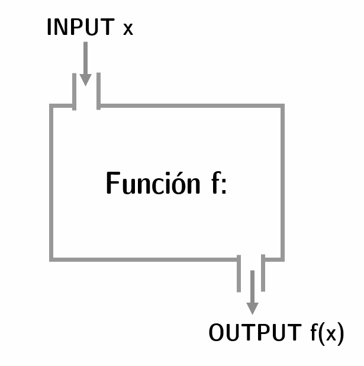
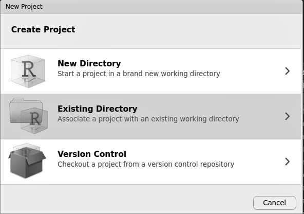
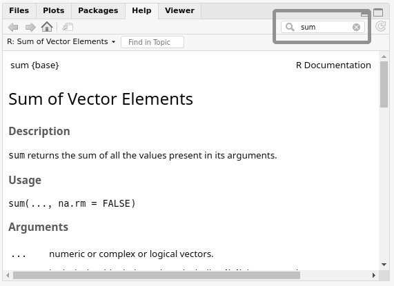

# (PART) Introducción a R {-}

# R Básico {#basic-r}

Andrés Cruz^[E-mail: arcruz\@uc.cl]

## Instalación

### R {-}

R es un lenguaje de programación desarrollado especialmente para el análisis estadístico. Una de sus principales características, como se sugirió en el prefacio, es que es de *fuente abierta*: además de ser libre, significa que las licencias que protegen legalmente a R son permisivas. Bajo estas licencias, miles de desarrolladores de todo el mundo han contribuido con sus dos céntimos a la usabilidad y el atractivo de R. En *AnalizaR Datos Políticos* utilizaremos esta diversidad para nuestro beneficio.

Instalar R es fácil, tanto si usas Windows, Mac o Linux. Sólo tienes que acceder a [https://cran.r-project.org/](https://cran.r-project.org) y seguir las instrucciones de descarga e instalación.

### RStudio {-}

Como dijimos, el R es un lenguaje de programación. Para decirlo de forma coloquial, es una forma ordenada de pedir al ordenador que realice ciertas operaciones. Esto significa que podemos usar R exclusivamente desde una consola o un terminal -las pantallas negras que los hackers usan en las películas-. Aunque esto tiene cierto atractivo (entre ellos, asemejarse a un hacker), en general queremos interfaces más amigables. Aquí es donde aparece RStudio en nuestra vida, el programa más popular para usar R. Una vez instalado, todo nuestro análisis ocurrirá dentro de RStudio, que también es de código abierto y es actualizado regularmente por un equipo de programadores.

Para instalar RStudio, es necesario tener R. La descarga e instalación es accesible para Windows, Mac y Linux. El enlace es [https://www.rstudio.com/products/rstudio/download/#download](https://www.rstudio.com/products/rstudio/download/#download).

> **Ejercicio 1A.** ¡Esperaremos mientras instalas R y RStudio! Adelante, lo necesitarás para trabajar con nosotros durante todo el libro.

Si pudiste descargar e instalar R y RStudio, sólo tienes que abrir este último para empezar a trabajar. Encontrarás una pantalla como la siguiente figura \@ref(fig:rbas-rstudio).

```{r rbas-rstudio, fig.align='center',echo=FALSE, out.width='85%', fig.cap="Los cuatro paneles de la interfaz básica de RStudio."}
knitr::include_graphics("00-images/basic-r/rstudio.png")
```

RStudio está dividido en cuatro paneles (consola, guión, objetos y miscelánea), que abordaremos a continuación. La idea de esta sección es familiarizar al lector principiante con la base de R.

Además, le recomendamos que edite algunas configuraciones de RSutdio antes de comenzar, lo que en nuestra experiencia mejorará su experiencia de aprendizaje^[La idea de estos cambios es que cada sesión de RStudio comience de cero para evitar malentendidos. Esto es coherente con los proyectos de RStudio, que revisaremos en un momento]:

- General > Desmarcar "Restaurar .RData en el espacio de trabajo al inicio"
- General > Guardar el espacio de trabajo en .RData al cerrar > Nunca

## Consola

El panel inferior izquierdo de RSutdio es nuestro espacio de comunicación directa con el ordenador, donde le exigimos que realice tareas específicas, utilizando el "lenguaje R". Llamaremos a estas demandas *comandos*. Intentemos usar o "ejecutar" un comando que realice una operación aritmética básica:

```{r}
2 + 2
```

Un consejo para la consola es que con las teclas de flecha arriba y abajo puedes navegar por el registro de comandos utilizados.


## Script

El panel superior izquierdo de RStudio puede describirse como un "registro de comandos". Aunque la consola puede ser útil para algunos comandos, los análisis complejos requerirán que llevemos un registro de nuestro código.

Para escribir un nuevo script es tan fácil como presionar `Ctrl + Shift + N` o ir a `Archivo > Nuevo archivo > R Script` (usar atajos de teclado es una gran idea, y no sólo por el "factor hacker"). La pantalla blanca de un nuevo script es similar a un bloc de notas en blanco, con la característica de que cada línea debe ser pensada como un comando. Note que escribir un comando en el script y presionar "Enter" no hace nada más que un salto de párrafo. Para ejecutar el comando en una línea, tienes que presionar `Ctrl + Enter` (si tienes Mac, `Cmd + Enter`). Es posible seleccionar varias líneas/comandos a la vez y ejecutarlos todos con `Ctrl + Enter`.

Escribir sólo código en nuestros scripts no es suficiente, ya que normalmente también queremos escribir comentarios explicativos. Esto no sólo es relevante para el trabajo en grupo (el código extranjero puede ser ininteligible sin una guía clara), sino que también denota atención para tu futuro "tú". En varias ocasiones, tenemos que comprobar el código que escribimos hace un par de meses, sin entender nada, y pensar cosas desagradables sobre nosotros mismos. Al escribir los comandos, R reconoce que todo lo que sigue a un signo numérico (#) es un comentario. Por lo tanto, hay dos maneras de escribir comentarios, como "comandos estériles" o como un apéndice de comandos funcionales:

```{r}
# Este es un comando estéril. ¡R sabe que es sólo un comentario!
```

```{r}
2 + 2 # Este es un apéndice-comando, no modifica el código
```

Para guardar un Script, todo lo que tienes que hacer es presionar "Ctrl + S" o hacer clic en "Archivo > Guardar".

## Objetos (y funciones)

Este es el panel superior derecho de RStudio. Aunque tiene tres pestañas ("Ambiente", "Historia" y "Conexiones"), la gran estrella es "Ambiente", que funciona como un registro de los objetos que creamos mientras trabajamos. Una de las principales características de R es que permite almacenar objetos y luego ejecutar comandos con ellos. La forma de crear un objeto es usando una flecha `<-`, para que el `nombre_del_objeto` <- `contenido`. Llamaremos a esto una *asignación*. Por ejemplo:

```{r}
objeto_1 <- 2 + 2
```

Después de ejecutar esto, un nuevo objeto aparecerá en el panel de "Ambiente", `objeto_1`. Este contiene el resultado de `2+2`. Es posible preguntarle a R cuál es el contenido de un objeto con sólo ejecutar su nombre como si fuera un comando:

```{r}
objeto_1
```

Crucialmente, los objetos pueden ser insertados en otros comandos refiriéndose a su contenido. Por ejemplo:

```{r}
objeto_1 + 10
```

También es posible reasignar los objetos: si nos aburrimos de `objeto_1` como un `4`, podemos asignarle el valor que queramos. Los valores de texto (caracteres) también son válidos, tienen que ser escritos entre comillas:


```{r}
objeto_1 <- "democracia"
```

```{r}
objeto_1
```

Borrar un objeto también es una tarea sencilla. Aunque puede sonar como si perdiéramos nuestro trabajo duro, tener una ficha de "Ambiente" limpia y fácil de leer a menudo vale la pena. Para ello, tenemos que usar la función `rm(nombre_del_objeto)`. También puedes usar `rm(list=ls())` para borrar todos los objetos.

### Vectores

Hasta ahora hemos aprendido los objetos más básicos de R, que contienen un único valor.  **Los vectores** son objetos más complejos^[Técnicamente hablando, los objetos anteriores son vectores de longitud 1 para R]. Crear un vector es simple, sólo tenemos que insertar sus componentes entre una `c()`, separados por comas:

```{r}
vector_1 <- c(15, 10, 20)
vector_1
```

Una necesidad básica al crear vectores es la inserción de secuencias de números. Una forma sencilla de hacerlo es con colones (:). Por ejemplo, examinemos el siguiente vector:

```{r}
vector_2 <- c(9, 7:10, 2, 14)
vector_2
```

Podemos seleccionar elementos específicos de un vector utilizando sus posiciones:

```{r}
vector_2[2] # nos da el segundo elemento
vector_2[4:6] # nos da el cuarto, quinto y sexto elemento.
```

### Functions {#basic-r-functions}

Mira el siguiente ejemplo de comando:

```{r}
2 + sqrt(25) - log(1) # equivalente a 2 + 5 + 0
```

R interpreta que `sqrt(25)` es la raíz cuadrada de 25, mientras que `log(1)` es el logaritmo natural de 1. Tanto `sqrt()` como `log()` son **funciones** de R. En términos sencillos, una función es un procedimiento que puede ser delineado como sigue:

(ref:wikimedia) Esquema de la función. Adaptado de Wikimedia Commons: https://commons.wikimedia.org/wiki/File:Function_machine2.svg.

```{r wikimedia,fig.align='center',echo=FALSE, out.width='40%', fig.cap='(ref:wikimedia)'}

```

 `sqrt()` asume un valor numérico como entrada y entrega su raíz cuadrada como salida. `log()` asume esa misma entrada, pero entrega su logaritmo natural. `c()`, una función que usamos previamente, asume diferentes valores únicos como entradas y entrega un vector que los contiene.

Es debido a los vectores que las funciones en R comienzan a brillar y se alejan de las cualidades básicas de una calculadora (eso, a grandes rasgos, es lo que hemos visto hasta ahora en R, nada impresionante). Examinemos otras funciones que extraen información útil de un vector. ¿Qué hace cada una de ellas?

```{r}
mean(vector_1) # media
median(vector_1) # median
sd(vector_1) # desviación estándar
sum(vector_1) # sum
min(vector_1) # valor mínimo
max(vector_1) # valor máximo
log(vector_1) # logaritmo natural
exp(vector_1) # exponencial
length(vector_1) # longitud (cantidad de valores)
sort(vector_1) # ...
```

Se puede deducir que `sort()`, la última función de la lista anterior, ordena el vector de menor a mayor:

```{r}
sort(vector_1)
```

¿Qué pasaría si quisiéramos ordenarlo desde el más grande al más pequeño? Esto nos permite introducir los *argumentos*, partes de las funciones que modifican su comportamiento. Ahora, añadiremos el argumento `decreasing = TRUE` en el comando anterior, lo que logra nuestro objetivo:

```{r}
sort(vector_1, decreasing = TRUE)
```

Un concepto que tiene que ver tanto con objetos como con funciones es el de *valores perdidos*, un tema que exploraremos con más detalle en el capítulo \@ref(adv-data). Las bases de datos con las que trabajamos pueden tener valores perdidos por varias razones: errores de codificación, gobiernos que ocultan información, datos aún no recogidos, entre otras. En cualquier caso, debemos tener esto en cuenta al hacer nuestro análisis R registra los valores perdidos como "NA" (no disponible). Nótese que no se trata de un valor de carácter con las letras "N" y "A", sino de un tipo de valor distinto. Agreguemos un valor faltante a nuestro vector anterior:

```{r}
vector_1_con_na <- c(vector_1, NA)
vector_1_con_na
```

¿Cómo deberían reaccionar las funciones a este nuevo vector? Por defecto, la mayoría de las operaciones R realizadas con valores perdidos fallan (devolviendo `NA`), alertando que no pueden computar lo que necesitas. Por ejemplo:

```{r}
mean(vector_1_con_na)
```

Tal vez en algunos casos quiera hacer saber a R que debe ignorar los valores faltantes en el vector y simplemente continuar con la operación. En la mayoría de las funciones, puedes especificar esto con el argumento `na.rm = TRUE`:

```{r}
mean(vector_1_con_na, na.rm = TRUE)
```

Otra posibilidad es hacer esta omisión de la NA *ex ante*, modificando el vector. Una función útil para este caso es `na.omit()`, que devuelve el vector sin ningún valor perdido:

```{r}
na.omit(vector_1_con_na)
```

Por último, una función común para tratar con NAs es `is.na()`, que permite comprobar qué valores de un vector faltan, algo que será útil más adelante (por ejemplo, para filtrar bases de datos):

```{r}
is.na(vector_1_con_na)
```

> **Ejercicio 1B.** Mira el siguiente gráfico y crea un vector con los salarios mínimos de los países de la región. ¿Qué significa? ¿Y su mediana?

(ref:salarios) Salario mínimo en América Latina, enero de 2019. Adaptado de Statista: https://es.statista.com/grafico/16576/ajuste-de-los-salarios-minimos-en-latinoamerica).

```{r isalarios, echo=FALSE, out.width='100%', fig.cap='(ref:salarios)'}

```


### Archivos / gráficos / paquetes / ayuda

El cuadrante inferior derecho de la pantalla de RStudio contiene una mezcla de diferentes usos, que examinaremos a continuación.

#### Archivos y proyectos de RStudio

Esta pestaña es una ventana a los archivos que tenemos en nuestro directorio de trabajo. Funciona como un pequeño gestor, y nos permite moverlos, renombrarlos y copiarlos.

En cuanto a los archivos, una de las grandes innovaciones recientes de R son los proyectos de RStudio. Los desarrolladores de RStudio se dieron cuenta de que sus usuarios tenían scripts y otros archivos R esparcidos por todo el disco duro, sin ningún orden. Por eso implementaron la filosofía de "un proyecto, una carpeta". "Un proyecto, una carpeta" es tan importante como suena: la idea es que cada proyecto en el que trabajamos sea autosuficiente, que incluya todo lo que necesitamos para trabajar (scripts, bases de datos, etcétera).

Los proyectos se pueden gestionar desde la esquina superior derecha en R. ¿Viste las tres pestañas, "Ambiente", "Historia" y "Conexiones"? Bueno, mira un poco más arriba y verás el logo de RStudio Projects. Aquí tienes que tener cuidado y tener en cuenta que al crear o abrir un nuevo proyecto se reiniciará tu sesión de R, borrando todo el trabajo que no hayas guardado.  Como aún no ha creado un proyecto, su sesión debería decir "Proyecto": (Ninguno)". Al hacer clic en "Nuevo proyecto", aparecen tres opciones:

```{r rbas-rproj, echo=FALSE,out.width='70%', fig.cap='Crear un nuevo proyecto en RStudio.'}

```

Una vez que creas un proyecto y empiezas a trabajar en él, todos los enlaces a los archivos serán locales. Por ejemplo, si la carpeta del proyecto contiene una subcarpeta `data` con un archivo `ejemplo.csv`, la referencia al archivo será simplemente `data/ejemplo.csv`. Recuerde el lema: "un proyecto, una carpeta".

Le recomendamos que cree un proyecto de RStudio para cada capítulo del libro que quiera seguir con el código!

#### Gráficos

Aquí están los gráficos que creamos con R. En el capítulo \@ref(dataviz), visualización de datos, aprenderás a dominarlos.

#### Instalando paquetes {#basic-r-packages}

Una de las principales características que hemos destacado de R es su versatilidad. Su filosofía de código abierto motiva a los desarrolladores a traer nuevas características a la comunidad R. En general, lo hacen a través de paquetes, que los usuarios pueden instalar como un apéndice adicional a R. Estos paquetes contienen nuevas funciones, bases de datos y características. Las pestañas de RStudio que hemos revisado nos permiten acceder a los paquetes instalados.

La instalación de un paquete es bastante sencilla a través de la función `install.packages()`. Ahora, instalaremos el paquete `tidyverse`, que será central para nuestros próximos análisis. El `tidyverse` es una compilación que incluye algunos de los mejores paquetes modernos para el análisis de datos en R.

```{r, eval = F}
install.packages("tidyverse")
```

Cada vez que un usuario abre una nueva sesión en R, ésta se abre como "recién salido de fábrica". Es decir, no sólo se abre sin objetos, sino también con sólo los paquetes básicos que permiten que R funcione. Entonces, tenemos que cargar los paquetes extra que queremos usar. Es como cuando compras un *smartphone* y descargas las aplicaciones que usarás de acuerdo a tus necesidades diarias. La forma más común de hacerlo es a través de la función `library`, como se ve a continuación. Tenga en cuenta que esta vez el "tiempo de espera" no está entre comillas^[Esta es la forma más común de usar `library` por convención. El comando funcionará con comillas, aunque no es muy común verlo así: `library("tidyverse")`. Seguir las convenciones es una gran idea, y por eso le recomendamos que omita las comillas].

```{r eval=F}
library(tidyverse)
```

Además, para sacar el máximo provecho de este libro, debe instalar nuestro paquete complementario, `paqueteadp`. Esto le dará acceso a las bases de datos que se utilizarán en los diferentes capítulos de este libro, además de algunas funciones de soporte. La instalación es ligeramente diferente, porque es un trabajo en progreso. Para obtenerlo, primero debes tener instalado el paquete `remotes`, que te permitirá utilizar los paquetes almacenados en GitHub, una plataforma de desarrollo de software.

```{r, eval=F}
install.packages("remotes")
```

Una vez cargado el paquete `remotes`, su función `install.github()` le permitirá instalar el paquete de este libro:

```{r eval=F}
library(remotes)
install_github("arcruz0/paqueteadp")
```

Fíjate que uno de nosotros tiene el nombre de usuario "arcruz0" en GitHub, donde se almacena el paquete "paqueteadp". ¡Ahora está instalado en tu sistema! Cada vez que lo necesites en una sesión R, tienes que cargarlo con `library()`:

```{r eval=F}
library(paqueteadp)
```

#### Ayuda

Buscar ayuda es esencial cuando se programa en R. Mira la figura \@ref(fig:rbas-help): esta pestaña de RStudio abre los archivos de ayuda que necesitamos y que podemos buscar. Las funciones tienen un archivo de ayuda para cada una de ellas. Por ejemplo, podemos acceder al archivo de ayuda de `sqrt()` a través del comando `help(sqrt)` (`?sqrt` también funciona). Los paquetes en su conjunto también contienen archivos de ayuda, que son más completos. Por ejemplo, para ver el fichero de ayuda de `tidyverse` sólo tenemos que invocar el argumento "paquete": `help(package=tidyverse)`. Además, los archivos de ayuda de los paquetes y las funciones de los paquetes sólo están disponibles cuando se han cargado los paquetes correspondientes.

(ref:sumhelp) Archivo de ayuda de la función `sum()`.

```{r rbas-help, echo=FALSE, fig.cap="(ref:sumhelp)", out.width='80%'}

```

Dentro del archivo de ayuda de un paquete podemos buscar funciones o dudas sobre comandos específicos, en el cuadrante de la imagen que hemos señalado en rojo.

> **Ejercicio 1C.** Instale y busque ayuda para el paquete de `ggparliament`. Se recomienda que juegues con todas las funciones que vimos del ecosistema R. Mencionaremos brevemente " `ggparliament` más adelante, en el capítulo de visualización de datos.

