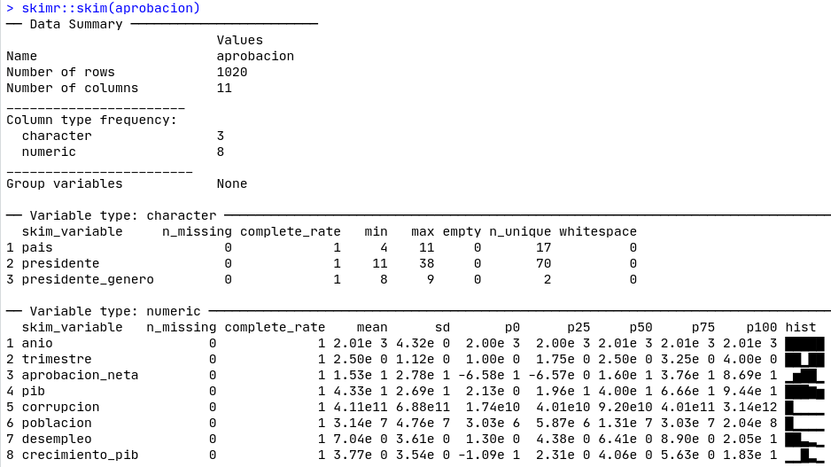

# Manejo de datos {#data}

Andrés Cruz^[E-mail: arcruz\@uc.cl]

### Los paquetes que necesitas instalar {-}

- `tidyverse` [@R-tidyverse], `paqueteadp` [@R-paqueteadp], `skimr` [@R-skimr].

```{r include=F}
library(magrittr)
```


## Introducción al manejo de datos

Las bases de datos tabulares son la forma por excelencia de guardar información en las ciencias sociales. Su poder se basa en la capacidad de registrar múltiples dimensiones de información para cada observación que nos interesa. Por ejemplo, para cada representante en el Congreso podemos saber su sexo, edad, porcentaje de asistencia a la sala, número de proyectos de ley presentados, etcétera:

```{r echo=F}
tibble::tribble(
  ~representante, ~género, ~edad, ~asistencia, ~`n_proyectos_presentados`,
  "Estuardo, Carlos", "M",   48L,         68L,                     8L,
  "Cerna, Marta", "F",   57L,         74L,                     3L
) %>% 
  kableExtra::kable(format = "html", 
                    caption = "Base de datos de ejemplo con representantes.") %>%
  kableExtra::kable_styling(full_width = F)
```
 
Probablemente estés familiarizado con este tipo de datos gracias a Microsoft Excel o Google Sheets. La primera fila es la **cabecera**, que indica qué datos están registrados en las celdas de esa columna. La primera columna en este caso es nuestra **columna de observaciones**: al consultar `representante`, podemos saber a qué observación se refiere cada fila. Así, sobre esta pequeña base de datos podemos decir que la **unidad de observación** es el legislador o representante, para los cuales tenemos información en cuatro variables: género, edad, asistencia a la sala y número de proyectos presentados.

En este capítulo aprenderás a modificar bases de datos tabulares como el del ejemplo. Aprenderás a ordenar las bases de datos, filtrar sus observaciones, crear nuevas variables, generar resúmenes, cambiar los nombres, recodificar los valores y modificar la estructura de la base de datos. Todas estas operaciones son un paso inicial para cualquier análisis o visualización: se estima que el 80% del tiempo de análisis de datos se invierte en modificar y limpiar nuestros datos para su uso óptimo [Dasu & Johnson, 2003 en @wickhamTidyData2014].

### Nuestra base de datos

En el presente capítulo utilizaremos datos de @reyes-housholderTheoryGenderRole2019, con algunas adiciones de los Indicadores de Desarrollo Mundial del Banco Mundial, recogidos por [Quality of Government](https://qog.pol.gu.se/data). La autora argumenta que, ante escándalos de corrupción similares, las presidenteas de América Latina sufren caídas más pronunciadas en la aprobación en comparación con sus homólogos masculinos.

Comencemos por cargar el paquete `tidyverse`, uno de los principales paquetes del libro, que nos dará herramientas útiles para trabajar con nuestra base de datos.

```{r message=F}
library(tidyverse)
```

Ahora carguemos nuestra base de datos en la sesión de R. Podemos hacerlo con facilidad con el paquete de este libro usando la función `data()`. La base de datos se llama "aprobacion":

```{r message=F}
library(paqueteadp)
data("aprobacion")
```

Ahora, podemos empezar a trabajar con nuestra  base. Puedes comprobar que se cargó correctamente utilizando el comando `ls()` (o mirando la pestaña de Ambiente en RStudio):

```{r}
ls()
```

Las siguientes son las variables de la base de este ejercicio:

```{r, echo=F}
tibble(
  Variable = c(
   "pais", "anio", "trimestre", "presidente", "presidente_genero", "aprobacion_neta",
    "pib","poblacion", "corrupcion", "desempleo", "crecimiento_pib"
  ),
Descripción = c(
    "País", "Año", "Cuatrimestre", "Presidente", "Sexo del presidentee",
    "Aprobación presidencial neta (% de aprobación - % de desaprobación)",
    "Producto Interno Bruto del país, dólares constantes de 2011 y ajustados por la Paridad de Poder Adquisitivo (PPA)",
    "Población",
    "Corrupción del Poder Ejecutivo, según V-Dem. De 0 a 100 (un número mayor significa más corrupción)",
    "Tasa de desempleo",
    "Crecimiento del PIB"
  )) %>%
  kableExtra::kable(format = "html",
                    caption = "Variables en la base") %>%
  kableExtra::column_spec(2, width = "25em")
```


## Describiendo una base de datos

Para aproximarnos a los datos recién cargados tenemos varias opciones. Podemos, igual que antes, escribir su nombre como si fuera un comando para tener un resumen rápido:

```{r rh-summary}
aprobacion
```

También podemos usar la función `glimpse()` para obtener un resumen desde otra perspectiva, mirando las primeras observaciones en cada variable:

```{r}
glimpse(aprobacion)
```

Una alternativa que nos permite la base completa es la función `View()`, similar a hacer clic en nuestro objeto en la pestaña "Ambiente" en RStudio:

```{r, eval=FALSE}
View(aprobacion)
```

Podemos obtener un rápido resumen de las variables de nuestro conjunto de datos utilizando la función `skimr::skim()`, como se muestra en la Figura \@ref(fig:skim-data).


```{r skim-data, fig.align='center',echo=FALSE, out.width='100%', fig.cap="Skim de nuestra base de datos."}

```

>Nota: Cada vez que ves que después de un paquete usamos :: significa que dentro de ese paquete estamos pidiendo que se use una función específica. Por ejemplo, en el ejemplo anterior llamamos a la función `skim()` del paquete `skimr`. 

Obtener la tabulación de una de las columnas de nuestra base, una función común para las variables categóricas, es una tarea fácil gracias a la función `count()`. Por ejemplo, podemos comprobar que los países-cuatrimestre con mujeres como presidentees son una minoría en la región, 98 de 1020:

```{r}
count(aprobacion, presidente_genero,
      sort = T) # orden de mayor a menor por n
```

## Operaciones básicas

A continuación, veremos algunas operaciones básicas para nuestra base de datos, que en su conjunto nos permitirán hacer una importante edición en la estructura y los contenidos [@wickhamDataScienceImport2016, cap. 5]. Esta subsección utiliza las herramientas del paquete `dplyr`, que está disponible al cargar `tidyverse`.

### Seleccionar columnas

A veces queremos trabajar sólo con un extracto de las variables de nuestros datos. Para ello, existe la función `select()`. Seleccionemos sólo la columna de países:

```{r}
select(aprobacion, pais)
```

El primer argumento de la función anterior (`aprobacion`) es la base de datos en la que queremos ejecutar la operación. El siguiente argumento indica qué columnas seleccionar (`pais`). Todas las funciones para operaciones básicas que veremos en esta subsección siguen la misma lógica: el primer argumento es siempre la base de datos en la que operaremos, mientras que el resto designa cómo queremos ejecutar la operación.

Recordemos que el código anterior no creó ningún objeto nuevo, es sólo un comando que estamos ejecutando en la consola. Si quisiéramos crear un nuevo objeto, tendríamos que asignarlo, usando el operador `<-`:

```{r}
aprobacion_reducida <- select(aprobacion, pais)
aprobacion_reducida
```

Podemos seleccionar varias columnas a la vez, separadas por comas:

```{r}
select(aprobacion, pais, anio, desempleo)
```

Supongamos que queremos las primeras cinco variables de nuestra base. A continuación se presentan tres formas de obtener el mismo resultado, aunque recomendamos la segunda, ya que es breve y clara:

```{r echo=T, eval=F}
select(aprobacion, pais, anio, trimestre, presidente, aprobacion_neta)
select(aprobacion, pais:aprobacion_neta) # forma recomendada
select(aprobacion, 1:5)
```

```{r echo=F, eval=T}
select(aprobacion, pais:aprobacion_neta) # forma recomendada
```

El comando `select()` también puede ayudarnos a reordenar las columnas. Supongamos que quisiéramos que la variable `presidente` fuera la primera. Podemos reordenar las variables, obteniendo la misma base con un nuevo orden para las columnas:

```{r}
select(aprobacion, presidente, pais:anio, aprobacion_neta:desempleo)
```

Este método es tedioso, especialmente para las bases de datos con múltiples variables. Hay una función que puede ser útil para estos escenarios, llamada `everything()`.  En este caso, seleccionará la columna `presidente` y "todo lo demás":

```{r}
select(aprobacion, presidente, everything())
```

Otra función útil para `select()` es `starts_with()`, que nos permite seleccionar las columnas según los patrones en sus nombres. Por ejemplo, a continuación se seleccionarán todas las columnas que empiecen con el prefijo "pib".

```{r}
select(aprobacion, starts_with("pib"))
```

### Renombra las columnas

Podemos cambiar los nombres de las columnas de una base con el comando `rename()`. Por ejemplo, hagamos más explícito el nombre de la variable con el PIB:

```{r}
rename(aprobacion, pib_ppp_c2011 = pib)
```

También es posible cambiar varios nombres a la vez. Observa cómo modificamos tres nombres con un solo comando:

```{r}
rename(aprobacion,
       pib_ppp_c2011              = pib,
       desempleo_porcentaje       = desempleo,
       crecimiento_pib_porcentaje = crecimiento_pib)
```

### Filtrar las observaciones

A menudo queremos mantener sólo algunas observaciones de nuestra base de datos, filtrando según características específicas. Podemos hacerlo gracias a la función `filter()` y a los operadores lógicos. Para empezar, mantengamos sólo las observaciones para Chile:

```{r}
filter(aprobacion, pais == "Chile")
```

Le decimos `filter()`, a través del segundo argumento, sólo para retener las observaciones en las que la variable país *es igual a* "Chile". Esta *es igual a* es un operador lógico, que se escribe como "==" en R ^[Los usuarios de Stata encontrarán esto familiar.] Aquí hay una lista de operadores lógicos comunes:

| operador | descripción
|:---------: |------------
| `==`       | es igual a
| `!=`       | es diferente a 
| `>`        | es más grande que
| `<`        | es menor que
| `>=`       | es mayor o igual a
| `<=`       | es menor o igual que
| `&` | intersección
| `|`        | Unión
| `%in%`     | ...está contenida en...

Por ejemplo, podemos obtener todas las observaciones (país-año-cuatrimestre) en las que la aprobación presidencial neta es positiva:

```{r}
filter(aprobacion, aprobacion_neta > 0)
```

También es posible ejecutar filtros más complejos. Filtremos sólo las observaciones para el Cono Sur:

```{r}
filter(aprobacion, 
       pais == "Argentina" | pais == "Chile" | pais == "Uruguay")
```
```{r}
# Lo mismo, pero con otro operador lógico:
filter(aprobacion, pais %in% c("Argentina", "Chile", "Uruguay"))
```

También podemos incluir pequeñas operaciones en nuestros filtros. Obtengamos todas las observaciones en las que la corrupción del ejecutivo sea mayor que la media de la muestra:

```{r}
filter(aprobacion, corrupcion > mean(corrupcion))
```

> Tip: Una advertencia práctica: no puedes buscar valores perdidos (NAs) con el intuitivo `== NA`. Necesitas usar la función `is.na()` que revisamos brevemente en la sección  \@ref(basic-r-packages). Nuestra base de datos no tiene valores perdidos, y por lo tanto un filtro como el siguiente no devolverá ninguna fila:

```{r}
filter(aprobacion, is.na(corrupcion))
```

> **Ejercicio 2A.** Seleccione sólo las dos columnas que registran el género del presidentee en la base de datos.
>
> **Ejercicio 2B.** Filtrar los datos para que contengan sólo observaciones del año 2000.

### Cambiar el orden de una base de datos

Una de las operaciones más comunes con los bases de datos es clasificarlas según una variable de interés. Esto puede darnos pistas claras sobre nuestras observaciones. Podemos hacerlo gracias a la función `arrange()`. Por ejemplo, clasifiquemos las observaciones desde el país menos corrupto - hasta el más corrupto, por trimestre del año:

```{r}
arrange(aprobacion, corrupcion)
```

Si quisiéramos ordenarlas a la inversa, tendríamos que añadir un - (signo menos) antes de la variable:

```{r}
arrange(aprobacion, -corrupcion)
```

Para utilizar un orden alfabético inverso (de la Z a la A), tenemos que utilizar la función `desc()`.

```{r}
arrange(aprobacion, desc(presidente))
```

Por último, podemos clasificar la base de datos por más de una variable. Esto es, ordenar los datos según la primera variable, y luego ordenarla según una segunda variable. Examinemos el siguiente ejemplo:

```{r}
arrange(aprobacion, presidente_genero, -aprobacion_neta)
```

### Transformar y crear variables

La mayoría de las veces queremos crear nuevas variables a partir de las que ya tenemos. Supongamos que quisiéramos transformar la escala de población (`poblacion`) en millones:

```{r}
mutate(aprobacion, poblacion_mill = poblacion / 1000000)
```

El comando anterior genera una nueva variable en la base de datos, `pop_mill`, que es `poblacion` pero en la escala de millones. Podemos ejecutar todo tipo de operaciones en nuestras columnas, como crear una variable PIB en una escala logarítmica:

```{r}
mutate(aprobacion, log_gdp = log(pib))
```

También podemos crear nuevas variables a partir de operaciones entre variables. Por ejemplo, calculamos el PIB *per cápita*, lo que nos permite comparar mejor los países con diferentes poblaciones:

```{r}
mutate(aprobacion, pib_pc = pib / poblacion)
```

Por último, también podemos generar más de una transformación a la vez con `mutate()`, utilizando múltiples argumentos:

```{r}
mutate(aprobacion,
       pop_mill = poblacion / 1000000,
       pib_pc = pib / poblacion)
```

> **Ejercicio 2C.** Crear una nueva base, que está ordenada por país-trimestre del año con menos aprobación presidencial al de más alto nivel (recuerde crear un nuevo objeto y darle un nombre descriptivo). En tu nuevo objeto, conserva sólo las observaciones con mujeres como presidenteas.
>
> **Ejercicio 2D.** Crear una nueva variable, que registre el desempleo como proporción en lugar de como porcentaje.

### Resúmenes

Podemos hacer resúmenes para nuestros bases de datos con `summarize`:

```{r}
summarize(aprobacion, desempleo_medio = mean(desempleo))
```

Este proceso a menudo se llama *colapsar* la base de datos: estamos comprimiendo la información de las filas para generar una sola fila de resumen. En este caso, la función de colapso `mean()` opera en el vector `desempleo` para obtener su media.

Como en las otras operaciones, podemos hacer varios resúmenes a la vez:

```{r}
summarize(aprobacion,
          desempleo_medio   = mean(desempleo),
          crecimiento_medio = mean(crecimiento_pib),
          aprobacion_media  = mean(aprobacion_neta))
```

### Resúmenes por grupo

¡Esta es una función muy divertida! Esta tarea consiste en colapsar filas hasta obtener una fila por observación que resuma la información de los diferentes grupos de la base.

Para ello, primero necesitamos tener variables que agrupen nuestras observaciones (partido, país, región, etc.). Le haremos saber a R cuál es la variable que estamos agrupando nuestras observaciones, y este nuevo conjunto de datos será el mismo que el original, pero R sabrá que las próximas operaciones que hagamos necesitan ser agrupadas.

```{r}
aprobacion_por_pais <- group_by(aprobacion, pais)
```

Hagamos una operación de resumen en este nuevo objeto:

```{r}
summarize(aprobacion,
          desempleo_medio   = mean(desempleo),
          crecimiento_medio = mean(crecimiento_pib),
          aprobacion_media  = mean(aprobacion_neta))
```

Los grupos también pueden ser combinaciones de variables. Por ejemplo, nuestra base de datos a nivel de país-año-cuarimestre puede ser agrupado por país-año, y entonces podemos obtener el mismo cálculo previo:

```{r}
aprobacion_por_pais_anio <- group_by(aprobacion, 
                                      pais, anio)
summarize(aprobacion_por_pais,
          desempleo_mean = mean(desempleo),
          crecimiento_pib_mean = mean(crecimiento_pib),
          approv_mean = mean(aprobacion_neta))
```

Por cierto, podemos desagrupar un conjunto de datos con `ungroup()`. Es una gran idea si no queremos seguir ejecutando operaciones agrupadas, evitando errores:

```{r}
aprobacion_por_pais_anio %>%
  ungroup() # nota que ya no hay "grupos" en el resumen de datos
```

## Comandos en cadena

La mayoría de las veces queremos hacer **más de una operación** sobre una base. Por ejemplo, podríamos querer (a) crear una nueva variable del PIB per cápita, y luego (b) filtrar las observaciones con valores iguales o mayores que el PIB medio per cápita de la muestra:

```{r}
aprobacion_con_pib_pc <- mutate(aprobacion,
                                pib_pc = pib / poblacion)

filter(aprobacion_con_pib_pc, pib_pc > mean(pib_pc))
```

La misma cadena de operaciones puede escribirse de la siguiente manera en lenguaje “tidy”:

```{r}
aprobacion %>%
  mutate(pib_pc = pib / poblacion) %>%
  filter(pib_pc > mean(pib_pc)) 
```

¡Este código es sorprendentemente legible! Las pipas (`%>%`) se leen como "entonces" (o "pero entonces"), y se pueden insertar con Ctrl o Cmd + Shift + M en RStudio^[Puedes ver todos los atajos de teclado en RStudio en Ayuda > Ayuda de los atajos de teclado]. A continuación se reproduce nuestro código anterior en español:

>Tomar el conjunto de datos "aprobacion", *entonces* generar una nueva variable llamada “pib_pc” (la división entre "pib" y "poblacion") y *entonces* filtrar las observaciones para que sólo queden aquellas en las que "pib_pc" sea mayor que la media.

Uno de los usos más comunes de las pipes es el combo `group_by()`+ `summarize()`. Repitamos nuestras operaciones anteriores para hacer un resumen agrupado:

```{r}
aprobacion %>%
  group_by(pais) %>%
  summarize(desempleo_medio   = mean(desempleo),
            crecimiento_medio = mean(crecimiento_pib),
            aprobacion_media  = mean(aprobacion_neta))
```

> **Ejercicio 3E.** Calcular, con la ayuda de las pipas, la corrupción del ejecutivo medio y el PIB por país. Recuerde que puede insertar tuberías con Ctrl o Cmd + Shift + M.
>
> **Ejercicio 3F.** Una vez más, utilizando pipas, clasifique los países de la base de datos desde el que obtuvo el mayor promedio de PIB per cápita en el período 2010-2014 hasta el más bajo.
>
> **Ejercicio 3G.** ¿Qué cuatrimestre del año, entre los gobernados por mujeres presidenteas, tuvo la corrupción más alta? ¿Y la mayor aprobación neta?

## Recodificar valores {#data-recodificar}

Un ejercicio común en la gestión de bases de datos es la generación de variables (o la edición de las ya existentes) basadas en ciertas condiciones lógicas. Ya construimos condiciones lógicas antes de usar `filter()`, así que la sintaxis general debería ser familiar. Por ejemplo, podríamos querer registrar los valores de una variable categórica binaria como ceros y unos, creando una variable *dummy*. Esto es fácil gracias al comando `if_else()`. Podemos especificar la condición lógica (`presidente_genero==female`), y luego los valores que se asignarán cuando se cumpla esta condición (`1`) o no (`0`):

```{r}
aprobacion %>%
  mutate(d_pres_mujer = if_else(condition = presidente_genero == "female",
                                true      = 1,
                                false     = 0)) %>%
  select(pais:presidente, presidente_genero, d_pres_mujer) # para legibilidad

```

Es posible especificar condiciones lógicas más complejas, como en `filter()`. Por ejemplo, generemos una variable *dummy* para los países-años-cuatrimestre en crisis económica, definida como: el crecimiento del PIB es negativo y/o la tasa de desempleo es superior al 20%. Bajo esta simple clasificación, Argentina estaría en crisis en 2001 y en 2010:

```{r}
aprobacion %>%
  # No explicamos los argumentos para hacer el código conciso:
  mutate(d_crisis_ec = if_else(crecimiento_pib < 0 | desempleo > 20, 1, 0)) %>%
  # Lo siguiente es sólo para mostrar los resultados más claramente:
  select(pais:trimestre, crecimiento_pib, desempleo, d_crisis_ec) %>%
  filter(pais == "Argentina" & anio %in% c(2001, 2013))
```

Sin embargo, `if_else()` a menudo no es lo suficientemente flexible, ya que sólo permite asignar dos valores basados en una condición lógica. ¿Qué pasa si la variable que queremos crear puede asumir más de dos valores? Por ejemplo, podríamos querer una variable que divida nuestras observaciones en tres categorías, según el país: "Cono Sur" (Argentina, Chile, Uruguay), "Centroamérica" y "Resto de AL". Para empezar, examinemos los valores que la variable "pais" puede asumir:

```{r}
unique(aprobacion$pais)
```

`if_else()` no nos permitiría generar esta nueva variable, pero su función hermana `case_when()` sí lo permite.

```{r}
aprobacion %>%
  mutate(grupo_de_paises = case_when(
    pais %in% c("Argentina", "Chile", "Uruguay") ~ "Cono Sur",
    pais %in% c("Costa Rica", "El Salvador", "Guatemala", "Honduras",
                   "Nicaragua", "Panama") ~ "Centroamérica",
    TRUE ~ "Resto de AL"
  )) %>%  
  # reduciremos la base de datos para ver mejor los resultados:
filter(anio == 2000 & trimestre == 1) %>%
  select(pais, grupo_de_paises) 
```

La nueva variable (`grupo_de_paises`) se construye sobre la base de múltiples condiciones lógicas, que se evalúan en orden. Si se cumple la primera condición (`pais %in% c("Argentina", "Chile", "Uruguay")`), se asigna el valor "Cono Sur" a la nueva variable. La condición lógica y el valor asignado se separan por un "~"^[Aprendí que algunos usuarios de R nombran este símbolo una "colita de chancho"!], que se puede leer como "por lo tanto". Lo mismo ocurrirá con la siguiente condición, que asignará "Centroamérica" si se cumple. Nuestro último argumento para `case_when()` tiene una condición lógica de gran alcance: *en todos los demás casos*, se aplicará el valor "Resto de AL".


> **Ejercicio 2H.** `if_else()` puede ser pensado como una versión reducida de `case_when`(): todo lo que hacemos con la primera función podría ser convertido en la sintaxis de la segunda. Traduzca uno de los ejemplos anteriores con `if_else()` a la sintaxis `case_when()`.
>
> **Ejercicio 2I.** Crea una nueva variable que separa los países en tres grupos: "América del Norte", "América Central" y "América del Sur".

### Pivoteo de datos {data-pivot}

La estructura de la base anterior, donde las filas son las observaciones, las variables son las columnas, y la base de datos tiene sólo una unidad de observación, es la *estructura tidy* de la presentación de datos [@wickhamTidyData2014]. En general, R y el `tidyverse` funcionan muy bien bajo este formato, así que querremos usarlo cuando sea posible.

Sin embargo, los datos con los que trabajamos en el mundo real no siempre están disponibles en este formato. A menudo, otros formatos son más adecuados en contextos diferentes al análisis de datos, por ejemplo, las codificaciones manuales de la administración pública. Para empezar este ejemplo, creemos una base de datos a nivel de país-año con los niveles medios de aprobación presidencial:

```{r}
aprobacion_anual <- aprobacion %>%
  group_by(pais, anio) %>%
  summarize(aprobacion_neta = mean(aprobacion_neta)) %>%
  ungroup()

aprobacion_anual
```

Este conjunto de datos *tidy* puede ser presentado en diferentes formatos. El más común de ellos es el formato *ancho* o *wide*^[A veces se utiliza el término *largo* (opuesto a ancho) en lugar de lo que llamamos *tidy*.], en el que una de las variables de identificación se distribuye entre las columnas (en este caso, "anio"). Ahora cargaremos el conjunto de datos en formato *ancho*, desde paquete del libro:

```{r message=F, eval=F}
library(paqueteadp)
data(aprobacion_wide1) 
```

```{r}
aprobacion_wide1 
```

Esta base de datos contiene la misma información que la que creamos manualmente, sólo cambia su forma de presentación. Esta estructura *ancha* tiene algunos beneficios, el más destacado es su brevedad: los años no se repiten en múltiples celdas, como sucede en un conjunto de datos *tidy*. Para un codificador manual, este ahorro de espacio (y tiempo) resulta atractivo. Sin embargo, el formato *wide* tiene una mayor desventaja en comparación con el formato *tidy*: en su forma tradicional, sólo es posible registrar información para una variable por base de datos. En el caso del ejemplo, no hay una forma posible de añadir, por ejemplo, información sobre la corrupción de los años-país. Como hemos visto, este ejercicio es trivial en un conjunto de datos *tidy*, donde las variables pueden ser añadidas como columnas. Tener múltiples variables en nuestra base de datos es exactamente lo que necesitamos para generar análisis de datos sociales, donde exploramos las diferentes dimensiones de nuestros fenómenos de estudio.

Afortunadamente, el paquete `tidyr`, que se carga automáticamente con `tidyverse`, proporciona funciones que convierten rápidamente los datos de un formato *ancho* en una versión más amigable para el análisis. Este tipo de transformación de la estructura se llama a menudo "pivote". La función clave aquí es `pivot_longer()`, que permite a un conjunto de datos pivotar en un formato vertical. El conjunto de datos que obtendremos es igual al conjunto de datos *tidy* que creamos antes:

```{r}
aprobacion_wide1 %>%
  pivot_longer(cols = -pais, names_to = "anio", values_to = "aprobacion_neta")
```

El primer argumento en `pivot_longer()`, `cols =`, nos pide que seleccionemos las columnas para transformarlas en una variable de identificación, utilizando la sintaxis `select()` que aprendimos antes en este capítulo. En este caso, estamos indicando `pivot_longer()` para transformar todas las variables, excepto `país`, en una variable de identificación. Entonces, el argumento `names_to()` nos pregunta cómo queremos llamar a la nueva variable de identificación, que se crea cuando se transforma el conjunto de datos. Por último, `values_to =` requiere nombrar la nueva variable que se crea, basándose en los valores de las celdas de los datos originales.

En algunos casos también es útil hacer la operación inversa, para transformar un conjunto de datos *tidy* en un formato *wide* (ancho). Para ello, podemos usar otra función importante en `tidyr`, llamada `pivot_wider()`. Veamos un ejemplo, partiendo de un formato de conjunto de datos *tidy*, que creamos antes:

```{r}
aprobacion_anual %>%
  pivot_wider(names_from = "anio", values_from = "aprobacion_neta") 
```

Los argumentos, en este caso, son prácticamente espejos de los anteriores. Aquí lo que queremos es que la base de datos tome de "año" sus nombres de columna a lo ancho (`names_from="anio" `), mientras que los valores se toman de nuestra variable de interés "aprobacion_neta" (`values_from = "aprobacion_neta "`).

Por lo tanto, estos comandos son perfectamente simétricos. Por ejemplo, la siguiente cadena de comandos es inofensiva, ya que `pivot_wider()` revertirá la transformación aplicada por `pivot_longer()`:

```{r}
aprobacion_wide1 %>%
  pivot_longer(cols = -pais, 
               names_to = "anio", values_to = "aprobacion_neta") %>%
  pivot_wider(names_from = "anio", values_from = "aprobacion_neta") 
```

> **Ejercicio 2J.** Genera una base en formato *tidy* con el crecimiento medio del PIB por país-año. Convierte estos datos a un formato *ancho/wide*, moviendo los años a las columnas.


### Bases de datos anchas con más de una variable de interés

Anteriormente, mencionamos que no es posible registrar, de manera simple, información para más de una variable de interés en una estructura *ancha*. Sin embargo, nuestras fuentes de datos a menudo contendrán sorpresas que no son agradables para nosotros, como el siguiente ejemplo:

```{r message=F, eval=F}
library(paqueteadp)
data(aprobacion_wide2) 
```

Observa que en esta base las columnas registran información a lo largo del tiempo para dos variables, "pib" y "poblacion". Lo que queremos es *extender* esta información en las filas, reconstruyendo nuestro par país-años y las dos variables de interés. Primero, podemos pivotear el conjunto de datos para dejarlos en el nivel de la variable país-año. En `pivot_longer()`, podemos indicar que los nombres de las columnas contienen información de más de una variable. Primero, el argumento `names_to = c("variable", "año")` toma dos valores en esta ocasión, los nombres de las nuevas variables después del pivote. En segundo lugar, `names_sep= "_"` indica que en las columnas del conjunto de datos original la información de las dos variables está separada por un guión bajo (puede ser otro carácter, como un guión alto o una barra vertical^[Si la separación entre sus variables es menos clara, podemos usar el argumento ` names_pattern=` en lugar de ` names_sep=`. Para esto necesitarás usar expresiones regulares, un tema tratado en el capítulo \@ref(qta) de análisis cuantitativo de textos. Por ejemplo, podríamos escribir la misma operación aquí con el siguiente argumento: `name_pattern = "(\\D+)_(\\d+)"`]).

```{r}
aprobacion_wide2 %>%
  pivot_longer(cols = -pais,
               names_to = c("variable", "anio"), names_sep = "_") 
```

Entonces, podemos pivotar las variables a través del ancho para obtener nuestra base datos de destino, como lo hicimos antes, con `pivot_wider()`. Hagamos todo en una cadena:

```{r}
aprobacion_wide2 %>%
  pivot_longer(cols = -pais,
               names_to = c("variable", "anio"), names_sep = "_") %>%
  pivot_wider(names_from = "variable", values_from = "value")
```


