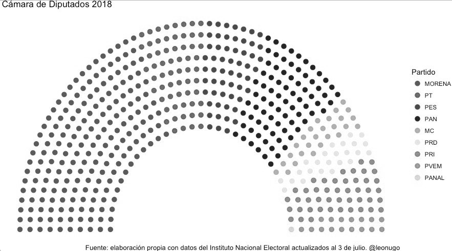

# Visualización de datos {#dataviz}

Soledad Araya^[E-mail: snaraya@uc.cl]

### Lecturas sugeridas {-}

- Henshaw, A. L., & Meinke, S. R. (2018). Data analysis and data visualization as active learning in political science. *Journal of Political Science Education, 14*(4), 423-439.

- Kastellec, J. P., & Leoni, E. L. (2007). Using graphs instead of tables in political science. *Perspectives on Politics, 5*(4), 755-771.

- Tufte, E. R. (2006). *Beautiful evidence*. Graphics Press.


### Los paquetes que necesitas instalar {-}

- `tidyverse` [@R-tidyverse], `paqueteadp` [@R-paqueteadp], `ggrepel` [@R-ggrepel].

## ¿Por qué visualizar mis datos?

Ya has aprendido a usar los comandos de Tidyverse, y probablemente quieras sumergirte en el mundo de los gráficos, y aplicar todo lo que has aprendido a tu propios datos. Con `tidyverse` y `ggplot2`, la visualización de datos se convierte en una tarea fácil, pero hay algunos pasos que debes seguir antes de escribir tu código. Por ejemplo, conocer tus variables. ¿Son variables continuas o categóricas? Cuando son categóricas, ¿tienen dos o más niveles? Además, esos niveles, ¿están en orden o no? Estas no son las únicas preguntas que tienes que considerar. Parece una tarea fácil, pero si no consideras este paso en tu trabajo con `ggplot2` las cosas pueden ponerse feas bastante rápido. Se pueden encontrar ejemplos divertidos de esto en [accidental aRt](https://twitter.com/accidental__aRt).

Una pregunta rápida: ¿Por qué representar nuestros datos gráficamente?

En primer lugar, sé que muchos de nosotros estamos interesados en representar nuestros datos gráficamente porque es una forma atractiva de hacerlo. Sin embargo, tener un buen o mal sentido de la estética no significa mucho si nuestros datos no son claros. Por lo tanto, es necesario *comprender* lo que queremos expresar, lo cual puede ser una tarea difícil si no reflexionamos sobre por qué estamos haciendo este tipo de representación. A veces, podemos utilizar tablas para resumir cantidades y/o patrones, pero la gran gestión de datos de hoy en día hace que esto sea una tarea compleja e ineficiente. Por lo tanto, volvamos a la pregunta principal: ¿por qué visualizar? ¿Por qué no hacer simplemente tablas que expresen lo que queremos decir? A través de la visualización de datos podemos entender otros tipos de problemas que los números por sí solos no pueden mostrar. Mediante la visualización, queremos explorar y *comprender* nuestros datos. Además, la representación gráfica puede ayudarnos a interpretar patrones, tendencias, distribuciones y a comunicarlos mejor a nuestros lectores.

```{r florence-nightingale, echo=F, out.width="40%", fig.cap="Estadística Florence Nightingale (1820-1910)."}
knitr::include_graphics("00-images/dataviz/florence_nightingale.jpg")
```

Florence Nightgale (1820-1910) fue una enfermera y estadística que ayudó a reorganizar la administración de los hospitales cívicos y militares de Gran Bretaña. Ella, con la ayuda de un equipo, logró hacer un registro de las muertes y enfermedades en los hospitales militares durante la Guerra de Crimea. Para su sorpresa, la gran mayoría de las muertes eran evitables, y la razón principal de ellas eran las malas condiciones del sistema de salud. Uno de sus informes para el gobierno británico fue el siguiente diagrama:
```{r mortality-nightingale1, echo=F, out.width="60%", fig.cap= " Diagrama de las causas de muerte en el ejército británico"}

```

En rojo se destacan las muertes por heridas de guerra, en azul las muertes debidas a enfermedades evitables, y en negro, las muertes causadas por otro tipo de causas. Este gráfico no sólo proporciona información cuantitativa sobre las muertes, sino que también señala un problema sustancial en el sistema de salud de los militares en ese momento.

El diagrama de Nightingale reveló el problema, que fue el paso inicial para una serie de reformas. Así, la visualización se convierte en una herramienta que puede ser aplicada en todas las etapas de la investigación. En una etapa inicial, es importante para la exploración de los datos, y para entender cómo se relacionan las variables entre sí, sus distribuciones y frecuencias. Al interpretar los datos, la visualización es útil para mostrar posibles tendencias o patrones en los datos. Por último, la visualización es una gran herramienta para la difusión del conocimiento. Pero recuerde, con un gran poder viene una gran responsabilidad, y las relaciones espurias dejan de ser graciosas cuando la gente se las toma demasiado en serio^[Aun así, siempre es entretenido observar cómo existe una correlación entre [el consumo de queso per cápita y el número de personas estranguladas hasta la muerte por sus sábanas en los Estados Unidos](http://tylervigen.com/spurious-correlations)!].
@monoganPoliticalAnalysisUsing2015 [cap. 3] ya había explicado de forma sencilla para los científicos sociales, por qué la visualización de datos es importante cuando se trabaja con datos cuantitativos. En la introducción del capítulo, Monogan afirma la importancia y las ventajas de trabajar con cifras, desde la simple distribución de variables, valores atípicos o sesgos, hasta las tendencias a lo largo del tiempo. Por esta razón, la visualización de datos es una herramienta crucial para cualquiera que trabaje con datos. No es, de ninguna manera, un "movimiento estético", la gráfica es extremadamente útil.

Sin embargo, para algunas personas, la visualización de datos es tanto un elemento funcional para el análisis como un elemento estético por excelencia. Para Edward Tufte [-@tufteBeautifulEvidence2006], visualizar los datos de manera efectiva tiene un componente artístico inevitable. Con formación de estadístico y un doctorado en Ciencias Políticas de la Universidad de Yale, Edward Tufte se dedicó a entender y explicar cómo la ciencia y el arte tienen en común una *observación a ojos abierto que genera información empírica*. Su libro *Beautiful Evidence* [@tufteBeautifulEvidence2006] describe el proceso de cómo *observar* se transforma en *mostrar*, y cómo la observación empírica se convierte en explicaciones y pruebas.

Necesitamos entender que la visualización de datos es un lenguaje como cualquier otro. Como emisores, necesitamos conocer nuestra audiencia: quiénes son los receptores de nuestro mensaje, si es una audiencia experta o sólo el público en general. En cualquier circunstancia, ajustaríamos nuestro mensaje al tipo de audiencia. Lo mismo ocurre cuando visualizamos los datos. Los gráficos que hacemos deben adaptarse a nuestro público. Sin embargo, incluso con las personas más conocedoras no debemos entusiasmarnos demasiado. No se trata de aplicar todo lo que sabemos inmediatamente, sino de entender lo que estamos tratando de comunicar. Comprender las funciones de este lenguaje es esencial.

En la siguiente subsección hablaremos de cómo funciona `ggplot2`. A partir de ahora, comenzaremos con ejemplos aplicados. Los tipos de representación visual más comunes son el histograma, el gráfico de barras, el gráfico de densidad y el gráfico de líneas. Además, introduciremos otros paquetes de utilidades para hacer gráficos más sofisticados. Finalmente, aprenderemos sobre otros paquetes que pueden ser útiles dentro de las ciencias sociales, y en particular, las ciencias políticas, como son `sf` y `ggparliament`.

>**Consejo:** Después de este capítulo, si quieres aprender más sobre la visualización de datos, consulta [Data Visualization: A Practical introduction](http://socviz.co) de Kieran Healy, un libro disponible de forma gratuita que es divertido y útil para aprender `ggplot2` paso a paso. En este libro no sólo encontrará una parte teórica, sino también una práctica. Por otro lado, la página web [From Data to Viz](https://www.data-to-viz.com/) puede ayudarte a aprender a presentar tus datos, pero no sólo eso: tanto si trabajas con R como con Python, puedes encontrar los paquetes y códigos para su aplicación.

## Primeros pasos

Ahora que entendemos el proceso antes de construir un gráfico, tenemos que familiarizarnos con `ggplot2`, el paquete para crear gráficos que es parte del `tidyverse`. [A Layered Grammar of Graphics](https://byrneslab.net/classes/biol607/readings/wickham_layered-grammar.pdf), de Hadley Wickham, explica en detalle cómo funciona esta nueva "gramática" para hacer gráficos. Recomendamos que se lea de la fuente original cómo se creó este paquete para entender más tarde el uso de las capas en la construcción de los gráficos.

Aunque el uso de `ggplot2` se expandió rápidamente, dentro de la comunidad R hay constantes discusiones sobre la enseñanza de `ggplot2` como primera opción sobre los gráficos base de R. Por ejemplo, [David Robinson](http://varianceexplained.org/r/why-I-use-ggplot2/) tiene en su blog diferentes entradas sobre este tema, donde explica en detalle las ventajas de `ggplot2` sobre otras opciones. Si eres un principiante en R, empezar con `ggplot2` te dará una herramienta poderosa, y su curva de aprendizaje no es tan empinada como las R básico.
Algunas ventajas que David Robinson menciona en "Por qué uso `ggplot2`"^[http://varianceexplained.org/r/why-I-use-ggplot2/] son:

* Subtítulos. R básico requiere más conocimiento de los usuarios para poder añadir subtítulos en los gráficos. Nuestro amigo `ggplot2` lo hace automáticamente.
* ¡Facetas! Básicamente, podemos crear subgráficos con una tercera o cuarta variable y superponerlos, lo que nos permitirá una mejor comprensión del comportamiento de nuestros datos.
* Funciona junto con `tidyverse`.  Esto significa que podemos hacer más con menos. Al final de este capítulo entenderán lo que quiero decir. Hay atajos para todo.
* Estéticamente, es mejor. Hay miles de opciones de paletas cromáticas, temas y fuentes. Si no te gusta, hay una forma de cambiarlo.

Con esto en consideración, empecemos con lo práctico.

### Las capas del "universo ggplotiano" 

Empecemos con nuestro tema de interés: ¿Cómo funciona `ggplot2`? Este paquete está incluido en el `tidyverse`, por lo que no es necesario cargarlo por separado. Además, utilizaremos las herramientas de ambos paquetes a lo largo de todo el capítulo. Así, el primer paso es cargar el paquete:

```{r, message = FALSE}
library(tidyverse)
```

La intuición detrás de `ggplot2` es directa. La construcción de los datos se basa en **capas** que contienen un cierto tipo de información.

#### Datos

La primera capa corresponde a los datos que usaremos. Para hacerlo más demostrativo, cargaremos la base datos que se utilizarán a lo largo del capítulo.

```{r}
library(paqueteadp)
data("datos_municipales")
```

El conjunto de datos debería estar ahora en nuestro ambiente. Estos datos corresponden a la información de los municipios chilenos. Algunos son del [Servicio Electoral](http://www.servel.cl) y otros del [Sistema Nacional de Información Municipal](http://datos.sinim.gov.cl/datos_municipales.php) de Chile. En la primera base de datos, encontramos los resultados electorales de las elecciones locales, regionales y nacionales del país; mientras que en la segunda encontramos las características económicas, sociales y demográficas de los municipios chilenos. En este caso, tenemos los datos electorales comunales de 1992 a 2012, con datos descriptivos como la población, el ingreso total del municipio, el gasto en asistencia social y el porcentaje de personas en situación de pobreza en base al total comunal de la Encuesta de Caracterización Socioeconómica Nacional (CASEN).


```{r}
glimpse(datos_municipales)
```

Al mirar a la base de datos, encontramos que hay variables continuas (numéricas) y categóricas (de texto). Saber con qué tipo de variable estamos trabajando es esencial para el siguiente paso.

#### Mapeos estéticos

La segunda capa corresponde al mapeo de las variables dentro del espacio. En este paso, usamos `mapping=aes()`, que contendrá la variable que tendremos en nuestros ejes x e y. Para `aes()`, hay muchas opciones que veremos a lo largo del capítulo: algunas de ellas son, por ejemplo, `fill`, `color`, `shape`, y `alpha`. Todas estas opciones son un conjunto de señales que nos permitirán traducir mejor lo que queremos decir a través de nuestro gráfico. Normalmente, estas opciones se llaman *estéticas* o `aes()`.


```{r, results='hide', warning=FALSE, fig.align='center', fig.cap="Marco vacío"}
ggplot(data    = datos_municipales, 
       mapping = aes(x = anio, y = pobreza))
```

El resultado muestra un marco vacío. Esto se debe a que no le hemos dicho a R qué objeto geométrico usar.

#### Objeto geométrico

Suena extraño, pero cuando hablamos del objeto geométrico o `geom`, nos referimos al tipo de gráfico que queremos hacer, ya sea un gráfico lineal, un gráfico de barras, un histograma, un gráfico de densidad, o un gráfico de puntos, o si queremos hacer un gráfico de cajas. Esto corresponde a la tercera capa. En este caso, ya que tenemos datos de la encuesta CASEN, haremos un gráfico de caja para ver cómo se distribuyen los municipios en nuestra muestra.

```{r, results='hide', warning=FALSE, fig.align='center',fig.width =5 , fig.asp = .72, fig.cap=" Añadiendo un objeto geométrico a su gráfica"}
ggplot(data    = datos_municipales, 
       mapping = aes(x = anio, y = pobreza)) +
  geom_boxplot()
```

Lo primero que notamos es la ausencia de datos durante tres períodos. Desafortunadamente, no hay datos anteriores a 2002, por lo que no se encuentran entradas para esos años. Por ello, es una gran idea filtrar los datos y dejar sólo los años que contienen datos sobre la encuesta CASEN. Además de eso, nuestro gráfico no nos dice mucho sobre el porcentaje de pobreza y su distribución. Considerando la geografía de Chile, es una gran idea ver la distribución de la pobreza por zona de la región geográfica.

#### Facetas

Ahora, usaremos nuestras nuevas habilidades para hacer dos cosas: primero, usaremos `filter()` para conservar sólo los años que nos interesan. Segundo, dividiremos los resultados por zonas usando `facet_wrap()`, que corresponde a la cuarta capa que podemos usar para construir un gráfico con `ggplot2`. Cuando usamos esta capa, lo que queremos es organizar las "geoms" que estamos usando en función de una variable categórica. En este caso, la zona. Sin embargo, las facetas, como acción, son mucho más que eso. `facet_wrap()` y `facet_grid()` pueden adoptar una serie de argumentos, siendo el primero el más importante. En este caso, la sintaxis que utilizamos es la misma que se usa para las fórmulas en R, y denotamos el primer argumento con un signo "~". Con los argumentos `nrow =` y `ncol =` podemos especificar cómo queremos ordenar nuestro gráfico.

Finalmente, añadimos dos líneas de código, una para filtrar y otra para subdividir nuestra información. Esto es lo que logramos:

```{r, warning=F, fig.align='center', fig.width = 7, fig.asp = .62, , fig.cap=" Añadiendo una faceta a su gráfico"}
ggplot(data    = datos_municipales %>% filter(anio == c(2004, 2008, 2012)),
       mapping = aes(x = anio, y = pobreza)) +
  geom_boxplot() +
  facet_wrap(~ zona, nrow = 1)
```

Tanto con `facet_wrap()` como con `facet_grid()` podemos usar más de un argumento, pero los resultados son diferentes. `facet_wrap()` no sólo ordena los geoms, sino que es capaz de cruzarlos, creando gráficos con dos o más dimensiones usando variables categóricas. Mira los siguientes ejemplos:

```{r, warning=F, fig.align='center', fig.cap=" Comparando wraps y grillas, ejemplo A"}
ggplot(data    = datos_municipales%>% filter(anio == c(2004, 2008, 2012)),
       mapping = aes(x = anio, y = pobreza)) +
  geom_boxplot() +
  facet_wrap(zona ~ genero)
```

```{r, warning=F, fig.align='center',fig.width = 7, fig.asp = .78, fig.height=9, fig.cap="Comparando wraps y grillas, ejemplo B"}
ggplot(data    = datos_municipales %>% filter(anio == c(2004, 2008, 2012)),
       mapping = aes(x = anio, y = pobreza)) +
  geom_boxplot() +
  facet_grid(zona ~ genero)
```

Este gráfico muestra que, por zonas, el porcentaje de pobreza ha variado considerablemente de 2004 a 2012, y que existe una gran variabilidad interregional. Además, nos muestra cómo `ggplot2` ofrece resultados de alta calidad sin mucha complejidad. La función `facet_wrap()` es una capa opcional dentro de las múltiples capas de "Una Gramática de Gráficos en Capas", pero es importante recordar que las otras tres deben estar presentes para cualquier tipo de resultados.

#### Transformaciones

Otra capa que se puede usar es la que nos permite hacer transformaciones de escala en las variables. Normalmente, aparecerá con el nombre `scale_x_discrete()`, que variará dependiendo de la estética utilizada dentro de nuestro mapeo. Así, podemos encontrarnos con `scale_fill_continous()` o `scale_y_log10()`. Por ejemplo, podemos ver cómo se distribuyen los ingresos de los municipios según la tasa de pobreza de nuestra muestra. Normalmente, haríamos esto de la siguiente manera:

```{r, warning=F, fig.align='center', fig.cap=" Ejemplo de una gráfica en la que no utilizamos la escala"}
ggplot(data    = datos_municipales %>% filter(anio == c(2004, 2008, 2012)),
       mapping = aes(x = pobreza, y = ingreso)) +
  geom_point()
```

Lo más frecuente es que cuando usamos una variable relacionada con el dinero, aplicamos una transformación logarítmica. Sin embargo, ¿cómo se traduce esto en nuestra figura?

```{r, warning=F, fig.align='center',  fig.cap=" Ejemplo de una trama en la que reescalamos el eje y "}
ggplot(data    = datos_municipales %>% filter(anio == c(2004, 2008, 2012)),
       mapping = aes(x = pobreza, y = ingreso)) +
  geom_point() +
  scale_y_log10()
```


#### Sistema de coordenadas

Por lo general, trabajaremos con un eje X y un eje Y. Hay funciones en `ggplot2`, como `coord_flip`, que nos permiten cambiar la dirección de nuestra gráfica. Sin embargo, también podemos utilizar este tipo de capa cuando trabajamos con datos geográficos, o cuando, por ejemplo, queremos hacer un gráfico de torta. Sin embargo, normalmente, [no queremos hacer gráficos de pastel](https://www.datapine.com/blog/common-data-visualization-mistakes/). Cuanto más se utilice `ggplot2`, más se aprenderá sobre cada opción.

#### Temas

Cuando hacemos un mapeo de datos, usamos opciones estéticas. Cuando queremos cambiar el aspecto de un gráfico, cambiamos el tema. Esto se puede hacer a través de `theme()`, que permite modificar cosas que no están relacionadas con el contenido del gráfico. Por ejemplo, los colores de fondo o la fuente de las letras en los ejes. También puedes cambiar el lugar donde se ubicará la leyenda o el título. Por último, también puedes cambiar el título, el nombre de los ejes, añadir anotaciones, etcétera. Sólo tienes que saber `labs()` y `annotate()`.

Ahora es el momento de aplicar todo lo que "aparentemente" ya entendemos.

## Ejemplo aplicado: Elecciones locales y visualización de datos

Como hemos mencionado anteriormente, la cuestión principal es entender que la visualización nos permite explorar nuestros datos y responder a preguntas sustantivas de nuestra investigación. Normalmente, los medios, las desviaciones estándar u otro tipo de parámetros no nos dicen mucho. Podemos expresar los mismos datos visualizándolos. Por ejemplo, un diagrama de caja puede ser útil para representar la distribución de los datos y ver sus posibles valores atípicos, mientras que un gráfico de barras puede ayudarnos a observar la frecuencia de nuestros datos categóricos, y un gráfico lineal es práctico para comprender el cambio a lo largo del tiempo. Estos son sólo algunos ejemplos dentro de una variedad de posibilidades.
En esta tercera sección, aprenderemos a visualizar diferentes tipos de gráficos con datos de la reelección municipal en Chile. Para contextualizar, la división político-administrativa más pequeña de Chile es la comuna o municipio, que cada cuatro años elige a sus autoridades locales: un alcalde y un consejo municipal. Desde 1992 a 2000, los alcaldes fueron elegidos indirectamente, y desde 2004 comenzaron a ser elegidos directamente por los ciudadanos.

Como ya conocemos nuestros datos, podemos empezar con los más simples. Una buena idea, por ejemplo, es ver el número de mujeres elegidas como alcaldes en comparación con el número de hombres elegidos. Para ello, podemos utilizar un gráfico de barras. Como aprendimos en la sección anterior, para construir cualquier tipo de gráfico necesitamos saber la(s) variable(s) que queremos usar y qué geometría o `geom` nos permite representarla. En este caso, usaremos `geom_bar()` para ver cuántos hombres y mujeres han sido elegidos desde 1992. 

### Gráfico de barras

```{r, fig.align='center',  fig.cap="Gráfica simple de barras", out.width="80%"}
plot_a <- ggplot(datos_municipales, mapping = aes(x = genero))

plot_a + 
  geom_bar()
```

Como podemos ver, construir un gráfico de barras es una tarea fácil. Vemos que, a partir de 2004, más de 800 hombres fueron elegidos como alcaldes, un número que supera con creces el número de mujeres elegidas para el mismo cargo en el mismo período.
 
Tal vez, este número ha cambiado con el tiempo, y no podemos verlo en este tipo de gráfico? Esto parece ser una buena razón para usar `facet_wrap`.

```{r, fig.align='center', fig.cap=" Gráfico de barras con una faceta por año"}
plot_a + 
  geom_bar() + 
  facet_wrap(~anio, nrow = 1)
```
 
Como vemos, el número de mujeres alcaldesas parece aumentar, aunque es un aumento mucho menor del que se esperaría. Esto podría ser un problema sustantivo para hacer un análisis del gobierno local en Chile.

Geometrías como `geom_bar`, `geom_col`, `geom_density` y `geom_histogram` tienden a no llevar un eje Y explícito en su estética, ya que son un recuento en el eje horizontal. Sin embargo, uno puede modificar el eje vertical en estas geometrías aplicando algún tipo de transformación. Por ejemplo, al especificar `y=..prop..` como una estética dentro del objeto geométrico, estamos ordenando el cálculo de la proporción, no el conteo. Normalmente, usaremos `aes()` además de los datos en `ggplot()`, pero dependiendo de tus 
preferencias, también es posible usarlo con `geom`. Esta última es más común cuando ocupamos más de una base de datos o cuando queremos hacer una transformación.

Por ejemplo, podríamos estar interesados en el número de autoridades locales por zona geográfica. Para ello, sería útil utilizar una proporción, ya que cada zona geográfica está formada por un número diferente de municipios. De esta manera, será más fácil comparar la situación entre las zonas.
```{r, fig.align='center',fig.width = 4.9, fig.height=3.3, , out.width="80%", fig.cap=" Gráfico de barras con una faceta por zona"}
plot_a + 
  geom_bar(mapping = aes(y = ..prop.., group = 1)) +
  facet_wrap(~zona, nrow = 1)
```

¿Pero por qué usamos `grupo=1`?

Cuando queremos calcular una proporción con `y=..prop..`, tenemos que tomar algunas precauciones si estamos usando `facet_wrap`. Esta función no calcula la proporción basada en la suma de ambos géneros por zona. Por ejemplo, esta función registra que hay 89 hombres y 13 mujeres elegidos en la zona del Gran Norte. Concluye que "en el Gran Norte, los 89 hombres corresponden al 100% de los hombres elegidos y las 13 mujeres al 100% de las mujeres elegidas". Claramente, esto no es lo que intentamos representar en el gráfico. Por eso usamos `group=1`. Intenta ver el resultado sin `group=1` para comprobar lo que sucede.

Ya lo hemos hecho! Vemos que no hay grandes diferencias, donde la zona del "Norte Pequeño" es la que tiene más mujeres en la alcaldía que hombres. Sin embargo, no hay grandes diferencias entre las zonas, y los resultados del primer gráfico de barras se replican en este.

Ahora, podemos cambiar la presentación del gráfico. Todo buen gráfico debe contener, por ejemplo, un título claro, la fuente de los datos y el detalle de los ejes.

> **Sugerencia.** El *Chicago Guide to Writing about Multivariate Analysis * [@millerChicagoGuideWriting2013] tiene muchos buenos consejos sobre cómo crear gráficos efectivos.

```{r, fig.align='center', fig.width = 6, fig.height=3.8, fig.cap=" Gráfico de barras con título y fuentes"}
plot_a + 
  geom_bar(mapping = aes(y = ..prop.., group = 1)) +
  facet_wrap(~zona, nrow = 1) +
  labs(title = " Proporción de hombres y mujeres elegidos como alcaldes 
       (2004-2012)\n Por zonas económicas de Chile", 
       x = "Género", y = "Proporción", 
       caption = " Fuente: Basado en datos de SERVEL y SINIM (2018)") 
```

Ahora, sólo tenemos que añadir etiquetas para el eje X. Podemos hacerlo fácilmente con `scale_x_discrete()`. Tienes que considerar qué estética de `aes()` modificarás, ya que esto cambiará la `scale =` que necesitas. Si examináramos las etiquetas desde `fill =`, por ejemplo, tendríamos que usar `scale_fill_discrete()`. También hay que tener en cuenta el tipo de variable que se utiliza. `scale_x_discrete()` no tiene "discrete" al final sin motivo. Como comprenderás, depende totalmente del tipo de variable que estamos usando.
```{r, fig.align='center',fig.width = 6, fig.height=3.8, fig.cap=" Gráfica con etiquetas de grupo"}
plot_a + 
  geom_bar(mapping = aes(y = ..prop.., group = 1)) +
  facet_wrap(~zona, nrow = 1) +
  scale_x_discrete(labels = c("Hombres", "Mujeres")) +
  labs(title = " Proporción de hombres y mujeres elegidos como alcaldes
       (2004-2012)\n Por zonas económicas de Chile ", 
       x = "Género", y = "Proporción", 
       caption = " Fuente: Basado en datos de SERVEL y SINIM (2018)") 
```

>**Consejo.** Con `labels =` podemos cambiar las etiquetas. Considera el número de valores de tu variable categórica para que coincidan con la variable, y no pierdas ninguna categoría.
### Gráfico de líneas

En el último gráfico de la sección anterior vimos que, aunque la elección de mujeres como alcaldesas en Chile ha aumentado, este aumento no parece ser significativo: en 2012, sólo el 13% de los alcaldes elegidos eran mujeres. Tal vez esto se deba a que los cambios socioeconómicos no han afectado las percepciones de los roles de género en la sociedad. El examen de los datos económicos de los ingresos municipales o del porcentaje de pobreza según la CASEN podría ayudarnos a comprender por qué la elección de mujeres en las instancias municipales no ha aumentado sustancialmente. Para ello, podemos utilizar `geom_line`, el objeto geométrico que permite observar la evolución en el tiempo de nuestro sujeto de interés. La intuición sería hacer la figura de esta manera:
```{r, fig.align='center', fig.width=3.5, fig.cap=" Una especificación errónea para un gráfico de líneas"}
plot_b <- ggplot(data    = datos_municipales, 
                 mapping = aes(x = anio, y = ingreso)) 

plot_b + 
  geom_line()
```

El problema es que no da el resultado esperado. La intuición es correcta, pero tenemos que ayudar a `geom_line()` con algunas especificaciones. En este caso, se agrupa por lo que tiene más sentido: por año. Por eso tenemos que especificar cuál es la variable que agrupa toda la información y, como sabemos, la información que poseemos está agrupada por municipio. Cuando añadimos esta información, el resultado cambia y se parece a lo que buscamos:
```{r, fig.align='center', warning=F, out.width="80%", fig.cap="Evolución anual de los ingresos por municipio"}
plot_b + 
  geom_line(mapping = aes(group = municipalidad))
```

Una de las cuestiones que surge a primera vista es que, teniendo en cuenta que Chile tiene 345 municipios, parece imposible mostrarlos todos en un solo gráfico.

Ahora, podemos separar el gráfico como lo hemos hecho antes. Se puede hacer por zonas o regiones, considerando sus intereses. Ya hemos visto resultados diferentes por zonas, por lo que valdría la pena ver los ingresos de la misma manera:

```{r, fig.align='center', warning=F,  fig.width = 12,fig.height=8, fig.cap=" Evolución anual de los ingresos por municipio enfrentado por zona"}
plot_b + 
  geom_line(aes(group = municipalidad)) +
  facet_wrap(~zona, nrow = 1)
```

Como nuestra muestra se compone de un pequeño número de años, no podemos ver mucha variabilidad y, a primera vista, los ingresos de todos los municipios han aumentado considerablemente. Tal vez, todavía podemos hacer algunos ajustes a nuestro gráfico. Lo más probable es que no estés familiarizado con la notación científica y te resulte mejor leer números grandes. Tal vez sepas que es mejor trabajar con una variable monetaria en su transformación logarítmica, como nos han enseñado en diferentes cursos de metodología. Además, puede que quieras añadir otro tipo de información en este gráfico, por ejemplo, los promedios.
¿Qué piensas de este gráfico?
```{r,fig.align='left', fig.height = 7, fig.width=14, warning=F, fig.cap=" Versión completa de nuestro gráfico de líneas para los ingresos de los municipios en los años electorales"}
medias <- datos_municipales %>% 
  group_by(zona) %>% 
  summarize(media_ingreso = mean(ingreso, na.rm = T))

plot_b + 
  geom_line(color = "gray70", aes(group = municipalidad)) +
  geom_hline(aes(yintercept = media_ingreso), 
             data = medias, color = "dodgerblue3") +
  scale_x_discrete(expand = c(0,0)) +
  scale_y_log10(labels = scales::dollar) +
  facet_wrap(~ zona, nrow = 1) +
  labs(title = " Ingresos municipales en los años electorales (2004-2012)",
       y = " Ingresos",
       x = "Año") +
  theme(panel.spacing = unit(2, "lines"))
```

¿Qué hemos especificado?

1. Primero, creamos un conjunto de datos ("promedio") que contiene los ingresos medios de cada zona. Lo hicimos usando `group_by()` y `summarize()` del `tidyverse`.

```{r}
datos_municipales %>% 
  group_by(zona) %>% 
  summarize(media_ingreso = mean(ingreso, na.rm = T))
```

2. Luego, especificamos el color de la `geom_line()`.

3. Después de eso, añadimos a nuestro código `geom_hline()`.  Este objeto geométrico, como `geom_vline()` o `geom_abline()`, nos permite añadir líneas con información. En este caso, lo usé para agregar el ingreso promedio de cada zona. Especificamos la variable que contiene la media `yintercept = mean`, la base de datos `means`, y el color con `color = "dodgerblue3"`.

4. A continuación, usamos `scale_x_discrete()` para especificar la expansión de los paneles. Si antes veíamos un espacio gris sin información, lo eliminamos. Esto es estético.
 5. Luego, usamos `scale_x_discrete()` para escalar nuestros datos. Esta es una transformación logarítmica que se hace normalmente cuando trabajamos con modelos lineales que contienen datos monetarios. Además, cambiamos las etiquetas del eje y: ya no aparece con notación científica. Esto se hizo con un paquete llamado `scales`. Aquí llamamos a la función directamente con `scales::dollar`.

6. Añadimos el título y los nombres de los ejes x e y con `labs()`.

7. Finalmente, especificamos la información sobre el tema. Sin ella, los años entre un panel y otro se colapsarían. Para eso, lo especificamos con `panel.spacing = unit(2, "lines")`  en la capa de `theme()`.

### Gráfico de caja

Ya vimos que los ingresos de los municipios en Chile aumentaron entre 2004 y 2012. Si bien miramos el gráfico sin transformaciones funcionales, observamos que algunos municipios tenían ingresos muy superiores al promedio y se destacaban dentro de sus zonas. La intuición es que probablemente son extravagantes. Pudimos verlo claramente con un gráfico de caja, que nos permite graficar diversos datos descriptivos en nuestras variables como la mediana, el mínimo y el máximo. En este caso, lo utilizaremos para observar si nuestra intuición es correcta o no^[El capítulo \@ref(maps) será muy útil si desea detectar los valores atípicos a través de los mapas].

Comencemos filtrando los datos como lo hicimos en el gráfico anterior. En nuestro eje x colocaremos las zonas de Chile y en el eje y los ingresos:

```{r, warning=F, fig.align='center',fig.height= 7, fig.width=11, fig.cap=" Recuadro de ingresos del municipio por zona, facetado por año"}
plot_c <- ggplot(data    = datos_municipales %>% 
                   filter(anio %in% c(2004, 2008, 2012)),
                 mapping = aes(x = zona, y = ingreso, color = zona)) +
  geom_boxplot() +
  facet_wrap(~anio, ncol = 1)

plot_c
```

Podemos ver valores atípicos muy claros. Tal vez, luego de mirar estos resultados, nos gustaría identificar qué municipalidades tienen mayores ingreso. Para esto podemos usar el mapeo estético `label =`, parte de `geom_text()`. Para etiquetas solo para los valores atípicos, debemos hacer un filtro en nuestra base:

```{r g18, fig.align='center', warning=F, fig.height=8.5, fig.width=11, eval=F}
plot_c + 
  geom_text(data    = municipal_data %>% filter(income > 50000000),
            mapping = aes(label = municipality))
```

Desafortunadamente, las etiquetas están sobre los puntos y, en algunos casos, estos se superponen cuando están cerca uno del otro. Podemos resolver esto con el paquete `ggrepel`, que tiene un elemento geométrico `geom_text()` "mejorado"  que evita la coalición de las etiquetas:


```{r, warning=FALSE, fig.align='center', fig.width = 12,fig.height=9, fig.cap=" Podemos arreglar las etiquetas que se superponen usando el ggrepel"}
library(ggrepel)

plot_c + 
  geom_text_repel(data    = datos_municipales %>% 
                    filter(ingreso > 50000000),
                  mapping = aes(label = municipalidad))
```

El límite puede estar en 50.000.000 de dólares o en números mayores o menores. Depende enteramente de lo que queramos observar. Además, con `geom_text` o `geom_text_repel` no sólo podemos cambiar el color, sino también el tipo de fuente del texto, o si debe estar en negrita, cursiva o subrayado. Para ver más opciones, puedes escribir `?geom_text` o llamar a un `help("geom_text")`.

También podríamos añadir otra información o cambiar la forma en que se presenta actualmente el gráfico.
```{r, fig.height = 9, fig.width = 12, fig.align='center', warning=F, fig.cap=" La versión pulida de nuestra gráfica de caja"}
plot_c + 
  coord_flip() +
  geom_text_repel(data = datos_municipales %>% 
                  filter(ingreso > 50000000), 
                  mapping = aes(label = municipalidad), 
                  color   = "black", 
                  size    = 3) +
  scale_y_continuous(labels = scales::dollar) +
  labs(title = "Ingresos municipales por zona (2004-2012)",
       x = "Ingresos", y = "Zona", 
       caption = " Fuente: Basado en datos del SINIM (2018)")
```

Algunas otras especificaciones:

1. Hemos añadido la información descriptiva en el gráfico.
2. Cambiamos el tamaño de la fuente. Esto era importante debido a la cantidad de municipios que están por encima de 50.000.000 dólares de ingresos.
3. De nuevo, cambiamos las etiquetas del eje y con `scales::dollar`.
4. Por último, con `guides`, y especificando las `aes()` que queríamos dirigir, escribimos el código `color=F` para eliminar la etiqueta, ya que era información repetida dentro del gráfico.


> **Ejercicio 3A.** Te invitamos a jugar con `geom_text`: cambiar los colores, el tamaño, las fuentes, etcétera. También te animamos a instalar paquetes que te permitan personalizar aún más tus gráficos: `ggthemes` de [jrnorl](https://github.com/jrnold/ggthemes) tiene temas para gráficos de programas y revistas conocidas como Excel o The Economist. Por otro lado, `hrbrthemes` de [hrbrmstr](https://github.com/hrbrmstr/hrbrthemes) ha elaborado algunos temas minimalistas y elegantes que harán que todos tus gráficos se vean mejor. Si te gustan los colores, puedes consultar el paquete `wespalette` de [karthik](https://github.com/karthik/wesanderson), una paleta cromática basada en las películas de Wes Anderson, o crear tus propias paletas basadas en imágenes con `colorfindr`. Puedes encontrar más sobre esto último en el siguiente [link](https://github.com/zumbov2/colorfindr).

### Histograma

Como observamos en nuestro boxplot, muchos municipios, especialmente los de la zona central, están muy por encima de la media de ingresos por zona. Podemos ver la distribución de estos datos a través de un histograma. Construir un histograma es una tarea fácil, y como se mencionó anteriormente, `geom_histogram` no tiene un eje y explícito, ya que cuenta la frecuencia de un evento dentro de un intervalo.

Al crear el histograma según nuestra intuición, el resultado es el siguiente:

```{r, fig.align='center', fig.cap=" La versión más simple de un histograma de los ingresos fiscales del municipio"}
ggplot(data    = datos_municipales, 
       mapping = aes(x = ingreso)) +
  geom_histogram()
```

Como podemos ver, el gráfico da una "Advertencia" que indica la existencia de "738 filas que contienen valores no finitos". Esta advertencia ha estado presente a lo largo de todo este capítulo, y no significa nada más que "Hay valores desconocidos dentro de esta variable" y se debe a que no hay datos de los primeros años. Así que no te preocupes, si filtramos los datos con `filter(!is.na(ingreso))`, esta advertencia seguramente desaparecerá.

Además, la consola da el siguiente mensaje: `stat_bin()` usando `bins = 30`. Elija mejores valores con `binwidth`. Simplemente, dice que es posible modificar los intervalos para el histograma.

El siguiente paso es modificar el eje x. Personalmente, nunca he sido buena leyendo números con notación científica. Por otro lado, intentaremos cambiar el número de intervalos con `bins`.
```{r, fig.align='center', fig.cap=" Histograma de los ingresos fiscales del municipio con una escala corregida en x"}
ggplot(data    = datos_municipales, 
       mapping = aes(x = ingreso)) +
  geom_histogram(bins = 50) +
  scale_x_continuous(labels = scales::dollar) 
```

> **Ejercicio 3B.** ¿Qué pasa si ponemos `bins = 15`de intervalos?

A continuación haremos un subconjunto de los datos. Considerando el número de valores atípicos que encontramos, eliminaremos los municipios con ingresos superiores a 50.000.000 dólares. También podemos examinar la frecuencia por zona. Como cuando usamos `color` con `geom_boxplot`, usaremos `fill` con `geom_histogram`.

```{r, warning=F, fig.align='center', fig.height = 6, fig.width = 10, fig.cap=" Versión pulida de nuestro histograma en el que haremos \'fill\' por zona"}
ggplot(data    = datos_municipales %>% filter(ingreso < 50000000), 
       mapping = aes(x = ingreso, fill = zona)) +
  geom_histogram(alpha = 0.5, bins = 50) +
  scale_x_continuous(labels = scales::dollar) +
  labs(title = "Número de municipios según sus ingresos anuales
       (2004-2012)",
       x = "Ingreso", y = " Número de municipios", 
       caption = " Fuente: Basado en los datos del SINIM (2018)")
```

### Relación entre las variables

Es probable que una de tus mayores preocupaciones sea si las dos variables que estás estudiando están relacionadas de alguna manera. Con `ggplot2` esto es fácil de verificar. En este caso, tenemos dos variables continuas: la tasa de pobreza, del conjunto de datos de CASEN, y los ingresos municipales. Siguiendo la teoría, debería haber algún tipo de correlación: cuanto mayor sea el ingreso municipal, menor será la tasa de pobreza en el municipio. Creamos nuestros datos:
```{r, warning=F, fig.cap=" Escogiendo las variables para trazar su relación lineal"}
plot_f <- ggplot(data    = datos_municipales, 
                 mapping = aes(x = pobreza, y = log(ingreso)))
```

Para este tipo de gráfico, usaremos`geom_smooth`. Con este objeto, puedes modificar la forma en que las variables se relacionan con `method`. También puedes introducir tus propias fórmulas. Por defecto, se especifica una relación lineal entre las variables, por lo que no es necesario escribirla.

```{r,  fig.align='center', warning=F, fig.cap="Ajuste lineal de la pobreza en el log de ingresos"}
plot_f + 
  geom_smooth(method = "lm", color = "dodgerblue3") 
```

Parece vacía, ¿no? Normalmente, usamos `geom_smooth` con otras figuras geométricas, como `geom_point`, para indicar la posición de las columnas en el espacio. Usamos `alpha` para ver la superposición de los puntos. Como no son demasiados, no hay problemas para ver cómo se distribuyen.

```{r,  fig.align='center', warning=F, fig.cap=" El ajuste lineal más las observaciones dispersas"}
plot_f + 
  geom_point(alpha = 0.3) +
  geom_smooth(method = "lm", color = "dodgerblue3") 
```
 
Ahora podemos hacer dos mejoras. Primero, insertaremos el título y el nombre de los ejes. Segundo, en `geom_x_continuous` especificaremos donde empieza y acaba nuestra gráfica. Ya habíamos usado esto con `geom_line`.

```{r,  fig.align='center', warning=F, fig.width=7.4,  fig.height=5, fig.cap=" La versión pulida de nuestra gráfica de ajuste lineal"}
plot_f + 
  geom_point(alpha = 0.3) +
  geom_smooth(method = "lm", color = "dodgerblue3") +
  scale_x_continuous(expand = c(0,0)) +
  labs(title = " Relación entre los ingresos del municipio y la tasa de pobreza de 
CASEN, Chile (2004-2012)", 
       x = "Tasa de pobreza de CASEN", y = " Ingresos", 
       caption = " Fuente: Basado en los datos del SINIM (2018)") 
```

Claramente, hay una correlación negativa entre ambas variables. ¡Esto es lo que esperábamos! Ahora, podemos calcular la correlación entre ambas variables, para estar más seguros de los resultados obtenidos visualmente:

```{r}
cor(datos_municipales $pobreza, datos_municipales$ingreso, 
    use = "pairwise.complete.obs")
```

La correlación entre ambas variables es de -0,27. Sería interesante añadir esta información en el gráfico. Podemos hacer esto con `annotate()`. Sólo necesitamos especificar el tipo de objeto geométrico que queremos generar. En este caso, lo que queremos crear es el texto `geom = "text"`, pero podría ser una caja que resalte un punto específico en el gráfico `geom = "rect"` o una línea `geom = "segment"`. Especificamos dónde queremos ubicarlo y, finalmente, anotamos lo que queremos anotar.

```{r, fig.align='center', warning=F, fig.width=7.4,  fig.height=5, fig.cap=" Añadimos la coeficiente de correlación usando `annotate`"}
plot_f + 
  geom_point(alpha = 0.3) +
  geom_smooth(method = "lm", color = "dodgerblue3") +
  scale_x_continuous(expand = c(0, 0)) +
  labs(
    title = " Relación entre los ingresos del municipio y la tasa de pobreza de 
CASEN, Chile (2004-2012)", 
    x = "Tasa de pobreza de CASEN ", y = " Ingresos", 
    caption = " Fuente: Basado en los datos del SINIM (2018)") +
  annotate("text", x = 50, y = 15, label = "Correlación:\n-0.27")
```

## Para continuar aprendiendo

Hay muchos caminos para visualizar sus datos. En este capítulo, aprendiste las principales funciones de `ggplot2`, un paquete dentro de `tidyverse`, pero hay muchos más paquetes que pueden ser de gran ayuda para otros tipos de visualizaciones.  Aunque `ggplot2` puede no tener todos los objetos geométricos que necesitas, hay paquetes para visualizar otros tipos de datos que funcionan bajo `ggplot2` y las capas que constituyen su estructura "gramatical".
### Otros paquetes:

#### `sf` 

Permite visualizar elementos espaciales. Para `ggplot2` funciona con `geom_sf`. Permite la creación de figuras geométricas con diferentes tipos de datos espaciales. En el capítulo \@ref(maps) de datos espaciales, Andrea y Gabriel entregan las herramientas para trabajar con `sf`, sus principales funciones y directrices. [Aquí](https://github.com/r-spatial/sf) puede encontrar más detalles sobre cómo instalarlo y su rendimiento dependiendo de su ordenador.

#### `ggparliament`

Todos los politólogos deberían conocer este paquete. Permite visualizar la composición del poder legislativo. Es un sueño para aquellos que trabajan con este tipo de información. Te permite especificar el número de escaños, el color de cada partido, y añadir diferentes características a tu gráfico. [Aquí](https://github.com/RobWHickman/ggparliament) puedes encontrar más detalles sobre las herramientas de `ggparliament`.

(ref:ggparl) Ejemplo de una gráfica construida con ggparliament con datos del Parlamento Mexicano.^[Source: ("\@leonugo", Twitter)[https://twitter.com/leonugo/status/1014298553500479489?lang=es]

```{r ggparl, echo=F, out.width="50%", fig.cap='(ref:ggparl)'}

```

#### `ggraph`

Si estudias redes y sabes cómo funciona `ggplot2`, este paquete puede convertirse en tu nuevo mejor amigo. Está hecho para todo tipo de datos relacionales, y aunque funciona bajo la lógica de `ggplot2`, tiene sus propios objetos geométricos, *facetas*, entre otros. [Aquí](https://github.com/thomasp85/ggraph) puedes encontrar más información. El Capítulo \@ref(networks) te mostrará cómo usar este paquete en profundidad.

#### `patchwork` 

Esta es una gran herramienta para combinar diferentes ggplots en el mismo gráfico. Usarás `+`, `|` y `/` para organizarlos.

```{r, fig.align='center', warning=F, fig.width=7.4, out.width="60%",  fig.height=5, fig.cap="Ejemplo de patchwork"}
library(patchwork)
(plot_f | plot_b) / plot_c
```


> **Ejercicio 3C.** Ya hemos aprendido a hacer un histograma, sin embargo, los gráficos de densidad tienden a ser más utilizados para mirar la distribución de una variable. Usando las mismas variables, haz una gráfica de densidad con `geom_density`.
>
> **Ejercicio 3D.** Normalmente, los gráficos de barras se presentan con la frecuencia o proporción dentro de la barra. También podemos hacer esto con el `ggplot2`. Usando `geom_bar` y `geom_text`, apunta el número de alcaldes por área geográfica. Un consejo: tienes que hacer algunos cálculos con `tidyverse` antes de añadir esa información en la gráfica.
>
> **Ejercicio 3E.** Escogiendo sólo un año, haz un gráfico de líneas con `geom_smooth` que indique la relación entre los ingresos y la tasa de pobreza. Ahora, con `annotate`, haz ungráfico de caja que contenga los municipios con mayor índice de pobreza y, encima de él, escribe el nombre del municipio correspondiente.
