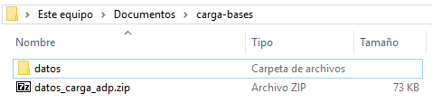
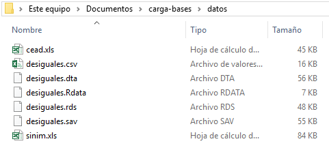
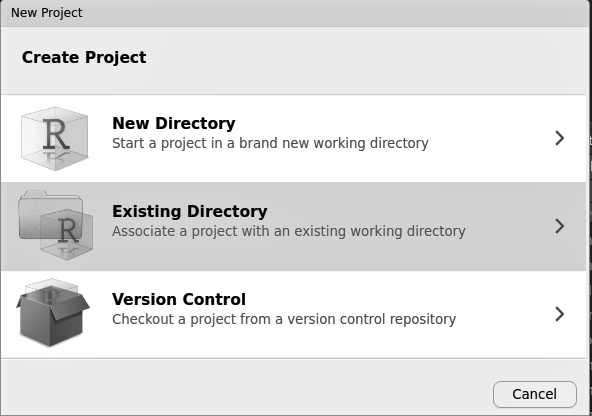
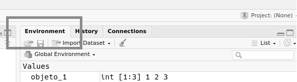
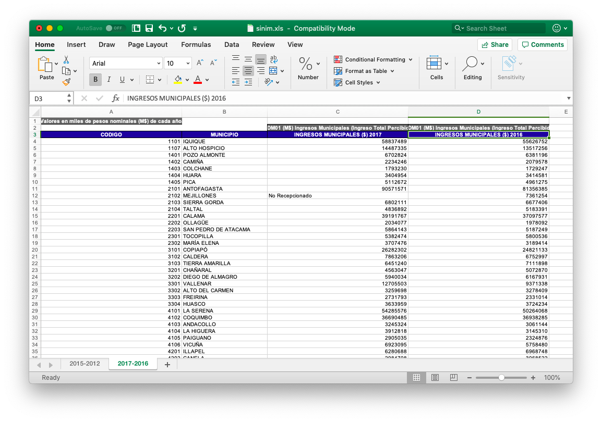
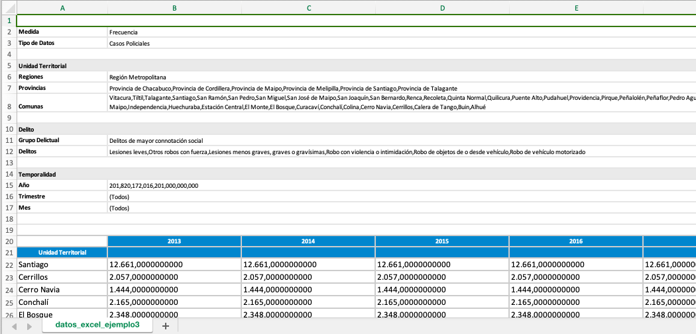

# Carga de bases {#load}

Soledad Araya^[E-mail: snaraya@uc.cl] y Andrés Cruz^[E-mail: arcruz\@uc.cl]

### Los paquetes que necesitas instalar {-}

- `tidyverse` [@R-tidyverse], `paqueteadp` [@R-paqueteadp], `haven` [@R-haven], `readxl` [@R-readxl], `data.table` [@R-data.table], `ff` [@R-ff].

## Introducción {#load-intro}

Cargar bases de datos no siempre es una tarea fácil. Las personas que crean base de datos utilizan diferentes formatos de archivo, tratando de optimizar diversos criterios (facilidad para los usuarios , software disponible, tamaño, etcétera). A veces, la información que se necesita está distribuida en múltiples bases de datos pequeñas. En otros casos, el problema depende de la magnitud de los datos, con bases de datos que, empleando los métodos habituales de carga de datos, afectarán al rendimiento de la computadora. Las siguientes tres subsecciones ayudarán a sortear estos desafíos.

A diferencia de los otros capítulos de este libro, aquí necesitarás descargar bases de datos directamente a tu computadora sin usar el paquete del libro. La idea es que aprendas a cargar datos en el mundo real! Comienza creando una nueva carpeta en tu ordenador, que será la carpeta de tu proyecto. Llamaremos a nuestra nueva carpeta de proyecto, muy originalmente, `load-dataset`. Luego, descarga [desde este enlace](https://arcruz0.github.io/libroadp/00-archivos/datos_carga_adp.zip) el archivo .zip con las bases de datos para este capítulo, y guárdalo en la carpeta que creaste. En Windows, por ejemplo, esto debería ser similar a esta imagen:


```{r folder1, echo=FALSE, out.width='65%', fig.cap=" Carpeta con archivo .zip"}
knitr::include_graphics(path = "00-images/load/folder_1.png")
```

Después, necesitas descomprimir el contenido del archivo .zip. La forma exacta de hacerlo dependerá de tu sistema operativo y sus programas, pero tiende a ser algo similar a `Haz clic derecho > Descomprimir aquí`. Ahora deberías tener una subcarpeta llamada "files":

```{r folder-2, echo=FALSE, out.width='65%', fig.cap=" Carpeta con subcarpeta ya descomprimida"}

```

Revisa la nueva subcarpeta. Aquí están las bases de datos que se van a utilizar en este capítulo. Como verás, aprenderemos a cargar y utilizar múltiples formatos comunes:

```{r folder-3, echo=FALSE, out.width='65%', fig.cap=" Subcarpeta con archivos de datos"}

```

¡Ya casi hemos terminado! Como se ha explicado con más detalle en el capítulo  \@ref(data), vamos a utilizar *Proyectos de RStudio* con el fin de ordenar nuestro trabajo. Vamos a crear un proyecto de RStudio haciendo clic en la esquina superior derecha de RStudio, "Proyecto...", y luego "Nuevo Proyecto". Seleccionando "Directorio Existente" en la siguiente ventana puedes vincular el proyecto a la carpeta que ya has creado (en este caso, `load-dataset`):

```{r rstudio-projects, echo=FALSE, out.width="60%", fig.cap=" Creando un nuevo proyecto de RStudio en una carpeta ya existente"}

```

¡Perfecto! Ahora deberías tener un nuevo proyecto para empezar a trabajar de forma ordenada con los datos de este capítulo.

## Diferentes formatos de bases de datos {#carga-formatos}

En esta subsección, aprenderás a cargar diferentes formatos de bases de datos en R: separados por delimitadores, creados en R, con etiquetas en Stata o SPSS, o desde Excel.

## Los archivos separados por delimitadores (.csv y .tsv)

Un archivo de texto plano (*flat-file dataset*) es un archivo constituido únicamente por texto o caracteres. Es un formato soportado por diferentes programas, y se puede trabajar con él sin esfuerzo. La única diferencia radica en los delimitadores que utiliza: (1) en el caso del .csv, el delimitador es una coma (,) y, (2) en el caso del .tsv, está delimitado por una tabulación (o parachoques) que se expresan con `<TAB>` o `\t`. 

### R básico: `utils`
 
R básico tiene funciones que leen este tipo de archivos. Probablemente has encontrado `read.table` or `read.csv`, que son funciones específicas que leen archivos csv con el paquete `utils`. La primera debería ser suficiente para abrir cualquiera de estos archivos. Sólo tenemos que centrarnos en las características específicas de cada uno. Como dijimos antes, las separaciones de estos archivos suelen ser diferentes, y esta función nos permite especificar el tipo de separación ("," , ";" , "|" o "\t") con el argumento `sep =`.

Sin embargo, hay mejores opciones para cargar estos tipos de bases de datos. Aunque `read.table()` puede ser amigable cuando se aprende R, no será suficiente para trabajar con archivos cada vez más grandes. La segunda desventaja de `read_table()` es que, normalmente, no funcionará correctamente con archivos que contengan caracteres especiales, ¡una gran desventaja para los no angloparlantes!

Para esos casos, tenemos diferentes alternativas que presentamos a continuación.

#### `readr`{#load-readr}

El paquete `readr` se encarga de introducir una serie de funciones que pueden leer diferentes tipos de archivos. A primera vista, la diferencia entre las funciones `utils` y `readr` es un guión bajo (pasamos de read.table a read_table). Sin embargo, las funciones de `readr` son mejores cuando se trabaja con  bases de datos grandes, y es mucho más rápido cuando se cargan. `readr`, como muchos de los paquetes ya presentados, es parte de los paquetes principales de `tidyverse`. Puedes cargarlo individualmente o a través de `tidyverse`.

```{r}
library(tidyverse)

library(readr) # alternativa individual
```

Comencemos presentando una de as bases de datos que se utilizarán en este capítulo, que proviene del proyecto [*Desiguales*]((https://www.desiguales.org/)) del PNUD - Programa de las Naciones Unidas para el Desarrollo. Este proyecto buscó mapear la complejidad de las desigualdades en Chile con la ayuda de una encuesta aplicada en 2016. Utilizaremos una pequeña subsección de esta base de datos, que contiene información para 300 encuestados a través de 20 variables. Como habrás notado, contamos con la base de datos en seis formatos diferentes para el desarrollo de este capítulo: 
 
```{r folder-3-2, echo=FALSE, out.width='65%', fig.cap="Subcarpeta con bases de datos"}

```

¿Cómo podemos cargar la base de datos en el formato .csv? Como puedes sospechar, empezaremos con la base de datos más simple de cargar. Gracias a la función `read_csv()` en `readr`, sólo tendremos que escribir la ruta del archivo dentro de nuestro proyecto:

```{r echo=F}
df_desiguales_csv <- read_csv("00-data/load/desiguales.csv")
```

```{r eval=F}
df_desiguales_csv <- read_csv("data/desiguales.csv")
```
 
Empezamos el nombre del objeto con "df" como abreviatura de *dataframe*. Para confirmar que nuestro archivo está en el sistema en forma como objeto, usaremos `ls()`. Con esta función se puede ver la lista de los objetos creados o cargados. También puedes comprobarlo en el panel "Environrment" de RStudio.

```{r env-flap, echo=FALSE, out.width='60%', fig.cap="Panel de Environment, arriba a la derecha"}

```

```{r}
ls()
```

Ahora, confirmamos con `class()` que este archivo está en el formato *dataframe* y *tibble*. Debido a que seguiremos usando las herramientas de `tidyverse`, es útil trabajar con este formato.
 
```{r}
class(df_desiguales_csv)
```

Es importante saber más sobre la función para poder sortear los obstáculos que surgen al cargar bases de datos en este formato. Para empezar, puede ser que tu archivo esté separado por un tipo diferente de separador. Puedes definirlo con `delim=`, que cumple la misma función que `sep=` en `read.table`. Además, cuando se manejan archivos con un cierto tipo de digitación, es útil usar `locale` para especificar separadores decimales y de miles. Los países angloparlantes usan un punto para separar los decimales, pero Europa continental y los países latinoamericanos usan una coma.
 

>Una segunda nota: Probablemente viste la función `read_csv2()` sugerida por R Studio cuando escribiste `read_csv` en R. La única diferencia entre las dos es el carácter que usamos para delimitar nuestros datos: `read_csv2()`  usa ";" como delimitador por defecto, mientras que `read_csv()` usa ",". Para los archivos .tsv se puede usar la función `read_tsv()`, que no está incluida por defecto en el paquete `utils`.

Una vez cargada la base, exploremos brevemente los datos en los que estamos trabajando con `glimpse()`, como hicimos en el capítulo anterior. Las herramientas del paquete `dplyr` deberían estar ya disponibles, ya que previamente has cargado `tidyverse`. Usaremos `glimpse()` para ver un breve panorama de las primeras 10 columnas de nuestros datos.

```{r}
df_desiguales_csv %>% select(1:10) %>% glimpse()
```

¡Todo se ve muy bien! Sigamos explorando otras formas de cargar datos en R.

### Archivos creados con R (.Rdata y .rds) {#load-r}

Ahora nos centraremos en los archivos creados con R, que tienen una extensión .Rdata (.rda también es válido) o .rds. Estos formatos de archivo nos permiten almacenar *cualquier* objeto en R, ya sea un vector, un *dataframe*, una matriz, una lista, etc. Después de leer el archivo, R cargará el objeto tal y como fue guardado. Así pues, los archivos en este formato destacan por (a) su flexibilidad a la hora de almacenarlos, sin limitarse a su base de datos, y (b) por su perfecta compatibilidad con R: por ejemplo, puedes estar seguro de que cada variable de una base de datos .rds se cargará en el formato correcto (vectores numéricos como numéricos, factores como factores, etc.^[Esto no siempre es así en un archivo .csv, por ejemplo, que no contiene esta información almacenada. Lo que hace R para ese determinado formato -y otros- es inferir el tipo de formato])

La diferencia entre un archivo .Rdata (o .rda) y un archivo .rds es simple pero importante: mientras que el primero puede contener cualquier número de objetos, el segundo se limita a un solo objeto. Ahora aprenderás a cargar los objetos creados en R, en cualquiera de los dos formatos.

#### Archivos .Rdata (uno o más objetos) {#load-rdata}

Los archivos .Rdata pueden contener más de un objeto. Aunque esto suena conveniente, incluye una limitación: al cargar los objetos, estos adoptarán automáticamente el nombre con el que fueron creados. Por ejemplo, en el archivo .Rdata para la base de datos de *Desiguales* hemos guardado dos objetos: el *dataframe* que vimos anteriormente (ahora llamado `df_desiguales_rdata`) y un vector numérico para las edades de los encuestados (llamado `age_vector`). Para cargar el archivo sólo hay que usar la función `load()`.
 
```{r echo=F}
load("00-data/load/desiguales.Rdata")
```

```{r eval=F}
load("data/desiguales.Rdata")
```

Como se ha dicho anteriormente, puedes usar el comando `ls()` para comprobar si los objetos se cargaron correctamente en la sesión R. Si los dos objetos fueron cargados correctamente, entonces ambos deben ser nombrados, además del marco de datos anterior originado de un archivo .csv.

```{r}
ls()
```

#### Archivos .rds (sólo un objeto)

Los archivos .rds se limitan a almacenar un solo objeto. Aunque suena menos atractivo que la flexibilidad del .Rdta, este formato se destaca por su modularidad, que ayuda a mantener sus archivos en orden. Otro rasgo positivo del .rds es que la sintaxis utilizada para cargar estos archivos es familiar, muy similar a la utilizada para cargar los archivos .csv. Ahora puedes ponerle un nombre al objeto cuando lo creas. El comando es el siguiente, usando la función `read_rds()` (que hemos cargado antes con el `tidyverse`):
 
```{r echo=F}
df_desiguales_rds <- read_rds("00-data/load/desiguales.rds")
```

```{r eval=F}
df_desiguales_rds <- read_rds("data/desiguales.rds")
```

De nuevo, puedes usar el comando `ls()` o RStudio para asegurarte de que el objeto haya sido creado sin problemas en la sesión:
```{r}
ls()
```

### Bases de datos con etiquetas (de Stata or SPSS) {#load-labels}

Las bases de datos con etiquetas son de uso común en las ciencias sociales, especialmente en los archivos SPSS (.sav) y Stata (.dta). La idea principal es relativamente simple: la información explicativa se guarda en el archivo además de los valores de la base de datos. Por ejemplo, la variable `p2` de la base de datos de *Desiguales*, que corresponde a la segunda pregunta de la encuesta, podría tener una etiqueta que describa la pregunta en sí ("Estado civil") o la pregunta explícita ("Independientemente de si tiene o no una pareja en este momento, ¿cuál es su estado civil o marital actual?"). Llamaremos a este tipo de etiqueta *etiqueta variable*.

Además, las etiquetas pueden registrar información sobre los valores de las variables. Por ejemplo, la pregunta `p2` tiene las siguientes respuestas posibles:

Valor | Etiqueta
----- | ---------------------------------
1 | Casado por primera vez
2 | Casado por segunda vez o más
3 | Legalmente casado, pero soltero de hecho
4 | Divorciado
5 | Soltero, nunca se ha casado
6 | Soltero, pero con un matrimonio legalmente anulado
7 | Viudo
8 | En pareja
88 | No sabe
99 | No contesta

Una base de datos puede almacenar los valores numéricos registrados por el encuestador, mientras que la información explicativa se puede guardar en etiquetas. Aunque una base de datos sólo puede registrar un "4" en la variable `p2` para un caso específico, su etiqueta nos ayuda a identificar el estado civil contestado por el encuestado ("Divorciado"). Llamaremos a este tipo de etiqueta *etiqueta de valor*.

En la siguiente sección, aprenderá a cargar en R las bases de datos de SPSS (.sav) y Stata (.dta) con etiquetas. Esto te permitirá reportar su análisis por etiquetas, tanto para las variables como para los valores. Necesitarás el paquete `haven` para usar esta función. Si instalaste `tidyverse` en el pasado ya tienes acceso a `haven`. Sin embargo, `library(tidyverse)` no es suficiente para instalarlo, así que tendrás que cargarlo por separado:^[Aunque `haven` es una parte de `tidyverse`, no está incluido en el "núcleo" del mismo. El núcleo de `tidyverse` incluye algunos paquetes, que son los más usados. El resto de los paquetes, por ejemplo `haven`, necesitan ser cargados (pero no instalados) por separado]

```{r}
library(haven)
```
 
Los comandos utilizados para cargar las bases de datos con etiquetas son similares a los utilizados anteriormente para cargar los archivos .csv y .rds. La función usada para leer los archivos SPSS es `read_spss()`, mientras que la de Stata es `read_stata()`. Vamos a cargar ambas bases de datos:

```{r echo=F}
df_desiguales_spss <- read_spss("00-data/load/desiguales.sav")
```

```{r eval=F}
df_desiguales_spss <- read_spss("data/desiguales.sav")
```

```{r echo=F}
df_desiguales_stata <- read_stata("00-data/load/desiguales.dta")
```

```{r eval=F}
df_desiguales_stata <- read_stata("data/desiguales.dta")
```

Puede comprobar si los objetos fueron creados usando el comando `ls()` o en el panel "Entorno" de RStudio.

```{r}
ls()
class(df_desiguales_spss)
class(df_desiguales_stata)
```

Las bases de datos con etiquetas se diferencian de los demás no por la clase del objeto, sino por sus variables. Utilizando las herramientas aprendidas en el capítulo \@ref(data), puedes explorar las primeras diez variables de cualquiera de las bases de datos (ambos darán los mismos resultados, por lo que a partir de ahora utilizaremos la base de datos de SPSS).

```{r}
df_desiguales_spss %>% select(1:10) %>% glimpse()
```

Como podrás notar, la mayoría de las variables no son sólo vectores numéricos ("dbl" o "doble" ^[ Esta es una forma de nombrar los números reales en la computación]), sino que también incluyen etiquetas (+ "lbl"). Obtengamos los primeros seis valores y la información de la variable etiquetada "p2" utilizando el comando `head()`:

```{r}
head(df_desiguales_stata$p2)
```

```{r echo=F}
labelled(head(df_desiguales_stata$p2), 
         labels = slot(head(df_desiguales_stata$p2), "labels"), 
         label = "P2 - ¿podria decirme cual es su estado conyugal...?")
```

Analicemos brevemente el resultado mostrado en la consola. En primer lugar, podemos ver que la variable en cuestión es un vector numérico con una etiqueta ("<Doble etiquetado>"). Luego, después de los dos puntos, registra la *etiqueta de variable*: *"P2 - ¿cuál es su estado civil o marital actual? "*. Después, se muestran los seis primeros valores de la variable, tal y como pedimos a través del comando `head()`. Por último, se encuentran las etiquetas de valor *, que nos dan información sobre el significado de cada número en el contexto de una variable específica.

De esta manera, obtenemos toda la información registrada por las etiquetas en esta base de datos. Con los comandos aprendidos se puede estar seguro del significado de cada valor en la base de datos etiquetada. Por último, note que R, con la ayuda de `haven`, también mostrará las etiquetas en otros casos cuando sea conveniente. Por ejemplo, veamos un simple resumen de las dos primeras variables de la base de datos. ¡Mira qué fácil es leerlo!

```{r}
df_desiguales_stata %>% select(region, p2)
```
### Archivos de Excel {#load-excel}

Aunque la mayoría de las veces utilizaremos bases de datos que vienen en los formatos anteriores, es importante reconocer que no todas las instituciones presentan su información de esta manera. A menudo te enfrentarás a formatos que traen dolores de cabeza. Por ejemplo, Excel. En Chile, una cantidad considerable de organizaciones gubernamentales todavía trabajan con Excel, y el problema no es el formato sino la estructura de las bases de datos. 

La mayoría de las veces nos enfrentaremos a algo como esto:

```{r excel-example-1, echo=F, out.width="100%", fig.cap = "Base de datos del SINIM (*Sistema Nacional de Información Municipal*)"}

```

O como esto:

```{r excel-example-2, echo=F, out.width="100%", fig.cap = "Base de datos del CEAD"}

```

Aquí es donde surgen los problemas.

Para empezar, carguemos uno de los paquetes más usados para leer archivos de Excel (sea .xls o .xlsx), `readxl`, un paquete de `tidyverse`^[Igual que `haven`, `readxl` es una parte de `tidyverse`, pero no un miembro principal de su núcleo. Por lo tanto, es necesario cargarlo por separado]:
 
```{r}
library(readxl)
```

Para el próximo ejemplo, utilizaremos la base de datos del [CEAD (*Centro de Estudios y Análisis del Delito*)](http://cead.spd.gov.cl/estadisticas-delictuales/). El CEAD es una institución chilena que se centra en la vigilancia y el estudio de la delincuencia en el país. Su objetivo es crear y analizar información sobre el crimen para ayudar a la formación de políticas públicas. Esta base de datos es la que se puede descargar por defecto en su página web.
Para cargar el archivo, usaremos `read_excel()`de `readxl`. Sólo es necesario poner la ruta del archivo .xls o .xlsx:

```{r echo=F}
df_cead_excel <- read_excel("00-data/load/cead.xls")
```

```{r eval=F}
df_cead_excel <- read_excel("data/cead.xls")
```
 
Primero, comprobemos que los datos fueron cargados correctamente en el *Environment* con `ls()`. Luego, usemos `glimpse` para examinar las primeras observaciones en nuestra base de datos:

```{r}
ls()
df_cead_excel %>% glimpse()
```

Algo se ve mal. Si miramos de nuevo la imagen de la base de datos de la CEAD, nos daremos cuenta de lo que está pasando. Primero, el archivo de Excel tiene en sus filas iniciales información de la base de datos, pero estas no son observaciones.

```{r excel-example-3, echo=F, out.width="100%", fig.cap = "Base de datos del CEAD (*Centro de Estudios y Análisis del Delito*)."}

```

Para resolver esto, es necesario usar `skip =`. Este argumento nos ayudará a omitir las filas que no nos interesan, en este caso, las primeras 18:

```{r echo=F}
df_cead_excel_v2 <- read_excel("00-data/load/cead.xls", skip = 18)
```

```{r eval=F}
df_cead_excel_v2 <- read_excel("data/cead.xls", skip = 18)
```

Otra forma de hacer lo mismo es delimitar la información que queremos cargar a través de un rango. Así, podemos delimitar el rango con `range`, obteniendo sólo la información que necesitamos dentro del rectángulo especificado. El rango puede ser delimitado con la letra de la columna y el número de la fila en el archivo .xls o .xlsx.

```{r echo=F}
df_cead_excel_v3 <- read_excel("00-data/load/cead.xls", range = "A20:G81")
```

```{r eval=F}
df_cead_excel_v3 <- read_excel("data/cead.xls", range = "A20:G81")
```

Comprobamos que los datos fueron cargados correctamente con `ls()`, y luego podemos ver el tipo de archivo con `class()`. Para los propósitos de este capítulo, sólo usaremos el último archivo .xls cargado (`df_cead_excel_v3`).

```{r}
ls()
class(df_cead_excel_v3)
```

Como pueden observar, es muy fácil cargar este tipo de archivos después de practicar durante un tiempo. Por ahora, esto es todo lo que necesitas saber para cargar archivos .xls o .xlsx. Es posible que tengas que lidiar con problemas de digitación, con nombres de variables imposibles o con errores de tecleo que pueden causar más de un problema al trabajar con `skip`. Pero ya sabes cómo usar algunas herramientas de `tidyverse` que pueden ayudarte con eso.

Intentemos hacer algunos cambios básicos en la base de datos del CEAD:

```{r}
names(df_cead_excel_v3)
```
El primer problema es el nombre de la columna que indica la comuna. El segundo problema es que queremos una base de datos *ancha*, ¡así que no nos ayuda tener los años como columnas! Para el primer problema, usamos `rename`, y para el segundo `pivot_longer`.

```{r}
df_cead_excel_v4 <- df_cead_excel_v3 %>% 
  rename(county = `...1`) %>% 
  pivot_longer(cols = -county, names_to = "year", values_to = "n_crime") %>% 
  filter(county != "Unidad Territorial")
```

Otro problema que puede surgir al utilizar los archivos de Excel es que la información puede estar dividida en diferentes hojas. Como verás, `read_excel()` resuelve esos problemas de una manera muy simple. Para demostrarlo, utilizaremos la base de datos del [SINIM (*Sistema Nacional de Información Municipal*)](http://datos.sinim.gov.cl/index.php). El SINIM es un sistema de información chileno a través del cual los ciudadanos pueden acceder a una variedad de datos relativos a la administración del condado:

```{r echo=F}
df_sinim_excel <- read_excel("00-data/load/sinim.xls", 
                             sheet = 2, skip = 2, na = "Not received")
```

```{r eval=F}
df_sinim_excel <- read_excel("data/sinim.xls", 
                             sheet = 2, skip = 2, na = "Not received")
```

Con el argumento `sheet=` podemos seleccionar la hoja que queremos cargar en R. Se puede cargar tanto con la posición como con el nombre de la hoja. Como ya hemos aprendido, con `skip` seleccionamos el número de filas que queremos saltar al cargar la base de datos, y con `na` podemos hacerle saber al programa qué otra frase, palabra o situación tiene que ser listada como NA además de las celdas en blanco.
 
Una de las principales tareas cuando se trabaja en Excel es la limpieza de la base de datos. Desafortunadamente, estos dos ejemplos están muy extendidos, y para tratar algunos de estos problemas usamos `janitor`. Por lo general, los nombres de las variables en Excel tienden a venir de una manera muy detallada y/o descriptiva: pueden tener espacios, caracteres especiales y mayúsculas que dificultan el trabajo con nuestras variables de interés. Por ejemplo, los nombres en las columnas de esta base de datos tienen todo lo anterior:

```{r}
names(df_sinim_excel)
```

¿Te imaginas tener que escribir esos nombres cada vez que queramos hacer algún tipo de análisis?

Para eso tenemos la función `clean_names()` del paquete `janitor`. Este paquete fue creado para facilitar la limpieza de los datos, y, sin ser un paquete `tidyverse`, puede ser usado sin problemas con las tuberías. Y, para nuestra suerte, está optimizado para trabajar con `readr` y `readxl`.

La función `clean_names()` funciona de una manera simple después de instalar `janitor` (con `install.packages(“janitor")`):
 

```{r load-excel-janitor}
df_sinim_excel_v2 <- df_sinim_excel %>% janitor::clean_names()
```

Ahora, veamos de nuevo los nombres de las variables:

```{r}
names(df_sinim_excel_v2)
```

¡Se ve mucho mejor! Estas funciones hacen que trabajar en R sea una experiencia mucho más simple y amigable, sin importar tu nivel de experiencia y lo que estés buscando hacer. Trabajar con nombres de variables puede ser un dolor de cabeza, y esta herramienta te ayudará a evitar el exceso de trabajo, permitiéndote centrarte en las partes importantes del análisis (que, por supuesto, no deberían ser nombres de columnas).

Con estas herramientas, deberías estar más que preparado para enfrentarse al horrible mundo de trabajar con Excel.


## Grandes bases de datos tabulares {#load-large}

Junto con los avances tecnológicos y las conexiones más rápidas a Internet, las grandes bases de datos son muy atractivas para los científicos sociales. Recientemente ha habido un boom en lo que se llama “big data”. Sin embargo, las herramientas habituales de gestión de bases de datos tabulares tienden a no funcionar correctamente en las grandes bases de datos, y es necesario encontrar alternativas. La complejidad de enfrentarse al tamaño de las bases de datos depende de múltiples factores (por ejemplo, la naturaleza de los datos y las características de la computadora), pero, en general, una base de datos tabulares de más de 1 GB de tamaño generará problemas en R en una computadora personal media. ¿Qué podemos hacer para manejar este tipo de base de datos?

En la siguiente sección, trabajarás con la base de datos *Desiguales* en formato .csv, tal y como hiciste en la subsección \@ref(carga-formatos) de este capítulo. Pretenderemos que se trata de un caso de una base de datos "gigante", a pesar de que sólo tiene 15KB de tamaño. Por cierto, si quieres probar hacer el siguiente análisis con bases de datos del mundo real que son de interés para la ciencia política, puedes encontrar algunos para descargar en el [*Observatorio de Complejidad Económica*](https://atlas.media.mit.edu/es/), que registra el comercio bilateral de los países por diferentes categorías productivas^[Estos se encuentran en un formato .tsv, por lo que tendrás que hacer ligeras alteraciones en la sintaxis, tal y como aprendiste en la subsección de archivos .csv/.tsv (\@ref(carga-formatos))].

Entonces, ¿cómo podemos manejar una base de datos muy grande? Una primera alternativa es evaluar la necesidad de utilizar toda la base de datos para el análisis, o, si se puede acortar antes de utilizarla. Para iniciar un análisis exploratorio que pueda aclarar este punto, recomendamos usar el argumento `n_max=` en `read_csv()` y sus funciones hermanas (por ejemplo, `read_tsv()`). De esta manera podemos examinar las primeras cien observaciones de la base de datos, haciendo que el proceso de cálculo sea menos exigente:
 

```{r load-csv-nmax, echo=F}
df_desiguales_large_100 <- read_csv("00-data/load/desiguales.csv", 
                                    n_max = 100)
```

```{r eval=F}
df_desiguales_large_100 <- read_csv("data/desiguales.csv", n_max = 100)
```

Seguramente tu computador manejará con facilidad esta nueva base de datos reducida. Ahora, ¿qué pasa si, después de comprobar los datos, descubres que sólo necesitas un par de variables para el análisis? Recortar la base de datos permitirá un uso eficiente de los recursos computacionales. Observe que el argumento `n_max` ya no es útil, ya que recorta las filas en lugar de las columnas. Supongamos que de la base de datos *Desiguales* (la "gigante") sólo necesitas las variables `age` y `p2`. Con una función de asistencia de nuestro paquete `paqueteadp` (`cols_only_chr()`), puedes hacer que `read_rds()`cargue la base de datos con sólo esas dos variables, omitiendo todas las demás, y además evitando el costo computacional que implican:
 

```{r message=F}
library(paqueteadp)
```

```{r echo=F}
df_desiguales_large_2vars <- read_csv("00-data/load/desiguales.csv",
                                       col_types = cols_only_chr(c("age", 
                                                                   "p2")))
```

```{r eval=F}
df_desiguales_laod_2vars <- read_csv("data/desiguales.csv",
                                       col_types = cols_only_chr(c("age",
                                                                   "p2")))
```

Sin embargo, es posible que algunos análisis no permitan la omisión de variables, o que incluso después de todos los procedimientos para reducir su tamaño, la base de datos siga siendo demasiado grande. En este caso, el ecosistema de R también proporciona alternativas.

Una primera opción son las funciones `fread()` del paquete `data.table`. Esta función, optimizada para la velocidad, suele ser más rápida que `read_csv()`, aunque no tiene la misma variedad de opciones y no es tan amigable en su uso. Una vez que `data.table` se instala en nuestro sistema --es decir, después de `install.packages("data.table")`-- el siguiente comando nos permitirá cargar la base de datos:
 

```{r read-dt, eval=F}
library(data.table)
df_desiguales_large_fread <- fread("data/desiguales.csv")
```

>Nota que, aunque el objeto creado es un *marco de datos*, también es un tipo especial llamado `data.table`:

```{r echo=F, warning=F, message=F}
df_desiguales_large_fread <- 1
class(df_desiguales_large_fread) <- c("data.table", "data.frame")
```

```{r}
class(df_desiguales_large_fread)
```

El paquete `data.table`  tiene varias funciones para tratar con grandes tipos de objetos, y tiende a ser más eficiente desde el punto de vista computacional - sin embargo, a menudo es menos intuitivo y legible. Si quieres saber más sobre `data.table`, puedes consultar las múltiples [viñetas](https://cran.r-project.org/web/packages/data.table/index.html) disponibles en la página web del paquete.

Por último, si `data.table` no es lo suficientemente eficiente para tratar tus datos, tenemos otra opción disponible. El paquete `ff` proporciona una solución interesante para el problema de las grandesbases de datos: en lugar de cargarlos en la RAM, como otros paquetes, ocupa directamente el disco duro (que normalmente tiene más espacio disponible). Aunque esto hace que la mayoría de las funciones tradicionales de R no funcionen, `ff` abre la puerta para usar bases de datos gigantes: el paquete trae toda una nueva familia de funciones de análisis *ad hoc*, inspiradas en R.

Puede encontrar más información sobre `ff`, si es necesario, en su [página web](http://ff.r-forge.r-project.org/) y en su R [archivo de ayuda] oficial(https://cran.r project.org/web/packages/ff/ff.pdf). Si quieres intentar cargar primero una base de datos con este paquete, puedes usar el siguiente comando^[Es importante añadir el argumento `file =`, ya que no es el primer argumento que recibe la función en cuestión]. -suponiendo que el paquete esté instalado, con `install.packages("ff")`:
 

```{r eval=F}
library(ff)
df_desiguales_large_ff <- read.csv.ffdf(file = "data/desiguales.csv")
```

> **Ejercicio 4A.** Desde la página web de [Latinobarómetro](http://www.latinobarometro.org/latContents.jsp), descarga la edición 2017 en formato SPSS (.sav) e impórtelas a R. Ten cuidado con las etiquetas.
>
> **Ejercicio 4B.** Ahora, repite el proceso de descarga de la base de datos de Stata (.dta).
