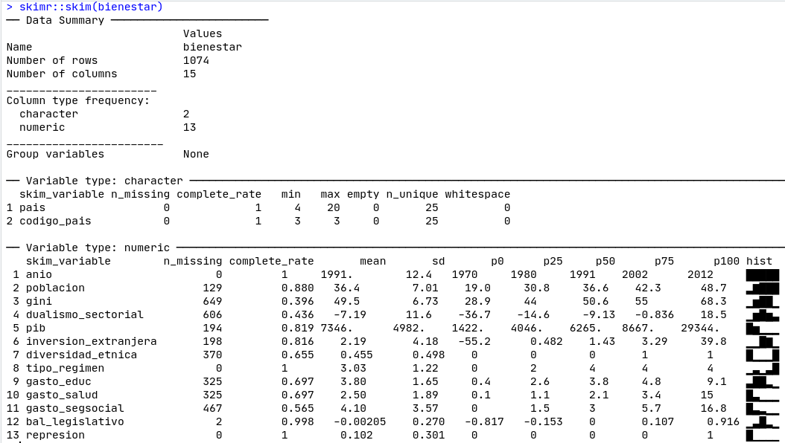

# (PART) Modelos {-}

# Modelos lineales {#linear}

Inés Fynn^[E-mail: ifynn@uc.cl] y Lihuen Nocetto^[E-mail: lnocetto@uc.cl]

```{r setup, include=FALSE}
knitr::opts_chunk$set(warning = T)
```

### Lecturas sugeridas {-}

- Angrist, Joshua, Jörn-Steffen Pischke. (2008). *Mostly Harmless Econometrics: An Empiricist's Companion*. Princeton: Princeton University Press.

- Dunning, Thad. (2012). *Natural Experiments in the Social Sciences. A design-based approach*. Cambridge: Cambridge University Press.

- Lewis-Beck, C., & Lewis-Beck, M. (2016). *Applied Regression: An Introduction*. SAGE Publications.

- Wooldridge, J. M. (2016). *Introductory econometrics: A modern approach* (6th ed.). Cengage Learning.

### Los paquetes que necesitas instalar {-}

- `tidyverse` [@R-tidyverse], `paqueteadp` [@R-paqueteadp], `skimr` [@R-skimr], `car` [@R-car], `ggcorrplot` [@R-ggcorrplot], `texreg` [@R-texreg], `prediction` [@R-prediction], `lmtest` [@R-lmtest], `sandwich` [@R-sandwich], `miceadds` [@R-miceadds].

### Introducción {-}

En este capítulo, aprenderemos a hacer regresiones lineales en R. Aquí la función a modelar es lineal, es decir, se estima por dos parámetros: la pendiente y el intercepto. Cuando nos enfrentamos a un análisis multivariado, la estimación se vuelve más compleja. Cubriremos en R cómo interpretar los diferentes coeficientes, cómo crear tablas de regresión, cómo visualizar los valores predichos, y profundizaremos en la evaluación de los supuestos de los mínimos cuadrados ordinarios (MCO), para que pueda evaluar lo bien que encajan tus modelos.

## Mínimos cuadrados ordinarios en R 

En este capítulo, la base de datos que trabajaremos es una mezcla de dos bases de datos construidas por [Evelyne Huber y John D. Stephens](http://huberandstephens.web.unc.edu/common-works/data/). Estas base de datos son:

- Base de datos bienestar en América Latina, 1960-2014 (Evelyne Huber y John D. Stephens, Latin American Welfare Dataset, 1960-2014, Universidad de Carolina del Norte en Chapel Hill, 2014): contiene variables sobre los Estados de bienestar en todos los países de América Latina y el Caribe entre 1960 y 2014.

- Base de datos política de América Latina y el Caribe, 1945-2012 (Evelyne Huber and John D. Stephens, Latin America and the Caribbean Political Dataset, 1945-2012, University of North Carolina at Chapel Hill, 2012): contiene variables políticas de todos los países de América Latina y el Caribe entre 1945 y 2012.

La base de datos resultante tiene 1074 observaciones para 25 países entre 1970 y 2012 (se excluyeron los datos del decenio de 1960 porque contenían muchos valores perdidos o *missing values*). 

En primer lugar, cargamos el paquete `tidyverse`.

```{r, message=F}
library(tidyverse)
```

Vamos a importar la base de datos del paquete del libro:

```{r}
library(paqueteadp)
data("bienestar")
```


Ahora, la base de datos ha sido cargada en nuestra sesión de R 

```{r}
ls()
```

En el capítulo, utilizaremos el documento de @huberPoliticsInequalityLatin2006 como ejemplo para el análisis. En este artículo, se estiman los determinantes de la desigualdad en América Latina y el Caribe. Trabajar a partir de este artículo nos permite estimar un modelo con múltiples variables de control que ya han sido identificadas como relevantes para explicar la variación de la desigualdad en la región. Así, la variable dependiente que nos interesa explicar es la desigualdad de ingresos en los países de América Latina y el Caribe, operada de acuerdo al Índice de Gini (`gini`). Las variables independientes que incorporaremos al modelo son las siguientes: 

+ Dualismo sectorial (se refiere a la coexistencia de un sector tradicional de baja productividad y un sector moderno de alta productividad) - `dualismo_sectorial`

+ PBI del país - `pib`

+ Inversión Extranjera Directa (ingresos netos como % del PIB) - `inversion_extranjera`

+ Diversidad étnica (variable *dummy* codificada como 1 cuando al menos el 20% pero no más allá del 80% de la población es étnicamente diversa) - `diversidad_etnica`

+ Democracia (tipo de régimen) - `tipo_regimen`

+ Gasto en educación (como porcentaje del PIB) - `gasto_educ`

+ Gasto en salud (como porcentaje del PIB) - `gasto_salud`

+ Gasto de seguridad social (como porcentaje del PIB) - `gasto_segsocial`

+ Equilibrio legislativo - `bal_legislativo`

En este capítulo se intentará estimar cuál es el efecto del gasto educativo en los niveles de desigualdad de los países de América Latina y el Caribe. Así, nuestra variable independiente de interés será `gasto_educ`.

### Cómo obtener estadísticas descriptivas

Antes de estimar un modelo lineal con mínimos cuadrados ordinarios (MCO) se recomienda identificar primero la distribución de las variables que te interesan: la variable dependiente $y$ (también llamada variable de respuesta) y la variable independiente de interés $x$ (también llamada variable explicativa o regresiva). En general, nuestros modelos tendrán, además de la variable independiente de interés, otras variables independientes (o explicativas) que llamaremos "controles", ya que su tarea es hacer el escenario *ceteris paribus* lo más creíble posible. Es decir, los controles ayudarán a "mantener constantes todos los demás factores" para acercarnos lo más posible a un escenario en el que podamos controlar todas las variables que afectan a $y$, y observar cómo la variación de una única variable independiente $x$ afecta a la variación de la variable dependiente ($y$).
Así, antes de estimar el modelo, observaremos las estadísticas descriptivas de las variables que se incluirán en el modelo (tanto las dependientes como las independientes). El objetivo es prestar atención a las siguientes cuestiones:

1. Variación en $x$: que las variables independientes (pero sobre todo la de interés) tengan variación en nuestra muestra. Si no hay variación en $x$, no podemos estimar cómo esta variación afecta a la variación de $y$.

2. Variación en $y$: si la variable dependiente no varía, no podemos explicar su variación según la variación de $x$.

3. Unidad de medida de las variables: aquí es donde evaluamos cómo se miden nuestras variables (además de revisar los libros de códigos que suelen venir con las bases de datos con los que estamos trabajando), para poder entender qué tipos de variables son (nominales, ordinales, continuas), y también para interpretar correctamente los resultados más adelante.

4. Tipo de variables: en la estimación del MCO, la variable dependiente debe ser, en general, *continua*, (aunque es posible trabajar con variables dependientes dicotómicas). Por lo tanto, debemos asegurarnos de que la variable dependiente es continua y numérica. Además, es importante conocer el tipo de variable independiente y comprobar que su tipo es coherente con su formato de codificación (es decir, si tenemos una variable independiente de "rangos de edad", la variable debe ser categórica o factorial, no numérica), para que nuestras interpretaciones de los resultados sean correctas. Los problemas con el formato de codificación son muy comunes, ¡ten cuidado!

5. Identificar los valores perdidos: si nuestras variables tienen demasiados valores perdidos, debemos comprobar dónde están (en qué variables, para cuales observaciones) y, eventualmente, decidir si una imputación es deseable y posible (como se explica en el capítulo \@ref(adv-data)).

### Estadísticas descriptivas y distribución de las variables en el modelo

Una visualización inicial de nuestras variables de interés se puede hacer utilizando el comando `skimr::skim()` que nos da una idea de las variables (Figura \@ref(fig:skim-linear)):

```{r skim-linear, fig.align='center',echo=FALSE, out.width='100%', fig.cap="Skim de nuestra base de datos"}

```

Notarás que los resultados están ordenados por el tipo de variable, e indica el número de valores perdidos de cada una de ellas, su respectiva media, su desviación estándar, los valores correspondientes de los percentiles y un pequeño histograma que muestra cómo está distribuida la variable.

### Matriz de correlación de variables independientes

Después de identificar todas las variables que incorporaremos al modelo, se recomienda observar cómo se relacionan entre sí. Para ello, crearemos una matriz de correlación de las variables independientes con el comando `ggcorrplot()` del paquete homónimo, con la que podremos evaluar la correlación de Pearson entre todas las variables.

De todas formas, es importante recordar que **la correlación no implica causalidad**. Aquí, simplemente queremos entender si las variables del modelo están relacionadas de cierta manera. Este paso no sólo es importante para reconocer nuestros datos y variables, sino también porque queremos evitar tener multicolinealidad perfecta (que haya variables independientes que estén perfectamente correlacionadas) en nuestro modelo, ya que ésta es una suposición central de el MCO.

```{r, fig.cap="Matriz de correlación entre las variables seleccionadas", out.width='100%'}
library(ggcorrplot)

corr_selected <- bienestar %>% 
  select(gini, gasto_educ, dualismo_sectorial, inversion_extranjera, pib, 
         diversidad_etnica, tipo_regimen, gasto_salud, gasto_segsocial,
         bal_legislativo, poblacion) %>% 
  # calcular la matriz de correlación y redondear a un decimal
  cor(use = "pairwise") %>% 
  round(1)

ggcorrplot(corr_selected, type = "lower", lab = T, show.legend = F)
```

Ahora que conocemos todas las variables que se incorporarán al modelo, y cómo se correlacionan entre sí, profundizaremos en las variables clave de interés: las dependientes y las independientes.

### Distribución de las variables de interés

Como hemos mencionado anteriormente, queremos estimar cómo el cambio de una variable independiente (su variación) afecta a la variación de una variable dependiente. Es decir, cómo cambia $y$ cuando cambia $x$. En este caso, supongamos que nos interesa estimar cómo varían los niveles de desigualdad de un país (medidos como el porcentaje del PIB asignado al presupuesto de educación). Así, nuestra variable de interés independiente es el gasto en educación, mientras que la variable dependiente es la desigualdad.

Observemos cómo se distribuyen estas variables en nuestra base de datos:

```{r hist1, fig.cap=" Histograma de nuestra variable dependiente", out.width='70%'}
ggplot(bienestar, aes(x = gini, na.rm = T)) +
  geom_histogram(binwidth = 1) +
  labs(x = "Gini Index", y = " Frecuencia",
       title = " Distribución de la variable dependiente",
       caption = "Fuente: Huber et al (2012)")
```

La variable independiente: Gasto en educación (% del PIB)

```{r hist2, fig.cap=" Histograma de nuestra variable independiente: Gasto en educación como porcentaje del PIB ", out.width='70%'}
ggplot(bienestar, aes(x = gasto_educ, na.rm = T))+
  geom_histogram(binwidth = 1) +
  labs(caption = "Fuente: Huber et al (2012))",
       x = "Gasto en educacion",
       y = "Frecuencia")
```

### Relación entre la variable dependiente e independiente

Después de observar cómo se distribuyen las variables de interés, podemos ver gráficamente cómo se relacionan. Es decir, graficamos la correlación entre estas dos variables: en el eje $x$ (horizontal) ubicamos la variable independiente, mientras que en el eje $y$ (vertical) la variable dependiente. Como resultado, cada "punto" de la Figura \@ref(fig:scatter1) representa una observación de nuestra muestra con un valor particular del gasto en educación ($x$) y un valor particular en el índice de Gini ($y$).
```{r scatter1, fig.cap="Scatter plot del gasto en educación y el índice de Gini", out.width='70%'}
ggplot(bienestar, aes(gasto_educ, gini)) + 
  geom_point() + 
  labs(x = " Gasto en educación (% del PIB)", y = "Gini", 
       caption = "Fuente: Huber and Stephens, 2012")
```

Esta es una primera visualización de la relación entre nuestras variables que nos permite observar si hay algún tipo de relación entre ellas. Aquí vemos claramente una relación positiva (cuanto más alto es el gasto en educación, más alto es el Gini). De todos modos, hasta ahora no podemos decir nada concluyente sobre el efecto del gasto en educación en los niveles de desigualdad. Para ello es necesario estimar un modelo. Hasta ahora sólo hemos explorado nuestros datos. ¡Pasemos a las regresiones!

> **Ejercicio 5A.** Imagina que ahora estamos interesados en el efecto de la Inversión Extranjera Directa `inversion_extranjera` en la desigualdad económica (Gini). Analiza la distribución de esta variable y haga un gráfico para evaluar la relación entre esta variable y nuestra variable independiente (`gini`), ¿Hay algún signo de correlación entre las variables? ¿Cuál es la dirección (positiva/negativa) de la relación?

## Modelo bivariado: regresión lineal simple

El modelo lineal simple asume que una variable de respuesta aleatoria $y$ es una función lineal de una variable independiente $x$ más un término de error $u$. También decimos que la variable dependiente $y$ es el resultado de un proceso de generación de datos (DGP, por sus siglas en inglés) que puede escribirse como 
$$ Y = \beta_0 + \beta_1x + u  $$

Así, el modelo lineal implica definir que $Y$ es generado por una función lineal de $x_1$, además de un término constante $\beta_0$ y la variable $u$ no observada.

Otros dos supuestos son necesarios para derivar los estimadores del MCO. La primera se refiere a la expectativa de que $u$ sea igual a 0 $$E(u)=0$$
Esto implica que, a nivel de población, todos los factores no observados tienen un promedio de cero. La suposición más importante es que el promedio de $u$ cada valor de $x$ es cero: $$E(u|x)=0$$

Esta suposición se conoce en la literatura econométrica como la media condicional cero, o independencia condicional. En la literatura experimentalista, se conoce como exogeneidad de $x$, o que $x$ y $u$ son ortogonales. Todos estos términos implican la suposición de que, para cada valor de la variable independiente de interés $x$, los factores no observados promediarán cero. En otras palabras, si la expectativa de los no observados es cero para cada valor $x$, el valor esperado de $Y$ sólo depende de $x$ y de la constante. Cuando se cumplen estas suposiciones, podemos identificar el efecto de $x$ en $y$, manteniendo todo lo demás constante. Además, cuando $E(u|x) = 0$, también es cierto que 
$$cov(x,u) = 0$$

En resumen, bajo el supuesto de independencia condicional, $x$ y $y$ no se correlacionan y esto permite derivar los estimadores del MCO a través de las *condiciones de primer orden*. Las dos primeras condiciones de orden son que $$E(u)=0$$ y $$E(u|x)=0$$

Entender que estas son las condiciones que permiten derivar el *estimador* de MCO es clave para entender por qué no podemos probar la independencia del error a partir de una estimación. Esto significa que, por construcción, los residuos ($\hat{u}$) de la regresión siempre promediarán cero en la muestra y en cada valor de $x$. Exigir exogeneidad implica poder argumentar que $u$ es efectivamente ortogonal a los $x$, algo más creíble para los experimentos y cuasi-experimentos que los datos de observación [mira @gerberFieldExperimentsDesign2012; @dunningNaturalExperimentsSocial2012]


### La función `lm`
La función `lm` que forma parte de la base R es la principal herramienta para la estimación de los modelos lineales. La forma general que toma la función es

```{r eval=FALSE, include=T}
lm(Y ~ 1 + X)
```

A partir de la cual se entiende que un *modelo lineal* (lm, por sus siglas en inglés) se estima para una variable dependiente Y regresada (~) en una variable independiente X. El "1" no suele incluirse, pero lo añadimos para denotar la intercepción ($\beta_0$). Basándonos en la investigación de @huberPoliticsInequalityLatin2006, nuestro modelo plantea que la desigualdad es una función lineal del gasto en educación, además de un término de error no observado $u$ y una constante $\beta_0$.
Formalmente:
$$ Desigualdad = \beta_0 + \beta_1 GastoEducacional + u $$

Por el momento, asumiremos que la base de datos contiene 1074 observaciones independientes.^[En realidad, la estructura es de datos de panel: el mismo país tiene diferentes observaciones a través del tiempo. Sin embargo, actualmente no somos capaces de acercarnos a estos datos. Lo trataremos en el capítulo de los datos de panel]. El supuesto de observaciones independientes y distribuidas de forma idéntica es lo que nos permite escribir el modelo para un individuo de $i$ escogido al azar como $$Desigualdad_i= \beta_0 + \beta_1GastoEducacional_i + u_i$$


Recuerda que la variable dependiente "Desigualdad" se representa con el índice de Gini y que el nombre de la variable es `gini`, mientras que la variable independiente "Gasto en educación" es `gasto_educ`. Dado que los datos se almacenan en un data.frame, necesitamos indicar su nombre en la función para traer los datos de la base de datos correspondiente. Eso es lo que ocurre después de la coma en el siguiente comando

```{r}
model_1 <- lm(gini ~ 1 + gasto_educ, data = bienestar) # después de la coma indicamos el data.frame que contiene los datos

class(model_1) # verificamos que la clase de objeto es "lm"
```

En la primera línea de código creamos un objeto (`model_1`) que guarda los resultados de la función `lm`. Esta función crea objetos de clase `lm`, que son vectores que incluyen los coeficientes estimados, los errores estándar, los residuos, los valores predichos, entre otros resultados de la estimación. Para ver los componentes del objeto, una forma rápida de hacerlo es usar la función `summary`.

```{r}
summary( model_1)
```

Se pueden lograr presentaciones más elegantes con la función `screenreg` del paquete `texreg`. Esto se utilizará en todos los capítulos de los modelos econométricos. Veamos la presentación de los resultados con la función `screenreg`

```{r}
library(texreg)
screenreg(model_1)
```

Podemos agregar nombres a las variables con `custom.coef.names`

```{r}
library(texreg)
screenreg(model_1, 
          custom.model.names = "Modelo 1",  
          custom.coef.names = c("Constante", "Gasto en educación"))
```

Y podemos exportar la tabla en formato .doc para añadirla a nuestro manuscrito. El archivo se guardará en nuestra carpeta de trabajo.
```{r eval=F}
htmlreg(list(model_1), file = "modelo_1.doc", 
        custom.model.names = "Modelo 1",  
        custom.coef.names = c("Constante", "Gasto en educación"),
        inline.css = FALSE, doctype = T, html.tag = T, 
        head.tag = T, body.tag = T)
```

Como puedes notar, los resultados se muestran mejor con `texreg` que con `summary()`. Se ve claramente que `gasto_educ` --el gasto en educación-- tiene un efecto positivo de magnitud 1.233. En particular, cuando el gasto en educación como porcentaje del PIB aumenta en una unidad, la desigualdad aumenta en 1,23%. El efecto del gasto en educación es significativo con un nivel de confianza del 99,9%.  Lo sabemos porque además del coeficiente aparecen tres estrellas que se refieren a un nivel de significación del 0,01%.
La significancia estadística es el resultado de un test-t. Esta prueba indica la distancia estandarizada, donde la beta estimada se encuentra en la distribución bajo la hipótesis nula de que $\beta_1=0$. El estimador tiene una distribución t-Student con grados de libertad iguales a $n-k-1$, donde $k$ es el número de variables independientes y se suma 1 para la estimación de la constante $\beta_0$. Una aproximación manual de la distancia beta estimada en la distribución del estimador bajo la hipótesis nula $\beta_1=0$ se obtiene cuando dividimos la estimación por su error estándar:

```{r}
1.233 / 0.25
```

El mismo valor es entregado por la tercera columna de la sección "Coeficientes" en el `summary()` del *modelo_1*. El valor t siempre se interpreta como la distancia de la estimación $\hat\beta_1$ de la media de la distribución del estimador bajo $H_0 = \beta_1 = 0$. En este caso, el valor 1,233 está a 4,93 desviaciones estándar de la distribución del estimador cuando H0 es verdadero (la media de la distribución es 0).

Dado que las distribuciones t se superponen a la distribución normal a medida que aumentan los grados de libertad, y sabemos que aproximadamente hasta 2 desviaciones estándar el 95% de la probabilidad se encuentra en una distribución normal, podemos afirmar que la probabilidad de observar nuestra estimación, si H0 es verdadera, es menor de 0,05 cuando la estadística-t supera el valor de 2. Cuando esto ocurre, rechazamos la hipótesis nula con un nivel de confianza del 95%.

En este caso, la estimación de $\hat\beta_1$ es más de 4,93 desviaciones estándar de la media de la distribución bajo $H_0=\beta_1=0$, por lo que es poco probable que se haya observado un efecto de 1,23 si $H_0$ fuera cierto.  La probabilidad precisa se puede observar en la cuarta columna del modelo `summary`, que se puede solicitar a R con el siguiente comando.

```{r}
coef(summary(model_1))[, "Pr(>|t|)"]
```

La probabilidad de observar una estimación de 1,23 si el H0 fuera cierto es de 0,00000128. Por lo tanto, podemos rechazar H0 incluso con un nivel de confianza del 99,9%.

> **Ejercicio 5B.** Utilizando los mismos datos, estima un modelo donde la variable independiente es Inversión Extranjera Directa (`inversion_extranjera`) y la variable dependiente es Desigualdad (`gini`) y exportarlo a un archivo .doc. ¿Es el efecto estadísticamente significativo?


### Representación gráfica

Como vimos anteriormente, una de las formas más fáciles de presentar la relación entre dos variables es a través de gráficos. Ya se ha dicho que `ggplot2` es una herramienta conveniente para generar varios tipos de gráficos. Exploremos su uso para MCO. En el primer código, todas las observaciones se grafican según sus valores de variables independientes y dependientes.


```{r scatter2, fig.cap=" Ajuste lineal entre el gasto en educación y la desigualdad ", out.width='80%'}
ggplot(data = bienestar, # seleccionamos la base de datos
       aes(x = gasto_educ, y = gini))+ # variables independientes y dependientes
       geom_point() + # los valores observados son graficados
       geom_smooth(method = "lm", # La línea de regresión se superpone
                   se = F, # el área de error no se grafica con un IC del 95%
                   color = "blue")+ # color de la línea
       labs (x = "Gasto en educación", y = "Desigualdad")
```

Por lo general, también es útil mostrar una representación gráfica del error de predicción de la línea. `ggplot2` nos permite editar un área sombreada donde los valores predichos con un cierto nivel de significación podrían haber sido localizados. Aunque el 95% de confianza es el valor por defecto, también podemos editar ese valor. El primer bloque muestra la línea de regresión y su error para un nivel de significancia estadística del 95%. Ten en cuenta que esta línea no representará el coeficiente que obtuviste a través de `lm` después de incluir controles a tu regresión.

(ref:scatter3) Ajuste lineal en el que añadimos un intervalo de confianza del 95%.

```{r scatter3, fig.cap="(ref:scatter3)", out.width='100%'}
ggplot(data = bienestar, aes(x = gasto_educ, y = gini))+ 
       geom_point() + 
       geom_smooth(method = "lm", color = "blue",
                   se = T) + # añadimos la predicción 
  labs(x = "Gasto en educación", y = "Desigualdad",
       title = " Ajuste lineal entre el gasto en educación y la desigualdad") 
```

## Modelo multivariado: regresión múltiple

Aunque tendemos a interesarnos por el efecto de una sola variable independiente sobre una dependiente, es común estimar modelos en los que $Y$ es tanto el resultado de una variable independiente de interés como de un conjunto de variables de control. Formalmente,

$$Y= \beta_0+\beta_1x_{1}+\beta_1x_{2}+...+\beta_jx_{j}+u$$ 

En contraste con una simple regresión, ahora la variable aleatoria $Y$ es una función de múltiples variables más un término de error $u$.  Como en las regresiones simples, la expectativa del error condicional en los valores de $x_j$ tiene que ser igual a cero.  Formalmente, $E(u|x_1, x_2, ..., x_j)=0$.
Para estimar un modelo lineal múltiple no sesgado, la suposición de una media condicional cero no es el único requisito, pero todas las suposiciones necesarias se presentarán en una sección posterior.

Por el momento, estimaremos un modelo de población en el que la desigualdad social (`gini`) es una función lineal del gasto en educación como porcentaje del PIB (`gasto_educ`), de la inversión extranjera directa (`inversion_extranjera`), del gasto en salud como porcentaje del PIB (`gasto_salud`), del gasto en seguridad social como porcentaje del PIB. (`gasto_segsocial`), de la población joven (`poblacion`), del dualismo estructural de la economía (`s_dualismo`), de la división étnica (`diversidad_etnica`), del PIB real per cápita (`pib`), del tipo de régimen (`tipo_regimen`), y del equilibrio entre los poderes del Estado (`bal_legislativo`).

Como puede verse, se han añadido diversas variables que se sospecha que predicen la desigualdad [@huberPoliticsInequalityLatin2006]. El análisis de regresión múltiple nos permitirá estimar hasta qué punto nuestro modelo es correcto. La función `lm` también estima múltiples modelos, y la única diferencia es que las variables independientes deben ser añadidas. Antes de estimar el modelo, filtraremos la base de datos eliminando todos los casos con valores perdidos (NA)^[para ello, puedes consultar el capítulo \@ref(adv-data) sobre imputación de valores perdidos]. Aquí, por motivos prácticos, sólo consideraremos aquellos casos (país-año) que estén completos en todas las variables de nuestro modelo, eliminando los valores perdidos.^[Hacemos esto para facilitar el ejemplo, con tus datos no debes hacerlo ya que podrías crear sesgos no deseados]:

```{r}
bienestar_no_na <- bienestar %>% 
  drop_na(gini, gasto_educ , inversion_extranjera , gasto_salud , gasto_segsocial , poblacion, 
          dualismo_sectorial, diversidad_etnica, pib, tipo_regimen, bal_legislativo)
```

Ahora podemos estimar el modelo 2:

```{r}
model_2 <- lm(gini ~ 1 + gasto_educ + inversion_extranjera + gasto_salud + gasto_segsocial + 
                poblacion + dualismo_sectorial + diversidad_etnica + pib + 
                factor(tipo_regimen) + bal_legislativo,
              data = bienestar_no_na)
```

>Nota: Hemos indicado que la variable `tipo_regimen` es categórica a través de `as.factor`. Al hacer esto, cada categoría de régimen se mide por un coeficiente `dummy`. 


> **Ejercicio 5C.** Recuerda: incluir el 1 no es necesario para estimar el modelo (lo colocamos ahí sólo para recordarte que también estamos estimando la intercepción). Intente probar el modelo sin él, y verá que los resultados no cambian.

Como en el modelo simple, podemos mostrar y graficar los resultados de la estimación con `summary()` o `screenreg()`.

```{r}
screenreg(model_2)
```

Estas funciones también nos permiten comparar dos o más modelos. Cuando se presentan las conclusiones de una investigación, a menudo se recomienda mostrar cómo cambian (o no) los resultados bajo diferentes especificaciones.  Primero, guardamos los modelos en una lista. Al comando `screenreg` añadimos los nombres de las variables, como hemos aprendido anteriormente. En este caso, la comparación de los modelos es la siguiente:

```{r}
models <- list(model_1, model_2)

screenreg(models,
          custom.model.names = c("Modelo 1", "Modelo 2"),  
           custom.coef.names = c(
             "Constante", "Gasto en educación", "IED", 
             "Gasto en salud", "Gasto en seg. social", 
             "Población jóven", "Dualismo en economía",
             "División étnica", "PBI pc", "Reg. democrático", "Reg. mixto",
             "Reg. autoritario", "Balance entre poderes")
          )
```

Como puedes ver, la estimación del efecto del gasto en educación cambió ligeramente. Mientras que en el modelo simple el efecto es de 1,23, en el modelo múltiple este efecto crece a 1,59. En este caso, la interpretación es que cuando el gasto en educación aumenta en una unidad, la desigualdad aumenta en un promedio de 1,59 puntos porcentuales, *manteniendo constantes todos los demás factores*. Al igual que en el modelo 1, la variable sigue siendo significativa con una confianza del 99,9%, por lo que decimos que el efecto del gasto en educación es *robusto* en diferentes especificaciones. Cuando los investigadores incluyen nuevos controles al modelo y la principal variable de interés sigue siendo significativa y con magnitudes relativamente estables, ganamos evidencia a favor del efecto de esta última. En otras palabras, es cada vez más improbable que el efecto observado en primera instancia fuera espurio.

Otra contribución del modelo 2 es la adición de variables nominales. Las variables dicotómicas y categóricas plantean un ligero desafío de interpretación. Observa la variable de diversidad étnica, que es dicotómica, es decir, el valor 1 implica que más del 20% de la población pertenece a una minoría étnica y el 0 que no existe una minoría tan relevante. El coeficiente de `diversidad_etnica` es 3,7, significativo en el 99,9%. ¿Cómo interpretamos este coeficiente? Simplemente, el valor predicho de la desigualdad es 3,7 puntos superior cuando existe una minoría étnica, para cualquier valor de los otros $x's$. Para interpretar estos coeficientes, siempre necesitamos saber la categoría base. Como `diversidad_etnica` es igual a 0 cuando no hay minorías étnicas, el coeficiente se interpreta como el efecto de tener una minoría étnica. 

En el caso de la variable `dualismo_sectorial`, dado que la categoría base es 0 para "no dualismo", el coeficiente se interpreta como el efecto de tener una economía dual *disminuye* (coeficiente negativo) la desigualdad en aproximadamente 0,17 puntos.

> **Ejercicio 5D.** Exporta la tabla con ambos modelos (con y sin controles) a un archivo .doc, te esperamos.

El siguiente gráfico muestra la diferencia en el efecto del gasto en educación sobre la desigualdad según la presencia o ausencia de minorías étnicas en el país. Con fines didácticos, estimamos un nuevo modelo restringido a dos variables de interés: el gasto en educación y las minorías étnicas.

```{r}
model_2_restricted<- lm(gini~1+gasto_educ + diversidad_etnica, 
                        data = bienestar_no_na)


screenreg(model_2_restricted) # observamos nuevos coeficientes
```

Para hacer el gráfico, necesitamos cargar el paquete de `prediction` que calcula los valores predichos de un modelo y que será usado para dibujar la línea predicha por el modelo.

```{r}
library(prediction)
```

```{r pred-model-2, fig.cap=" Valores predichos por división étnica", out.width='80%'}
pred_model_2_restricted <- as_tibble(prediction(model_2_restricted)) 

ggplot(data = pred_model_2_restricted) + # los nuevos valores predichos
  geom_point(mapping = aes(x = gasto_educ, y = gini,
                           color = factor(diversidad_etnica))) +
  # se dibujan las líneas de regresión (diferenciadas por color):
  geom_line(mapping = aes(x = gasto_educ, y = fitted, 
                          color = factor(diversidad_etnica), 
                          group = factor(diversidad_etnica))) +
  labs(x = "Gasto en educación", y = "Desigualdad")
```

Como vemos claramente en el gráfico, el efecto del gasto en educación sobre la desigualdad es positivo porque, a medida que el gasto aumenta, el valor esperado del coeficiente de Gini también aumenta. Sin embargo, los países con minorías étnicas (valor de 1 en `diversidad_etnica`) tienen casi 7 puntos porcentuales más en su coeficiente de Gini en cualquier valor del gasto en educación. También se puede afirmar que el efecto medio de tener minorías étnicas en la desigualdad es de 6,82. Los modelos con más regresores (como el modelo 2 estimado anteriormente) son más complejos de graficar porque el valor predicho no sólo depende de dos variables (como en este gráfico), sino de todas las variables presentes en el modelo. En cualquier caso, como vimos anteriormente, la interpretación es la misma. 

## Ajuste del modelo

La bondad del ajuste se define como la capacidad explicativa del modelo. Intuitivamente, se refiere a la porción de la variación de la variable dependiente $y$ se explica por el modelo especificado. La medida de la bondad del ajuste es $R^2$ y se define como 1- RSS/TSS, donde RSS es la Suma Residual de Cuadrados y TSS la Suma Total de Cuadrados. En términos sencillos, RSS es una medida de todo lo que *no* es explicado por el modelo, mientras que TSS es la variabilidad de $y$.
Un modelo que explica *toda* la variación de $y$ tendrá un $R^2$ de 1. Un modelo que no explica nada de la variabilidad de la variable dependiente tendrá un valor de 0.

Como regla general, a medida que el número de variables independientes aumenta, la $R^2$ nunca disminuye, por lo que la $R^2$ ajustada se utiliza a menudo como una medida que penaliza la inclusión de variables sin fundamento. Como podemos observar en la comparación de los modelos previamente estimados, el modelo lineal simple tiene un $R^2$ de 0,06. Esto puede leerse como el modelo 1 que explica el 6% de la variabilidad de la desigualdad. El modelo múltiple 2 aumenta su capacidad explicativa al 59%.

Algunas investigaciones tratan de aumentar la bondad de ajuste del modelo. Sin embargo, para estimar el efecto de una sola variable no es necesario aumentar la bondad de ajuste sino simplemente cumplir con los supuestos del Modelo Lineal Clásico, tales como la media condicional cero, la linealidad en los parámetros y el resto de los supuestos que se describen en la sección correspondiente.

## Inferencia en los modelos lineales múltiples 

Como en la regresión lineal simple, los estimadores de cada parámetro $\beta_j$ tiene una distribución t-Student, por lo que es posible hacer inferencias sobre las estimaciones puntuales de cada $\hat{\beta_j}$ a través de un tes-t. Sin embargo, a menudo queremos imponer múltiples restricciones lineales al modelo del tipo $H_0= \beta_1= \beta_2 = 0$. Aquí estamos afirmando que el efecto de las dos variables $x_1$ y $x_2$ es igual a cero. Un caso típico que requiere este tipo de hipótesis nula es el de las variables categóricas que entran en el modelo como variables dicotómicas ficticias.La variable dicotómica "educación secundaria" y la variable dicotómica "educación superior" son, en realidad, categorías de la variable nominal única "nivel de educación", que sólo pueden entrar en el análisis de regresión en un formato *dummy* .


La prueba que nos permite hacer inferencias para múltiples restricciones lineales es la prueba F. Esto significa que el $H_0$ de una restricción múltiple se distribuye como la F de Fisher. Supongamos que queremos probar la hipótesis nula $H_0= \beta_1= \beta_2 = \beta_3 =0$. De acuerdo con esta hipótesis, las variables $x_1$, $x_2$ y $x_3$ no afectan a $Y$ cuando se consideran juntas. La hipótesis alternativa es que al menos una de las betas es diferente de 0. Si $H_0$ es cierto, entonces un modelo que excluye estas variables debería explicar lo mismo que un modelo que las incluye, es decir, estas variables son redundantes. 

La forma de probar esta hipótesis es a través de una test-F, en la que se compara la suma de los residuos al cuadrado de los modelos completo y restringido. En términos sencillos, si las variables no explican la variabilidad de $Y$, la suma de los residuos al cuadrado de ambos modelos (otra forma es considerar el $R^2$) no debería cambiar significativamente. En este caso, no tiene sentido mantener la variable en el modelo.

Utiliza el hecho de que la comparación de los residuos al cuadrado distribuye F
$$F= \frac{(RSS_r-RSS_c)/q}{RSS_c/(n-k-1)}$$

Donde $RSS_r$ es la Suma Residual de Cuadrados del modelo restringido, $RSS_c$ es la Suma Residual de Cuadrados del modelo completo, $q$ es la cantidad de variables excluidas y $n-k-$ son los grados de libertad del modelo completo.  En R, podemos usar la función `anova` para comparar los modelos. 

Por ejemplo, supongamos que un colega afirma que el equilibrio legislativo (`bal_legislativo`), el tipo de régimen (`tipo_regimen`) y la diversidad étnica (`diversidad_etnica`) deben ser excluidos del modelo. Entonces, necesitamos estimar un modelo restringido de manera que 
```{r}
model_2_restrained <- lm(gini ~ 1 + gasto_educ + inversion_extranjera + gasto_salud + gasto_segsocial +
                           poblacion+ dualismo_sectorial  + pib,
                         data = bienestar_no_na)
```

Como podemos ver, las variables listadas fueron excluidas de la sintaxis. Ahora necesitamos comparar la capacidad explicativa de cada modelo

```{r}
anova(model_2, model_2_restrained)
```

La importancia de la última columna de la prueba (Pr(>F)) muestra claramente que la hipótesis nula se rechaza ya que el valor p es inferior al umbral de 0,05, por lo que estas variables *no* deben ser excluidas del modelo.

> **Ejercicio 5E.** Estime un modelo en el que excluya el gasto en salud (`gasto_salud`) y el gasto en seguridad social (`gasto_segsocial`), y compare su capacidad explicativa con el modelo completo. De acuerdo con los resultados, ¿deberíamos excluir estas variables del modelo?

## Testeando los supuestos de MCO

Como habrás visto en tus manuales de econometría, el estimador MCO será útil (estimará sin sesgo el parámetro de población) si se cumplen los supuestos de Gauss-Markov. Esto permite que sea el mejor parámetro lineal sin sesgo (BLUE, por sus siglas en inglés). Para una discusión más profunda de las suposiciones, mira @wooldridgeIntroductoryEconometricsModern2016 y @stockIntroductionEconometrics2019. Es importante evaluar que estos supuestos se cumplen en nuestra estimación. Como veremos, esta evaluación es teórica y, en algunos casos, podría ser abordada empíricamente. Todas estas evaluaciones suelen añadirse a los artículos como apéndices o en los archivos de replicación de datos, y no necesariamente en el cuerpo del texto, pero puedes hacerlas en R.

#### Cero condicionalidad de la media

Esta es la principal suposición para utilizar el estimador de mínimos cuadrados ordinarios. La premisa central es la independencia entre las variables independientes y el término de error. Esto nos permite aislar el efecto del $x$ de los factores no observables (contenidos en el término de error $u$).
Esta suposición no puede evaluarse empíricamente porque, por definición, no conocemos los factores contenidos en el término de error. Por lo tanto, la defensa de esta suposición siempre será *teórica*.

#### Muestra aleatoria

Esta es una suposición sobre la generación de datos. Se supone una muestra aleatoria de tamaño $n$, lo que implica que la muestra se tomó de tal manera que todas las unidades de la población tuvieron la misma probabilidad de ser seleccionadas. Es decir, no hay ningún sesgo de muestreo. 

#### Linealidad en los parámetros

MCO asume que la variable dependiente ($y$) tiene una relación lineal con la(s) variable(s) independiente(s) y el término de error ($u$). Es decir, un aumento de una unidad de $x$ resulta en un efecto constante sobre la variable dependiente $y$. De ahí la forma funcional de la ecuación de regresión:

$$Y = \beta_0 + \beta_1x + u$$

Si la relación no es lineal, entonces nos enfrentamos a un problema de especificación del modelo. Es decir, los valores predichos por nuestro modelo no encajan en la realidad de nuestros datos y, en consecuencia, las estimaciones estarán sesgadas.  Por lo tanto, es fundamental evaluar si la relación que queremos estimar es lineal o si la forma funcional que caracteriza esa relación es otra (por ejemplo, podría ser cuadrática, cúbica, logarítmica, etc.).

La buena noticia es que si tenemos razones teóricas y empíricas para creer que la relación no es lineal, es posible hacer transformaciones en nuestras variables para lograr una mejor especificación del modelo. Un ejemplo clásico es el de la relación parabólica entre edad e ingresos: a medida que aumenta la edad, los ingresos aumentan hasta que se alcanza un punto de inflexión en el que un aumento de la edad se relaciona con niveles de ingresos más bajos, como una U invertida.

Para evaluar la linealidad, hacemos un gráfico de dispersión de los valores predichos contra los residuos de $u$. El objetivo es evaluar si el promedio de los residuos tiende a situarse aleatoriamente por encima y por debajo de cero.  Si los residuos presentan un patrón creciente o decreciente - o cualquier otro tipo - entonces la forma funcional de una de las variables en cuestión es no lineal. Para ello utilizamos `ggplot2`:


```{r abline, fig.cap=" Prueba de linealidad en valores predichos "}
ggplot(mapping = aes(x = model_1$fitted.values, y = model_1$residuals)) +
  labs(x = "Valores predichos", y = "Residuos") +
  geom_point() +
  geom_hline(mapping = aes(yintercept = 0), color = "red")
```

También podemos hacer un gráfico de residuos parciales donde cada variable independiente del modelo se grafica contra los residuos. El objetivo es obtener un gráfico "parcial" para observar la relación entre la(s) variable(s) independiente(s) y la variable dependiente teniendo en cuenta (controlando) todas las demás variables del modelo. Una línea de puntos nos muestra la predicción del MCO, y otra línea (roja) nos muestra la relación "real". Si observamos que una de nuestras variables **no tiene una relación lineal** podemos hacer transformaciones (¡a las variables!) para que la forma funcional se aproxime a la empírica. Hay que señalar que, además de la justificación empírica, esta transformación lineal debe **siempre** estar apoyada por un argumento teórico de por qué la relación entre las dos variables toma tal forma.

Una transformación común que se verá regularmente en los trabajos es la de las transformaciones logarítmicas de las variables. Éstas están presentes tanto en las variables dependientes como en las independientes. Por esta razón, le ofrecemos una tabla que le será útil. Esto le permitirá saber cómo cambia la interpretación de los resultados cuando una de las variables (o ambas) se transforma.

La tabla resume la interpretación de los coeficientes en presencia de transformaciones logarítmicas".

```{r echo=F, warning=F}
tibble(
  Case = c(
    "Regresión nivel-nivel", "regresión log-nivel", 
    "regresión nivel-log", "regresión log-log"
  ),
  `Variable dependiente ($y$)` = c("$y$", "$ln(y)$", "$y$", "$ln(y)$"),
  `Variable independiente ($x$)` = c("$x$", "$x$", "$ln(x)$", "$ln(x)$"),
  `Interpretación para $\\beta_1$` = c(
    "$\\Delta y = \\beta_1\\Delta x$\n Si $x$ crece en una unidad, esperamos un cambio de $\\beta_1$ unidades en $y$",
    "$\\%\\Delta y = 100\\beta_1\\Delta x$\n Si incrementamos $x$ en una unidad, esperamos que $y$ cambie en $100 \\beta_1\\%$ porciento",
    "$\\Delta y = (\\beta_1/100)\\%\\Delta x$\n Si incrementamos $x$ en una unidad $\\%$, esperamos un cambio en $y$ de ($\\beta$1 / 100) unidades",
    "$\\%\\Delta y = \\beta_1\\%\\Delta x$\n Si incrementamos $x$ en una unidad $\\%$, esperamos que $y$ cambie en $\\beta_1\\%$ porciento"
  )) %>% 
  mutate_all(kableExtra::linebreak) %>%
  kableExtra::kable(format = "latex", booktabs = T, 
                    linesep = "\\addlinespace",
                    escape = F,
                    caption = " Interpretación en presencia de transformaciones logarítmicas") %>% 
  kableExtra::kable_styling(full_width = F) %>% 
  kableExtra::column_spec(1:3, width = "5em") %>% 
  kableExtra::column_spec(4, width = "17em") %>% 
  kableExtra::footnote(general = " Tengan cuidado con las observaciones con un valor de 0 ya que se omitirán, creando un sesgo.")
```


Por ejemplo, decidimos transformar nuestra variable dependiente de tal manera que

```{r}
model_1_log <- lm(log(gini) ~ 1 + gasto_educ, data = bienestar)

screenreg(model_1_log)
```

La interpretación sería la siguiente: si aumentamos el gasto en salud en una unidad, esperaríamos que el Gini aumente un 3%, *ceteris paribus*. Para saber cuándo transformar nuestras variables, veremos con un ejemplo cómo podemos diagnosticar un problema de medición en nuestras variables.

```{r, fig.cap="Test de linearidad", fig.align='center',fig.dim=c(5,4)}
library(car)
crPlots(model_1)
```

La relación de nuestra variable de interés con las variables dependientes parece ser cada vez más cuadrática. Entonces, es razonable hacer una transformación cuadrática a la variable. Evaluemos esto gráficamente:

```{r, fig.cap=" Prueba de linealidad alternativa", fig.align='center', fig.dim=c(7,4)}
bienestar_no_na <- bienestar_no_na %>% mutate(cseduc2 = gasto_educ*gasto_educ)

model_1_quadratic <- lm(gini ~ 1 + cseduc2 + gasto_educ, 
                        data = bienestar_no_na)


crPlots(model_1_quadratic)
```

Basándonos en un diagnóstico visual, observamos una tendencia creciente en los residuos a medida que avanza en los valores predichos. También detectamos una relación no lineal entre el gasto en educación y los niveles de desigualdad. Sospechamos que esta relación podría ser cuadrática (parábola cuadrática creciente) y, según la gráfica de residuos parciales, parece que la variable transformada está mucho más cerca de la relación lineal estimada por MCO (marcada por la línea punteada). Observa que la escala de la figura de la izquierda es de 0 a 15, mientras que la de la derecha es de 0 a 20, lo que denota una pendiente más pronunciada. 

Para confirmar las observaciones visuales, a menudo se utiliza una prueba estadística para diagnosticar una especificación funcional deficiente del modelo: El test RESET de Ramsey. La idea es, precisamente, evaluar si hay un error de especificación en la ecuación de regresión. Lo que esta prueba hace es estimar de nuevo el modelo pero añadiendo los valores predichos del modelo original con algunas transformaciones no lineales de las variables. Luego, a partir de un test-F, el modelo se evalúa con las especificaciones no lineales para comprobar si tiene un mejor ajuste que el modelo original sin la transformación no lineal. La hipótesis nula establece que las nuevas variables (en este caso, `csdeuc`^2) no son significativas para explicar la variación de la variable dependiente; es decir, que su coeficiente es igual a cero ($beta=0$)

```{r}
library(lmtest)
resettest(model_1, power = 2, type = "fitted", data = bienestar_no_na)
```

Según el resultado del test-F, confirmamos lo que observamos gráficamente: añadir un término cuadrático al gasto en educación mejora el ajuste de nuestra estimación. Llegamos a esta conclusión observando el *valor p* del test RESET de Ramsey: a un nivel de significancia estadística del 5%, se rechaza la hipótesis nula de que la incorporación del término cuadrático no mejora el ajuste del modelo.

> *Nota*: Esta evaluación se hizo para un modelo de regresión simple (bivariante), pero el mismo procedimiento puede hacerse para modelos multivariantes.

#### Variación en variables independientes y colinealidad no-perfecta

Declaramos que es necesario que haya variación en la(s) variable(s) independiente(s). Una variable que no varía,  ¡no es una variable! Si no tenemos variación, la estimación de los coeficientes será indeterminada. Además, una mayor variación en las variables independientes nos permitirá hacer estimaciones más precisas. 
Por otra parte, la ausencia de colinealidad perfecta implica que las variables independientes no están perfectamente correlacionadas *linealmente*. Es decir, aunque las variables independientes tienden a tener algún tipo de relación entre ellas, ¡no queremos que midan lo mismo! Esto se evaluará con pruebas de multicolinealidad.

##### Problemas de multicolinealidad

A. *Pérdida de eficiencia*, porque sus errores estándar serán infinitos. Incluso cuando la multicolinealidad es menos que perfecta, los coeficientes de regresión tienen mayores errores estándar, lo que significa que no pueden ser estimados con gran precisión. 

Revisemos la fórmula del error estándar de los coeficientes
$$\hat{\sigma}_{\hat{\beta}_1} = \frac{\hat{\sigma}}{\sqrt{\sum(X_j – \bar{X})^2(1 - R^2_j)}}$$

* $\hat{\sigma}$ Es la varianza del término del error: $\frac{\sum\hat{u}}{n-k-1}$

* $\sum(X_j – \bar{X})^2$ es la varianza de of $x_j$ ($STCx_j$)
* $1 - R^2_j$ Es la porción de $x_j$ que no es explicada por el resto de  *x* en el modelo ($R^2_j$ indica que la varianza de $x_j$ que se explica por el resto de las "x" del modelo). Es por este término que la colinearidad no perfecta es tan importante!
B. *Las estimaciones de los coeficientes pueden variar ampliamente* dependiendo de qué otras variables independientes hay en el modelo. En una estimación MCO, la idea es que podemos cambiar el valor de una variable independiente y no el de las otras (esto es lo que significa *ceteris paribus*, para mantener constantes las otras co-variables). Sin embargo, cuando las variables independientes están correlacionadas, los cambios en una variable están vinculados a los cambios en otra variable. Cuanto más fuerte es la correlación, más difícil es cambiar una variable sin cambiar otra. Se hace difícil para el modelo estimar la relación entre cada variable independiente y la variable dependiente mientras se mantiene constante el resto, porque las variables independientes tienden a cambiar simultáneamente. Repasemos la fórmula para estimar el coeficiente en una regresión múltiple:
$$\hat{\beta_1} = \frac{\sum(\hat{r_{i1}}\hat{y_i})}{\sum(\hat{r^2_{i1}})}$$

donde:

* $\hat{r_{i1}}$ son los residuos de una regresión de $x_1$ sobre el resto de los $x$ en el modelo (es decir, la parte de $x_1$ que no puede ser explicada - o que no está correlacionada - con el resto de los $x$)

Así, $\hat{\beta_1}$ mide la relación de la muestra entre $y$ y $x_1$ después de eliminar los efectos parciales de $x_2$, $x_3$...$x_k$. Para evaluar la multicolinealidad, el primer paso es observar la matriz de correlación de las variables de nuestro modelo (tal como hicimos en la etapa de análisis estadístico descriptivo)

```{r, fig.cap="Matriz de correlación, donde diagnosticaremos los problemas de multicolinealidad", fig.align='center',fig.width=18, fig.height=10, fig.asp=.80}
library(ggcorrplot)

corr_selected <- bienestar %>% 
  select(gini, gasto_educ, dualismo_sectorial, inversion_extranjera, pib, 
         diversidad_etnica, tipo_regimen, gasto_salud, gasto_segsocial,
         bal_legislativo, poblacion) %>% 
  # calcular la matriz de correlaciones y redondear a un decimal
  cor(use = "pairwise") %>% 
  round(1)

ggcorrplot(corr_selected, type = "lower", lab = T, show.legend = F)
```

Vemos que algunas de nuestras variables tienen fuertes correlaciones, como el gasto en seguridad social `gasto_segsocial` y la población (`poblacion`), que tiene una correlación negativa de 0,7. En cualquier caso, para detectar si la multicolinealidad es un problema, es necesario realizar un test de VIF (*variance inflation factor*), porque mirar los pares de correlaciones no nos ayuda a establecer si más de dos variables tienen una correlación lineal. Lo que el test VIF revela es cuánto "crecen" los errores de los coeficientes cuando el resto de las variables están presentes (cuánto aumenta la varianza del error).

```{r}
vif(model_2)
```

A continuación, hacemos una consulta sobre si la raíz cuadrada de VIF para cada variable es inferior a 2 (la raíz cuadrada porque nos interesa el error estándar y no la varianza). Como regla general, la puntuación debe ser inferior a 2. Si es superior a 2, significa que la varianza es alta. Por lo tanto, hay problemas de multicolinealidad.

```{r}
sqrt(vif(model_2)) > 2
```

Según la consulta, parece que no tenemos problemas de multicolinealidad. Sin embargo, si los tenemos, ¿deberíamos corregirlos? En general, los manuales de econometría coinciden en la necesidad de reducir la multicolinealidad en función de su gravedad y de cuál es el objetivo principal del modelo de regresión. Debemos considerar los tres puntos siguientes: 

1. La seriedad de las cuestiones aumenta el grado de multicolinealidad. Por lo tanto, si tenemos una multicolinealidad moderada, es plausible no resolverla.

2. La multicolinealidad sólo afecta a las variables específicas independientes que están correlacionadas. Por lo tanto, si la multicolinealidad no está presente en las variables independientes de interés, es plausible no resolverla.

3. La multicolinealidad sólo afecta a los coeficientes y a los errores estándar, pero no influye directamente en los valores predichos del modelo, ni en la precisión de estas predicciones y en la bondad de las estadísticas de ajuste. Si nuestro principal objetivo es hacer predicciones, y no necesitamos entender el papel de cada variable independiente, no necesitamos reducir la multicolinealidad.

##### Soluciones a la multicolinealidad

1. Eliminando una de las variables independientes que está fuertemente correlacionada. Esto constituye una compensación, y es necesario que haya una justificación teórica que explique por qué se mantuvieron algunas variables y otras no, además de hacer evidente el alto grado de correlación.

2. Combinando las variables que están fuertemente correlacionadas, por ejemplo, haciendo un índice (como mostramos en el Capítulo \@ref(indexes).

+ Hasta ahora, hemos revisado cuatro supuestos que nos permiten afirmar que nuestros estimadores de MCO no están sesgados. Es decir, nos permite confiar en que la expectativa de la estimación hecha a través de MCO será igual al promedio de la población: $E(\hat\beta)=\beta$  

#### Homoscedasticidad

El quinto supuesto está relacionado con la eficiencia. Es decir, con la variación del término de error de nuestra estimación.  El término de error varianza es una constante. Es decir, dado cualquier valor de las variables explicativas, el error tiene la misma varianza.

$Var(u\mid{x})=\sigma^2$, that is $Var(u)=\sigma^2$
  
Así, la varianza del error inobservable, $u$, condicionada a las variables explicativas, es constante. Como dijimos anteriormente, este supuesto **no afecta al sesgo** del estimador (es decir, que la distribución muestral de nuestra estimación $\hat{\beta_1}$ está centrada en $\beta_1$), sino a su *eficiencia* (cuánta dispersión hay alrededor de la estimación $\hat{\beta_1}$ del parámetro $\beta_1$)

Este supuesto es crucial para calcular la varianza de los estimadores MCO, y es el que permite que sea el estimador de menor varianza entre los estimadores lineales no sesgados. Si evaluamos la fórmula de error estándar de los coeficientes, la necesidad de este supuesto se hace evidente:
$$\hat{\sigma}_{\hat{\beta}{_1}} = \frac{\hat{\sigma}} {\sqrt{\sum(X_j – \bar{X})^2(1 - R^2_j)}}$$

- $\hat{\sigma}$ Es la varianza del término del error: $\frac{\sum\hat{u}}{n-k-1}$

Para implementar esta fórmula, **necesitamos** que ${\sigma^2}$  sea constante. Cuando esta suposición no se cumple, es decir, el término de error no permanece constante para diferentes valores de $x$, nos enfrentamos a un escenario de **heteroscedasticidad**. Es bastante común tener heteroscedasticidad. La buena noticia es que esto no dificulta el uso del estimador MCO: ¡hay una solución!

##### Evaluando el supuesto

Para evaluar este supuesto, se suelen seguir dos pasos:

1. Diagnóstico visual: Queremos observar si los residuos (la distancia entre los puntos y la línea de regresión) son constantes para diferentes valores de x. Primero, hacemos un simple gráfico de dispersión de las variables independientes que nos interesan y la variable dependiente:

```{r, fig.cap=" Evaluación visual de la suposición de homoscedasticidad"}
ggplot(bienestar_no_na, aes(gasto_educ, gini)) + 
  geom_point() +
  theme_bw()+ 
  geom_smooth(method = "lm")
```

Al parecer, en los niveles bajos de gasto en educación, la variabilidad de los niveles de desigualdad es significativamente mayor que en los niveles más altos de gasto en educación. Podemos hacer un mejor diagnóstico visual si utilizamos el modelo estimado (y no sólo la relación entre las dos variables) y graficamos los residuos. En primer lugar, lo hacemos para el modelo bivariante, simplemente usando `plot()` con el argumento `which = 1` (hay algunos otros diagnósticos disponibles, que no discutiremos aquí): 

```{r, fig.cap=" Evaluación de la homoscedasticidad para el modelo bivariado.",fig.width=5.5,fig.height=3, out.width='60%'}
plot(model_1, which = 1)
```

Despues, lo hacemos para el modelo mutivariado: 

```{r, fig.cap=" Evaluación de la homoscedasticidad para el modelo multivariado.", fig.width=5.5, fig.height=3, out.width='60%'}
plot(model_1, which = 1)
```

Estos gráficos marcan los valores ajustados contra los residuos que se grafican. Recordemos que bajo el supuesto de homocedasticidad, ya que $Var(u\mid{x})=\sigma^2$,  entonces $Var(Y\mid{x})=\sigma^2$. En otras palabras, la varianza de los residuales de los valores predichos basados en x's **debería ser constante**. Por lo tanto, si no hay absolutamente ninguna heteroscedasticidad (es decir, estamos ante un escenario de homocedasticidad), debemos observar una distribución completamente aleatoria e igual de puntos a lo largo del rango del eje X y una línea roja constante. Sin embargo, observamos claramente que los residuos no son constantes para los diferentes valores de la variable gasto en educación. Estamos ante un caso de **heteroscedasticidad**.

* También podemos evaluar cada variable del modelo y así identificar en qué variables específicas está presente la heteroscedasticidad. De nuevo, lo que esperamos es que la línea roja coincida con la línea punteada (en cero). Usaremos la función `residualPlots` en el paquete `car`. Una forma de usar una función sin subir toda la librería es con `::` como puedes ver aquí:

```{r, fig.cap=" Análisis de residuos para cada covariable", fig.align='center', fig.dim=c(14,12)}
car::residualPlots(model_2)
```

##### Diagnóstico estadístico 

En el segundo paso hacemos un diagnóstico estadístico. Hay diferentes maneras de evaluar la homoscedasticidad, pero el test de *Breusch-Pagan* es la más utilizada. La lógica de este test es la siguiente: se hace una regresión, donde la variable dependiente consiste en los residuos cuadrados para evaluar si las variables independientes del modelo tienen alguna relación con $u$ o no. Lo que esperamos es que el efecto sea 0, porque si la varianza del error es constante, el error (residuos) no debería variar en relación con los valores de $x's$. En resumen, ¡no queremos rechazar la hipótesis nula!

```{r}
bptest(model_2, studentize = T)
```

Como el valor p es menor de 0,05, la hipótesis nula es rechazada. Por lo tanto, estamos en un escenario de heteroscedasticidad.

##### Soluciones a la heteroscedasticidad

Una vez que identificamos que tenemos heteroscedasticidad, es necesario resolverla. La primera alternativa es corregir la *forma funcional*. Puede estar frente a un caso en el que la no constancia del término de error es el resultado de una relación no lineal entre las variables, un problema que ya hemos aprendido a resolver, por ejemplo, exponiendo las variables. La segunda alternativa se produce a menudo cuando la naturaleza empírica de la relación hace que el error no sea constante. Sabemos que no podemos calcular los errores estándar de los estimadores como siempre lo hacemos en MCO: como la varianza del error es **no constante**, es necesario modificar la forma en que calculamos los errores.

Así, para hacer una inferencia, necesitamos ajustar la estimación del error de tal manera que podamos hacer una estimación válida en presencia de **heteroscedasticidad de la forma desconocida**.  Esto es, aunque no sepamos el tipo de heteroscedasticidad que tenemos, podemos mejorar nuestra precisión y hacer una inferencia estadística válida. La fórmula habitual del error estándar del estimador es: 
$$
\hat\sigma_{\hat\beta_1} = \frac{\sum_{i=1}^{n}(x_{i}-\overline{x})^2\hat{\sigma}} {\sqrt{\sum(X_j – \bar{X})^2(1 - R^2_j)}}
$$

Lo que pasa es que cuando se tiene **homoscedasticidad**, lo que hay en el nominador: $\sum_{i=1}^{n}(x_{i}-\overline{x})^2\hat{\sigma}=\hat\sigma$. Dado que el significado ya no es constante, ¡la igualdad ya no está presente! Esto se debe a que el valor asumido por el signo depende de los diferentes valores de $x$. Además, recuerda que al estimar una regresión **múltiple**, es necesario restar la variación de $x_1$ en la estimación del error estándar, que se explica por el resto de los $x_k$ del modelo.

Así, en una regresión múltiple, un estimador válido de $\hat{\sigma}_{\hat{\beta}{_1}}$ bajo heteroscedasticidad será:
$$\hat{\sigma}_{\hat{\beta}{_1}} = \frac{\sum_{i=1}^{n}r_{ij}^2\hat{u}^2}{\sqrt{\sum(X_j–\bar{X})^2(1 - R^2_j)}}$$

donde:

*$r_{ij}^2$ Representa los residuos cuadrados de la regresión del resto de las variables independientes en la variable independiente $j$.
*$\sqrt{\sum(X_j–\bar{X})^2(1 - R^2_j)}$ Representa la Varianza Total de x después de restar el efecto del resto de las x.

Esta forma de estimar los errores estándar se llama **errores estándar robustos**, también conocidos como **refuerzo** del error, que no es otra cosa que abordar y permitir la heterocedasticidad haciendo que los errores sean más exigentes.

###### Errores Estándar Robustos

Mientras que hay varias maneras de reforzar los errores (incluso podemos hacerlo a mano), R nos permite calcularlos fácilmente con el comando `coeftest` del paquete `lmtest`. Además, el paquete `sandwich`, con su función `vcovHC`, nos permite incorporar las especificaciones de la robusta matriz de varianza-covarianza.

- HC0 = es el original de White [@wooldridgeIntroductoryEconometricsModern2016]
- HC1= Es el que usa el software de Stata
- HC3 =Es el más conservador, por lo tanto, es muy recomendable


```{r}
library(lmtest)
library(sandwich)
model_2_robust_3 <- coeftest(model_2, vcov = vcovHC(model_2, "HC3"))
model_2_robust_1 <- coeftest(model_2, vcov = vcovHC(model_2, "HC1"))
model_2_robust_0 <- coeftest(model_2, vcov = vcovHC(model_2, "HC0"))

models_robust <- list(model_2, model_2_robust_0, 
                      model_2_robust_1, model_2_robust_3)

screenreg(models_robust,
          custom.model.names = c("sin ES robustos", 
                                 "robustos HC0", "robustos HC1", "robustos HC3"))
```

Todas las alternativas dan lugar a errores sólidos similares. La diferencia viene dada por las diferentes especificaciones sobre la matriz robusta de varianza-covarianza (HC).

>*Consejo*: Para reproducir el comportamiento por defecto de Stata de usar la opción robusta en una llamada de regresión, necesitas solicitar a vcovHC usar la matriz de varianza-covarianza robusta HC1.

##### Un caso especial de Heteroscedasticidad: varianza de error asociada a los clusters

Sabemos que hay observaciones que pueden relacionarse entre sí dentro de grupos (o clusters) específicos. Por ejemplo, los países de América Latina podrían relacionarse por pertenecer a regiones similares (América del Sur frente a América Central o el Caribe, regiones andinas frente a no andinas, etc.). Así pues, sus errores estándar podrían correlacionarse en función de la región a la que pertenecen. Entonces, tenemos que la varianza del error condicionada por la región no es constante. 

Mientras se trabaja con datos de panel, como es nuestro caso, esto es mucho más claro. Al tener el gasto en educación por país durante varios años, *autocorrelación del error* existe entre observaciones de un mismo país.  Es decir, los errores se correlacionan entre las observaciones del mismo país para cada año (lo que se gasta en un año determinado está probablemente relacionado con lo que se gastó en el año anterior). Entonces, cuando nuestras observaciones pertenecen a clusters, la corrección será para **clusters de los errores estándar**. 

Lo que hacemos cuando agrupamos los errores estándar es permitir la existencia de una correlación de errores dentro del cluster (se afloja el supuesto de homoscedasticidad). Así, permitimos que la variación del error no sea constante, sino que sea diferente según los clusters. La selección de los clusters pertinentes se definirá teóricamente. En este caso, tiene sentido pensar que los clusters son los países. Recordemos que nuestro objetivo es estimar el efecto del gasto en educación en el Gini de los países latinoamericanos. Observemos esta relación en la región para evaluar si, a primera vista, existen clusters:
```{r, fig.cap=" Relación entre la educación y el Gini por país", fig.dim=c(6,4.5)}
library(ggplot2)

ggplot(bienestar_no_na, aes(gasto_educ, gini)) + 
  geom_point() + 
  facet_wrap(~pais) 
```

Parece que hay clusters por países. Es decir, el gasto en educación por país suele mantenerse dentro de un rango que varía ligeramente. Cuando lo observamos así no es obvio, ya que hay muchos países. Sin embargo, parece que todavía hay ciertos clusters por país (las observaciones se agrupan por país; no parecen ser independientes).
```{r, fig.cap=" Concretamos la figura anterior en una sola faceta", fig.dim=c(7,5.3)}
ggplot(bienestar_no_na, aes(gasto_educ, gini, color = pais)) + 
  geom_point() + 
  theme_bw()
```

Para hacer la estimación de MCO con el error de cluster, usaremos el comando `lm.cluser` del paquete `miceadds`. Este comando agrupa los errores estándar según la variable de agrupación indicada. En resumen, lo que estamos haciendo es permitir la presencia de una correlación de errores dentro de los clusters, en este caso, países (aflojando la suposición de homoscedasticidad).

Los errores estándar robustos por clusters pueden aumentar o disminuir los errores estándar. Es decir, los errores estándar por conglomerados pueden ser mayores o menores que los errores estándar convencionales. La dirección en la que cambian los errores estándar depende del signo de la correlación de los errores intragrupo. Para este paso, es necesario instalar los paquetes `miceadds` y `multiwayvcoc`. Con la opción "cluster", indicamos qué variable agrupará los errores:


```{r}
# install.packages("miceadds")
library(miceadds)
model_2_cluster <- miceadds::lm.cluster(
  data = bienestar_no_na, 
  formula = gini ~ 1 + gasto_educ + dualismo_sectorial + inversion_extranjera + pib + 
    diversidad_etnica + tipo_regimen + gasto_salud + gasto_segsocial + bal_legislativo, 
  cluster = "pais"
)

summary(model_2_cluster)
```

Al utilizar los clusters, el coeficiente de nuestra variable independiente `gasto_educ` disminuyó de 1,56 a 1,19, pero mantuvo una alta significancia estadística (valor t de >12).

#### La normalidad en la distribución del error

Hasta ahora, hemos revisado y evaluado empíricamente - cuando ha sido posible - los cinco supuestos del teorema de Gauss-Markov que aseguran que el estimador MCO es el mejor parámetro lineal imparcial (BLUE, por sus siglas en inglés). Sin embargo, estos no son suficientes para hacer inferencias estadísticas. Para ello, necesitamos una suposición adicional:

Como hemos aprendido previamente, para probar una hipótesis de significancia individual de un coeficiente estimado por MCO, utilizamos la estadística $t$ que nos permite contrastar el valor empírico $t$ contra un valor teórico $t$ (llamado "valor crítico") dado un cierto nivel de significación ($\alpha$). Se suele utilizar un alfa del 5% (por eso hablamos de significancia estadística con un nivel de confianza del 95%), Sin embargo, para realizar esta prueba de hipótesis, y así hacer una inferencia estadística, es necesario asumir que el coeficiente ($\beta$) sigue una distribución T-Student. Sólo entonces podemos realizar la prueba de hipótesis utilizando la estadística $t$.

La suposición que permite esto es la de la *normalidad en la distribución del error*. Dado que el estimador MCO ($\beta$) es una combinación lineal de los errores ($Y = \beta_0 + \beta_1x + u$), al asumir una distribución normal del error ($u$), podemos asumir una distribución normal del estimador MCO. Sin embargo, como se desconoce el error y su varianza, se estiman utilizando los residuos de la regresión ($\hat{u}$), obteniendo así el error estándar de la estimación.  No obstante, las estimaciones implican una pérdida de grados de libertad (por cada parámetro estimado perdemos un grado de libertad: n-k-1, n=tamaño de la muestra, k=número de parámetros estimados -variables del modelo-, 1=la estimación de interceptación, $\beta_0$) y, por lo tanto, la distribución del error estándar y, por ende, del coeficiente, que ya no se distribuye normalmente sino como T-Student ($\hat\beta t_{n-k-1}$). Los dos comandos siguientes nos permiten comprobar que los residuos del modelo estimado a través del MCO siguen una distribución T-Student (aproximadamente normal).

* El comando `qqPlot` viene por defecto en R, y genera una gráfica de probabilidad normal que muestra la distribución de los datos frente a una distribución normal esperada teórica. Por lo tanto, lo que necesitamos examinar en el gráfico es que las observaciones (que son los residuos) no deben salir de las líneas punteadas (que delimitan la distribución normal):


```{r, fig.cap=" La normalidad de los residuos. Obsérvese que los países 160 y 118 son valores extremos", fig.dim=c(5,4)}
qqPlot(model_2$residuals)
```

* El comando `ggdensity` del paquete `ggpubr` nos permite construir diagramas de densidad. Así, podemos trazar los residuos para evaluar visualmente si siguen una distribución aproximadamente normal.

```{r, fig.cap=" Normalidad de la prueba de residuos"}
library(ggpubr)
ggdensity(model_2$residuals, main = " Gráfica de densidad de los residuos")
```

Después de evaluar los supuestos y encontrar las soluciones (cuando sea necesario), podemos tener una mayor certeza en nuestra estimación y, como resultado, en la relación encontrada entre las variables. No obstante, una explicación completa de nuestro descubrimiento debe profundizar en el por qué y cómo se relacionan las dos variables entre sí. Todo lo que hemos aprendido será útil en el capítulo de selección de casos de estudio \@ref(case-sel). En el próximo capítulo, estimaremos modelos con variables dependientes binarias mediante la Estimación de Máxima Verosimilitud (EMV, por sus siglas en inglés).

> **Ejercicio 5F.** 
> - Antes de pasar al siguiente capítulo, haz un gráfico de dispersión de la relación entre la variable `gini` y la variable `inversion_extranjera`. Añade el nombre del país a cada observación. 
> - Para el modelo 1, añade la variable `inversion_extranjera` como control e interpreta su coeficiente.
> - Haz las pruebas correspondientes para comprobar que no se violan las suposiciones del MCO. 
> - Usando `htmlreg`, exporta la tabla de regresión a Word.
