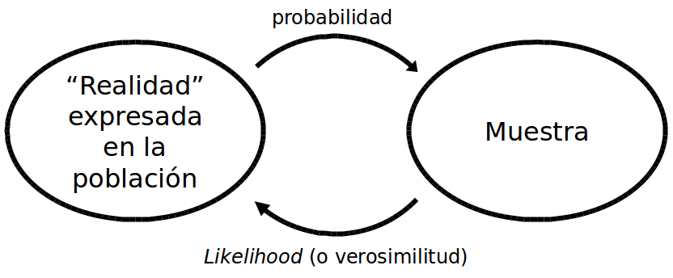
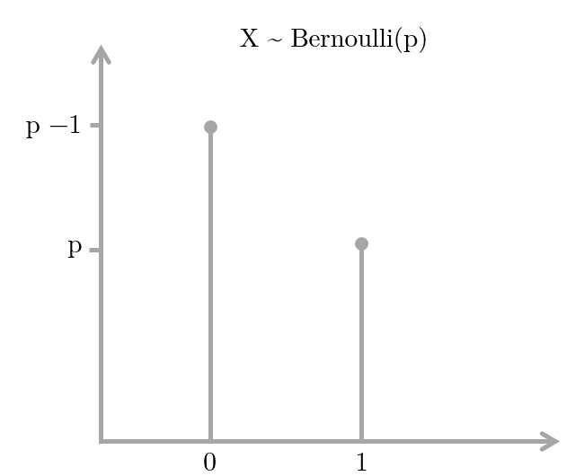
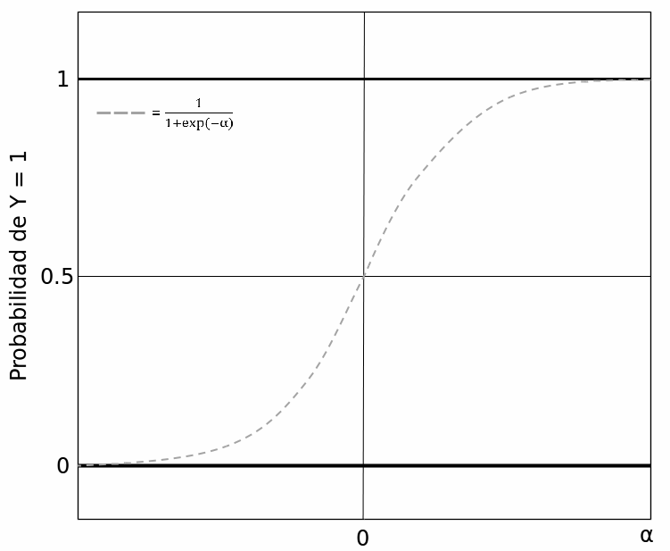
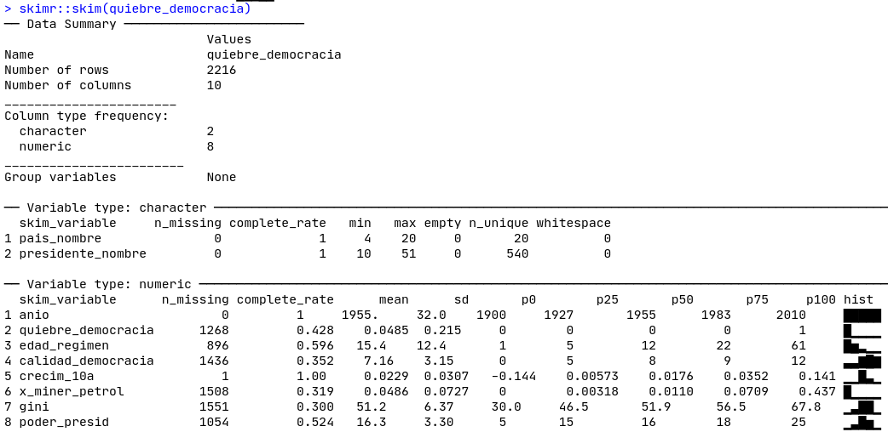
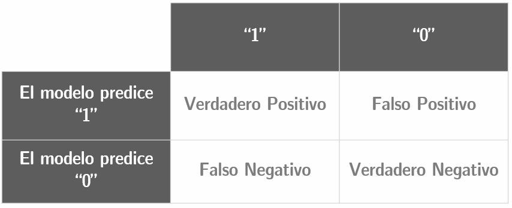

# Modelos logísticos {#logit}

Francisco Urdinez^[E-mail: furdinez\@uc.cl]

### Lecturas sugeridas {-}

- Agresti, A. (2007). *An Introduction to Categorical Data Analysis*, 2nd Ed. Hoboken: Wiley. 

    + Capítulos 3, 4 y 5 – "Generalized Linear Models"; "Logistic Regression"; "Building and Applying Logistic Regression Models."

- Glasgow, G., & Alvarez, R. M. (2008). Discrete Choice Methods. In J. M. Box-Steffensmeier, H. E. Brady, & D. Collier (Eds.), *The Oxford Handbook of Political Methodology* (pp. 513–529). Oxford: Oxford University Press.

- Long, J. S. (1997). *Regression models for categorical and limited dependent variables*. Sage Publications.
    + Capítulos 3 y 4 - "Binary Outcomes"; "Hyphotesis Testing and Goodness of Fit."

### Los paquetes que necesitas instalar {-}

- `tidyverse` [@R-tidyverse], `paqueteadp` [@R-paqueteadp], `ggcorrplot` [@R-ggcorrplot], `margins` [@R-margins], `prediction` [@R-prediction], `texreg` [@R-texreg], `jtools` [@R-jtools], `skimr` [@R-skimr], `pscl` [@R-pscl], `DescTools` [@R-DescTools], `broom` [@R-broom], `plotROC` [@R-plotROC], `separationplot` [@R-separationplot].

## Introducción 

En el capítulo anterior aprendiste a correr regresiones lineales cuando tienes variables dependientes continuas de una manera sencilla y cubriendo los paquetes más útiles disponibles en R. En este capítulo verás cómo estimar los modelos de regresión cuando tienes variables dependientes dicotómicas (también llamadas variables binarias o *dummy*). Estas variables asumen uno de dos valores, comúnmente 0 y 1. Al igual que en los capítulos anteriores, no trataremos aspectos sustanciales de la teoría que subyace a cada modelo, ni desglosaremos las fórmulas en detalle. Para ello, sugerimos las referencias anteriores que te ayudarán a acompañar lo que discutiremos.

## Uso de los modelos logísticos

Los modelos de variables dependientes dicotómicas se utilizan para estimar la probabilidad de que ocurra un evento. En nuestra base de datos, codificamos como '1' a los casos en los que el evento ocurre, y '0' cuando no ocurre. Por ejemplo, si mi variable fuera "países con acuerdos de libre comercio con los Estados Unidos", Chile y México estarían codificados con un '1', Argentina y Brasil con un '0'. Estos modelos estiman probabilidades, es decir, cuál es la probabilidad de que se observe un '1' dadas ciertas características de las observaciones de nuestra muestra. Toda la discusión sobre cómo estimar la probabilidad de una muestra es muy interesante, y se puede profundizar en los capítulos 3, 4 y 5 de @agrestiIntroductionCategoricalData2007. También es importante comprender la distinción entre probabilidad y verosimilitud (*likelihood*, en inglés). La probabilidad se estima a partir de una "población" de la que conocemos sus "parámetros", mientras que la verosimilitud estima los valores de los parámetros para los que el resultado observado se ajusta mejor a ellos (ve la figura \@ref(fig:reality-sample)).

```{r reality-sample, echo=FALSE, fig.cap=" El camino de doble sentido de la probabilidad y la verosimilitud", out.width="70%"}

```

Cuando se tiene una variable dependiente dicotómica que se quiere modelar a través de Logit, se asume que ésta tiene una distribución de Bernoulli con una probabilidad de $Y=1$ que no conocemos. Así pues, estimamos nuestra probabilidad desconocida mediante la Estimación de Máxima Verosimilitud (*Maximum Likelihood Estimation*, en inglés), que nos dará una cierta combinación lineal de variables independientes de nuestra elección (ver la figura \@ref(fig:bin-bernou). Un muy buen ejercicio para entender cómo estimar un parámetro con una distribución binomial a través de Máxima Verosimilitud lo ofrece [RPubs](https://rpubs.com/felixmay/MLE).

```{r bin-bernou, echo=FALSE, fig.cap="Distribución de Bernoulli", out.width="60%"}

```

Los modelos logísticos han crecido enormemente en popularidad en la Ciencia Política. Google Scholar reporta que de la búsqueda de "logit" + "ciencias políticas" un total de 17100 referencias fueron publicadas entre 2008 y 2018. La década anterior (1998-2007) reporta 8900 artículos, y la anterior (1988-1997), 2100. La Ciencia Política ha extendido el uso de los modelos Logit, por encima de los modelos Probit, en gran medida porque el primero permite el cálculo de *odds ratios*. Casi todos los manuales econométricos discuten las diferencias y similitudes entre Probit y Logit, aunque a efectos prácticos de la estimación de un modelo, ambos son muy similares y reportan coeficientes casi idénticos. Por lo tanto, dado que son métodos que conducen a resultados muy similares, en este capítulo sólo utilizaremos Logit.

Los modelos Logit y Probit difieren en sus funciones de enlace. Logit lleva su nombre porque la función viene dada por el logaritmo natural de las probabilidades ("log odds" $\rightarrow$ logit!).

$$ ln(odds) = ln(\frac {p}{1 - p})$$

Al despejar los términos, podemos calcular el inverso de su función, de modo que tendremos

$$ logit^{-1}(\alpha) =  \frac {1}{1+e^{-\alpha}} = \frac {e^\alpha}{1+e^\alpha}$$

Donde $\alpha$ es la combinación lineal de variables independientes y sus coeficientes. El inverso del Logit nos dará la probabilidad de que la variable dependiente sea igual a '1' dada una cierta combinación de valores para nuestras variables independientes.

```{r bin-invlogit, echo=FALSE, fig.cap="La inversa de la función de Logit", out.width="70%"}

```

Si profundizas en la literatura recomendada, notarás que la función está indefinida en 0 y 1, es decir, que la probabilidad está infinitamente cerca del límite sin llegar a tocarlo. Si modeláramos las probabilidades por medio de los Mínimos Cuadrados Ordinarios, obtendríamos probabilidades mayores que 100% y menores que 0%, lo cual es conceptualmente imposible. La función sigmoide de Logit impide que esto suceda. Lo que vamos a estimar es la probabilidad de que, dada una cierta combinación de atributos (variables independientes y controles) de una cierta observación permita suponer que su variable dependiente es igual a 1. Esta probabilidad puede compararse con el valor real que ha asumido la variable dependiente y así saber qué tan bien nuestro modelo hace predicciones. Por esta razón, muchos manuales se refieren a los modelos logit como un modelo de "clasificación", ya que lo que estimamos es la probabilidad de que cada observación sea clasificada correctamente como $Y= 1$ o como $Y= 0$.


## ¿Cómo se estiman las probabilidades?

Como mencionamos antes, los modelos probabilísticos han ganado una enorme preeminencia en la Ciencia Política en los últimos años, y es por eso que probablemente estés buscando una guía para saber qué hacer y qué no hacer cuando se tiene una variable dependiente dicotómica. Ilustraremos un paso a paso en R utilizando como ejemplo la base de datos del libro * Democracies and Dictatorships in Latin America: Emergence, Survival, and Fall* de Scott Mainwaring y Aníbal Pérez-Liñán [-@mainwaringDemocraciesDictatorshipsLatin2013]. A lo largo del libro, los autores analizan qué variables ayudan a explicar por qué y cuando se produjeron quiebres democráticos en América Latina a lo largo del siglo XX y principios del XXI. En el capítulo 4, los autores exploran qué factores explican la supervivencia de los regímenes políticos y, mientras que prueban varios modelos complejos, algunos logísticos y otros de supervivencia (los que trataremos en este libro en el próximo capítulo); ilustraremos un ejemplo muy sencillo para que nos acompañes desde tu computador paso a paso. Para cargar la base de datos del capítulo, utiliza nuestro paquete `paqueteadp`.

Entonces, cargaremos la base de datos llamada, `quiebre_democracia`.

```{r message=F}
library(paqueteadp)
```

```{r}
data("quiebre_democracia")
```

Ahora, la base de datos se ha cargado en nuestra sesión R:

```{r}
ls()
```

Asumiendo que la variable dependiente tiene el valor '1' si el país sufre el colapso de su régimen político democrático y '0' si no, podemos hacer un par de preguntas. ¿Qué efecto tiene el hecho de tener una constitución nacional que otorga grandes poderes constitucionales al poder ejecutivo en la probabilidad de un colapso democrático? si esos poderes son pequeños, ¿la probabilidad de un colapso democrático es mayor o menor? Como argumentan los autores, estos poderes pueden ser medidos por medio de un índice creado por @shugartPresidentsAssembliesConstitutional1992^[En el capítulo \@ref(indexes) ejemplificaremos cómo crear índices en R]

Primero que nada, quieres explorar tus datos. Queremos ver cuántos países han sufrido una quiebre democrático en la muestra y cómo se distribuye el índice de poderes del ejecutivo. ¿Recuerdas lo que se explicó en el capítulo \@ref(datos)? Empezamos cargando el `tidyverse` y luego usamos `count()`. El país con el mayor número de quiebres democráticos es Perú con 6, seguido de Argentina y Panamá, con 5 cada uno.

```{r message=F}
library(tidyverse)
```

```{r, warning=FALSE, message=FALSE}
quiebre_democracia %>% filter(quiebre_democracia == 1) %>% count(pais_nombre)
```

El primer modelo que vamos a probar tiene la variable dependiente de el quiebre democrático (`quiebre_democracia`) siendo predicha por el índice de @shugartPresidentsAssembliesConstitutional1992 de los poderes ejecutivos (`poder_presid`). La función `glm` requiere que definamos nuestros datos y el modelo, porque con la misma función para los Modelos Lineales Generalizados se puede usar Probit, Poisson y otras [funciones menos comunes](https://www.rdocumentation.org/packages/stats /versions/3.5.1/topics/family) en Ciencia Política.
```{r}
model_1 <- glm(quiebre_democracia ~ poder_presid, # variables dependientes e independientes separadas por ~
                data   = quiebre_democracia, #tus datos
                family = binomial("logit")) #usamos la función de enlace “logit”
```

Como vimos en los capítulos anteriores, la función `summary` nos permite ver rápidamente los resultados de un modelo de regresión:

```{r}
summary(model_1)
```

El coeficiente de la variable `poder_presid` está asociado negativamente a la probabilidad de que ocurra un quiebre de régimen `(-0.191)`, y es estadísticamente significativo `(p=0.00312)`. Ahora bien, a diferencia de los modelos MCO -donde podíamos usar los coeficientes de regresión para interpretar directamente el efecto de la variable independiente sobre la variable dependiente- en el caso de las regresiones logísticas esto no es tan sencillo. Debemos transformar los coeficientes en probabilidades o chances. Dado que la función de enlace logístico es el logaritmo del cociente de chances (*odds*), tenemos que:
$$ln(\frac {p}{1 - p}) = \beta_{0} + \beta_{1}x_{1}$$

Despejando $ln$, obtenemos:

$$(\frac {p}{1 - p}) = e^{\beta_{0}+\beta_{1}x_{1}}$$

Y despejando los términos, una vez más, obtenemos:

$$\hat{p} = \frac {e^{\beta_{0}+\beta_{1}x_{1}}}{1 + e^{\beta_{0}+\beta_{1}x_{1}}}$$

Lo que queremos, entonces, es transformar los coeficientes de la misma manera en que R los reporta en una probabilidad, con la variable dependiente asumiendo el valor '1'. Sabemos que la variable independiente `poder_presid` es un índice que a un valor más alto significa mayor concentración de poder para el ejecutivo *vis a vis* el legislativo, por lo tanto el coeficiente de regresión indica que a menor concentración de poder del ejecutivo, mayor probabilidad de quiebre de régimen. Los regímenes de presidentes fuertes serían más resistentes. La muestra del libro abarca 20 países de América Latina entre 1900 y 2010, y el índice oscila entre un mínimo de 5 (Haití, en varios años) y un máximo de 25 (Brasil en 1945, en años de Getúlio Vargas) (ver la figura \@ref(fig:bin-shugarthist). 

```{r, warning=FALSE, message=FALSE}
quiebre_democracia %>%
  select(pais_nombre, anio, poder_presid) %>%
  arrange(poder_presid) %>%
  slice(1)
```

>Consejo: Si ponemos un (-) antes de la variable dentro de la función `arrange()`, ordena de mayor a menor.

```{r, warning=FALSE, message=FALSE}
quiebre_democracia %>%
  select(pais_nombre, anio, poder_presid) %>%
  arrange(-poder_presid) %>%
  slice(1)
```

Podemos ver la distribución de la variable trazando un histograma. La mayoría de las observaciones tienen valores de 16 en el índice y la variable asume una distribución normal.
Haremos un histograma con `ggplot2`, como hemos tratado a fondo en el capítulo \@ref(dataviz). Además, añadiremos una escala de colores para visualizar mejor los valores más frecuentes.

```{r, bin-shugarthist, fig.cap=" Histograma del índice Shugart y Carey", warning=FALSE, message=FALSE}
shugart_plot<- ggplot(quiebre_democracia, aes(poder_presid)) +
 geom_histogram(aes(fill = ..count..), binwidth = 2) +
  scale_x_continuous(name = " Índice de Poder Presidencial") +
  scale_y_continuous(name = "Conteo")
shugart_plot
```

¿Cómo podemos calcular cuánto cambia la probabilidad de un quiebre democrático si el nivel de concentración del poder ejecutivo "salta" de una puntuación de 5 (el mínimo observado) a una de 25 (el máximo observado), dado que no controlamos por nada más en la regresión? Para hacer este cálculo podemos sustituir los valores de nuestra última fórmula, en la que aislamos en el lado izquierdo de la fórmula un $\hat{p}$. Primero debemos calcular cuál es la probabilidad de sufrir un quiebre de régimen a un índice Shugart y Carey de 5 y a un nivel 25, respectivamente. Luego calculamos la diferencia de ambas probabilidades. Por lo tanto, tenemos para un índice de 5 que

$$\hat{p} = \frac {e^{(0+(-0.019*5))}}{1 + e^{(0+(-0.019*5))}}$$

Notarán que el valor correspondiente al intercepto es igual a 0 porque ese coeficiente no es estadísticamente significativo. Sabemos que para un índice Shugart y Carey de 5, después de hacer el cálculo en la fórmula anterior, la probabilidad de un quiebre es igual a 0,47 o 47%.

>**Tip.** Recomendamos que dejes de leer por un segundo y hagas el cálculo de la función en lápiz y papel.


Si repetimos el proceso para un valor `poder_presid` de 25, la probabilidad baja al 38%. Con las probabilidades podemos calcular las chances o *odds*, que son simplemente $\frac{p}{1-p}$. Así, el impar para un valor 5 del índice Shugart y Carey es 0.0, mientras que para un índice Shugart y Carey de 25 es 0.62.

$$odd_a = \frac {0.47}{1 - 0.47}$$
$$odd_b = \frac {0.38}{1 - 0.38}$$

La utilidad de los *odds* es que permiten calcular los odds ratios (cuya traducción es horrible: razón de momios) ¿Cuál es el punto de calcular un odds ratio? Veamos.

Cuando calculamos la probabilidad de un cambio en el índice de Shugart y Carey de 23 a 24, la magnitud de esta probabilidad será diferente a un cambio en la probabilidad dado que el índice va de, supongamos, 12 a 13. Esto se debe a que los efectos de la variable independiente sobre la probabilidad de que la variable dependiente sea `=1` no son lineales (recordemos la función "S" de la Figura \@ref(fig:bin-invlogit)). Sin embargo, las razones de probabilidad tienen la propiedad útil de poder reflejar los cambios independientemente de la curvatura de la función, es decir, son cambios "constantes". Así, podemos expresar el efecto de la variable sin tener que especificar un valor determinado para ella. Por lo tanto, en muchos artículos se verán resultados expresados como *odds ratios* así como en cambios de probabilidad. Ambos se complementan bien, de hecho. 

Veamos cómo se vería el cálculo de *odds ratios* al seguir el ejemplo usando la base de datos de Mainwaring y Pérez-Liñan. Dijimos que las chances *odds* vienen dadas por $\frac{p}{1-p}$. Por lo tanto, una razón de chances *odds ratio* se expresa como $\frac {p_1}{1-p_1}}{\frac {p_2}{1-p_2}$.


Supongamos que en 1992 un país tenía un índice Shugart de 15, y que en 1993 ese índice pasó a 16. ¿Cuánto cambiará la probabilidad de un quiebre democrático si se asume que todo lo demás permaneció constante?
$$ Pr(quiebre){_{pais,1992}} = \frac {e^{(0+(-0.019*15))}}{1 + e^{((0+(-0.019*15))}} = 0.42$$

$$ Pr(quiebre){_{pais,1993}} = \frac {e^{(0+(-0.019*16))}}{1 + e^{(0+(-0.019*16))}} = 0.43$$

La probabilidad difiere poco, cayendo un 2,4%, lo que parece ser un efecto pequeño. El *odds ratio* se calcula como la proporción de ambas chances, por lo que obtenemos

$$\frac {0.42}{0.43}=0.97$$

De esta manera, un *odds ratio* mayor que 1 expresa un cambio positivo, mientras que si es menor que 1 (entre 0 y 1) representa un cambio negativo en las probabilidades estimadas. Si hiciéramos el mismo ejercicio para otros valores del índice de poderes presidenciales, por ejemplo, un cambio de 3 a 4 o de 23 a 24, el *odds ratio* también daría 0.97. He ahí su atractivo.

> **Ejercicio 8A.** Tomate un minuto para hacer un ejercicio antes de continuar.
> 1. Abre la base de datos `latinobarometro` del paquete del libro: `data (latinobarometro)`. Esta es una encuesta de 2018 de la opinión pública latinoamericana sobre temas políticos.
> 2. La variable `pro_dem` es 1 si la persona cree que la democracia es, a pesar de sus problemas, la mejor forma de gobierno existente. Calcula cuánto cambia la probabilidad de que esta respuesta sea 1 dependiendo de los años de educación del encuestado (`educ`).
> 3. ¿Cuál es el odds ratio de un año más de educación? ¿En qué país es mayor el efecto, en Brasil o en México?

R ofrece paquetes para facilitar este análisis. Podemos graficar fácilmente los *odds ratios* usando `ggplot2` combinado con `margins` y `prediction`. Podemos calcular las probabilidades predichas, y también podemos realizar pruebas fáciles para saber la capacidad explicativa de nuestros modelos. Utilizando la misma base de datos, te daremos un ejemplo de una rutina típica, que puedes replicar en tu computador utilizando tus propios datos.

Los pasos a seguir son: a) estimar tus modelos, b) crear tablas formateadas para incluirlas en tus artículos, c) crear figuras para visualizar la magnitud de los coeficientes por medio de *odds ratios*, d) graficar las probabilidades predichas para las variables de interés y explorar interacciones, y e) calcular la capacidad explicativa de los modelos (porcentaje correctamente previsto, AIC, BIC, curvas ROC, puntajes de Brier o *separation plots*, que explicaremos más adelante).

## Estimación de los modelos

Para ejemplificar este paso, estimaremos dos modelos más, aparte del modelo 1. El modelo 2 tendrá como variables independientes el índice de poder presidencial de Shugart y Carey y la edad (`edad_regimen`) del régimen político, medida en años. Veamos la distribución de la variable `edad_regimen`:


```{r, warning=FALSE, message=FALSE, fig.cap=" Histograma de la edad del régimen político "}
age_plot <- ggplot(quiebre_democracia, aes(edad_regimen)) +
  geom_histogram(aes(fill = ..count..), binwidth = 5) +
  scale_x_continuous(name = " Edad del régimen político ") +
  scale_y_continuous(name = "Conteo")

age_plot
```

Veamos el modelo con esta nueva variable:


```{r, warning=FALSE, message=FALSE}
model_2 <- glm(quiebre_democracia ~ poder_presid + edad_regimen,
                data   = quiebre_democracia,
                family = binomial("logit"))
```

Después de correr la regresión, con `summary` obtenemos los coeficientes:

```{r}
summary(model_2)
```

El modelo 3 añade una tercera variable, `calidad_democracia`, que corresponde al [puntaje de Freedom House](https://freedomhouse.org/report/methodology-freedom-world-2017) de calidad de la democracia. Cuanto más alta sea la puntuación, mejor el rendimiento de la democracia de un país. 

> Nota: Estos son modelos de ejemplo; no nos preocupa demostrar causalidad.

```{r fhhist, fig.cap=" Histograma del índice de democracia de Freedom House ", warning=FALSE, message=FALSE}
fh_plot <- ggplot(quiebre_democracia, aes(calidad_democracia)) +
  geom_histogram(aes(fill = ..count..), binwidth = 1) +
  scale_x_continuous(name = "Indice de Freedom House") +
  scale_y_continuous(name = "Conteo")
fh_plot
```

Seguramente querrás añadir una matriz de correlación a tu análisis para diagnosticar cómo se relacionan las variables independientes antes de incluirlas en el modelo. Para ello, podemos utilizar el paquete `ggcorrplot`. Vemos que la correlación entre `edad_regimen`, `calidad_democracia` y `poder_presid` es muy baja, pero ligeramente positiva.

```{r, message=FALSE, warning=FALSE, fig.width=5, fig.cap=" Matriz de correlación de las variables seleccionadas "}
library(ggcorrplot)

corr_selected <- quiebre_democracia %>% 
  dplyr::select(edad_regimen, calidad_democracia, poder_presid) %>% 
  # calculate correlation matrix and round to 1 decimal place:
  cor(use = "pairwise") %>% 
  round(1)

ggcorrplot(corr_selected, type = "lower", lab = T, show.legend = F)
```

El modelo 3 se verá entonces de la siguiente manera:

```{r, warning=FALSE}
model_3 <- glm(quiebre_democracia ~ poder_presid + edad_regimen + calidad_democracia,
                data   = quiebre_democracia,
                family = binomial("logit"))
```

```{r}
summary(model_3)
```

Ahora la variable `poder_presid` ya no es estadísticamente significativa, sin embargo, ambas `calidad_democracia` y el intercepto son significativas.

## Creando tablas

Aquí veremos cómo crear tablas editables para artículos académicos usando el paquete `texreg` de [Philip Leifeld](https://www.rdocumentation.org/collaborators/name/Philip%20Leifeld). Básicamente, la función contiene tres paquetes, uno para exportar tablas a html (`htmlreg()`), otro para exportar tablas a \LaTeX\ y un tercero para verlas en RStudio (llamado `screenreg()`).

A través de `htmlreg` podemos exportar nuestras tablas formateadas en html y desde allí incorporarlas a nuestros artículos directamente.

Una vez que estimamos los modelos que irán en la tabla, los agrupamos en una lista usando la función `list`. Esto ahorra tiempo, porque en lugar de tener que escribir el nombre de los modelos, simplemente nos referiremos a la lista `mp_models`:

```{r}
library(texreg)
mp_models <- list(model_1, model_2, model_3)
```

Para exportar la tabla a html debemos definir la opción `file` y un nombre para el archivo html. En este ejemplo lo llamaremos "tabla_1". Este archivo html puede ser arrastrado a tu Word para insertar las tablas directamente en el artículo. En el ejemplo, usaremos dos opciones de función para mejorar aún más la tabla. La primera es `custom.model.names` que permite nombrar los modelos y la segunda es `custom.coef.names` que permite nombrar los coeficientes. Entonces, el comando completo sería:

```{r, eval=FALSE, message=FALSE}
htmlreg(mp_models,
          custom.model.names = c("Modelo 1", "Modelo 2", "Modelo 3"),
          custom.coef.names = c("Intercepto", "Poder presidencial (Shugart & Carey)", 
                                "Edad del régimen", "Democracia (Freedom House"),
          file="tabla_1.html") # nombre de su archivo html. Se guardará en tu 
#directorio de trabajo por defecto.
```

Esta línea crea un archivo html en tu carpeta de proyecto. Si haces un clic derecho en el archivo, puedes abrirlo en Word o en cualquier procesador de texto.

Antes de exportarlo, también podemos ver una versión en pantalla de la tabla usando `screenreg`. En este caso, veamos cómo se ve sin la opción `custom.coef.names`. Puedes usar este comando en tus proyectos de trabajo, y una vez que te decidas por la mejor tabla, la exportas con `htmlreg`.

```{r, message=FALSE, warning=FALSE}
screenreg(mp_models,
          custom.model.names = c("Modelo 1", "Modelo 2", "Modelo 3"),
          custom.coef.names = c("Intercepto", " Poder presidencial (Shugart & Carey)",
                                "Edad del régimen", "Democracia (Freedom House)")
          )
```

Noten que `poder_presid` deja de ser estadísticamente significativa cuando controlamos por `calidad_democracia` en el Modelo 3. En este modelo, `calidad_democracia` se convierte en la única variable estadísticamente significativa. Además, noten que el número de observaciones disminuye significativamente al incluir la variable `calidad_democracia`, lo que dificulta la comparación de los modelos. 

La función `skimr:skim()`será muy útil para detectar valores perdidos, como podemos ver en la Figura \@ref(fig:skim-logit). Las tres variables tienen un número muy alto de valores faltantes, para `calidad_democracia` de casi $2/3$ del total de las observaciones (1436 de 2216).^[Esto podría ser problemático, pero a veces no hay nada que podemos hacer con los datos que faltan. Sin embargo, cubrimos algunas soluciones posibles en el capítulo \@ref(adv-data).]

```{r skim-logit, fig.align='center',echo=FALSE, out.width='100%', fig.cap="Skim de nuestra base de datos"}

```

En el muy recomendable libro *The Chicago Guide to Writing about Multivariate Analysis*, Jane Miller [-@millerChicagoGuideWriting2013] pone mucho énfasis en la importancia de entender la diferencia entre la significancia *estadística* y la significancia *sustantiva* de los efectos cuando se interpretan las regresiones: no porque sea una variable estadísticamente significativa la magnitud del efecto será la esperada, ni significa que el hallazgo sea científicamente relevante. ¿Cuáles son algunas buenas opciones para comprender la magnitud de nuestros efectos? En MCO se suelen estandarizar los coeficientes. En regresiones logísiticas, los *odds ratio* y graficar las probabilidades predichas son buenas opciones.

Para utilizar los *odds ratios* queremos mostrarte cómo puedes cambiar los coeficientes que obtienes directamente de la tabla, que son *log odds*, y reemplazarlos por *odds ratios*. Para ello, puedes usar los argumentos `override.coef`,`override.se` y `override.pvalues` de `screenreg()`. Los *odds ratios*, como vimos antes, son simplemente los coeficientes exponenciados. El cálculo de sus errores estándar y los valores p, mientras tanto, es un poco más complejo: necesitamos acceder a la matriz de varianza-covarianza del modelo. Afortunadamente esto ya lo ha hecho [Andrew Heiss](https://www.andrewheiss.com/blog/2016/04/25/convert-logistic-regression-standard-errors-to-odds-ratios-with-r/), a quien agradecemos por compartir la función. Adaptamos ligeramente estas funciones, que pueden ser introducidas fácilmente en el análisis siempre que se haya cargado el paquete de libro, `paqueteadp`.

```{r, message=FALSE, warning=FALSE}
screenreg(model_3,
          custom.model.names = "Modelo 3 - Odds Ratios",
          override.coef    = exp(coef(model_3)),
          # la siguiente función, odds_*, están en el paquete del libro
          override.se      = odds_se(model_3),
          override.pvalues = odds_pvalues(model_3),
          # además, omitiremos el coeficiente del intercepto
          omit.coef = "Inter")
```

Al obtener una tabla como la que acabamos de crear, nos encontramos con dos retos que abordaremos en las próximas subsecciones: El primero es saber si la magnitud de los efectos es sustantiva desde el punto de vista científico. Por ejemplo, ¿qué diríamos si la variable `calidad_democracia` es estadísticamente significativa y sin embargo encontramos que si un país pasa de la peor puntuación (0) a la mejor puntuación (12) en `calidad_democracia`, la probabilidad de un quiebre democrático cae sólo en un 0,03%? Probablemente diríamos que, a pesar de tener un efecto estadísticamente significativo, nuestra variable no tiene un efecto sustantivo.

El segundo desafío que enfrentaremos es comparar nuestros modelos para decidir cuál es el que mejor se ajusta, es decir, cuál tiene la mejor capacidad explicativa. A diferencia de MCO, no tenemos $R^2$, por lo que se utilizan otras medidas. ¡Veamos!

> **Ejercicio 8B.** Usando la base de datos del Latinobarometro, escoge tres variables que creas que pueden predecir `pro_dem` e interpreta el modelo con `summary`. Si te atreves, crea tablas con `texreg`. Las variables disponibles son: `edad_regimen` (edad del encuestado), `ideol` (donde 1 es la extrema izquierda y 10 la extrema derecha), `educ` (años de educación del encuestado) y `socioecon_status` (1, muy bueno - 5, muy malo).

## Representación visual de los resultados

Podemos representar visualmente la tabla que hicimos con `texreg` usando los paquetes de `prediction` y `margins`. Si has usado Stata en el pasado, este comando será familiar.

Para visualizar las magnitudes, una figura es mucho más intuitiva que una tabla. La figura \@ref(fig:bin-m1pr) muestra la probabilidad predicha de un quiebre democrático según el índice de poderes presidenciales.


```{r}
library(margins)
library(prediction)

predict_model_2 <- prediction::prediction(
  model_2, at = list(poder_presid = unique(model.frame(model_2)$poder_presid))
)
```

```{r, eval=F}
summary(predict_model_2)
```


```{r echo=F}
print(as_tibble(summary(predict_model_2)))
```

El resumen nos ofrece un *tibble* donde tenemos la probabilidad prevista de nuestra variable dependiente para cada valor observado de `poder_presid` y su significado estadístico. Esto se convierte fácilmente en una cifra, y para ello hay dos alternativas que recomendamos.


```{r bin-m1pr, message=FALSE, fig.cap=" Opción 1. Modelo 2 basado en Mainwaring y Pérez Liñan (2013), probabilidad predicha de una ruptura democrática ", warning=FALSE, message=FALSE}
#option 1
figure_op_1 <- ggplot(summary(predict_model_2),
                 aes(x = `at(poder_presid)`, y = Prediction,
                     ymin = lower, ymax = upper,
                     group = 1)) +
   geom_line() +
  geom_errorbar(width = 0.2) +
  theme(axis.text.x = element_text(angle = 90)) +
  labs(x = " Poder presidencial", y = "Pr(quiebre democrático)")

figure_op_1
```

```{r bin-m2pr, message=FALSE, fig.cap=" Opción 2. Modelo 2 basado en Mainwaring y Pérez Liñán (2013), probabilidad predicha de una ruptura democrática", warning=FALSE, message=FALSE}
#option 2
cdat <- cplot(model_2, "poder_presid", what = "prediction",
              main = "Pr(quiebre democrático)", draw = F)

ggplot(cdat, aes(x = xvals)) +
  geom_line(aes(y = yvals)) +
  geom_line(aes(y = upper), linetype = 2)+
     geom_line(aes(y = lower), linetype = 2) +
  geom_hline(yintercept = 0) +
  labs(title = "Pr. Quiebre democrático",
       x = "Poder presidencial", y = "Prob. predicha")
```

Ambas opciones conducen al mismo resultado, el formato de la figura puede ser personalizado a tu preferencia con la sintaxis de `ggplot2`. ¿Qué dirías sobre este efecto en términos de importancia científica? Si tuviéramos que interpretar la magnitud del índice de poderes presidenciales sobre la probabilidad de un quiebre de régimen, probablemente diríamos que su caída produce un efecto considerable en los países que se encuentran entre los valores 6 y 10 del índice, pero para los valores superiores a 10 el aumento del índice casi no afecta a la probabilidad de un quiebre. De hecho, para los países con un índice de poder presidencial superior a 10, la probabilidad de un quiebre democrático es muy baja.

¿Cuál es el efecto medio del aumento de una unidad de la variable independiente en la probabilidad de que se produzca la variable dependiente? El Efecto Marginal Promedio (AME, por sus siglas en inglés) se utiliza para ver estos efectos, y se logra con el comando `plot` del paquete de `margins`.

```{r bin-m2avg, message=FALSE, fig.cap=" Efecto marginal medio del Modelo 2 basado en Mainwaring y Pérez Liñán (2013)", warning=FALSE, message=FALSE, fig.height=4.5}
marginal_ef <- margins(model_2)

plot(marginal_ef, labels = c("Edad del régimen","índice de poder presidencial"),
      ylab = "AME")
```

También podemos estar interesados, no en el efecto promedio, sino en el efecto marginal completo de una variable. Dada la no linealidad de estos modelos, el efecto marginal de una variable sobre la probabilidad de ocurrencia de la variable dependiente no es constante ni es significativo en toda la variable. Para ello utilizamos la función `cplot` del paquete `margins` y luego lo personalizamos con las opciones de `ggplot2`.

```{r bin-m2arg, message=FALSE, fig.cap="Efecto marginal de `poder_presid` en el modelo 2 en Mainwaring y Perez Liñan (2013)", warning=FALSE, message=FALSE, fig.width=4}
marginal_shugart <- cplot(model_2, "poder_presid", what = "effect", 
                          main = "Ef.Marg(Quiebre)",
                          draw = F)

ggplot(marginal_shugart, aes(x = xvals)) +
  geom_line(aes(y = yvals)) +
  geom_line(aes(y = upper), linetype = 2)+
  geom_line(aes(y = lower), linetype = 2) +
  geom_hline(yintercept = 0) +
  labs(title = "Modelo 2",
       x = "Indice de poder presidencial", y = "Efecto marginal")
```

También podemos graficar los coeficientes como *odds ratios*: recuerda que los *odds ratios* menores que 1 son efectos negativos y mayores que 1 son positivos.  El coeficiente se expresa como su valor medio y su intervalo de confianza del 95%. Si el coeficiente es estadísticamente significativo, su intervalo de confianza no pasará de la línea en 1. Si, por el contrario, no son significativos, el efecto cruzará la línea. Comparemos los tres modelos: Para graficar los *odds ratios* usamos el paquete `jtools` de nuevo, esta vez con su función `plot_summs`.  Como la opción `exp=T` es verdadera, estamos exponiendo los coeficientes. Si hiciéramos `exp=F`, veríamos las probabilidades logarítmicas de la tabla.


```{r bin-m3or, message=FALSE, fig.cap="Odds ratios del Modelo 3, basado en Mainwaring y Pérez Liñán (2013)", warning=FALSE, message=FALSE, fig.width=7, fig.height=4.5}
# Es probable que para ejecutar este comando sea necesario
#instalar estos dos paquetes antes.
#install.packages("ggstance")
#install.packages("huxtable")

library(jtools)
name_models <- c("Modelo 1", "Modelo 2", "Modelo 3")

odds_ratios <- plot_summs(model_1, model_2, model_3, exp=T, scale = F,
                          inner_ci_level = .9,
                          coefs = c("Indice de poder presidencial" =  "poder_presid",
                                    "Edad del regímen" = "edad_regimen",
                                    "Indice de democracia" = "calidad_democracia"),
                          model.names = name_models)

odds_ratios + labs(x = "Coeficientes exponenciados", y = NULL)
```

Cada vez es más común encontrar este tipo de figuras en lugar de tablas, y personalmente creemos que son preferibles. Un precursor en la disciplina del uso de figuras e infografías fue [Edward Tufte](http://pages.mtu.edu/~hcking/Tufte_hKing.pdf), quien fue mencionado en el Capítulo \@ref(dataviz). Sin embargo, las ciencias políticas no habían prestado mucha atención a la presentación de los resultados a través de las figuras hasta hace unos dos decenios. Hoy en día, la [tendencia](https://www.princeton.edu/~jkastell/Tables2Graphs/graphs .pdf) en la disciplina es evitar el uso de tablas cuando no son esenciales. Paquetes como `margins` y `jtools` han facilitado esta tarea.

Veamos las probabilidades predichas para la puntuación de democracia según Freedom House: observamos que la relación entre la probabilidad de que ocurra un colapso democrático y la puntuación de calidad democrática es negativa. Cuando un país tiene un puntaje de 2.5 en el índice, la probabilidad de un quiebre democrática es del 100%. Cuando la puntuación es de 5, la probabilidad es casi nula. Por lo tanto, un pequeño cambio en este índice afectará enormemente la probabilidad de un quiebre de régimen.

```{r bin-m3prpr-avgs, fig.cap=" Probabilidades predichas de FH en el Modelo 3, basadas en Mainwaring y Pérez Liñán (2013)", message=FALSE, warning=FALSE, fig.width=4, fig.height=3.8}
cdat <- cplot(model_3, "calidad_democracia", what = "prediction", main = "Pr(Quiebre)")

ggplot(cdat, aes(x = xvals)) +
  geom_line(aes(y = yvals)) +
  geom_line(aes(y = upper), linetype = 2)+
  geom_line(aes(y = lower), linetype = 2) +
  geom_hline(yintercept = 0) +
  labs(title = " Probabilidad de quiebre democrático",
       x = "Indice de Freedom House", y = "Prob. predicha")
```

> **Ejercicio 8C.** Con las regresiones que has corrido usando los datos del Latinobarometro, crea tres gráficos para visualizar los efectos, ya sean probabilidades predichas, efectos marginales o coeficientes expresados como *odds ratios*. ¿Sus hallazgos tienen una significancia sustantiva?

### Visualización de las interacciones entre las variables

Este tema puede ser útil si ya se tienes algún conocimiento sobre lo que es una variable interactiva y para qué se utilizan. Si no es así, y no te interesa saberlo, puedes pasar a la siguiente sección sobre el ajuste de los modelos sin problemas. 
¿Cómo se vería una hipótesis interactiva en los modelos logísticos? Supongamos que después de meses de explorar las variables políticas que predicen la ocurrencia de un quiebre de régimen en América Latina (`edad_regimen`, `poder_presid` y `calidad_democracia`), decidimos explorar si las variables económicas pueden tener poder explicativo. Después de estudiar extensamente la literatura existente, se formula la hipótesis de que la desigualdad económica en la sociedad (que mediremos con el índice de Gini como hicimos en el capítulo de MCO) afecta positivamente la probabilidad de un quiebre democrático. Para ello seguimos utilizando la base de datos `quiebre_democracia`, ahora con las variables económicas (`crecim_10a`, `x_miner_petrol` y `gini`). Construyamos un nuevo modelo, esta vez incorporando el índice de Gini:

```{r, fig.cap=" Modelo económico basado en Mainwaring y Pérez Liñán (2013)", message=FALSE, warning=FALSE}
model_4 <- glm(quiebre_democracia ~  gini,
               data = quiebre_democracia,
               family = binomial("logit"))
summary(model_4)
```

Pero eso no es todo, porque también formulamos una hipótesis interactiva, que sostiene que el efecto de la desigualdad económica en la sociedad sobre la probabilidad de un quiebre democrático *dependerá* de cuánto haya crecido la "torta" para a distribuida (es decir, del crecimiento de la economía reciente). Por lo tanto, interactuaremos `gini` con `crecim_10a` que mide el crecimiento económico en los diez años anteriores al quiebre democrático. También añadiremos algunos controles, que no merecen demasiada discusión.

```{r, fig.cap=" Modelo interactivo basado en Mainwaring y Pérez Liñán (2013)", message=FALSE, warning=FALSE}
model_5 <- glm(quiebre_democracia ~ crecim_10a * gini + x_miner_petrol + poder_presid,
               data = quiebre_democracia,
               family = binomial("logit"))

summary(model_5)
```

Como pueden ver, la interacción de `crecim_10a*gini` es estadísticamente significativa. ¿Cómo interpretamos este coeficiente? Allí vamos: 
La necesidad de incluir variables interactivas para probar las hipótesis condicionales en los modelos binarios ha sido objeto de un gran debate académico en los últimos años. A diferencia de los modelos lineales estimados a partir de MCO, donde hay consenso sobre esta necesidad [en parte a partir de @bramborUnderstandingInteractionModels2006]. En el MCO, debido a la construcción del propio estimador y al supuesto de linealidad en los parámetros, los efectos de las variables independientes sobre la variable dependiente son siempre efectos constantes e independientes del valor tomado por las otras covariables del modelo.

Los modelos logísticos, por otra parte, son interactivos por naturaleza: el efecto de una variable independiente sobre la probabilidad de que ocurra la variable dependiente depende de los valores de las otras covariables del modelo, como se ejemplifica con el Modelo 1 al principio del capítulo. Hay dos opiniones al respecto en la ciencia política: Según @berryTestingInteractionBinary2010, la inclusión o no de un término interactivo en una regresión logística dependerá en gran medida de la hipótesis o teoría que prediga el efecto de la interacción. En particular, dependerá de si la hipótesis predice un efecto sobre la variable dependiente latente, o si se trata de la probabilidad de que ocurra el evento. Si la hipótesis se refiere al primer escenario, entonces no hay más discusión en la literatura, ya que la situación es análoga al caso de una variable dependiente continúa estimada con una regresión MCO. Por lo tanto, es necesario incorporar un término de multiplicación con su respectivo coeficiente para evaluar la interacción.

@raineyCompressionConditionalEffects2016, por su parte, sostiene que incluso cuando la hipótesis de interacción sobre la probabilidad de ocurrencia de la variable dependiente se basa en la noción de compresión, es necesario incorporar términos de interacción en los modelos. La recomendación de Rainey [-@raineyCompressionConditionalEffects2016] es incorporar siempre términos de interacción porque si no incluyen el modelo de regresión logística, no puede representar situaciones razonables que serían inconsistentes con la teoría interactiva.

Aunque este debate sigue abierto, en este capítulo recomendamos que *siempre se incluyan las interacciones si se tienen razones teóricas para hacerlo*. A efectos prácticos, el paquete de `margins` que utilizaremos para visualizar este tipo de efectos interactivos requiere este término.

¿Cómo interpretamos este coeficiente? Los resultados muestran que la desigualdad de la sociedad aumenta la probabilidad de un quiebre democrático sólo cuando la economía ha crecido en los últimos diez años. También confirmamos que en las recesiones económicas la probabilidad de un quiebre democrático aumenta fuertemente pero sólo si la sociedad tiene un índice de Gini de menos de 50 puntos, es decir, en sociedades más equitativas. Para graficar estos hallazgos utilizamos la función `persp()` del paquete de `margins` de nuestro modelo que tiene la interacción.


```{r bin-m3prpr-medias, message=FALSE, warning=FALSE, fig.dim=c(5,5), fig.cap=" Interacción entre el coeficiente de Gini y el crecimiento del PBI en tres dimensiones"}
persp(model_5, "crecim_10a", "gini", what = "prediction",
      ylab = "Desigualdad", xlab = "Crecimiento económico",
      zlab = "Probabilidad predicha" )
```

Una forma alternativa de ver los resultados de la interacción es en dos dimensiones. Para ello utilizamos la función `image`. Ambas son equivalentes, dependerá de nuestra preferencia estética.
```{r bin-m3prpr-medias-2d, message=FALSE, warning=FALSE, fig.dim=c(5,4), fig.cap=" Interacción entre el coeficiente de Gini y el crecimiento del PIB en dos dimensiones "}
image(model_5, "crecim_10a", "gini",
      xlab = "Crecimiento económico", ylab = "Desigualdad",
      zlab = "Probabilidad predicha")
```

## Medidas para evaluar el ajuste de los modelos

Una vez que se haya analizado la importancia sustantiva de los modelos mediante tablas y trazando las probabilidades previstas y los efectos marginales, podría interesarte el ajuste de los modelos. Al igual que en la MCO, cuando se utilizan $R^2$ y el error medio de la raíz cuadrada, hay una serie de estadísticas diseñadas para saber cuál de los modelos logísticos tiene el mejor ajuste.

#### Pseudo-$R^2$

Muchas veces, verás que las regresiones logísticas van acompañadas de Pseudo-$R^2$. No es nuestra medida favorita para los modelos logísticos, pero se usa habitualmente. Para entender cómo se interpreta el Pseudo-$R^2$ (normalmente se usa el de McFadden) es importante entender cómo se diferencia de un $R^2$ en las regresiones lineales (puedes usar [este enlace](http://setosa.io/ev/ordinary-least-squares-regression/) para acompañar su interpretación en el capítulo de MCO). La fórmula, en este caso es

$psR^2 = 1-\frac{ln\hat{L}(Modelo completo)}{ln\hat{L}(Modelo solo con intercepto)}$

Donde $\hat{L}$ es la probabilidad estimada por el modelo. Básicamente, lo que hace la fórmula es comparar el modelo con todas nuestras covariables con el modelo que apenas tiene el intercepto, para ver cuánto mejora la capacidad explicativa del mismo si incluimos variables independientes. Dado que $L$ oscila entre 0 y 1, su logaritmo es menor o igual a 0. Por lo tanto, cuanto menor sea la relación, mayor será la diferencia entre el modelo elegido y el modelo que sólo tiene intercepto. La función se toma del paquete `pscl`. Los modelos 1 y 2 tienen casi la misma capacidad explicativa, aunque se ha incorporado una variable más en el segundo modelo. En cambio, al añadir `calidad_democracia` al modelo 3, nuestro Pseudo-$R^2$ salta a 0,96.


```{r, message=FALSE, warning=FALSE}
library(pscl)
pR2(model_1)[["McFadden"]]
pR2(model_2)[["McFadden"]]
pR2(model_3)[["McFadden"]]
```

También se podría implementar un $pseudo-R^2$ ajustado. Ajustado significa que es una versión que penaliza la cantidad de covariables. Al igual que en el $R^2$ ajustado, añadimos a la fórmula el término $c$, que es la cantidad de covariables, y por lo tanto tenemos
$Pseudo-R^2=1-\frac{ln\hat{L}(Modelo completo)-c}{ln\hat{L}(Modelo solo con intercepto)}$

Aunque el $R^2$ siempre aumenta cuando se añaden covariables al modelo, si utilizamos medidas ajustadas, tendremos en cuenta este aspecto.


```{r, message=FALSE, warning=FALSE}
library(DescTools)
PseudoR2(model_1, c("McFadden"))
PseudoR2(model_2, c("McFadden"))
PseudoR2(model_3, c("McFadden"))
```

#### AIC

Casi siempre, las tablas con modelos de regresión logística informan sobre el  Criterio de Información de Akaike (AIC, por sus siglas en inglés). Éstos permiten la comparación de diferentes modelos ejecutados para la misma muestra y decidir cuál tiene un mejor poder explicativo. El AIC, al igual que el $Pseudo-R^2$, utiliza información de $ln(\hat{L})$. Lo que hace la AIC es medir la "distancia" que existe entre los parámetros verdaderos y los estimadores del modelo, mediante una distancia matemática llamada divergencia Kullback-Leibler. Cuanto más pequeña sea esta distancia, mejor será el modelo. Es muy útil cuando se comparan diferentes modelos para argumentar cuál debe tomarse como referencia, y se calcula como

$AIC = 2p-2ln(\hat {L})$

$p$ es el número de regresores incluyendo la intercepción, y $hat{L}$ es la probabilidad estimada por el modelo. De los tres modelos, claramente el que mejor se ajusta a este criterio es el tercero.

```{r, message=FALSE, warning=FALSE}
AIC(model_1)
AIC(model_2)
AIC(model_3)
```

#### BIC

El Criterio de Información Bayesiana (BIC, por sus siglas en inglés), al igual que el AIC, es un criterio para comparar los modelos según su ajuste. A efectos prácticos, y para no entrar en las diferencias entre el AIC y el BIC, es importante saber que el BIC penaliza la complejidad del modelo más rigurosamente que el AIC, ya que su fórmula es

$BIC=ln(n)p-2ln(\hat {L})$

donde se añade a la fórmula $n$, que es el número de observaciones en la muestra. Los resultados son similares a los que obtuvimos a través de la AIC, es decir, el tercer modelo muestra el mejor ajuste.

```{r,  message=FALSE, warning=FALSE}
BIC(model_1)
BIC(model_2)
BIC(model_3)
```

A efectos prácticos, se recomienda utilizar el AIC o el BIC, pero no es necesario informar de ambos en un cuadro con varios modelos.


#### Porcentaje de predicciones correctas

Tal vez, un nombre mejor para ello sería "Porcentaje de clasificaciones correctas". Este es uno de nuestros diagnósticos favoritos por la bondad de encajar en los modelos Logit, ya que es el más intuitivo de todos. Para entender el porcentaje de predicciones correctas en un modelo, es importante tener claro que un modelo produce cuatro combinaciones posibles para cada observación:

```{r perc-pred, echo=FALSE, out.width='60%', fig.cap=" Tabla de clasificación a partir de la cual se calcula el porcentaje de predicciones correctas", fig.dim=c(4,3)}

```

Cualquier observación se clasificará como "correcta" si corresponde al cuadro superior izquierdo (verdadero positivo) o al inferior derecho (verdadero negativo). El porcentaje de observaciones que pertenecen a estos dos recuadros determina el porcentaje de predicciones correctas en el modelo. Como criterio estándar, si la probabilidad estimada de una observación es mayor o igual al 50%, se estima que es una probabilidad positiva, y si es menor del 50%, será una probabilidad negativa.

Para calcular las predicciones correctas, necesitamos hacer varios pasos, pero si utilizas los comandos que te ofrecemos a continuación, podrás hacerlo con tu propia base de datos cuando trabajes solo. En primer lugar, necesitamos usar el paquete `broom`, que transforma los modelos que hemos guardado en bases de datos en formato `tidy`, como vimos en el Capítulo \@ref(linear). Calcularemos los valores predichos del modelo 3 como un ejemplo que puede ser repetido para los otros modelos. Lo primero que necesitamos son los valores predichos, es decir, la probabilidad asignada a cada observación de que `Y=1`. En el orden que obtuvimos usando `broom` esta variable se llama `.fitted`.

```{r, message=FALSE, warning=FALSE}
library(broom)

pred_model_3 <- augment(model_3, type.predict = "response")
pred_model_3
```

La función `dplyr` nos permite transformar nuestra nueva base obtenida a través de `broom`.  Una de las funciones básicas de `dplyr` es `select`, que nos permite elegir las variables por sus nombres. Necesitamos identificar los valores predichos y la variable dependiente (en este caso `quiebre_democracia`) para comparar la probabilidad asignada por el modelo con el valor real de la variable. La función `mutate` de `dplyr` nos permitirá crear una variable binaria para saber si el modelo ha predicho correctamente cada observación.  El punto de corte es 0,5, es decir, si la probabilidad estimada es igual o superior a 0,5, se considera que el modelo ha predicho la ocurrencia del evento, y si es inferior a ese valor, se considera que ha predicho la no ocurrencia del evento. Trabajar con valores de corte arbitrarios tiene desventajas, que como veremos a continuación se resuelven con los ROC. Finalmente, creamos una variable que llamamos `pcp`  (*p*orcentaje de *c*orrectamente *p*redicho) que muestra la proporción de verdaderos positivos y verdaderos negativos estimados por el modelo 3. El resultado muestra que de las 422 observaciones del modelo 3, el 99,5% se han predicho correctamente.

```{r, message=FALSE, warning=FALSE}
pred_model_3 %>%
  dplyr::select(.rownames, quiebre_democracia, .fitted) %>%
  mutate(predict_binary = if_else(.fitted >= 0.5, 1, 0),
                      predict_binary = if_else(quiebre_democracia ==
                                                 predict_binary, 1, 0)) %>%
  summarize(pcp = mean(predict_binary))
```

#### Puntaje Brier

Esta es otra medida de ajuste, menos frecuente en Ciencias Políticas pero muy útil. Cuanto más se acerque el puntaje Brier a 0, mejor será el ajuste del modelo. En general, no se utilizan todas las medidas que estamos revisando (AIC, BIC, Brier, etc.), sino que se eligen dos o tres que sean de su agrado. Pensamos que las situaciones en las que se quiere "castigar" las predicciones erróneas es una alternativa ideal ya que su fórmula viene dada por $$BS=\frac{1}{N}\sum(\hat{p}-x)^2$$ 
donde $N$ es el número de observaciones, $hat{p}$ es la probabilidad predicha para cada observación, y $x$ es el valor real de la observación en nuestra base de datos. La puntuación es el promedio de todas las observaciones de la muestra. ¿Cuál de los tres modelos tiene la puntuación más baja?

```{r}
BrierScore(model_1)
BrierScore(model_2)
BrierScore(model_3)
```

####  ROC Plot

Otra de nuestras medidas favoritas por su versatilidad es el ROC. Comparadas con el porcentaje de observaciones correctamente predichas, las curvas ROC tienen la ventaja de no definir un límite arbitrario a partir del cual se pueda decidir si la observación ha sido clasificada correcta o incorrectamente. Su desventaja es que se trata de una figura adicional que debe incluirse en el documento, que tal vez prefieras añadir a un apéndice. Para interpretar estas figuras, lo que más importa es el área debajo de la curva diagonal que cruza la figura. Cuanto mayor sea el área bajo la curva, mejor será el ajuste del modelo. Si quieres leer más sobre ello, el área forma una puntuación llamada puntuación AUC, por sus siglas en inglés (que significa *Area Bajo la Curva*). Construyámosla con la función `geom_roc()` del paquete `plotROC`. Lo que haremos primero es crear una base de datos con los resultados de los tres modelos de regresión. Llamaremos a la base `pred_models`.


```{r, fig.cap="ROCs de nuestros modelos", out.width='70%', message=FALSE, warning=FALSE}
library(plotROC)
library(broom)

pred_models <- bind_rows(augment(model_1, response.type = "pred") %>%
                           mutate(model = "Modelo 1"),
                         augment(model_2, response.type = "pred") %>%
                           mutate(model = "Modelo 2"),
                         augment(model_3, response.type = "pred") %>%
                           mutate(model = "Modelo 3"))
```

Una vez creado el objeto con la información de los tres modelos, procedemos a crear la figura usando `ggplot2`, que aprendiste en el capítulo \@ref(dataviz). En el eje vertical tenemos la *sensibilidad* del modelo, mientras que en el eje horizontal tenemos (1-*especificidad*) del modelo. La sensibilidad es la relación entre los verdaderos positivos (es decir, las observaciones predichas como "1", que en realidad eran "1" en la base de datos), y la suma de los verdaderos positivos más los falsos negativos (los predichos como "0", que en realidad eran "1"). La especificidad es la relación entre los verdaderos negativos (las observaciones predichas como "0" que eran "0" en la base de datos) y la suma de los falsos positivos (las observaciones predichas como "1" que realmente eran "0") sumados a los verdaderos negativos.

```{r bin-rocplot, fig.cap="ROCs de nuestros modelos", message=FALSE, warning=FALSE}
roc <- ggplot(pred_models, aes(d = quiebre_democracia, m = .fitted, color = model)) +
  geom_roc(n.cuts = 0) + 
  geom_abline(slope = 1) +
  labs(x = "1 - especificidad", y = "Sensibilidad")

roc
```

Para obtener el AUC, usamos la función `calc_auc` encima del objeto que llamamos `roc`.

```{r, message=FALSE, warning=FALSE}
calc_auc(roc)
```

> **Ejercicio 8D.**
> 1. Usa la base de datos `latinobarometro` del paquete del libro: `data (latinobarometro)`. 
> 2. La variable`pro_dem` asume 1 si la persona cree que la democracia es, a pesar de sus problemas, la mejor forma de gobierno existente. Dependiendo de los años de educación del encuestado `educ`, calcula cuánto cambia la probabilidad de que esta respuesta sea 1.
> 3. Estima un modelo que prediga, lo mejor que puedas, la variable dependiente.
> 4. 4. Traza la curva ROC del modelo.


#### Plots de separación

Los *separation plots* fueron propuestos por tres politólogos en 2011 [@greenhillSeparationPlotNew2011] y se refiere a la idea que mencionamos al principio del capítulo. Esta idea es que los modelos logísticos son modelos de clasificación. El plot de separación mezcla la utilidad tanto de los porcentajes correctamente predichos como de los ROC. Son cifras que nos permiten ver la información en una tabla de clasificación, pero donde también podemos identificar qué observaciones son las peor predichas.

¿Cómo interpretamos la figura? Si el modelo predijera perfectamente nuestra variable dependiente, todas las observaciones en amarillo estarían en el lado izquierdo, y todas las observaciones en rojo en el lado derecho, ya que en el eje horizontal de la figura tenemos la probabilidad predicha para cada observación.


```{r bin-sepplots, fig.cap="Separation plots de modelos 1 y 3", message=FALSE, warning=FALSE, fig.width=9, fig.height=5.7, out.width='70%'}
library(separationplot)
separationplot(
  pred    = predict.glm(model_1, type = "response"),
  actual  = as.vector(model_1$y),
  type    = "line", show.expected = T,
  newplot = F, line = F,
  heading = "Model 1"
)

separationplot(
  pred    = predict.glm(model_3, type = "response"),
  actual  = as.vector(model_3$y),
  type    = "line", show.expected = T,
  newplot = F, line = F,
  heading = "Model 3"
)

```

La ventaja del plot de separación es que cada observación se incluye en la figura en forma de una línea vertical que será amarilla si la observación asume `quiebre_democracia = 0` y roja si `quiebre_democracia = 1`. Fíjate en cómo usamos el argumento `type = "line"` en las opciones, de modo que cada observación se incluye como una línea. Una crítica que se puede hacer a esta hermosa herramienta visual es que cuanto mayor es el número de observaciones en nuestra muestra, más difícil se hace interpretar la figura. Si las observaciones fueran demasiadas, sería aconsejable utilizar el argumento `type = "band"`, que facilita la lectura para los modelos con muestras muy grandes. 

El pequeño triángulo negro que vemos debajo de la figura es el punto desde el que deberían comenzar las observaciones rojas si estuvieran perfectamente clasificadas de las amarillas. Si observas el plot de separación del modelo 1, verás que hay líneas rojas en el lado izquierdo de la figura. Estas son observaciones para las cuales `quiebre_democracia = 1` y sin embargo se ha estimado que tienen una probabilidad muy baja de un desglose democrático. El modelo 1, sólo con una variable independiente (`poder_presid`) predice bastante mal la realidad de los quiebres democráticos en América Latina. Notarán que el modelo 3 ha calificado las observaciones mucho mejor que el modelo 1. De hecho, el modelo 3, con sólo 3 variables independientes, ha sido capaz de clasificar la variable dependiente casi perfectamente.

> **Ejercicio 8E.**
> - Añade dos variables independientes al modelo 3 que revisamos en el capítulo e interpreta los coeficientes como *odds ratios*.
> - Gráfica estos coeficientes usando `ggplot2`.
> - Diagnostica el ajuste del modelo con un ROC y un plot de separación.
