# Inferencia causal {#causal-inf}

Andrew Heiss^[E-mail: aheiss\@gsu.edu]

### Lecturas sugeridas {-}

- Elwert, F. (2013). Graphical Causal Models. In S. L. Morgan (Ed.), *Handbook of Causal Analysis for Social Research* (pp. 245--273). Springer.

- Hernán, M. A., & Robbins, J. M. (2020). *Causal Inference: What If*. CRC Press.

- Morgan, S. L., & Winship, C. (2007). *Counterfactuals and Causal Inference: Methods and Principles for Social Research*. Cambridge University Press.

- Pearl, J., Glymour, M., & Jewell, N. P. (2016). *Causal Inference in Statistics: A Primer*. Wiley.

- Pearl, J., & Mackenzie, D. (2018). *The Book of Why: The New Science of Cause and Effect*. Basic Books.

- Rohrer, J. M. (2018). Thinking Clearly About Correlations and Causation: Graphical Causal Models for Observational Data. *Advances in Methods and Practices in Psychological Science*, *1*(1), 27--42.


### Los paquetes que necesitas instalar {-}

- `tidyverse`, `ggdag`, `dagitty`, `MatchIt`, `broom`, `texreg`


## Introducción

Una de las frases más repetidas en cualquier clase de estadística introductoria es la advertencia de que "la correlación no es causalidad". En las investigaciones de Ciencia Política, sin embargo, a menudo nos preocupamos por las causas de los fenómenos sociales y políticos. ¿El gasto del gobierno en educación disminuye la desigualdad social? ¿El aumento del poder ejecutivo causa el colapso de un régimen? ¿El aumento de la fragmentación étnica causa genocidio? ¿Los proyectos de desarrollo internacional reducen la pobreza o aumentan la salud? Estas son preguntas importantes, pero usando los métodos estadísticos que se tratan en este libro, sólo podemos hablar de estas relaciones usando un lenguaje asociativo. En el capítulo 6 encontramos que los gastos en educación están asociados con el aumento de la desigualdad, y en el capítulo 9 encontramos que el aumento de la concentración del poder ejecutivo está asociado con una menor probabilidad de que el régimen se derrumbe. Aunque tuvimos mucho cuidado de no utilizar un lenguaje causal al interpretar estos coeficientes de regresión, en última instancia nos preocupa la causalidad, especialmente si tenemos la capacidad de influir en la política. Si una intervención de desarrollo *causa* mejoras en la salud, sería valioso desplegarla a gran escala. 

Es bastante fácil hacer una regresión que incluya dos variables aparentemente no relacionadas y encontrar que en realidad están significativamente correlacionadas. Por ejemplo, en los Estados Unidos, el consumo per cápita de queso de mozzarella se correlaciona fuertemente ($r = 0,959$) con el número de doctorados de ingeniería civil (ver Figura \@ref(fig:dr-cheese)). Matemáticamente no hay diferencia entre la fuerte relación entre el consumo de queso y los doctorados en ingeniería civil y la fuerte relación entre el gasto en educación y la desigualdad social. Ambas relaciones están definidas por un único número: un coeficiente de regresión. Sin embargo, la relación entre el queso y los títulos no significa que el aumento del consumo de queso creará nuevos doctores, ni que el aumento de las filas de ingenieros civiles provoque un aumento de la cantidad de queso que comen los estadounidenses. Podemos fácilmente descartar esta relación como espuria. 

```{r dr-cheese, echo=FALSE, fig.cap="La alta correlación entre el queso y la ingeniería civil"}
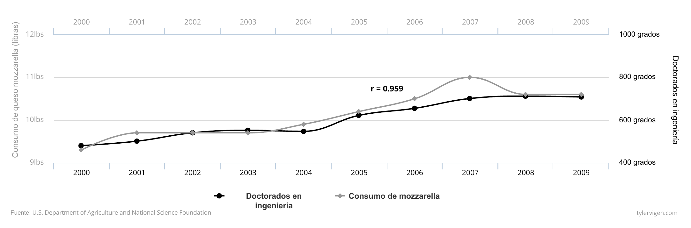
```

Es menos probable que califiquemos de espuria la relación entre el gasto en educación y la desigualdad. No nos reímos inmediatamente de la correlación que encontramos en el capítulo 6, y hay muchos trabajos académicos publicados que investigan la relación genuina entre ellos. ¿Por qué? La diferencia entre la posibilidad de las dos relaciones va más allá de las estadísticas. No hay ninguna explicación creíble que vincule el consumo de queso con los títulos de doctorado, a pesar de la alta correlación entre ambos. Hay una historia causal creíble entre la desigualdad y la educación, ya que el aumento de la calidad de la educación mejora las oportunidades de empleo disponibles para los estudiantes después de la graduación. 

En este capítulo, presentamos un nuevo lenguaje no estadístico para crear, medir y evaluar situaciones y relaciones causales utilizando datos observacionales (es decir, no experimentales). Introducimos el concepto de gráficos acíclicos dirigidos por la causalidad (*Directed Acyclical Graphs* o DAGs en inglés) que nos permiten codificar formalmente nuestra comprensión de las historias causales. Con los DAGs bien elaborados, podemos utilizar un conjunto de reglas llamadas cálculos *do* (hacer) para lograr ajustes específicos a los modelos estadísticos y aislar o identificar relaciones causales entre las variables de interés. 


## Causalidad y gráficos causales

A diferencia de la correlación, que en su núcleo es simplemente una fórmula matemática, no existe una función de "causalidad" en R, algo como `causation()`. La causalidad es una cuestión de filosofía y teoría, no de matemáticas. Los debates sobre la definición de la causalidad se han llevado a cabo durante miles de años - Platón y Aristóteles escribieron sobre la metafísica y los componentes de las relaciones causales. En aras de la simplicidad, en este capítulo utilizaremos una definición bastante universal: se puede decir que $X$ causa $Y$ si:

- **Asociación**: $X$ e $Y$ están *relacionadas* entre sí
- **Orden temporal**: $X$ *precede a* $Y$
- La relación entre $X$ e $Y$ *no es espúrea*

Más simplemente, podemos colapsar las tres condiciones en una sola definición:

> Una variable $X$ es una causa de una variable $Y$ si $Y$ de alguna manera depende de $X$ para su valor... $X$ es una causa de $Y$ si $Y$ escucha a $X$ y decide su valor en respuesta a lo que escucha [@PearlGlymourJewell:2016, 5--6]

El concepto de variables que se "escuchan" simultáneamente incorpora la relación, el ordenamiento en el tiempo y la relación no espuria. Considere la relación entre encender un interruptor de luz y que la luz se encienda. El acto de accionar un interruptor de luz se asocia con una bombilla que emite luz, lo que indica una asociación entre ambos.  Una bombilla no puede emitir luz antes de ser encendida, por lo que se debe asegurar el orden correcto del tiempo: el encendido del interruptor debe preceder a la luz. Por último, la asociación no es espuria ya que existe un vínculo plausible entre ambos: los impulsos eléctricos viajan a través de los cables hasta el equipo que transforma la energía en electricidad que, en última instancia, puede alimentar la bombilla. También podemos decir más simplemente que la bombilla "escucha" al interruptor de luz. Los cambios en el estado de encendido y apagado del interruptor influyen en el estado de la bombilla más abajo en la cadena causal. Una bombilla escucha muchos otros factores - la electricidad debe fluir en el edificio, los transformadores deben funcionar correctamente, y múltiples interruptores podrían controlar la misma luz - pero un solo interruptor es definitivamente una de las causas de la emisión de luz.

```{r general-examples, echo=FALSE, fig.cap="Varios DAGs"}
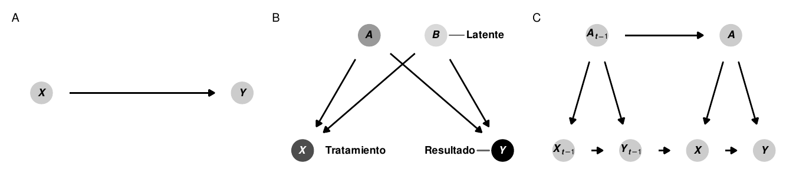
```

Podemos codificar la filosofía o la teoría de una cadena causal de eventos en un gráfico acíclico dirigido, o DAG. Los DAGs son modelos gráficos del proceso que genera los datos y describen cómo $X$ causa $Y$ (ver panel A de la Figura \@ref(fig: general-examples)) Estos gráficos consisten en tres elementos centrales: nodos, bordes (o flechas) y dirección. Los nodos representan fenómenos que tienen relaciones causales con otros elementos del sistema. Estos pueden ser cosas que se pueden medir y que podrían incluir una base de datos, como el PIB, la población, el partido político, el tiempo de permanencia en el cargo, los ingresos, la ubicación geográfica o la situación socioeconómica. Los nodos no tienen por qué ser necesariamente medibles; las limitaciones en la recopilación de datos o la abstracción de variables pueden hacer imposible la recopilación de mediciones fiables sobre diferentes fenómenos. Si éste es el caso, el nodo debe seguir estando incluido en el gráfico, pero debe ser considerado *no observado* o *latente*. Los nodos también representan las variables de tratamiento y de resultado (véase el panel B de la figura \@ref(fig: general-examples)). Por ejemplo, si nos interesa el efecto causal de los gastos en educación sobre la desigualdad (como en el capítulo 6), los gastos en educación serían el *tratamiento* o la *exposición*, y la desigualdad social basada en Gini sería el *resultado*.

Las flechas transmiten asociaciones entre nodos. Por ejemplo, si un gráfico muestra que  $X \rightarrow Y$, $X$ tiene una asociación causal con $Y$, o $Y$ "escucha" o responde a $X$. Crucialmente, la ausencia de una flecha entre los nodos implica que no hay relación causal entre los nodos. Las asociaciones causales entre los nodos sólo pueden fluir en una **dirección**- las flechas nunca pueden ir en ambas direcciones (por ejemplo, $X \leftrightarrow Y$), y debería ser imposible volver a cualquier nodo dado mientras se camina por el gráfico (por ejemplo, $X \rightarrow Z \rightarrow Y \rightarrow Z \rightarrow X$). A menudo hay una razón válida para incluir flechas de loop o de retroalimentación. Por ejemplo, los gastos en educación pueden conducir a la desigualdad, lo que a su vez conduce a cambios en los gastos en educación. En estas situaciones, en lugar de incluir flechas bidireccionales, es mejor distinguir entre los dos períodos de gastos en educación, a menudo utilizando el subíndice $t$ para el tiempo: $X_{t-1} \rightarrow Y_{t-i} \rightarrow X_t \rightarrow Y_t$ (ver panel C en la figura \N-(fig:general-examples)). 

La presencia y ausencia de nodos, flechas y dirección en un DAG comunica nuestra teoría y nuestra filosofía de la causalidad. El uso de los DAGs deja claro a su audiencia cuáles son tus supuestos. Vincular los nodos entre sí implica que hay una relación estadística entre dos fenómenos, mientras que omitir un nodo o una flecha implica que el nodo no juega ningún papel en la historia causal. Si los lectores quieren discutir con su teoría de la causalidad, pueden hacerlo fácilmente refiriéndose al DAG y señalando qué nodos y flechas deben ser incluidos o excluidos. 


## Midiendo efectos causales

Como la causalidad significa que $Y$ escucha a $X$, medir el efecto de $X$ en $Y$ requiere que se pueda manipular $X$ directamente para ver qué pasa con $Y$. Podemos usar una pieza especial de notación matemática para representar intervenciones directas: el operador *hacer*, o $hacer(\cdot)$. Si $Y$ escucha a $X$, podemos decir que hay algún valor esperado de $Y$ cuando "hacemos" $X$, o $E(Y | hacer(X))$ (léase esto como "el valor esperado de Y dado que tienes X").[^doprob] Podemos hacer que esta notación sea un poco más fácil de entender con algunos ejemplos de preguntas causales que interesan a los cientistas sociales:

- $E(\text{Votos obtenidos}\ | \ hacer(\text{Recaudación de fondos de la campaña}))$: El efecto de *hacer* (es decir, participar en) la recaudación de fondos de la campaña en el número de votos ganados en una elección
- $E(\text{Desigualdad}\ | \ hacer(\text{Gastos en educación}))$: El efecto de "hacer" gastos de educación (es decir, gastar dinero) en el nivel de desigualdad social de un país
- $E(\text{Calidad del aire}\ | \ hacer(\text{Impuesto sobre el carbono}))$: Tel efecto de "hacer" (es decir, aplicar) un impuesto sobre el carbono en la calidad del aire de un país
- $E(\text{Tasa de infección de malaria}\ | \ hacer(\text{redes para mosquitos}))$: El efecto de "hacer" (es decir, usar) un mosquitero en la tasa de infección de malaria de una aldea

[^doprob]: Esto también puede escribirse como $P(Y | hacer(X))$, de la distribución de probabilidad de $Y$ dado que "haces" $X$.

Para medir el efecto causal de una intervención, necesitamos comparar el valor esperado del resultado ($E(Y)$) cuando intervenimos y cuando no intervenimos con $X$. Por ejemplo, podemos comparar lo que sucede con una bombilla cuando accionamos un interruptor con lo que sucede con una bombilla cuando no accionamos el interruptor. Restringiendo la diferencia entre estos dos estados del mundo se obtiene un efecto causal:

$$
\text{Efecto causal del encendido de la luz} = E(\text{Luz}\ | \ hacer(\text{Interruptor = Encendido})) - E(\text{Luz}\ | \ hacer(\text{Interruptor = Apagado}))
$$

Podemos escribir esta definición de manera más general usando unos pocos símbolos matemáticos más. Aquí $\delta$ representa el efecto causal y el subíndice $i$ representa un individuo específico (es decir, comparando los efectos en la misma bombilla):

$$
\delta_i = E(Y\ | \ hacer(X = 1))_i - E(Y\ | \ hacer(X = 0))_i
$$

El cálculo del efecto causal $\delta_i$ en el mundo físico es bastante sencillo. Encuentra dos bombillas codigoénticas, enciende una ( $hacer(\text{Interruptor = Encendido})$), deja una apagada ( $hacer(\text{Interruptor= Apagado})$), y compara la luz que se emite. O, como una sola bombilla no cambia con el tiempo, medir el cambio de luz en la misma bombilla en dos momentos diferentes. 

Sin embargo, en las ciencias sociales es mucho más difícil medir el efecto causal de las intervenciones en personas, provincias o países concretos. No podemos medir $E(Y | hacer( X = 1))_i$ en un individuo y luego retroceder en el tiempo para medir $E(Y | hacer(X = 0))_i$ en ese mismo individuo. Esto plantea el *problema fundamental de la inferencia causal*: los efectos causales a nivel individual son imposibles de observar porque no podemos ver contrafactuales a nivel individual.

En lugar de medir los efectos a nivel individual, es más fácil (y realmente factible) medir los resultados medios de cada unidad de un grupo. Podemos encontrar el *efecto promedio del tratamiento* (ATE) calculando la diferencia entre el valor esperado del resultado promedio ($\bar{Y}$) para los que $hacen(X)$ y los que no:

$$
\delta_\text{ATE} = E(\bar{Y}\ | \ hacer(X = 1)) - E(\bar{Y}\ | \ hacer(X = 0))
$$

En condiciones experimentales, como en los ensayos controlados aleatorios en los que los participantes se asignan al azar para recibir tratamiento o no, los grupos que $hacen(X = 1)$ y $hacen(X = 0)$ serán generalmente comparables porque ningún individuo se seleccionó voluntariamente dentro o fuera del tratamiento. Mientras la aleatorización se haga bien, el ATE que calculamos debe ser imparcial (sin sesgo) y preciso. 

Sin embargo, la mayoría de los datos de la ciencia política son de naturaleza observacional. El PIB nacional, los resultados de las elecciones, el gasto del gobierno, la matrícula en las escuelas primarias y el número de golpes de Estado se generan a partir de procesos no experimentales. Si estamos interesados en el efecto de ser una democracia (es decir, "hacer" democracia) en el PIB, podríamos tratar de definir el efecto causal como:

$$
\delta_\text{ATE} = E(\text{PBI promedio}\ | \ hacer(\text{Democracia} = 1)) - E(\text{PBI promedio}\ | \ hacer(\text{Democracia} = 0))
$$

Sin embargo, el simple hecho de restar el PIB medio de las no democracias del PIB medio de las democracias dará lugar a una estimación sesgada e incorrecta. Los países no se asignan al azar para ser democracias. Hay innumerables factores económicos, históricos, sociológicos y políticos que influyen en la capacidad de un país para $hacer(\text{democracia})$, lo que garantiza que habrá un sesgo sistemático en la selección del sistema político de un país. Cualquier correlación que pudiéramos encontrar no implicaría causalidad.

Existen muchas técnicas econométricas para identificar y estimar los efectos causales a partir de datos de observación, incluidos los experimentos naturales, el análisis de diferencias en las diferencias, el análisis de regresión discontinua y las variables instrumentales (véase @mixtape, @angristMostlyHarmlessEconometrics2008, @masteringmetrics para una visión general completa de todos estos métodos). En general, estos métodos tratan de aproximarse a los grupos de tratamiento y control, organizando a las personas o los países en grupos comparables y eliminando el sesgo de selección. Además de estos enfoques, podemos utilizar la lógica de los modelos causales para identificar las relaciones causales, eliminar la confusión estadística y utilizar datos de observación para estimar efectos causales válidos.


## DAGs y asociaciones estadísticas

Dibujar nodos y flechas es útil para comprender los diversos elementos de un fenómeno social, pero por sí solos, los nodos y bordes no identifican relaciones causales. Se considera que un efecto causal está *identificado* si la asociación entre el nodo de tratamiento y el nodo de resultado se aísla y se despoja de las asociaciones estadísticas que provienen de otros nodos del gráfico.

```{r association-examples, echo=FALSE, fig.cap="Los tipos básicos de relaciones en DAGs"}
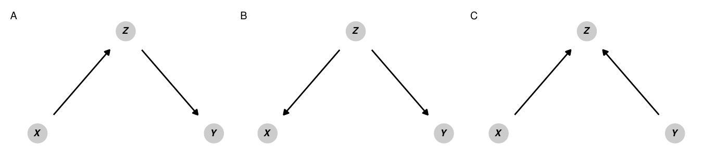
```

La **dirección** de las flechas a lo largo de las trayectorias entre nodos en un gráfico determina cómo se transmiten las asociaciones estadísticas entre los nodos. Para ilustrar cómo ciertas relaciones direccionales pueden pasar asociaciones estadísticas entre nodos en un gráfico, supongamos que dos variables $X$ e $Y$ no están relacionadas entre sí. Podemos decir esto con notación matemática usando el símbolo $\perp$: $X \perp Y$ significa que $X$ es independiente de $Y$ (y $X  \not\perp Y$ significa que las dos variables no son independientes). En el lenguaje de los gráficos causales, podemos decir que si $X$ e $Y$ son independientes la una de la otra, están *d-separadas* (el *d-* significa "dirección"). Si $X$ e $Y$ no son independientes una de la otra, están *d-conectadas*: las características de las relaciones direccionales en el gráfico causal conectan las dos variables entre sí y permiten que la información pase entre ellas. La figura \@ref(fig:association-examples) muestra cómo la inclusión de un tercer nodo $Z$ en la vía entre $X$ y $Y$ cambia la relación estadística entre los dos e influye en si están *d*-separadas o *d*- conectadas. 
 
1. **Mediadores**: En el panel A, $X$ e $Y$ están correlacionadas entre sí por la variable mediadora $Z$. Cualquier cambio en $X$ causará cambios en $Y$ a través de $Z$. El camino entre $X$ e $Y$ es por lo tanto *abierto* y $X \not\perp Y$. $X$ e $Y$ están *d*conectadas.

2. **variable confusora**: En el panel B, aunque $X$ e $Y$ no se causan mutuamente, $Z$ es una causa común de ambos y confunde la relación. Cualquier cambio en $Z$ causará cambios tanto en $X$ como en $Y$, eliminando así cualquier independencia estadística entre los dos. El camino entre $X$ e $Y$ está así *abierto* y de nuevo, $X \not\perp Y$. $X$ e $Y$ están *d*conectadas.

En realidad, $X$ e $Y$ deberían ser independientes entre sí, pero en el caso de los mediadores y los las variables de confusión, $X$ e $Y$ están *d*conectadas porque $Z$ abre un camino entre los dos y pasa información entre ellos. 

Un elemento poderoso de la lógica de los diagramas causales es que podemos controlar el flujo de información estadística bloqueando y abriendo vías entre los nodos. Tanto para mediar como para confundir, si podemos detener la asociación entre ambos $X$ y $Z$ y $Z$ e $Y$, entonces $X$ e $Y$ serán una vez más independientes entre sí y estarán *d*-separadas. Para ello, podemos *ajustar para* o *condicionar sobre* $Z$ quitando las partes de $X$ e $Y$ que se explican por $Z$. Hay muchas maneras de ajustar las variables, y se incluyen ejemplos más adelante en este capítulo. Una forma básica de pensar en el ajuste de variables es con la regresión: si ejecutáramos una regresión e incluyéramos $Z$ como variable de control (por ejemplo, `lm(Y ~ X + Z)`), el coeficiente para $Z$ explicaría (y eliminaría) la variación conjunta de $Z$ a través de $X$ y $Y$. Una vez que ajustamos para $Z$, el camino entre $X$ e $Y$ se bloquea y los dos se *d*separan. Matemáticamente, podemos escribir esto como $X \perp Y | Z$, o decir que $X$ es independiente de $Y$ condicionado a $Z$.

El concepto de bloqueo o condicionamiento nos ayuda a entender el tipo de relación final entre los nodos:

3. **Colisionadores**: En el panel C de la figura \@ref(fig: association-examples), $X$ e $Y$ son causas comunes de $Z$, pero cada una es independiente de la otra. El camino entre $X$ e $Y$ está cerrado porque está bloqueado por $Z$. $X \perp Y$ y $X$ e $Y$ están *d*separados. Si controlamos por $Z$ en un modelo de regresión, abrimos inadvertidamente el camino entre $X$ e $Y$ y creamos una relación estadística espuria entre los dos. 

```{r money-votes-simple, echo=FALSE, fig.cap="DAG simplificado que muestra la relación entre los gastos de campaña y los votos ganados en una elección", out.width="60%"}
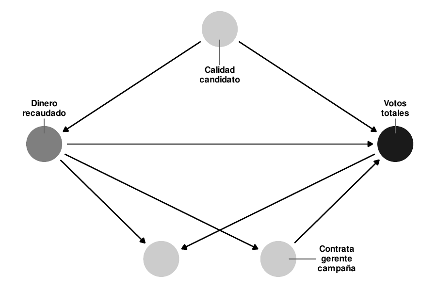
```

Hasta ahora, hemos hablado de DAGs y *d*-separación en abstracto con $X$, $Y$, y $Z$. La figura \@ref(fig:money-votes-simple) proporciona un gráfico causal más concreto que ilustra las tres relaciones simultáneamente. Supongamos que estamos interesados en el efecto causal de la recaudación de fondos de la campaña ($X$) sobre el total de votos ($Y$). En este caso, ya no suponemos que $X$ e $Y$ son independientes la una de la otra (es decir, $X \perp Y$), sino que queremos medir la relación entre ambas. Sin embargo, para aislar esa relación, debemos asegurarnos de que la vía entre el dinero de la campaña y el total de votos sea la única vía conectada en el gráfico. Cada uno de los otros nodos del gráfico - "director de campaña contratado", "calidad del candidato" y "elección ganada" - pasa por diferentes tipos de asociaciones estadísticas entre el dinero y el éxito electoral. Podemos examinarlos a su vez:

1. La relación entre el dinero y el total de votos es **mediada** por la contratación de un director de campaña. Cualquier cambio en la recaudación de fondos tiene un efecto en el número de votos ganados, pero la recaudación de fondos también influye en las posibilidades de contratar a un director de campaña, lo que a su vez tiene un efecto en el total de votos. El camino entre el dinero y los votos está así abierto debido a la variable de director de campaña mediador.
2. La relación entre el dinero y el éxito electoral se **confunde** con la calidad del candidato. Los candidatos de alta calidad son más propensos a recaudar más dinero *y* ganar elecciones, lo que significa que la relación entre el dinero y el éxito electoral ya no está aislada. Si ajustamos la calidad del candidato y comparamos los candidatos de la misma calidad (o controlar por la calidad en una regresión, manteniendo la calidad constante), podemos cerrar el camino entre el dinero y el éxito electoral.
3. Ganar una elección es un **colicionador** en el camino entre el dinero y el éxito electoral. Si ajustamos por ganar las elecciones (es decir, sólo miramos a los candidatos ganadores), la relación real entre el dinero y el éxito electoral se distorsionará. El sesgo colisionador es un tipo de sesgo de selección: si sólo miramos las campañas exitosas, no vemos la relación entre el dinero y el éxito de los candidatos que no ganaron, y nuestras estimaciones serán erróneas. No deberíamos controlar por el hecho de ganar una elección.

Conocer la dirección de las flechas entre los nodos de un DAG, por lo tanto, proporciona una guía útil sobre qué controlar o ajustar. Si queremos aislar la relación entre la recaudación de fondos de campaña y el éxito electoral, debemos controlar por la calidad del candidato (ya que es un confusor) y no debemos controlar por el hecho de ganar la elección (ya que es un colisionador). La decisión de ajustar por tener un director de campaña dependerá de nuestra pregunta de investigación. Si lo ajustamos, eliminaremos el efecto de director de campaña del efecto total de la recaudación de fondos sobre los votos, y el efecto restante de $X$ sobre $Y$ será realmente de $X$ sin el efecto de director de campaña. Si estamos interesados en el efecto total de la recaudación de fondos, incluyendo cualquier efecto que provenga de tener un director de campaña, *no deberíamos controlar* el tener un director de campaña. 


## Puertas traseras y cálculos "*hacer*"

Following the fundamental problem of causal inference (i.e. due the the fact that we do not have a time machine), answering causal questions without an experiment appears impossible. However, if we apply a special set of logical rules called *do*-calculus to our causal graph, we can strip away any confounding relationships between our tratamiento and outcome nodes and isolate the causal effect between them using only observational data.

```{r rct-arrow-deletion, echo=FALSE, fig.cap="Las flechas en un DAG se borran cuando usamos el operador $hacer(\\cdot)$", out.width="60%"}
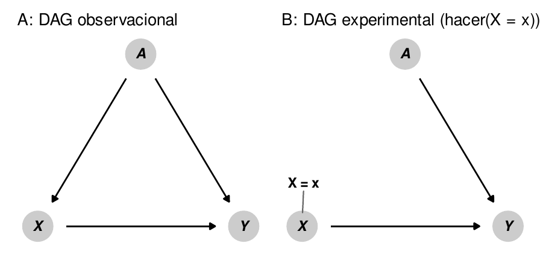
```

El operador *hacer* representa una intervención directa en un DAG y nos permite "congelar" un nodo en un valor específico. Por ejemplo, en un ensayo controlado aleatorio, nosotros como investigadores tenemos control sobre quién es asignado al tratamiento y a los grupos de control en la intervención. El efecto causal (o $delta$) que encontramos en el ensayo es el efecto de $X$ en nuestro resultado $Y$ cuando $hacer(X = \ text{tratamiento})$. En los entornos experimentales, una intervención $hacer(\cdot)$ implica que todas las flechas que entran en el nodo de tratamiento se eliminan (ver Figura \@ref(fig:rct-arrow-deletion)). Esto asegura que $X$ esté *d*-separada de $Y$ y que la flecha entre $X$ y $Y$ esté completamente aislada e identificada. Sin embargo, con datos de observacionales, no es posible estimar $E(Y | hacer(X))$ porque como investigadores, no tenemos control sobre $X$. No podemos asignar a algunos países a que aumenten y otros a que disminuyan el gasto en educación como parte de un experimento para ver cómo cambia la desigualdad social, ni asignar a algunas campañas a que hagan un esfuerzo extra en la recaudación de fondos para ver el efecto del dinero en los votos. En lugar de $E(Y | hacer(X))$, que es nuestro valor de interés, sólo podemos estimar $E(Y | X)$, o el valor esperado de $Y$ dados los niveles existentes de $X$ (es decir, la correlación entre ambos). Desafortunadamente, la frase con la que se abrió este capítulo, "la correlación no es causalidad", se mantiene aquí: $E(Y | X) \neq E(Y | hacer(X))$. Para estimar un efecto causal a partir de datos observacionales, necesitamos transformar $E(Y | hacer(X))$ en algo que esté liberado del término *hacer*, ya que no podemos realmente intervenir sobre cuándo *hacer* ocurre y cuando no.

Un conjunto de tres reglas lógicas especiales denominadas "cálculos *hacer*" nos permite hacer precisamente eso: mediante la aplicación de diferentes reglas, podemos eliminar los operadores $hacer(\cdot)$ de los DAG e identificar los efectos causales con sólo datos observacionales. Cubrir el conjunto completo de reglas de cálculo *hacer* va más allá del alcance de este capítulo; puedes consultar @PearlGlymourJewell:2016, @PearlMackenzie:2018, @ShpitserPearl:2008 para más detalles y ejemplos. 

Una derivación particular de las reglas de cálculos *hacer* define un especial *criterio de puerta trasera* que nos permite eliminar los operadores $hacer(\cdot)$ ajustando las variables de confusión a lo largo del camino entre $X$ y $Y$. El criterio de puerta trasera establece que el efecto causal de $X$ sobre $Y$ es identificable (es decir, puede ser aislado) después de ajustar el conjunto de variables de confusión $Z$, usando la fórmula:

$$
P(Y | hacer(X)) = \sum_Z P(Y | X, Z) \times P(Z)
$$

En este capítulo, la derivación e interpretación exacta de esta fórmula es menos importante que la intuición. De acuerdo con este criterio de puerta trasera, el operador *hacer* del lado izquierdo de la ecuación puede transformarse en una expresión libre de *hacer* del lado derecho, estimada con $P(Y | X, Z)$ (la distribución de $Y$ condicionada tanto a $X$ como a $Z$) y $P(Z)$ (la distribución de $Z$), que son ambas estimables utilizando sólo datos de observación.

En la práctica, el ajuste de la puerta trasera suele ser mucho más intuitivo que tratar de derivar fórmulas largas. En su lugar, es posible encontrar y ajustar  caminos de puertas traseras confusores usando un DAG siguiendo este proceso:

1. Enumera todos los caminos entre $X$ e $Y$, sin importar la dirección de las flechas.
2. Identifica cualquier camino que tenga flechas que apunten hacia atrás, hacia $X$.
3. Los nodos que apuntan hacia atrás a $X$ son confusores y por lo tanto abren caminos de vuelta. Estos deben ser ajustados.

Podemos aplicar este proceso al DAG en la figura  \@ref(fig:money-votes-simple). Estamos interesados en el efecto de la recaudación de fondos de campaña en la cantidad de votos obtenidos en una elección, o $E(\text{Votos obtenidos}\ | \ hacer(\text{campaña de recaudación de fondos}))$. Como no asignamos experimentalmente algunas campañas para recaudar dinero y otras no, sólo podemos trabajar con datos observacionales, dejándonos sólo con la correlación entre la recaudación de fondos de la campaña y los votos, o $E(\text{Votos obtenidos}\ |\ \text{campaña de recaudación de fondos})$. Si miramos el gráfico causal hay cuatro caminos entre "Dinero recaudado" y "Total de votos":

- $\text{Recaudación} \rightarrow \text{Cantidad de votos}$
- $\text{Recaudación} \leftarrow \text{Calidad del candidato} \rightarrow \text{Cantidad de votos}$
- $\text{Recaudación} \rightarrow \text{Contratar gerente de campaña} \rightarrow \text{Cantidad de votos}$
- $\text{Recaudación} \rightarrow \text{Ganar la elección} \leftarrow \text{Cantidad de votos}$

En el segundo camino, la calidad del candidato apunta hacia atrás hacia "dinero recaudado" y es un confusor que abre un camino secundario entre la recaudación de fondos y los votos. El primero, tercero y cuarto caminos sólo tienen flechas hacia la derecha y no producen ninguna confusión. Si ajustamos por la calidad del candidato y la mantenemos constante, nos aseguramos de que la relación entre la recaudación de fondos y los votos estará *d*-separada de todos los demás nodos y por lo tanto esté aislada e identificada.

```{r money-votes-complex, echo=FALSE, fig.cap="Un DAG más complicado que muestra la relación entre los gastos de campaña y los votos ganados en una elección", out.width="60%"}
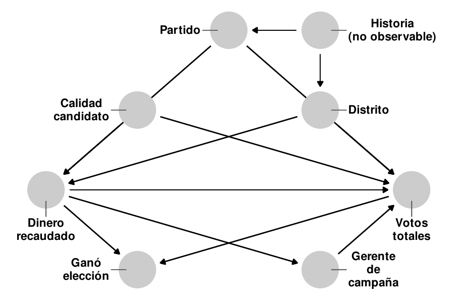
```

La misma lógica se aplica también a DAGs más complejos. Consideremos la figura \@ref(fig:money-votes-complex), que es una versión amplificada de la figura \@ref(fig:money-votes-simple) con tres nuevos nodos: el partido político del candidato, el distrito en el que se presenta el candidato y la historia no observada tanto del distrito como del partido, que influyen en la toma de decisiones del partido y en la dinámica demográfica del distrito. Estamos interesados en identificar o aislar el camino entre la recaudación de fondos y el total de votos, pero hay caminos de confusión que *d*-separan el camino causal que nos interesa. Podemos cerrar estas puertas traseras para aislar el efecto causal. Primero, enumeramos todos los caminos entre "Dinero recaudado" y "Total de votos":

- $\text{Recaudación} \rightarrow \text{Cantidad de votos}$
- $\text{Recaudación} \rightarrow \text{Contratar gerente de campaña} \rightarrow \text{Cantidad de votos}$
- $\text{Recaudación} \rightarrow \text{Ganar elección} \leftarrow \text{Cantidad de votos}$
- $\text{Recaudación} \leftarrow \text{Calidad del candidato} \rightarrow \text{Cantidad de votos}$
- $\text{Recaudación} \leftarrow \text{Distrito} \rightarrow \text{Cantidad de votos}$
- $\text{Recaudación} \leftarrow \text{Partido} \rightarrow \text{Cantidad de votos}$
- $\text{Recaudación} \leftarrow \text{Distrito} \leftarrow \text{Historia} \rightarrow \text{Partido} \rightarrow \text{Cantidad de votos}$
- $\text{Recaudación} \leftarrow \text{Partido} \leftarrow \text{Historia} \rightarrow \text{Distrito} \rightarrow \text{Cantidad de votos}$

De estos ocho caminos posibles, los últimos cinco tienen flechas que apuntan hacia la izquierda en "Dinero recaudado" desde tres nodos únicos: calidad del candidato, partido y distrito. Por lo tanto, debemos ajustar por la calidad del candidato, el partido y el distrito para cerrar estos caminos de puerta trasera y asegurarnos de que se identifique la conexión entre dinero y votos. Es importante destacar que la historia, que no es medible, también es un factor de confusión. Sin embargo, debido a que cerramos el partido y el distrito mediante ajustes, la historia no confunde estadísticamente la relación entre el dinero y los votos. Aunque es latente e inconmensurable, los nodos posteriores que *son* medibles nos permiten cerrar sus efectos de puerta trasera. También ten en cuenta que medir por "haber ganado la elección" es un colisionador, no un factor de confusión, y no debe ajustarse para evitar crear conexiones espurias entre la recaudación y los votos, y tener un gerente de campaña es un mediador y no debe ajustarse si estamos interesados en el efecto total del dinero en los votos.

El criterio de puerta trasera no es el único método para encontrar qué nodos deben ajustarse. Otro método común es el criterio de la puerta delantera, que se basa en variables mediadoras *d*-separadas para identificar la relación entre $ X $ e $ Y $ (consulta @Rohrer:2018, @PearlGlymourJewell:2016, @PearlMackenzie:2018, @Elwert:2013 y @HernanRobbins:2020 para detalles y ejemplos). Los DAGs complejos que no se ajustan fácilmente a los criterios de puerta trasera o puerta delantera pueden usar la aplicación de las reglas de cálculo *hacer* para encontrar ajustes apropiados y factibles. Se han desarrollado algoritmos especiales para trabajar a través de las reglas de cálculo *hacer* para determinar si un efecto es identificable: el paquete `causaleffect` en R incluye funciones para ejecutar estos algoritmos.

Es importante destacar que no siempre es posible identificar los efectos causales en un DAG. Si no hay forma de traducir $ P (Y | hacer (X)) $ a una expresión libre usando cálculos *hacer*, entonces es imposible aislar e identificar la relación causal usando datos observacionales.

## Dibujar y analizar DAGs

Como los DAGs son un conjunto de nodos y flechas, son fáciles de dibujar. Recomiendo esbozarlos a mano en papel o en una pizarra cuando estés mapeando por primera vez tu teoría causal, y luego transfiere el borrador escrito a mano a una computadora. Si bien es posible usar muchos programas diferentes para dibujar DAGs, incluidos Microsoft PowerPoint o Adobe Illustrator, es mejor usar un software de gráficos como DAGitty o el paquete `ggdag`en R.

### Dibujar un DAG con DAGitty

DAGitty ([https://www.dagitty.red ](https://www.dagitty.red )) is an in-browser graphical editor for creating and analyzing causal diagrams. By pointing and clicking, you can create nodes and link them together with edges. You can also assign specific nodes to be tratamiento, outcome, and latent/unobserved variables, which each have their own coloring scheme. You can export DAGs as PNG, JPG, and SVG files for inclusion in other documents. Figure \@ref(fig:example-dagitty) shows an example of a causal graph made in DAGitty. Consult [the online manual](http://dagitty.red /manual-3.x.png) for more details about DAGitty's features, or spend a few minutes playing around to get used to adding and connecting nodes.

DAGitty ([https://www.dagitty.red ] (https://www.dagitty.red )) es un editor gráfico online para crear y analizar diagramas causales. Con el mouse, y sin código, puede crear nodos y vincularlos con flechas. También puede asignar nodos específicos para que sean tratamiento, resultado o variables latentes / no observadas, y a cada una darle su propia escala de colores. Puedes exportar los DAGs como archivos PNG, JPG y SVG para incluirlos en otros documentos. La figura \@ref(fig:example-dagitty) muestra un ejemplo de un gráfico causal realizado en DAGitty por mí. 

> **Ejercicio 10A.** Consulta [el manual en línea] (http://dagitty.red /manual-3.x.png) para obtener más detalles sobre las características de DAGitty, o pasa unos minutos jugando para acostumbrarte a agregar y conectar nodos.


```{r example-dagitty, echo=FALSE, fig.cap="Ejemplo de un DAG dibujado en DAGitty", out.width="50%"}
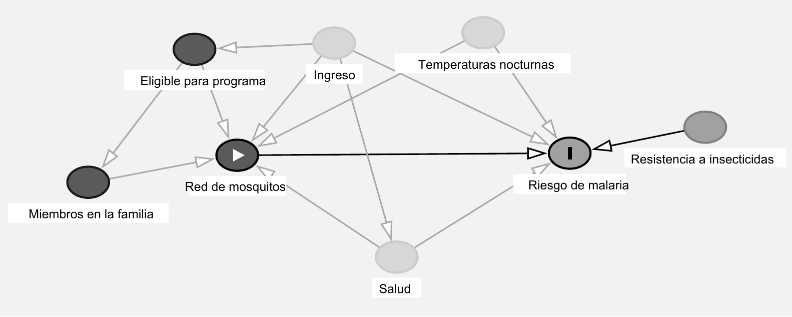
```

### Encontrar sets de ajuste con DAGitty

DAGitty colorea automáticamente los nodos y las flechas según estén abiertos o no. Por ejemplo, en la Figura \@ref(fig:example-dagitty), los nodos de la temperatura nocturna,  ingresos y condiciones de salud son rojos, lo que indica que confunden la relación entre el tratamiento (red) y el resultado (malaria). Puedes especificar que estos nodos se ajustarán y así despejar ej camino causal.

En la barra lateral derecha, DAGitty incluye una lista de nodos que deben ajustarse para identificar el efecto causal. Si el efecto es identificable, enumerará todos los nodos mínimamente suficientes; y si la causalidad no es identificable, DAGitty se lo informará. Para el DAG en la Figura \@ref(fig:example-dagitty)), el conjunto de ajustes mínimamente suficientes incluye las temperaturas nocturnas, los ingresos y las condiciones de salud subyacentes (see Figure \@ref(fig:dagitty-adjust-implications)).

```{r dagitty-adjust-implications, echo=FALSE, fig.cap="Sets con ajustes mínimos suficientes e implicaciones comprobables para un modelo en DAGitty", out.width="45%"}
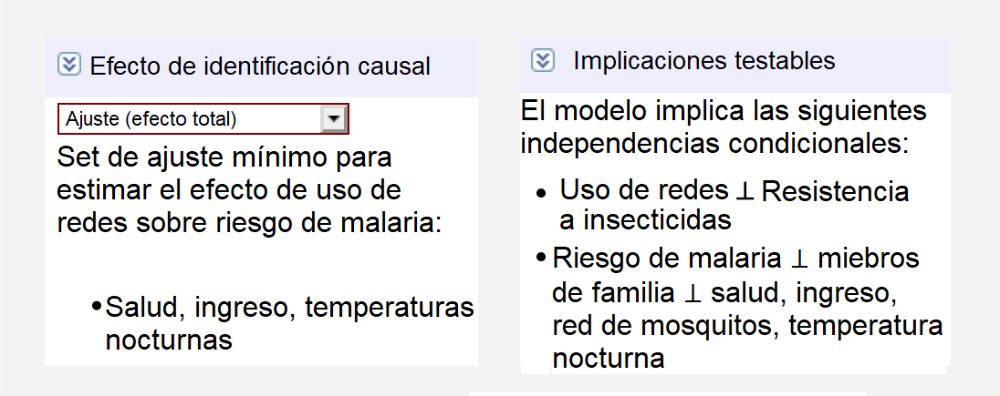
```

La barra lateral derecha también incluye una lista de todas las implicaciones comprobables del DAG. Recuerde que después del ajuste, ciertos nodos se *d*separan y, por lo tanto, no pasan asociaciones estadísticas entre sí. Según este DAG, después de ajustar las temperaturas nocturnas, los ingresos y las condiciones de salud subyacentes, algunas de las siguientes afirmaciones deberían ser ciertas:

- $\text{Ingresos} \perp \text{Resistencia al insecticida}$: Los ingresos deben ser independientes de la resistencia a los insecticidas.
- $\text{Ingresos} \perp \text{Temperaturas nocturas}$:Los ingresos deben ser independientes de las temperaturas nocturnas.
- $\text{Gente en el hogar} \perp \text{Condiciones de salud subyacente}\ |\ \text{Ingresos}$: El número de personas en un hogar debe ser independiente de las condiciones de salud subyacentes en niveles similares de ingresos.

Cada una de estas afirmaciones es comprobable con datos observacionales. Si tiene columnas en una base de datos para estos nodos diferentes, puede usar R para verificar las correlaciones entre ellos (es decir, `cor(data$ingresos, data$temperatura)`  o `lm(gente_hogar ~ salud + ingresos)`) y ver si en realidad son independientes entre sí.

### Diseñar DAGs en R

El paquete `ggdag` te permite usar `ggplot2` para crear y analizar DAGs en R. La documentación del paquete está llena de ejemplos útiles del rango completo de funciones del paquete. A continuación se presentan algunos ejemplos de las cosas más comunes que puede hacer con él

En general, diseñas un DAG con `dagify ()` y lo graficas con `ggdag ()` o `ggplot ()`. La sintaxis para diseñar un DAG en `dagify ()` es similar a la que usas cuando creas modelos con `lm ()` o `glm ()`: crearás sistemas de fórmulas que indican relaciones entre los nodos. Por ejemplo, en el DAG a continuación, `y` es causado por `x`, `a` y `b` (`y ~ x + a + b`), y `x` es causado por `a` y` b` (`x ~ a + b`), que hace que `a` y `b` sean variables de confusión.

```{r include=FALSE}
# hacer que todos estos DAG posicionados al azar tengan el mismo diseño
set.seed(1234)
```

```{r build-simple-dag, fig.width=6, fig.height=3.6, fig.cap="DAG básico diseñado con \\texttt{ggdag()}", out.width="55%"}
library(ggdag)

simple_dag <- dagify(
  y ~ x + a + b,
  x ~ a + b,
  exposure = "x",
  outcome = "y"
)

# theme_dag() coloca la trama en un fondo blanco sin etiquetas en los ejes
ggdag(simple_dag) + 
  theme_dag()
```

Establecer `x` e `y` como tus variables independiente y dependiente es opcional si lo que deseas es un gráfico simple, pero si lo configuras así, puedes colorear los puntos por tipo de nodo:

```{r status-dag-fake, eval=FALSE}
ggdag_status(simple_dag) +
  theme_dag()
```

```{r status-dag, echo=FALSE, fig.width=6, fig.height=3.6, fig.cap="DAG con nodos coloreados por estatus", out.width="55%"}
ggdag_status(simple_dag) +
  scale_color_manual(values = c("grey50", "grey10"), na.value = "grey80") +
  theme_dag(base_family = "LM Roman 10")
```

Observe cómo el diseño es diferente en ambos gráficos. Por defecto, `ggdag ()` coloca los nodos aleatoriamente cada vez que usa un algoritmo de red. Puedes cambiar el algoritmo utilizando el argumento `layout`:` ggdag (simple_dag, layout = "nicely")`. Puedes ver una lista completa de los posibles algoritmos ejecutando `?layout_tbl_graph_igraph` en la consola.

Alternativamente, puedes especificar tus propias coordenadas para que los nodos se coloquen en el mismo lugar cada vez. Logras esto con el argumento `coords` en` dagify ()`:

```{r dag-with-coords}
simple_dag_with_coords <- dagify(
  y ~ x + a + b,
  x ~ a + b,
  exposure = "x",
  outcome = "y",
  coords = list(x = c(x = 1, a = 2, b = 2, y = 3),
                y = c(x = 2, a = 1, b = 3, y = 2))
)
```

```{r coords-dag-fake, eval=FALSE}
ggdag_status(simple_dag_with_coords) + 
  theme_dag()
```

```{r coords-dag, echo=FALSE, fig.width=6, fig.height=3.6, fig.cap="DAG con coordenadas manuales", out.width="55%"}
ggdag_status(simple_dag_with_coords) +
  scale_color_manual(values = c("grey50", "grey10"), na.value = "grey80") +
  theme_dag(base_family = "LM Roman 10")
```

Esto ya lo sabrás de los capítulos previos, pero es bueno aclarar que los nombres de variables que uses no tienen que limitarse a solo `x`, `y` y otras letras minúsculas. Puedes usar cualquier nombre que desees, siempre que no haya espacios.

```{r dag-with-names}
dag_with_var_names <- dagify(
  resultado ~ tratamiento + confundidor1 + confundidor2,
  tratamiento ~ confundidor1 + confundidor2,
  exposure = "tratamiento",
  outcome = "resultado"
)
```

```{r plot-name-dag-fake, eval=FALSE}
ggdag_status(dag_with_var_names) + 
  theme_dag()
```

```{r plot-name-dag, echo=FALSE, fig.width=6, fig.height=3.6, fig.cap="DAG con nombres en los nodos", out.width="55%"}
ggdag_status(dag_with_var_names) + 
  scale_color_manual(values = c("grey50", "grey10"), na.value = "grey80") +
  theme_dag(base_family = "LM Roman 10")
```

Sin embargo, a menos que uses nombres muy cortos, es probable que el texto no se ajuste dentro de los nodos. Para evitar esto, puede agregar etiquetas a los nodos utilizando el argumento `labels` en `dagify () `. Trace las etiquetas configurando `use_labels =" label "` en `ggdag ()`. Puedes desactivar el texto en los nodos con `text = FALSE` en` ggdag ()`.

```{r dag-with-labels}
simple_dag_with_coords_and_labels <- dagify(
  y ~ x + a + b,
  x ~ a + b,
  exposure = "x",
  outcome = "y",
  labels = c(y = "Resultado", x = "Tratamiento", 
             a = "Confundidor 1", b = "Confundidor 2"),
  coords = list(x = c(x = 1, a = 2, b = 2, y = 3),
                y = c(x = 2, a = 1, b = 3, y = 2))
)
```

```{r plot-label-dag-fake, eval=FALSE}
ggdag_status(simple_dag_with_coords_and_labels, 
             use_labels = "label", text = FALSE) +
  guides(fill = FALSE, color = FALSE) +  # Quitar la leyenda
  theme_dag()
```

```{r plot-label-dag, echo=FALSE, fig.width=6, fig.height=3.6, fig.cap="DAG con etiquetas en los nodos", out.width="55%"}
ggdag_status(simple_dag_with_coords_and_labels, 
             use_labels = "label", text = FALSE) +
  scale_color_manual(values = c("grey50", "grey10"), na.value = "grey80") +
  scale_fill_manual(values = c("grey50", "grey10"), na.value = "grey80") +
  guides(fill = FALSE, color = FALSE) +  # Quitar la leyenda
  theme_dag(base_family = "LM Roman 10")
```

### Encontrar caminos y sets de ajustes con R

R también puede realizar análisis en objetos DAG. Por ejemplo, podemos encontrar todas las implicaciones comprobables del DAG utilizando la función `impliedConditionalIndependencies ()` del paquete `dagitty`. Para este DAG simple, solo hay uno: `a` debe ser independiente de` b`. Si tuviéramos una base de datos con columnas para cada una de estas variables, podríamos verificar si esto es cierto ejecutando `cor (a, b)` para ver si las dos están relacionadas.

```{r find-independencies}
library(dagitty)

impliedConditionalIndependencies(simple_dag)
```

También podemos encontrar todas las rutas entre `x` e` y` usando la función `paths ()` del paquete `dagitty`. Podemos ver que hay tres caminos abiertos entre `x` e` y`:

```{r find-paths}
paths(simple_dag)
```

El primer camino abierto está bien: queremos una única relación *d*conectada entre el tratamiento y el control, pero las otras dos indican que hay confusión entre `a` y` b`. Podemos ver cuáles son cada una de estas rutas con la función `ggdag_paths ()` del paquete `ggdag`:

```{r plot-dag-paths-fake, eval=FALSE}
ggdag_paths(simple_dag_with_coords) +
  theme_dag()
```

```{r plot-dag-paths, echo=FALSE, fig.width=9, fig.height=4.2, fig.cap="Todos los caminos posibles entre \\texttt{x} e \\texttt{y}", out.width="70%"}
ggdag_paths(simple_dag_with_coords) +
  scale_color_manual(values = c("grey50"), na.value = "grey80") +
  ggraph::scale_edge_color_manual(values = c("grey50"), na.value = "grey80") +
  theme_dag(base_family = "LM Roman 10")
```

En vez de enumerar todos los caminos posibles e identificar puertas traseras a mano, puede usar la función `settingsSets ()` en el paquete `dagitty` para buscar todos los nodos que necesitan ser ajustados. Aquí vemos que tanto `a` como` b` deben controlarse para aislar la relación `x -> y`.

```{r find-adjustment-sets}
adjustmentSets(simple_dag)
```

También puedes visualizar los sets de ajustes con `ggdag_adjustment_set ()` en el paquete `ggdag`. Asegúrate de establecer `shadow = TRUE` para dibujar las flechas que salen de los nodos ajustados ya que de manera predeterminada, no están incluidos.

```{r plot-adjustment-sets-fake, eval=FALSE}
ggdag_adjustment_set(simple_dag_with_coords, shadow = TRUE) +
  theme_dag()
```

```{r plot-adjustment-sets, echo=FALSE, fig.width=6, fig.height=3.6, fig.cap="Sets de ajuste en un DAG", out.width="55%"}
ggdag_adjustment_set(simple_dag_with_coords, shadow = TRUE) +
  scale_color_manual(values = c("grey50", "grey10"), na.value = "grey80") +
  theme_dag(base_family = "LM Roman 10")
```

R encontrará conjuntos de ajustes mínimamente suficientes, que incluyen el menor número de ajustes necesarios para cerrar todas las puertas traseras entre `x` e` y`. En este ejemplo, el DAG solo tiene un set de variables (`a` y` b`), pero en otras situaciones podría haber muchos sets posibles, o ninguno si el efecto causal no es identificable.

> **Ejercicio 10B.** En el Capítulo 6, hiciste una regresión múltiple para estimar los determinantes de la desigualdad en América Latina y el Caribe (@huberPoliticsInequalityLatin2006). Para este ejercicio, dibujarás un DAG que modele el efecto causal de la *diversidad étnica* sobre la *desigualdad social*. Haz lo siguiente:
>
> 1. Enumera todas las variables que utilizaste en ese capítulo (PIB, inversión extranjera directa, gasto en salud, etc.) y cualquier otra variable que parezca relevante para explicar la desigualdad social.
>
> 2. Dibuja un DAG inicial a mano en papel o en una pizarra y considera cuidadosamente las relaciones causales entre los diferentes nodos.
>
> 3. Dibuja el DAG con DAGitty. Asigne la desigualdad como el resultado y la diversidad étnica como la variable independiente. Si alguno de tus nodos no es observado, asígnelos como latentes. Determine para qué nodos deben ajustarse.
>
> 4. Dibuja el DAG en R con `ggdag()`.


## Haciendo ajustes causales

A lo largo de este capítulo, hemos hablado sobre el ajuste de los confusores para cerrar los caminos de las puertas traseras, pero hasta ahora no hemos explorado cómo hacer realmente estos ajustes. No hay un método único y correcto para ajustar los nodos. Matemáticamente, el ajuste significa eliminar la variación que proviene de los confusores fuera de los nodos de tratamiento y control. Por ejemplo, en el DAG de la figura \@ref(fig: money-votes-simple), eliminamos el efecto de la calidad del candidato sobre el dinero recaudado, eliminamos el efecto de la calidad del candidato sobre el total de votos, y luego comparamos el efecto sin confusión del dinero recaudado sobre el total de votos. Podemos explicar el efecto de la calidad del candidato estratificando nuestra muestra en candidatos de alta y baja calidad, realizando una regresión que incluya la calidad del candidato como covariable, encontrando pares coincidentes en los datos que tengan valores de calidad similares, o ponderando las observaciones por calidad. En esta sección, recorreremos tres formas comunes de hacer ajustes: regresión múltiple, emparejamiento y ponderación de probabilidad inversa.

### Datos de redes para mosquitos

En lugar de utilizar una base de datos real de ciencia política, exploraremos diferentes métodos para hacer ajustes utilizando datos simulados que generé sobre un programa de desarrollo internacional diseñado para reducir el riesgo de malaria utilizando mosquiteros. Los mismos métodos y principios se aplican al análisis utilizando datos reales, pero es imposible conocer el verdadero efecto causal preexistente en los datos reales de observación, por lo que no hay forma de comparar las estimaciones con la "verdad". Sin embargo, debido a que nuestros datos son simulados, sabemos que la (hipotética) verdad de que el uso de mosquiteros *causa* que el riesgo de malaria disminuya, en promedio, en 10 puntos.

A los investigadores les interesa saber si el uso de mosquiteros disminuye el riesgo de que una persona contraiga malaria. Para ello han recopilado datos de 1.752 hogares en un país sin nombre y tienen variables relacionadas con los factores ambientales, salud individual y las características de los hogares. Además, este país tiene un programa especial que proporciona mosquiteros gratuitos a los hogares que cumplen con requisitos específicos: para calificar para el programa, debe haber más de 4 miembros del hogar, y el ingreso mensual del hogar debe ser inferior a 700 dólares al mes. Los hogares no se inscriben automáticamente en el programa, y muchos no lo usan. Los datos no son experimentales - los investigadores no tienen control sobre quién usa los mosquiteros, y los hogares individuales toman sus propias decisiones sobre si solicitan mosquiteros gratuitos o compran sus propios mosquiteros, así como si usan los mosquiteros si los tienen.


```{r build-mosquito-dag}
mosquito_dag <- dagify(
  riesgo_malaria ~ red + ingreso + salud + temperatura + resistencia,
  red  ~ ingreso + salud + temperatura + elegible + hogar,
  elegible ~ ingreso + hogar,
  salud ~ ingreso,
  exposure = "red",
  outcome = "riesgo_malaria",
  coords = list(x = c(riesgo_malaria = 7, red  = 3, ingreso = 4, salud = 5,
                      temperatura = 6, resistencia = 8.5, elegible = 2, hogar = 1),
                y = c(riesgo_malaria = 2, red  = 2, ingreso = 3, salud = 1,
                      temperatura = 3, resistencia = 2, elegible = 3, hogar = 2)),
  labels = c(riesgo_malaria = "Riesgo de malaria", red  = "Mosquitero", ingreso = "Ingreso",
             salud = "Salud", temperatura = "temperaturas nocturnas", 
             resistencia = "Resistencia a insecticidas",
             elegible = "Eligible para el programa", hogar = "Miembros en el hogar")
)
```

```{r plot-mosquito-dag-fake, eval=FALSE}
ggdag_status(mosquito_dag, use_labels = "label", text = FALSE) + 
  theme_dag()
```

```{r mosquito-dag-plain, echo=FALSE, fig.cap="DAG del efecto de un hipotético programa de mosquiteros sobre el riesgo de malaria", out.width="60%"}
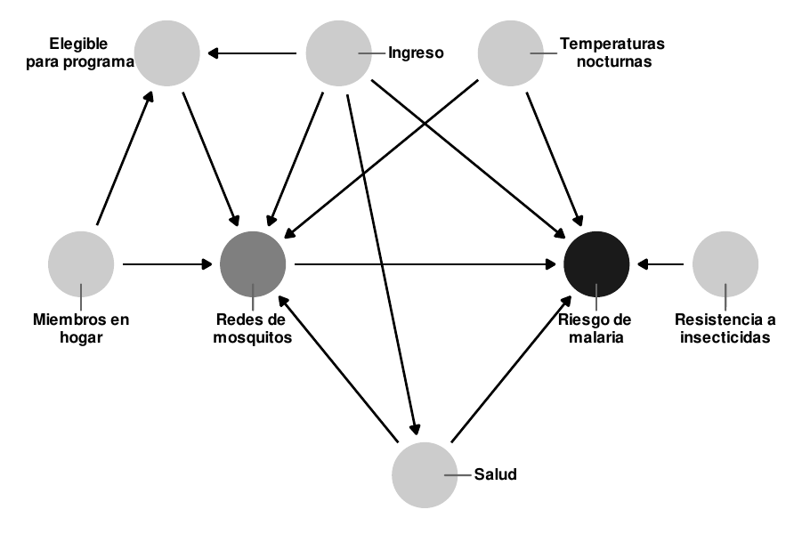
```

El gráfico causal de la figura \@ref(fig:mosquito-dag-plain) esboza la relación completa entre el uso de mosquiteros y el riesgo de malaria. Cada nodo en el DAG es una columna en la base de datos recogida por los investigadores, e incluye lo siguiente:

- Riesgo de malaria (`riesgo_malaria`): La probabilidad de que alguien en el hogar se infecte con malaria. Se mide en una escala de 0-100, con valores más altos que indican un mayor riesgo.
- Mosquitero (`red ` y `red_cant`): Una variable binaria que indica si el hogar utiliza mosquiteros.
- Elegible para el programa (`elegible`): Una variable binaria que indica si el hogar es elegible para el programa de mosquiteros gratuitos.
- Ingresos (`ingreso`): Los ingresos mensuales del hogar, en dólares americanos.
- Temperaturas nocturnas (`temperatura`): La temperatura media nocturna, en grados centígrados.
- Salud (`salud`): La salud de la familia se declarada por sus propios miembros. Medido en una escala de 0-100, con valores más altos que indican mejor salud.
- Número en el hogar (`hogar`): Número de personas que viven en el hogar.
- Resistencia a los insecticidas (`resistencia`): Algunas cepas de mosquitos son más resistentes a los insecticidas y, por lo tanto, suponen un mayor riesgo de infectar a las personas con malaria. Esto se mide en una escala de 0-100, con valores más altos que indican una mayor resistencia.

Según el DAG, el riesgo de contraer malaria es causado por los ingresos, las temperaturas, la salud, la resistencia a los insecticidas y el uso de mosquiteros. Las personas que viven en regiones más cálidas, tienen ingresos más bajos, tienen peor salud, están rodeadas de mosquitos con alta resistencia a los insecticidas y los que no utilizan mosquiteros corren un riesgo mayor de contraer malaria que los que los utilizan. El uso de los mosquiteros se explica por los ingresos, las temperaturas nocturnas, la salud, el número de personas que viven en la vivienda y la elegibilidad para el programa de mosquiteros gratuitos. Las personas que viven en zonas más frescas por la noche, tienen ingresos más altos, mejor salud, tienen más personas en el hogar, y son elegibles para los mosquiteros gratuitos del gobierno, tienen más probabilidades de usar regularmente los mosquiteros. El DAG también muestra que la elegibilidad para el programa de mosquiteros gratuitos se explica por los ingresos y el tamaño de los núcleos familiares, ya que los hogares deben cumplir con umbrales específicos para calificar.

Podemos cargar los datos y usar `glimpse()` para ver las primeras observaciones de cada columna:

```{r load-mosquito-data, message=FALSE, warning=FALSE}
library(tidyverse)
```

```{r}
library(paqueteadp)
data(red_mosquitos)
```

```{r}
glimpse(red_mosquitos)
```

### Verificar las independencias condicionales

Antes de proceder a identificar la relación causal entre el uso de mosquiteros y el riesgo de malaria, debemos comprobar primero si las relaciones definidas por nuestro DAG reflejan la realidad de los datos. Recordemos que la *d*separación implica que los nodos son estadísticamente independientes entre sí y no transfieren información asociativa. Si dibujas el DAG en la Figura \@ref(fig:mosquito-dag-plain) en DAGitty, o si ejecutas `impliedConditionalIndependencies()` en R, puedes ver una lista de todas las independencias condicionales implícitas. 

```{r}
impliedConditionalIndependencies(mosquito_dag)
```

Por motivos de espacio aquí, no verificaremos todas estas independencias implícitas, pero podemos probar algunas de ellas:

- $\text{Salud} \perp \text{Miembros en el hogar}$: La salud debe ser independiente del número de personas en cada hogar. En los datos, las dos variables no deben estar correlacionadas. Este es el caso:

```{r indent="    "}
cor(red_mosquitos$salud, red_mosquitos$hogar)
```

- $\text{Income} \perp \text{Insecticide resistencia}$: Income should be independent of insecticide resistencia. This is again true:

```{r indent="    "}
cor(red_mosquitos$ingreso, red_mosquitos$resistencia)
```

- $\text{Riesgo de malaria} \perp \text{Miembros en el hogar}\ |\ \text{Salud, Ingreso, Uso de la red, Temperatura}$: El riesgo de malaria debe ser independiente del número de miembros de la familia, dado que los niveles de salud, ingresos, uso de mosquiteros y temperaturas nocturnas son similares. No podemos utilizar `cor()` para probar esta implicación, ya que hay muchas variables en juego, pero podemos utilizar un modelo de regresión para comprobar si el número de miembros del hogar está significativamente relacionado con el riesgo de malaria. No es significativo ($t = -0.17$, $p = 0.863$), lo que significa que los dos son independientes, como se esperaba.

```{r indent="    "}
lm(riesgo_malaria ~ hogar + salud + ingreso + red  + temperatura, 
   data = red_mosquitos) %>% 
  broom::tidy()
```

Después de comprobar todas las demás dependencias condicionales, podemos saber si nuestro DAG captura la realidad del sistema completo de factores que influyen en el uso de mosquiteros y el riesgo de malaria. Si hay correlaciones sustanciales y significativas entre los nodos que deberían ser independientes, es probable que haya un problema con la especificación del DAG. Si es así, vuelves a la teoría y refinas más tu DAG.


### Encuentra el set de ajuste

Existe una vía directa entre el uso de mosquiteros y el riesgo de contraer malaria, pero el efecto no se identifica causalmente debido a otras varias vías abiertas. Podemos enumerar todos los caminos y encontrar cuáles tienen flechas que apuntan hacia atrás en el nodo del mosquitero (ejecuta `paths(mosquito_dag)` para ver estos resultados), o podemos dejar que R encuentre los sets de ajuste apropiados automáticamente:

```{r}
adjustmentSets(mosquito_dag)
```

Basándose en las relaciones entre todos los nodos del DAG, el ajuste por salud, ingresos y temperatura es suficiente para cerrar todas las puertas traseras e identificar la relación entre el uso de la red y el riesgo de malaria (ver Figura \@ref(fig:mosquito-dag-adjusted)). Es importante destacar que no tenemos que preocuparnos por ninguno de los nodos relacionados con el programa gubernamental de redes gratuitas, ya que esos nodos no están *d* conectados con el riesgo de malaria. Sólo tenemos que preocuparnos por las relaciones de confusión.

Podemos confirmar esto gráficamente con `ggdag_adjustment_set()`:

```{r plot-mosquito-adjustment-fake, eval=FALSE}
ggdag_adjustment_set(mosquito_dag, shadow = TRUE,
                     use_labels = "label", text = FALSE)
```

```{r mosquito-dag-adjusted, echo=FALSE, fig.cap="Adjustment set to identify the relationship between mosquito red  use and malaria risk", out.width="60%"}
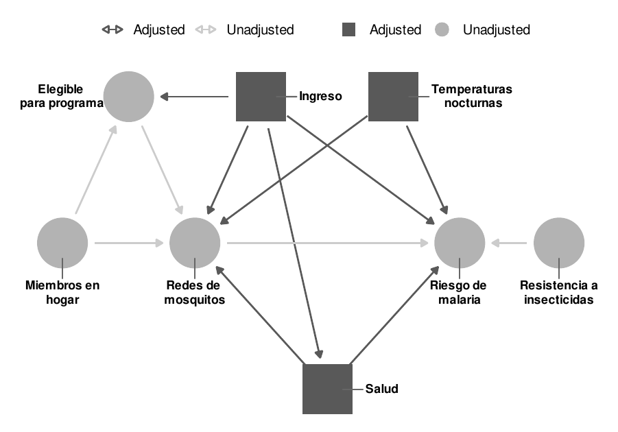
```

### Estimación ingenua no ajustada

Como base de referencia para los otros enfoques de ajuste que intentaremos, podemos ver primero cuál es la relación entre el uso de mosquiteros y el riesgo de malaria en ausencia de cualquier ajuste. Si creamos un cuadro de la distribución del riesgo de malaria entre las personas que usan y no usan mosquiteros, vemos que el riesgo medio es sustancialmente menor entre los que usan mosquiteros (véase la figura \@ref(fig:naive-boxplots)).

```{r naive-boxplots, fig.width=4, fig.height=2.4, fig.cap="Distribución del riesgo de malaria entre quienes usaron y no usaron mosquiteros"}
ggplot(red_mosquitos, aes(x = red , y = riesgo_malaria)) +
  geom_boxplot() +
  cowplot::theme_cowplot(font_size = 11, font_family = "LM Roman 10")
```

Podemos ejecutar un simple modelo de regresión para medir la diferencia promedio exacta:

```{r}
model_naive <- lm(riesgo_malaria ~ red , data = red_mosquitos)

texreg::screenreg(model_naive)
```

Según este modelo, parece que el uso de un mosquitero está asociado con una disminución de 16 puntos en el riesgo de malaria. Sin embargo, este no es el efecto causal. Este es un caso en el que la correlación no es igual a la causalidad. Otros factores como los ingresos, la salud y las temperaturas confunden la relación entre el uso de los mosquiteros y el riesgo.

### Regresiones

Como ya está familiarizado con los modelos de regresión múltiple del capítulo 6, una forma rápida y fácil de tratar de ajustar las variables de confusión es incluirlas como covariables en una regresión lineal. A primera vista, esto tiene sentido intuitivo: el objetivo del ajuste es comparar los nodos de tratamiento y de resultado con los mismos valores de los diversos confusores, y el propósito de la regresión múltiple es explicar la variación del resultado manteniendo constantes las diferentes variables explicativas. Sin embargo, hacer ajustes de confusión con la regresión lineal dará como resultado relaciones causales correctamente identificadas sólo en circunstancias muy específicas. Para que el ajuste basado en la regresión funcione, las relaciones entre todos los nodos de tratamiento, resultado y confusión *deben ser lineales,* lo cual es difícil de probar y verificar con datos de observación reales. Casi siempre es mejor utilizar una de las otras técnicas de ajuste que se describen a continuación (matching o ponderación de probabilidad inversa), ya que esos métodos no se basan en el supuesto de la linealidad.

Con esta *importante advertencia*, podemos ajustar nuestras puertas traseras incluyéndolas en un modelo de regresión:

```{r}
model_regression <- lm(riesgo_malaria ~ red  + ingreso + temperatura + salud, 
                       data = red_mosquitos)

texreg::screenreg(model_regression)
```

Según estos resultados, el uso de un mosquitero *causa* una disminución de 10.44 puntos en el riesgo de paludismo, en promedio. Nótese que debido a que hemos ajustado los confusores, ahora podemos usar justificadamente el lenguaje causal en lugar de hablar simplemente de asociaciones.


### Matching

El principal problema de utilizar datos de observación en lugar de datos experimentales es que las personas que utilizaron un mosquitero lo hicieron sin ser asignadas a un grupo de tratamiento. Las características individuales llevaron a las personas a auto-seleccionarse para el tratamiento, lo que hace que las personas que usaron mosquiteros sean esencialmente diferentes de las que no lo hicieron. Gracias al DAG, conocemos muchos de los factores que causaron que la gente eligiera usar los mosquiteros: ingresos, salud y temperatura. Si pudiéramos agrupar las observaciones que son similares entre sí en cuanto a ingresos, salud y temperatura, pero que difieren en el uso de los mosquiteros, podríamos simular el tratamiento experimental y los grupos de control y, posiblemente, calcular un efecto causal más exacto, ya que estamos encontrando la estimación entre grupos comparables.

En el capítulo 7 se exploró la idea de matching para identificar estudios de casos relevantes en una investigación de métodos mixtos. Allí se crearon puntuaciones de propensión que estimaban la probabilidad de tratamiento, y luego se identificaron casos con puntuaciones de propensión similares (o muy diferentes). Si bien el emparejamiento con los puntajes de propensión es popular, puede causar problemas cuando se utiliza para la identificación causal (véase @KingNielsen:2019). Sin embargo, existen alternativas. Una técnica común es encontrar coincidencias que minimicen la distancia entre los diferentes factores de confusión para cada observación.

Para ilustrar este concepto muy brevemente, considere un modelo causal en el que la edad y la educación son los únicos factores de confusión de la relación entre un tratamiento y un resultado. Algunas de las observaciones se autoseleccionaron en el tratamiento, mientras que el resto no. El panel A de la figura \@ref(fig:matching-example) muestra la distribución del tratamiento auto-seleccionado a través de diferentes valores de edad y educación. Hay algunos patrones notables: sólo una observación tratada tiene más de 25 años de educación, y sólo una tiene menos de 15 años de edad. Si queremos crear grupos sintéticos de tratamiento y control a partir de estos datos, no tendría sentido comparar la única observación tratada de alto nivel educativo con observaciones no tratadas de bajo nivel educativo, ya que las dos observaciones tienen niveles muy diferentes de educación. Idealmente, queremos encontrar la observación altamente educada no tratada más cercana y usarla como comparación con la única observación altamente educada tratada. 

Si podemos encontrar un conjunto de observaciones sin tratar que estén cerca en distancia de las observaciones tratadas, podemos crear un grupo equilibrado de observaciones tratadas y no tratadas. El panel B de la figura \@ref(fig:matching-example) muestra cada uno de los pares más cercanos de observaciones tratadas y no tratadas. Podemos descartar cualquier observación sin tratar y sólo usar el grupo emparejado para hacer nuestra inferencia causal, ya que ahora aparentemente tenemos grupos de tratamiento y control comparables. Hay múltiples maneras de medir esta distancia - Mahalanobis y distancia euclidiana son comunes, pero no son los únicos métodos. También hay múltiples métodos para definir pares. En la figura \@ref(fig:matching-example), cada observación tratada se empareja con una única observación no tratada, pero también es posible permitir la duplicación y triplicación de los emparejamientos. El ejemplo de la figura \@ref(fig:matching-example) minimiza la distancia entre dos dimensiones de las variables de confusión (edad y educación), pero se pueden utilizar tantas variables de confusión como sea necesario para crear pares de coincidencia.

```{r matching-example, echo=FALSE, fig.cap="Matching basado en la distancia Mahalanobis del vecino más cercano"}
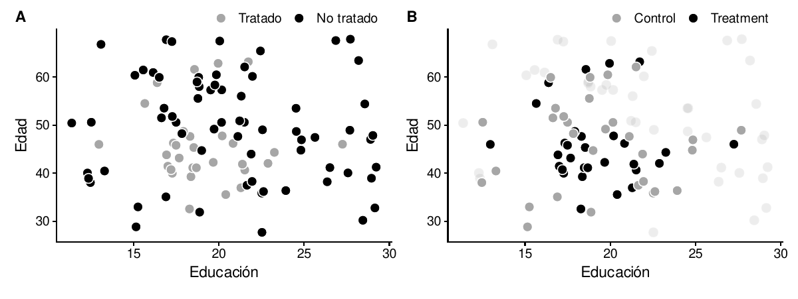
```

Podemos usar matching para ajustar los factores de confusión en nuestro DAG con la relación entre usar la red de mosquitos y el riesgo de malaria. La función `matchit()` en el paquete `Matchit` proporciona muchos métodos de emparejamiento diferentes, incluyendo la concordancia de Mahalanobis del vecino más cercano. No hay un método de concordancia que sea necesariamente el mejor, y deberás jugar con las diferentes opciones para los argumentos de `method` y `distance`. El argumento `replace = TRUE` permite que las observaciones tratadas se emparejen con más de una observación no tratada. 

La función `matchit()` utiliza una sintaxis familiar basada en fórmulas para definir cómo hacer coincidir la asignación con los mosquiteros. Debido a que nuestro set de ajuste incluye ingresos, temperatura y salud, usamos las tres para crear las coincidencias.

```{r}
library(MatchIt)

matched <- matchit(red ~ ingreso + temperatura + salud, 
                   data = red_mosquitos,
                   method = "nearest", distance = "mahalanobis", replace = TRUE)
```

```{r eval=F}
matched
```

```{r echo=F}
custom_print_matchit <- function(x, custom_call, digits = getOption("digits"), ...){
  cat("\nCall: ", custom_call, sep = "\n")
  cat("\nSample sizes:\n")
  print.table(x$nn, ...)
  invisible(x)
  cat("\n")
}

custom_call <- deparse(matched$call)

custom_call[1] <- str_replace(custom_call[1], ", data", ",\n        data")
custom_call[2] <- str_replace(custom_call[2], "    method", "        method")

custom_print_matchit(matched, custom_call)
```


Según el resultado de `matched`, las 681 observaciones tratadas (es decir, las que utilizaron mosquiteros) se emparejaron con 439 observaciones no tratadas (es decir, personas que son similares en cuanto a ingresos, temperatura nocturna y salud, pero que no utilizaron mosquiteros). 632 observaciones no tratadas no fueron emparejadas y serán descartadas. Si hubiéramos usado `replace = FALSE`, habría habido un número igual de observaciones tratadas y no tratadas; hay menos observaciones no tratadas aquí porque algunas se duplican o triplican.

Podemos crear una nueva base de datos basada en este matching con la función `match.data()`. Observa cómo ahora hay sólo 1120 filas en lugar de 1752, ya que hemos descartado las observaciones no emparejadas. También nota que hay una nueva columna llamada `weights`. La función `matchit()` asigna a los pares de observaciones emparejadas diferentes pesos dependiendo de lo cerca o lejos que estén los emparejamientos en un intento de controlar la variación de la distancia. Podemos utilizar estos pesos en nuestro modelo de regresión para mejorar nuestra estimación del efecto causal.

```{r}
red_mosquitos_matched <- match.data(matched)

glimpse(red_mosquitos_matched)
```

Por último, podemos hacer una regresión usando los datos emparejados:

```{r}
model_matched <- lm(riesgo_malaria ~ red , data = red_mosquitos_matched, 
                    weights = weights)

texreg::screenreg(model_matched)
```

Según estos resultados, el uso de un mosquitero *causa* una disminución de 10.49 puntos en el riesgo de malaria, en promedio. Una vez más, podemos utilizar el lenguaje causal ahora porque hemos ajustado los confusores al hacer la comparación, identificando así el camino causal entre el uso de mosquiteros y el riesgo de malaria.

### Ponderación de probabilidad inversa

Una desventaja del uso de matching es que desechamos mucha información: las observaciones no coincidentes se descartan, y el tamaño de nuestra muestra puede reducirse significativamente. El emparejamiento también tiende a ser muy riguroso, ya que cada observación tratada debe ser emparejada con una (o más) observaciones no tratadas. Miren el Panel B en la Figura \@ref(fig:matching-example) y noten que algunas observaciones no tratadas están en realidad muy cerca de las observaciones tratadas, pero aún así se descartan porque fueron superadas por observaciones que tienen una distancia ligeramente menor. 

En lugar de desechar datos potencialmente útiles, podemos utilizar otros métodos para crear coincidencias que sean menos rigurosas pero más informativas. Un método común en epidemiología y bioestadística es la ponderación de probabilidad inversa (IPW, en inglés). En la IPW, a cada observación se le asigna un peso basado en lo bien que su asignación real al tratamiento coincide con la probabilidad prevista del tratamiento, y esos pesos se utilizan luego en un modelo de regresión para estimar el efecto causal del tratamiento en el resultado.

Podemos ilustrar este proceso con el ejemplo de educación y edad de la figura \@ref(fig:matching-example). En lugar de emparejar por matching, utilizamos una regresión logística para crear puntuaciones de propensión al tratamiento:

```{r}
data("edad_educ") # desde el paquete "paqueteadp"
```

```{r}
edad_educ <- edad_educ %>% 
  mutate(tratamiento = factor(tratamiento))

model_tratamiento <- glm(tratamiento ~ educacion + edad, data = edad_educ,
                       family = binomial(link = "logit"))

edad_educ_propensiones <- broom::augment_columns(
  model_tratamiento, edad_educ, type.predict = "response"
) %>% 
  rename(propension = .fitted)
```

Podemos mirar unas pocas filas en los datos para ver estos puntajes de propensión (o propensity scores). La persona 59 tenía una probabilidad del 14% de auto-seleccionarse para el tratamiento dada su educación y edad, pero terminó no haciendo el tratamiento, como se predijo. La persona 27, por otro lado, también tenía una probabilidad del 14% de elegir el tratamiento y lo hizo, lo cual es un resultado bastante improbable. Esa elección es inesperada!

```{r}
edad_educ_propensiones %>% 
  select(codigo, tratamiento, educacion, edad, propension) %>% 
  slice(59, 27)
```

Con matching, estábamos interesados en emparejar las observaciones inesperadas y esperadas, recordemos que necesitábamos encontrar una observación no tratada altamente educada para emparejarla con la única observación tratada altamente educada. Hacemos lo mismo aquí. Las observaciones que es improbable que reciban tratamiento y luego no lo reciben siguen nuestras expectativas y deberían tener menos peso. Por el contrario, las observaciones que con poca probabilidad recibirán tratamiento  deberían tener más peso. La ponderación de la probabilidad inversa nos permite asignar un valor numérico a lo inesperado de las observaciones. Utilizamos la siguiente fórmula para calcular los pesos de probabilidad inversa para un efecto medio del tratamiento, donde $\text{Tratamiento}$ es una variable binaria 0/1:[^ipwate]

$$
\frac{\text{Tratamiento}}{\text{Propensión}} + \frac{1 - \text{Tratamiento}}{1 - \text{Propensión}}
$$

[^ipwate]: Hay muchas otras versiones de ponderaciones de probabilidad inversa que tienen por objeto estimar otras cantidades causales, como el promedio de tratamiento en el efecto tratado, el promedio de tratamiento entre el efecto igualado y el promedio de tratamiento entre el efecto de la población superpuesta. Vale la pena ver esta entrada en el blog de Lucy D'Agostino McGowan para más detalles: [https://livefreeordichotomize.com/2019/01/17/understanding-propension-score-weighting/](https://livefreeordichotomize.com/2019/01/17/understanding-propension-score-weighting/)

Podemos agregar pesos de probabilidad inversa a nuestros puntajes de propensión pronosticados con `mutate()`. Compara los valores de `ipw` de las personas 59 y 27. Recuerde que la persona 59 tenía una baja probabilidad de seleccionar en el tratamiento y no lo hizo, como se esperaba. Su peso de probabilidad inversa es sólo 1.17. La persona 27, por otro lado, tenía una baja probabilidad de estar en el tratamiento y sin embargo superó las probabilidades y se unió al tratamiento, en contra de lo esperado. En consecuencia, tienen un alto peso de probabilidad inversa de 6.78.

```{r}
edad_educ_peso_invertido <- edad_educ_propensiones %>% 
  mutate(peso_invertido = (num_tratamiento / propension) + 
           (1 - num_tratamiento) / (1 - propension))

edad_educ_peso_invertido %>% 
  select(codigo, tratamiento, educacion, edad, propension, peso_invertido) %>% 
  slice(59, 27)
```

Dado que cada observación en la base de datos tiene una puntuación de probabilidad inversa, no necesitamos desechar ningún dato. En su lugar, podemos ponderar cada observación por su puntuación de probabilidad inversa. La figura \@ref(fig:ipw-example) muestra los datos completos con los puntos dimensionados por su IPW. Las observaciones que cumplen las expectativas reciben menos peso que las que se comportan de forma contraria a las expectativas.

```{r plot-ipw-example-fake, eval=FALSE}
ggplot(edad_educ_peso_invertido, aes(x = educacion, y = edad, 
                        color = tratamiento, size = peso_invertido)) +
  geom_point()
```

```{r ipw-example, echo=FALSE, fig.cap="Observaciones dimensionadas por pesos de probabilidad inversa", out.height="100%"}
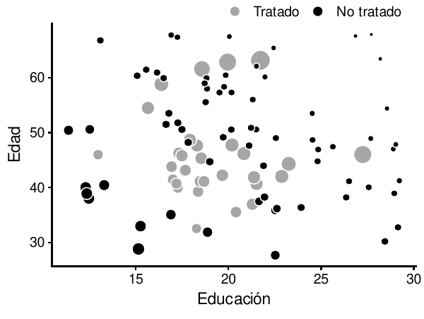
```

Podemos ajustar los factores de confusión de nuestro mosquitero y el ejemplo de riesgo de malaria usando una ponderación de probabilidad inversa. Primero, usamos una regresión logística para predecir la propensión a usar un mosquitero usando los ingresos, la temperatura y la salud. Luego usamos los puntajes de propensión para calcular los pesos de probabilidad inversa usando esta fórmula:

$$
\frac{\text{Mosquitero}}{\text{Propensión}} + \frac{1 - \text{Mosquitero}}{1 - \text{Propensión}}
$$

```{r}
model_red_mosquitos <- glm(red  ~ ingreso + temperatura + salud, 
                          data = red_mosquitos,
                          family = binomial(link = "logit"))

red_mosquitos_ipw <- broom::augment_columns(model_red_mosquitos,
                                            red_mosquitos,
                                            type.predict = "response") %>% 
  rename(propension = .fitted) %>% 
  mutate(peso_invertido = (red_cant / propension) + (1 - red_cant) / (1 - propension))
```


Ahora que tenemos pesos de probabilidad inversa, podemos usarlos en una regresión:

```{r}
model_peso_invertido <- lm(riesgo_malaria ~ red , data = red_mosquitos_ipw, 
                weights = peso_invertido)

texreg::screenreg(model_peso_invertido)
```

Según este modelo de IPW, el uso de un mosquitero *causa* una disminución de 10.13 puntos en el riesgo de malaria, en promedio. Una vez más, podemos utilizar con seguridad el lenguaje causal porque hemos identificado el camino causal entre el uso de mosquiteros y el riesgo de malaria teniendo en cuenta los factores de confusión en los pesos de probabilidad inversos.


### Comparando todos los métodos

Ahora que hemos ejecutado varios modelos de regresión que se ajustan a los factores de confusión de diferentes maneras, podemos comparar los resultados todos juntos. La ingenua estimación de -16 parece ser definitivamente una sobreestimación: después de ajustar con la regresión, el matching y la ponderación de probabilidad inversa, el efecto causal del uso de un mosquitero en el riesgo de malaria es consistentemente de alrededor de -10. Asumiendo que nuestro DAG está correcto, encontramos con éxito un efecto causal a partir de datos no experimentales y observacionales.

```{r}
texreg::screenreg(list(model_naive, model_regression, model_matched, model_peso_invertido),
                  custom.model.names = c("Naive", "Regresión", "Matching", "IPW"))
```


> **Ejercicio 10B**: En el ejercicio 10A, dibujaste un DAG que modeló la relación causal entre la diversidad étnica y la desigualdad social. En este ejercicio utilizarás el set de ajustes de ese DAG para intentar estimar el efecto causal de esa relación. Haz lo siguiente:
> 
> 1. Carga la base de datos de `bienestar` del paquete del libro:
>
>    ```{r eval=FALSE}
>    library(paqueteadp)
>    data("bienestar")
>    ```
>
>    Tu variable dependiente es el índice de Gini (`gini`). Tu variable de tratamiento es la diversidad étnica (`diversidad_etnica`), una variable binaria que es 1 si entre el 20-80% de la población es étnicamente diversa (y 0 si no).
> 
> 2. Use el DAG que hiciste anteriormente para determinar el ajuste mínimo suficiente. ¿Qué nodos deben ser ajustados para asegurar que se identifique el camino entre la diversidad étnica y la desigualdad?
> 
> 3. Construye un modelo de correlación no causal (que llamamos de ingenuo o naive) para probar la relación entre la diversidad y la desigualdad (es decir, `lm(gini ~ diversidad_etnica, data = bienestar)`). ¿Cómo se asocia la diversidad con la desigualdad? ¿Por qué esta estimación no es causal?
> 
> 4. Usar una regresión múltiple para cerrar las puertas traseras. Incluya las variables de tu set de ajuste como variables explicativas en un modelo de regresión.
>
> 5. Usa matching para cerrar las puertas traseras. Usa las variables de tu set de ajuste para hacer coincidir la asignación de las observaciones con el tratamiento, luego usa las observaciones emparejadas en un modelo de regresión.
>
> 6. Usa la ponderación de probabilidad inversa para cerrar las puertas traseras. Usa las variables de tu conjunto de ajustes para generar puntuaciones de propensión para la asignación al tratamiento, y luego crea ponderaciones de probabilidad inversas y usa esas ponderaciones en un modelo de regresión.
> 
> 7. ¿Cómo se comparan estos efectos ajustados con el modelo "ingenuo"? ¿Cuánta confianza tienes en que estos son efectos causales? ¿Por qué? ¿Qué podría hacer para mejorar su identificación causal?


## CConsejos finales

Los DAG son herramientas poderosas para incorporar la teoría y la filosofía de tu modelo causal en la estimación estadística de la relación entre tratamiento y control. Sin embargo, diseñar un DAG no te garantiza automáticamente la capacidad de hablar con lenguaje causal. Los gráficos causales no resuelven el problema fundamental de la inferencia causal, no crean una máquina del tiempo que permita ver los resultados en un mundo contrafactual. 
El supuesto central cuando se utilizan los DAG es que es posible identificar y aislar completamente una relación causal utilizando sólo datos observables. Los críticos de este supuesto a menudo desprecian este enfoque de selección de datos observables. Si se omite un nodo importante porque no es observable, la estimación causal será incorrecta y sesgada, independientemente de si se utiliza matching, la ponderación de probabilidad inversa o cualquier otro método para aislar relaciones entre nodos. 

Los nodos en los DAG pueden representar variables observables reales en una base de datos, pero no siempre es así. Recordemos que los gráficos causales codifican nuestra filosofía del proceso de generación de datos: cada nodo representa algún fenómeno que tiene alguna influencia en algún punto de la cadena de eventos que finalmente causa el tratamiento y el resultado. Los nodos no necesitan ser medibles. En la figura \@ref(fig:money-votes-complex) incluimos un nodo para la historia del distrito electoral, que influye tanto en la dinámica de los partidos como en las características del distrito. Es imposible destilar toda la historia de un distrito en un solo número en un conjunto de datos. Podríamos intentar hacerlo dividiendo el nodo de "historia" en componentes más pequeños (y más mensurables), como el partido de los candidatos anteriores, las decisiones sobre los límites del distrito o la riqueza de los dirigentes y partidarios del partido, pero incluso así, debemos sentirnos cómodos declarando que estos nodos más pequeños representan toda la historia de un distrito. Es una suposición difícil. 

Contrariamente a las críticas al enfoque de selección sobre observables inherente a los gráficos causales, la presencia de nodos inobservables en un DAG no impide que los utilicemos para aislar e identificar los efectos causales. Debido a la lógica de la *d*separación - y a la forma en que hemos dibujado las flechas en el DAG, podemos excluir la historia inobservable de un distrito en la Figura \@ref(fig:money-votes-complex) porque su nodo está bloqueado por los nodos de distrito y partido. Si creemos que nuestro DAG es correcto y que estos dos nodos son de hecho suficientes para bloquear toda la variación no medida del nodo de la historia, podemos proceder con seguridad a estimar el efecto causal. Si la historia inobservable de un distrito pasa de las asociaciones estadísticas a la recaudación de fondos de campaña o el total de votos a través de otras vías no bloqueadas, no podremos identificar el efecto causal con datos observacionales. 

Al final, tus estimaciones causales son tan buenas como sea tu DAG. Si accidentalmente omites nodos de varaibles de confusión, o si no puede medir los nodos de confusión, o si incluyes nodos que son colisionadores, los resultados serán erróneos. Además, las relaciones entre los nodos observados y no observados podrían ser demasiado complejas para ser resueltas usando el ajuste de cálculo *hacer*. A menos que estés completamente seguro de que tu DAG refleja el proceso real de generación de datos y la teoría subyacente del fenómeno que estás estudiando y que los ajustes que hagas son suficientes para identificar la relación causal, evita siempre confiar demasiado en los resultados y mantén una actitud de incertidumbre.