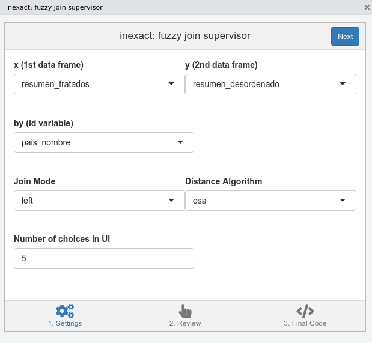
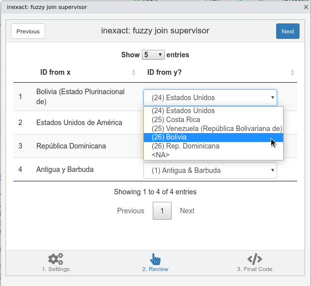
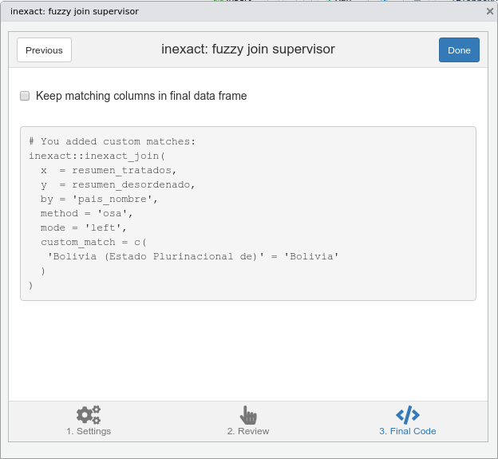
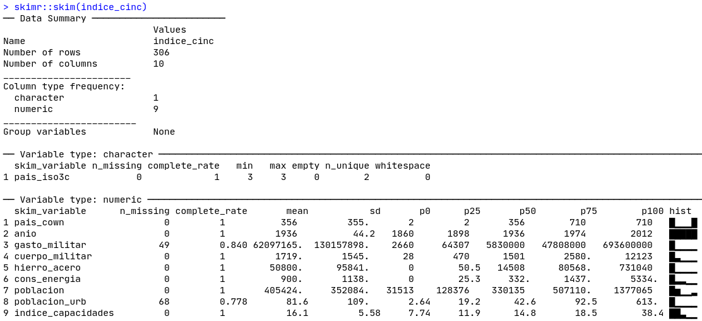
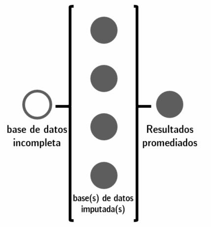
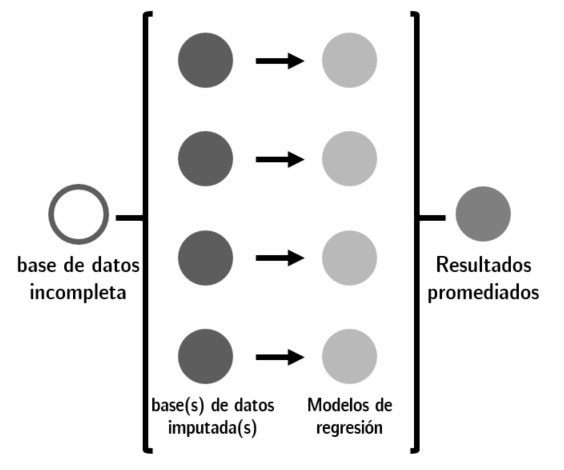

# (PART) Aplicaciones {-}

# Manejo avanzado de datos políticos {#adv-data}

Andrés Cruz^[E-mail: arcruz\@uc.cl] y Francisco Urdinez^[E-mail: furdinez\@uc.cl]

### Lecturas sugeridas {-}

- Graham, B. A., & Tucker, J. R. (2019). The international political economy data resource. *The Review of International Organizations, 14*(1), 149-161.

- Lall, R. (2016). How multiple imputation makes a difference. *Political Analysis, 24*(4), 414-433.

### Los paquetes que necesitas instalar {-}

- `tidyverse` [@R-tidyverse], `paqueteadp` [@R-paqueteadp], `skimr` [@R-skimr], `countrycode` [@R-countrycode], `stringdist` [@R-stringdist], `naniar` [@R-naniar], `mice` [@R-mice], `remotes` [@R-remotes], `inexact` [@R-inexact].

## Introducción

En el presente capítulo abordaremos dos problemas comunes que surgen cuando se utilizan datos de fuentes diferentes. El primero de ellos consiste en unir bases de datos, proceso que a menudo se aborda utilizando una o varias variables de identificación (por ejemplo, el nombre de un país, el código oficial de una unidad subnacional, un código creado por uno mismo). En algunos casos, cuando las variables de identificación están bien normalizadas, el proceso se vuelve sencillo. Por ejemplo, en las bases de datos oficiales del gobierno, los países tienen un código único. En todos ellos el Brasil será "BRA", y Chile será "CHI", lo que facilita el trabajo en R. 

Sin embargo, en el mundo real, las diferentes fuentes de datos no están hechas para trabajar juntas. Después de mirar una herramienta para estandarizar los códigos de país, `countrycode`, mostraremos una solución general, la unión *fuzzy* o inexacta de datos. Considere el siguiente escenario: su principal base de datos tiene una variable llamada `country`, donde Brasil está codificado en mayúsculas como "BRAZIL". Entonces, quieres unir tus datos con los del Banco Mundial, donde la información de Brasil está etiquetada como "Brazil". Hay casos extremos, como la diferencia entre "Venezuela" y su nombre oficial, "República Bolivariana de Venezuela". Es probable que se enfrente a este tipo de diferencias en los países de su base de datos. ¿Cómo podemos resolver este rompecabezas de una manera rápida y efectiva?

El segundo problema es que, en la mayoría de los casos, nuestras bases de datos contienen valores perdidos. Esto ocurre por múltiples razones: error de codificación, gobiernos que no registran la información, etcétera. En la subsección, aprenderá cómo R registra y trabaja con los valores perdidos, además de algunas herramientas que permiten explorarlos en sus bases de datos. Un tema específico que abordaremos es el de las imputaciones. Cuando en una regresión hay valores perdidos, R simplemente elimina la observación que tiene el valor perdido, ya sea en su variable dependiente, variable independiente o controles (esta eliminación se llama *listwise deletion*). Imaginemos que queremos comparar diez países de América Latina en la evolución de sus tasas de desempleo entre 2008 y 2018, y sin embargo uno de ellos no tiene datos para el trienio 2011-2013. ¿Podemos, tal vez, llenar esos valores "adivinando" los valores no observados? Este proceso recibe el nombre de imputación.

La decisión de imputar o no es una decisión del investigador. La imputación será adecuada dependiendo de si los datos faltan de forma **aleatoria** o no. Este dilema está presente cuando los datos se usan para hacer gráficos de tendencia temporal y no queremos que estén incompletos. Además, en algunos modelos avanzados, como los espaciales, el hecho de tener valores perdidos puede inhibirnos de usar comandos. Para estos casos, podemos considerar la imputación de datos. Hacer esto tiene un costo ya que, como toda solución, no es perfecta.

A lo largo de este capítulo utilizaremos la base de datos de tratados internacionales creada por [Carsten Schulz](https://www.carstenschulz.eu/) basada en el [repositorio de tratados internacionales existentes de las Naciones Unidas] (https://tratados.un.org/). Este repositorio alberga todos los tratados internacionales celebrados entre Estados, con sus textos e información sobre los firmantes. La base de datos del ejemplo se simplifica, ya que sólo tiene cuatro tratados internacionales en lugar de los cientos que utiliza Schulz para estudiar las razones que motivan la decisión de un país de adherirse a un acuerdo internacional. 

Comencemos cargando la base de datos de nuestro paquete, `paqueteadp`:

```{r}
library(tidyverse)
```

```{r}
library(paqueteadp)
```

```{r}
data("tratados")
```

Ahora, la base de datos ha sido cargado en nuestra sesión de R.

```{r}
ls()
```

La unidad de análisis de la base de datos es el país del tratado. Cada observación contiene información sobre el proceso de incorporación del tratado a nivel nacional, es decir, de su firma y ratificación. Estas acciones se clasifican en la variable `accion_tipo`, que va acompañada de la variable `accion_anio`. Esta última registra el año en que se llevó a cabo cada acción. Echemos un vistazo a la base de datos con `glimpse()`:

```{r}
glimpse(tratados)
```

Nuestra base de datos sólo contiene información de 31 países americanos y sus respuestas (firma, ratificación) a cuatro tratados pertinentes de los años 90. 

- El Tratado de Prohibición Completa de los Ensayos Nucleares (1996).

- El Protocolo de Kyoto de la Convención Marco de las Naciones Unidas sobre el Cambio Climático (1997). 

- El Convenio de Rotterdam sobre el procedimiento de consentimiento fundamentado previo aplicable a ciertos plaguicidas y productos químicos peligrosos objeto de comercio internacional (1998) 

- El Estatuto de Roma, acto constitutivo de la Corte Penal Internacional (1998). 

Así, para cada tratado tenemos 62 observaciones (31 países, 2 respuestas posibles para cada uno):

```{r}
tratados %>% 
  count(nombre_tratado)
```

## Uniendo bases de datos

Un ejercicio común en los estudios de observación es unir bases de datos de diferentes fuentes. Supongamos que, por ejemplo, tenemos el siguiente resumen sobre cuántos tratados de la muestra han sido firmados o ratificados por cada país:

```{r}
resumen_tratados <- tratados %>% 
  group_by(pais_nombre) %>% 
  summarize(
    # Encontraremos los que no faltan con !is.na()
    sum_signed = sum(accion_tipo == "Firma" & !is.na(accion_anio)),
    sum_ratif  = sum(accion_tipo == "Ratificación" & !is.na(accion_anio))
  )

resumen_tratados
```

Al explorar la base de datos, un caso interesante es el de los Estados Unidos, que firmó los cuatro tratados pero no los ratificó:

```{r}
resumen_tratados %>% 
  filter(pais_nombre == "Estados Unidos")
```

Sería interesante explorar la relación entre las respuestas de los países a los tratados y algunas otras variables sobre ellos. A modo de ejemplo, cargaremos datos en panel con información sobre el PIB per cápita con paridad de cambio, según el Banco Mundial.

```{r}
data("pib_pc_america")
```

Tenemos información de los 31 países de interés entre 1996 y 1998:

```{r}
pib_pc_america %>% 
  count(pais_nombre)

pib_pc_america %>% 
  count(anio)
```

Con esta base de datos, obtenemos el cambio medio del PIB per cápita con paridad de poder adquisitivo para el período 1996-1998:

```{r}
resumen_pib <- pib_pc_america %>% 
  group_by(pais_nombre) %>% 
  summarize(mean_pib_pc = mean(pib_pc))
```

Ahora tenemos dos bases de datos de resumen, `resumen_tratados` y `resumen_pib`, ambos a nivel de país. ¿Cómo podemos unir su información? En este caso particular, ambos tienen 31 filas (observaciones). Una opción que hay que evitar es simplemente pegar una base de datos junto a la otra (por ejemplo, con la función `bind_cols()`). En algunos casos, esta opción puede ser una buena idea, pero suele ser una elección arriesgada: es difícil saber si ambas bases de datos están ordenadas exactamente de la misma manera necesaria para unirlas correctamente, especialmente cuando el número de observaciones es grande. Por lo tanto, normalmente queremos guiar la unión por una o más variables de identificación presentes en ambas bases de datos. En este caso, la columna `pais_nombre` puede guiar la unión: queremos añadir información sobre el PIB a nuestra base de datos si y sólo si hay un *match* exacto entre sus nombres de países. 

En el código, podemos añadir nuevas variables a nuestra base de datos de otro con `left_join()`^[Esta forma de unir bases de datos, conocida como `left join`, es particularmente común. En algunos casos específicos, podríamos necesitar otros tipos de uniones, más avanzadas. Te recomendamos que revises este prolífico [resumen escrito por Jenny Bryan](https://stat545.com/join-cheatsheet.html)]:

```{r}
resumen_completo <- left_join(x = resumen_tratados, y = resumen_pib,
                              # Podemos proporcionar explícitamente la identificación 
                              #nombre variable:                             
                              by = "pais_nombre")
```

Este código dará los mismos resultados usando pipes:

```{r eval=F}
resumen_completo <- resumen_tratados %>% 
  left_join(resumen_pib, by = "pais_nombre")
```

```{r}
resumen_completo
```

También es posible unir bases de datos utilizando más de una variable de identificación. Por ejemplo, podríamos unir nuestras bases de datos originales, `tratados` y `pib_pc_america`, ambos con la unidad de observación del año del país. Sin embargo, hay una particularidad. En ambos casos, la variable país se llama `pais_nombre`, pero el nombre de la variable año no es el mismo: en el primero, el nombre es `anio_adopcion` (para la fecha original del tratado), y en el segundo es `anio`. Podemos proporcionar fácilmente esta información a `left_join()` con el argumento `by =`:

```{r}
tratados_con_pib <- tratados %>% 
  left_join(pib_pc_america, 
            by = c("pais_nombre", "anio_adopcion" = "anio"))
```

Así pues, a la base de datos original de los "tratados", que tenía 248 observaciones y 5 columnas, añadimos la columna adicional con información sobre el PIB per cápita con paridad de tipos de cambio para cada año de participación en el tratado:

```{r}
tratados_con_pib
```

> **Ejercicio 11A.** Descargue el [World Economics and Politics (WEP) Dataverse](https://ncgg.princeton.edu/wep/dataverse.html) y elija diez variables de país-año, incluyendo tanto las características institucionales como económicas de los estados como nuevas variables que se añadirán a `tratados_con_pib` y unirlas. ¿Fue fácil encontrar los identificadores únicos (códigos, nombres)?

## Estandarizando los códigos de país

Puedes notar que los nombres de los países en las bases de datos con los que estamos trabajando son muy particulares. Por ejemplo, Bolivia es "Bolivia (Estado Plurinacional de)" y la República Dominicana es "República Dominicana (la)". Estos son sus nombres oficiales para la comunidad internacional. Probablemente queramos unirlos con datos de otras fuentes que no tienen los mismos nombres: podemos tener "Bolivia", "Estado Plurinacional de Bolivia", "Plurinational State of Bolivia", etcétera. Para estos casos, que son muy comunes para los que estudian política comparada y relaciones internacionales, la mejor opción es tener *códigos estandarizados*, algo que también podemos encontrar para las divisiones subnacionales y otros tipos de unidades de análisis. 

La mayor parte de la codificación reduce sustancialmente los nombres de los países a un puñado de caracteres y/o números. En general, éstos provienen de organizaciones internacionales o de grandes proyectos académicos que los apoyan. El paquete de `countrycode` nos permite transformar diferentes codificaciones y estándares con facilidad, lo que nos ayuda en las operaciones posteriores con las bases de datos.
```{r}
library(countrycode)
```

Después de cargar el paquete, podemos comprobar en el archivo de ayuda `?codelist` las diferentes codificaciones permitidas. Después de esto, usando nuestra variable inicial y la función `countrycode()`, crearemos una variable con códigos estandarizados. `iso2c` y `iso3c` son algunas de las codificaciones más comunes, que reducen los países a 2 o 3 caracteres, según la ISO (Organización Internacional de Normalización). Mientras tanto, `cown` y `imf` utilizan codificaciones numéricas relativamente comunes en las ciencias sociales, que provienen del proyecto Correlates of War y del Fondo Monetario Internacional, respectivamente[^`countrycode` permite muchas otras codificaciones utilizadas en nuestra disciplina, algunas más completas que otras. Dos de ellas, que prevalecen en las ciencias políticas, son las de Polity IV y el proyecto Varieties of Democracy (V-Dem). Le recomendamos que revise el archivo de ayuda `?codelist` para más información.]

```{r}
resumen_completo_con_codigos <- resumen_completo %>% 
  mutate(
    pais_iso2c = countrycode(pais_nombre, 
                             origin = "un.name.es", destination = "iso2c", 
                             custom_dict = codelist),
    pais_iso3c = countrycode(pais_nombre, 
                             origin = "un.name.es", destination = "iso3c", 
                             custom_dict = codelist),
    pais_iso3c = countrycode(pais_nombre, 
                             origin = "un.name.es", destination = "cown", 
                             custom_dict = codelist),
    pais_iso3c = countrycode(pais_nombre, 
                             origin = "un.name.es", destination = "imf", 
                             custom_dict = codelist),
  )
```

```{r}
resumen_completo_con_codigos %>% 
  select(starts_with("pais_"))
```

Tener una base de datos con al menos un código de normalización es particularmente útil, ya que a menudo reduce la fricción de unir nuestros datos con otros. El `countrycode`, entonces, es una buena herramienta para pre-procesar las bases de datos con la información del país antes de unirlos.

## La unión borrosa o inexacta de los datos

Aunque el `country code` ayuda enormemente en algunos casos, no siempre es lo suficientemente flexible. A veces, en lugar de necesitar traducir entre codificaciones, no tenemos un estándar para guiar la unión, es todo un desastre. Piensa en los nombres de las personas: en una base datos de ex-presidentes de Brasil, la misma persona puede ser codificada como `Lula`, `Luiz Inácio Lula da Silva`, `Lula da Silva`. ¿Y si la persona se cambió el nombre o se le conoce por un apodo? El legislador chileno José Manuel Ismael Edwards Silva es conocido como Rojo Edwards. Estos problemas del mundo real pueden causar grandes dolores de cabeza a los que trabajan con datos políticos. La unión difusa es la solución para estas situaciones.

Carguemos una base de datos igual a nuestro anterior `resumen_pib`, pero con nombres desordenados en los países:

```{r}
data("resumen_desordenado")
```

```{r}
unique(resumen_desordenado$pais_nombre)
```

Los nombres de esta base de datos no corresponden a ninguna normalización, sino que son el resultado de una codificación manual. Un ejemplo claro es la abreviatura de "Rep. Dominicana". ¿Qué pasaría si unimos nuestra base de datos `resumen_tratados` con una base de datos confuso como este?

```{r}
resumen_tratados %>% 
  left_join(resumen_desordenado, by = "pais_nombre")
```

Como pueden observar, la unión falla para las observaciones múltiples porque no se encuentra una coincidencia exacta para la variable de identificación. Ese es el caso de "Antigua y Barbuda" en la base de datos original, y "Antigua & Barbuda" en el adicional. R considera que son unidades diferentes. Intuitivamente, estos valores son similares, pero R no puede adivinar o asumir sin nuestras instrucciones precisas. 

Afortunadamente, tenemos una solución para este tipo de casos, así como con situaciones similares para nombres de políticos, partidos políticos, empresas o regiones. La intuición inicial es la siguiente: Las cadenas de texto `Antigua y Barbuda` y `Antigua & Barbuda` son similares. Comparten letras, tienen longitudes similares, etcétera. Ambas tienen más en común que, por ejemplo, el par "Antigua y Barbuda" y "Argentina". Los científicos de la computación, reconociendo este hecho, han desarrollado múltiples algoritmos para asignar un puntaje de diferencia entre dos cadenas de texto, cualquiera que sea. La mayoría de estos algoritmos asignan un valor de 0 cuando las cadenas son iguales, y luego aumenta de acuerdo a su disimilitud.

Basándonos en lo anterior, podríamos calcular las distancias entre todos los posibles pares de cadenas en nuestras dos variables de identificación. Luego, podríamos recuperar los valores más bajos para hacer los pares, y finalmente, podríamos realizar un *`fuzzy join`*. Como ejemplo, usaremos el paquete `stringdist` para generar una matriz con todas estas distancias para nuestros dos bases de datos:

```{r eval=F}
library(stringdist)
stringdistmatrix(resumen_tratados$pais_nombre,
                 resumen_desordenado$pais_nombre, 
                 # Usaremos el algoritmo por defecto, llamado "osa" o
                 # "Alineación óptima de las cuerdas"
                 method = "osa", 
                 useNames = T)
```

```{r echo=F}
options(max.print = 16)
library(stringdist)
stringdistmatrix(resumen_tratados$pais_nombre,
                 resumen_desordenado$pais_nombre, 
                 method = "osa", 
                 useNames = T)[1:4, 1:4]
options(max.print = 20)
```

Mirando la primera fila, podemos ver que la cadena "Antigua y Barbuda" obtiene una puntuación de 1 en comparación con "Antigua & Barbuda", mientras que recibe una puntuación de 14 en comparación con "Argentina".

Aunque los algoritmos disponibles en `stringdist` son robustos, no son infalibles, y la supervisión humana es a menudo necesaria. 

Para realizar un *fuzzy join* utilizaremos un paquete de trabajo en curso desarrollado por Andrés Cruz, `inexact`, que combina los algoritmos de `stringdist` con la supervisión humana. Permite hacer una unión borrosa supervisada por un humano.

Después de instalar `inexact`, podemos usarlo en la pestaña `Addins` de RStudio, o ejecutando el siguiente comando:

```{r eval=F}
inexact::inexact_addin()
```

Aparecerá una ventana como la de la figura \@ref(fig:adv-data-inexact-1), en la que tendremos que proporcionar las características de la unión que estamos tratando de realizar. 

(ref:cap-inexact-1) Primer panel de `inexact`, donde hay que seleccionar las opciones de unión.

```{r adv-data-inexact-1, echo=FALSE, fig.cap="(ref:cap-inexact-1)", out.width='80%'}

```

Después de hacer clic en `Next`, aparecerá una ventana de supervisión de `inexact`, como podemos observar en la Figura \@ref(fig:adv-data-inexact-2). En esta ventana sólo aparecerán los pares que tengan una distancia superior a 0 (es decir, los imperfectos).  Por defecto, estos estarán ordenados desde el más conflictivo al menos conflictivo, en términos de las distancias calculadas. Puede comprobar cada par y modificarlos manualmente según sus conocimientos. En este caso, uno de los seis pares por defecto del algoritmo está equivocado: se emparejó "Bolivia (Estado Plurinacional de)"  con "Estados Unidos". Podemos corregir esto fácilmente seleccionando "Bolivia" en la lista de opciones.

(ref:cap-inexact-2) Segundo panel de `inexact`, donde supervisamos los pares por defecto.

```{r adv-data-inexact-2, echo=FALSE, fig.cap="(ref:cap-inexact-2)", out.width='80%'}

```

Por último, después de hacer clic en `Next`, llegaremos a una ventana final, donde se presenta un código que nos permite hacer la unión *fuzzy*, tal como muestra la Figura \@ref(fig:adv-data-inexact-3).

(ref:cap-inexact-3) Tercer panel de `inexact`, con el código final.
```{r adv-data-inexact-3, echo=FALSE, fig.cap="(ref:cap-inexact-3)", out.width='80%'}

```

El código y sus resultados se presentan a continuación. Fíjate en cómo el argumento `custom_match =` es el que permite a `inexact::inexact_join()` modificar los pares por defecto del algoritmo. Ahora podemos unir ambas bases de datos perfectamente, ¡aunque no tengan variables completamente estandarizadas en común!

```{r}
# You added custom matches:
inexact::inexact_join(
  x  = resumen_tratados,
  y  = resumen_desordenado,
  by = 'pais_nombre',
  method = 'osa',
  mode = 'left',
  custom_match = c(
   'Bolivia (Estado Plurinacional de)' = 'Bolivia'
  )
)
```

> **Ejercicio 11B.** La siguiente [base de datos tiene los nombres e información de los diputados argentinos en 2019](https://datos.hcdn.gob.ar/dataset/a80e0fa7-d73a-4ed1-9dec-80465e368951/resource/169de2eb-465f-4007-a4c2-39a5ba4c0df3/download/diputados1.8.csv). Descárguelo y combínelo con el [siguiente base de datos](https://datos.hcdn.gob.ar/dataset/b238e6ab-691a-4e64-91d9-1445c4506ef4/resource/237f85b1-0b99-42e4-9b64-31a3935870a2/download/bloques_integracion2.5.csv) que contiene la información de las comisiones de las que cada diputado forma parte. Utilice códigos y nombres únicos para unir ambas variables y comparar los resultados. 

## Gestión de valores perdidos

Ya nos hemos encontrado con valores perdidos (NAs) en algunas ocasiones, incluyendo la sección introductoria. En el contexto de R, se trata de valores especiales que pueden asumir vectores que designan que hay información faltante. Sin embargo, los valores perdidos no son sólo una rareza de la programación. Tomarlos de forma suelta puede implicar serios sesgos en nuestra investigación. Por lo tanto, abordaremos el tema con mayor detalle. Discutiremos las imputaciones, una posible técnica para modificar los sesgos producidos por los valores perdidos.

### Tipos de valores perdidos

Aunque R simplemente registra `NA` en la célula perdida, es importante entender teóricamente el tipo de valor perdido con el que estamos tratando. En resumen, la literatura de imputación identifica cuatro tipos diferentes. Los valores faltantes pueden ser **estructurales**, *faltantes completamente al azar* (**MCAR**, en inglés), *faltantes al azar* (**MAR**, en inglés) y *faltantes no al azar* (**MNAR**, en inglés). 

Primero, examinaremos el caso de los datos *estructurales* faltantes. Veamos el siguiente ejemplo de la base de datos de nuestros tratados:

```{r}
tratados %>% 
  filter(pais_nombre == "Estados Unidos de América" &
           nombre_tratado == "Tratado de Prohibición Completa de los Ensayos Nucleares") %>% 
  select(pais_nombre, accion_tipo, accion_anio)
```

La variable `accion_anio` codifica el año en que, en este caso los Estados Unidos, tomó medidas sobre el Tratado de Prohibición Completa de los Ensayos Nucleares (1996). Estados Unidos firmó el tratado en 1996, pero nunca lo ratificó, como observamos anteriormente. En otras palabras, el año de la ratificación simplemente no existe para los Estados Unidos, como podría ser el caso de otros países. Por lo tanto, los datos que faltan son estructurales cuando faltan datos porque no existen. 

En segundo lugar, tenemos datos que faltan completamente al azar (**MCAR**) si hubo algún proceso de aleatorización en el trabajo cuando se generaron los datos. Por ejemplo, si hemos hecho ocho preguntas a cada persona al azar en una encuesta de diez preguntas. Las dos preguntas que faltan para cada persona no se explican por variables relacionadas con el encuestado (su ideología, edad, género, religión, etc.), porque por diseño elegimos no hacerlas al azar. Otros casos de datos que faltan completamente al azar pueden ocurrir sin la interferencia del diseño, pero debido a eventos no planeados que afectan nuestro proceso de recolección de datos.

Por otro lado, nuestros datos podrían faltar al azar (**MAR**), además del resto de las variables que nos permitirán modelar la distribución de las celdas perdidas. Por ejemplo, pensemos en el Índice Compuesto de Capacidad Nacional (CINC, en inglés) del proyecto Correlatos de Guerra (COW, en inglés). Este índice es un *proxy* del poder nacional tal y como lo entiende la escuela de realismo. Combina seis indicadores de poder duro: consumo de energía primaria, población total, población urbana, producción de acero y hierro, gasto militar y número de tropas militares. El índice varía de 0 a 1, ya que representa la participación de cada país en el poder mundial total en un año determinado. Supongamos que tenemos veinte valores faltantes para algunos países-años. Probablemente tenemos otras variables para describir estos países-años que teóricamente se correlacionan con el índice. Podríamos hacer un modelo para tratar de "adivinar" nuestros valores perdidos a través de la información que observamos. Esto es lo que llamamos una "imputación".

Finalmente, nuestros datos podrían faltar no al azar (**MNAR**). Este es posiblemente el escenario más frecuente en el que los datos se imputan incorrectamente en la ciencia política, cuando en realidad no deberían. Los valores faltantes no aleatorios son aquellos cuya condición faltante está correlacionada con otra variable de tal manera que hay un *patrón* en los datos faltantes. Cuando nos enfrentamos a un escenario en el que hay datos perdidos, debemos considerar cuidadosamente qué variables pueden estar explicando estos datos perdidos, y si existe un sesgo de selección. Por ejemplo, si utilizamos datos del Banco Mundial sobre el crecimiento del PIB, es posible que los países pobres no presenten ningún dato.  Esto se debe a que la calidad de las mediciones en estos países no es óptima. También es posible que no se hayan hecho mediciones si el país está pasando por un momento difícil en su economía, lo que podría tener efectos negativos en sus estadísticas nacionales. Por ejemplo, desde 2016 el Banco Mundial no reporta las tasas de inflación de Venezuela. Idealmente, es necesario corregir este sesgo a través de una co-variable en el modelo utilizando modelos de selección (desafortunadamente, no los abordamos en el libro).

Después de explicar el caso de ejemplo y presentar las estadísticas descriptivas de los valores faltantes, haremos dos escenarios para las imputaciones. El primero es una imputación con fines descriptivos (creación de gráficos). El segundo, quizás más útil, será para corregir posibles sesgos en el modelo de regresión.

### Descripción de los valores que faltan en la base de datos

Comencemos cargando algunos datos sobre la capacidad del estado recogidos del proyecto Correlatos de Guerra, que hemos mencionado anteriormente. Nuestra muestra tiene sólo dos países, Estados Unidos y China, con datos anuales desde 1860 hasta 2012. Por lo tanto, la unidad de observación de la base de datos es el país-año.

```{r}
library(paqueteadp)
data("indice_cinc")
```

Tenemos dos variables con códigos estandarizados de países, `pais_iso3c` (categórico) y `pais_cown` (numérico), además de `anio`, que denota el año. A continuación, `gasto_militar` es el gasto militar del país, `cuerpo_militar` es el tamaño del ejército en hombres activos, `hierro_acero` denota la producción de acero y hierro, `cons_energia` corresponde al consumo de energía, `poblacion` es la población total, y `poblacion_urb` es la población urbana. Por último, `indice_capacidades` es el índice compuesto por las capacidades materiales que nos interesan. Esto refleja la parte de poder global que cada país posee. Si observamos el valor de los dos países más poderosos del mundo, notaremos que China superó a los Estados Unidos hace un par de años:

```{r}
indice_cinc %>% 
  filter(anio == 2012) %>% 
  select(pais_iso3c, indice_capacidades)
```

En la literatura de Relaciones Internacionales existe un debate sobre el alcance de este índice en relación con la participación real en el poder mundial total de los países, que se puede observar en @chanTherePowerTransition2005 y @xuetongRiseChinaIts2006.

Empecemos describiendo los valores que faltan de la base de datos. Usando el resumen rápido de `skimr::skim()`, observamos en la Figura \@ref(fig:skim-adv-data) que `gasto_militar` y `poblacion_urb` son las dos variables en las que están presentes, teniendo 49 y 68 valores perdidos, respectivamente.

```{r skim-adv-data, fig.align='center',echo=FALSE, out.width='100%', fig.cap="Skim de nuestra base de datos"}

```

El paquete `naniar` contiene herramientas visuales para ayudarnos a entender mejor los posibles patrones de nuestros valores perdidos. Una forma de explorar visualmente estos últimos viene con la función `gg_miss_var()`:

```{r}
library(naniar)
```

```{r, fig.cap=" Los valores perdidos por variable en nuestra base de datos"}
gg_miss_var(indice_cinc)
```

De manera similar, sólo podemos presentar los porcentajes con el argumento `show_pct = T`:

```{r,  fig.cap=" Valores perdidos por variable en nuestra base de datos, expresados como porcentaje de las observaciones"}
gg_miss_var(indice_cinc, show_pct = T)
```

¿Dónde están nuestros valores perdidos? Una inspección visual de la base de datos, por ejemplo, con `View()`, nos permite tener una idea en bases de datos de tamaño pequeño y mediano. En cualquier caso, la función `gg_mis_fct()` de `naniar` es a menudo útil, que nos permite separar las NA según una variable categórica de nuestra base de datos. Hagámoslo por país:

```{r, fig.width=6,  fig.cap=" Gráfica alternativa. Valores perdidos por variable en nuestra base de datos, expresados como un porcentaje de las observaciones"}
gg_miss_fct(x = indice_cinc, fct = pais_iso3c)
```

Rápidamente observamos que todos los valores que nos faltan corresponden a China. En contraste, sólo hay observaciones completas para los Estados Unidos.

También puede ser interesante explorar la relación entre los valores perdidos de una variable y una columna numérica de la base de datos, en lugar de una categórica. Para esta operación ligeramente más compleja, `naniar` proporciona la función `bind_shadow()`, que genera variables `shadow` a partir de las de nuestra base de datos. Estas variables contienen sólo la información binaria de los valores que faltan o no faltan para cada observación.

```{r}
indice_cinc_perdidos <- indice_cinc %>%
  bind_shadow(only_miss = T) 
```

Con esta nueva base de datos podemos generar gráficos con `ggplot2` que pueden ayudarnos a explorar la distribución de los valores perdidos (según nuestras nuevas variables de las `shadows`) en relación con el año (variables del `anio`).

(ref:question-nas) Diagnosticar para responder a la pregunta: "¿En qué años hay NAs para la población urbana?

```{r, fig.width=5, fig.cap="(ref:question-nas)"}
ggplot(indice_cinc_perdidos,
       aes(x = anio, fill = poblacion_urb_NA)) + 
  geom_histogram(binwidth = 1) +
  # el resto es para hacer la gráfica más legible:
  scale_x_continuous(breaks = seq(1860, 2020, 10)) +
  scale_y_continuous(breaks = c(1, 2)) +
  theme(axis.text.x = element_text(angle = 90, hjust = 1))
```

```{r,fig.width=5, fig.cap="(ref:question-nas)"}
ggplot(indice_cinc_perdidos,
       aes(x = anio, fill = gasto_militar_NA)) + 
  geom_histogram(binwidth = 1) +
  # el resto es para hacer la gráfica más legible:
  scale_x_continuous(breaks = seq(1860, 2020, 10)) +
  scale_y_continuous(breaks = c(1, 2)) +
  theme(axis.text.x = element_text(angle = 90, hjust = 1))
```

En el caso de `poblacion_urb`, la población urbana del país, los valores que faltan se recogen claramente en los primeros años de la base de datos. Lo mismo se aplica para el `gasto_militar`, aunque ocasionalmente hay datos completos para unos pocos años más que en el `poblacion_urb`.

## Imputación de valores perdidos

Observemos en un diagrama de dispersión la evolución del Índice Compuesto de Capacidad Nacional de China y Estados Unidos:

```{r, fig.cap=" En lugar de mirar el índice de capacidades materiales como una línea, vemos cada año como un punto para observar mejor los valores que faltan", fig.width=5, fig.height=4}
ggplot(indice_cinc) + 
  geom_point(aes(x = anio, y = indice_capacidades, group = pais_iso3c, color = 
                   pais_iso3c)) +
  scale_x_continuous(breaks = seq(1860, 2020, 10)) +
  theme(axis.text.x = element_text(angle = 90, hjust = 1))
```

¿Cómo se vería el gráfico si los Estados Unidos no tuviera datos entre 1950 y 1970?

```{r}
indice_cinc2 <- indice_cinc %>%
  mutate(indice_capacidades = if_else(pais_iso3c == "USA" & anio %in% 1950:1970, 
                                      NA_real_, indice_capacidades))
```

Entonces, observamos el gráfico:

```{r, fig.cap=" A la figura le faltan datos de los Estados Unidos entre 1950 y 1970",fig.width=5, fig.height=4}
ggplot(indice_cinc2) + 
  geom_point(aes(x = anio, y = indice_capacidades, group = pais_iso3c, 
                 color = pais_iso3c)) +
  scale_x_continuous(breaks = seq(1860, 2020, 10)) +
  theme(axis.text.x = element_text(angle = 90, hjust = 1))
```

Ahora, es importante pensar en el tipo de valores perdidos que tenemos. Supongamos que no hay motivos declarados para asumir los valores perdidos en la base de datos, por lo tanto, se pierden al azar.

Para hacer la imputación usaremos
`mice` (abreviatura en inglés para Multivariate Imputation via Chained Equations). Esta es una de las muchas opciones que existen para el ecosistema de los paquetes de R, que también incluye el popular paquete [`Amelia`](https://gking.harvard.edu/amelia), creado por los cientistas políticos Gary King, James Honaker y Matthew Blackwell. Elegimos ejemplificar con `mice`, considerando que es uno de los paquetes que se ha mantenido más actualizado. Por cierto, recuerda que estos paquetes asumen que los datos perdidos son MAR.

El paquete está diseñado para que podamos indicar cuántas imputaciones queremos hacer por cada valor que falta (con la opción `m=`, que por defecto hace 5 imputaciones), y nos permite trabajar tanto con datos transversales (como encuestas) como con datos de panel, como es nuestro caso con el índice CINC, que contiene datos de muchos años para cada país.

Después de comprender la estructura de los valores que faltan en la base de datos y exponer las hipótesis sobre su aleatoriedad, el segundo paso para la imputación es seleccionar las variables que se utilizarán. Sólo se necesita el id de cada observación (`pais_iso3c` o `code_cowc`), la variable temporal (`anio`) y las variables que se utilizarán para modelar los valores. Nuestra base de datos no tiene variables adicionales que nos gustaría eliminar, pero es una gran idea si quieres aplicar estos pasos en tus propios ejemplos.

Llamaremos a la imputación `imputacion_inicial`. Para ejecutarla, necesitamos indicar a `mice` una serie de parámetros. Como nuestros datos son de panel, necesitamos declarar cuál es la variable de las unidades de análisis y cuál es la variable temporal. Haremos esto por medio de la función `predictor()`: `pais_cown` es nuestra ID de países (numérica) y `anio` nuestra variable de tiempo.

```{r message=F}
library(mice)
```


```{r}
imputacion_inicial <- mice(indice_cinc2, maxit = 0)

predictor <- imputacion_inicial$predictorMatrix
# fijar pais_cown como la variable de ID
predictor[, "pais_cown"] <- -2 
# fijar el año como variable temporal (efectos aleatorios)
predictor[, "anio"] <- 2 
```

También necesitamos especificar el método por el cual se realizará la imputación, usando el argumento `method =`. "pmm" (Predictive Mean Matching) funciona para variables numéricas, "logreg" (Logistic Regression) funciona para variables binaria y "polyreg" (Bayesian polytomous regression) es lo recomendado para variables de factores. En este caso, como el índice CINC es una variable continua, usaremos "pmm". También definiremos un modelo normal en dos niveles con "2l.lmer" (tendría sentido usar "2l.bin", un modelo logístico de dos niveles, si estuviéramos imputando variables categóricas).

```{r}
metodo_1 <- imputacion_inicial$method
metodo_1[which(metodo_1 == "pmm")] <- "2l.lmer"
```

Una vez que la imputación está creada, la guardaremos como `imputacion_mice`. La imputación está más o menos escondidas en la lista de objetos que creamos, por lo que le asignaremos un nombre directamente.

```{r}
imputacion_mice <- mice(indice_cinc2, m = 5, seed = 1, 
                      method = metodo_1, predictorMatrix = predictor)
```

Podemos mirar los datos imputados, guardados dentro de `imp`:

```{r}
imputacion_mice$imp$indice_capacidades
```

Observemos visualmente los valores imputados en la distribución de la variable "indice_capacidades":

```{r}
stripplot(imputacion_mice, indice_capacidades, pch = 20)
```

Para trabajar con las imputaciones, debemos extraerlas del objeto `imputacion_mice`. Recuerda que generamos cinco imputaciones (`m = 5`). Usando la función `mice::complete()` extraeremos cada una, juntándolas al mismo tiempo con `bind_rows()`:

```{r}
datos_completos <- bind_rows(
  mice::complete(imputacion_mice, 1) %>% mutate(num_imp = 1),
  mice::complete(imputacion_mice, 2) %>% mutate(num_imp = 2),
  mice::complete(imputacion_mice, 3) %>% mutate(num_imp = 3),
  mice::complete(imputacion_mice, 4) %>% mutate(num_imp = 4),
  mice::complete(imputacion_mice, 5) %>% mutate(num_imp = 5),
) %>% 
  select(num_imp, everything()) %>% 
  mutate(fuente = "Imputación específica") %>% 
  filter(pais_iso3c == "USA" & anio %in% 1950:1970)
```

Calcularemos la media de las imputaciones, para analizar los resultados en un gráfico bivariado.

```{r}
media_imp <- datos_completos %>% 
  group_by(pais_iso3c, pais_cown, anio) %>% 
  summarize(indice_capacidades = mean(indice_capacidades)) %>% 
  ungroup() %>% 
  mutate(fuente = "Average Imp.") %>% 
  filter(pais_iso3c == "USA" & anio %in% 1950:1970)
```

La siguiente figura muestra las imputaciones individuales en un color claro y la media de estas en un tono más oscuro:

```{r, fig.cap="Cuatro imputaciones (tono claro) más su media (tono oscuro).", fig.dim=c(5,4)}
ggplot(mapping = aes(x = anio, y = indice_capacidades, 
                     group = pais_iso3c, color = pais_iso3c)) + 
  geom_point(data = indice_cinc2) +
  # add imputed data and its average values:
  geom_point(data = datos_completos, color = "darkgray") +
  geom_point(data = media_imp, color = "black") +
  # add vertical lines for emphasis:
  geom_vline(xintercept = c(1950, 1970), linetype = "dashed") +
  scale_x_continuous(breaks = seq(1860, 2020, 10)) +
  scale_color_manual(values = c("lightgray", "black")) +
  theme(axis.text.x = element_text(angle = 90, hjust = 1))
```

Es importante remarcar que usar imputaciones para estudios descriptivos es distinto a hacerlo para regresiones, como veremos a continuación.

```{r imp, echo=FALSE, out.width='70%', fig.cap="El proceso de las imputaciones para un análisis visual se realiza luego de tomar el promedio de las imputaciones individuales de mice.", out.width='57%'}

```

### Regresiones luego de imputar datos

A diferencia de cuando visualizamos datos, al hacer regresiones con datos imputados lo recomendado no es tomar el promedio de las imputaciones, sino que obtener el promedio de los coeficientes obtenidos para regresiones hechas por separado con las distintas imputaciones. El proceso es el siguiente:

```{r imputa3, echo=FALSE, out.width='70%', fig.cap="El proceso de imputación para regresiones consiste en obtener el promedio de los coeficientes entre múltiples regresiones, no usar los datos promediados en una sola regresión.", out.width='60%'}

```

Primero veamos cómo se vería usando una regresión usando datos incompletos. Usando un modelo muy sencillo, estimaremos el índice de capacidades de cada país de acuerdo a las variables `cons_energia` y `poblacion_urb`.

```{r}
modelo_incompleto <- lm(indice_capacidades ~ cons_energia + poblacion_urb, 
                        data = indice_cinc2)

texreg::screenreg(modelo_incompleto)
```

A continuación generaremos cinco regresiones, una por cada base imputada que generamos antes:

```{r}
modelo_imp1 <- lm(indice_capacidades ~ cons_energia + poblacion_urb, 
                  data = mice::complete(imputacion_mice, 1))

modelo_imp2 <- lm(indice_capacidades ~ cons_energia + poblacion_urb, 
                  data = mice::complete(imputacion_mice, 2))

modelo_imp3 <- lm(indice_capacidades ~ cons_energia + poblacion_urb,
                  data = mice::complete(imputacion_mice, 3))

modelo_imp4 <- lm(indice_capacidades ~ cons_energia + poblacion_urb, 
                  data = mice::complete(imputacion_mice, 4))

modelo_imp5 <- lm(indice_capacidades ~ cons_energia + poblacion_urb, 
                  data = mice::complete(imputacion_mice, 5))

lista_modelos <- list(modelo_incompleto, modelo_imp1, modelo_imp2, modelo_imp3, modelo_imp4, modelo_imp5)

texreg::screenreg(
  lista_modelos, 
  custom.model.names = c("M incomp", "M imp 1", "M imp 2", "M imp 3", "M imp 4", "M imp 5")
)
```

`mice` nuevamente hace bastante simple el proceso de combinar los valores de las cinco regresiones:

```{r}
modelo_combinado_form <- with(
  imputacion_mice, 
  lm(indice_capacidades ~ cons_energia + poblacion_urb)
)

modelo_combinado <- summary(pool(modelo_combinado_form))
```

```{r}
modelo_combinado
```

Mostrar los resultados con `texreg` será un poco más complicado, pues no hay una implementación por defecto. Crearemos una personalizada usando `texreg::createTexreg()`, especificando manualmente los coeficientes, errores estándar, $R^2$, etc.

```{r}
tr_modelo_combinado <- texreg::createTexreg(
  # nombres de los coeficientes:
  coef.names = as.character(modelo_combinado$term), 
  # coeficientes, errores estándar y valores-p:
  coef = modelo_combinado$estimate, 
  se = modelo_combinado$std.error, 
  pvalues = modelo_combinado$p.value,
  # R^2 y número de observaciones:
  gof.names = c("R^2", "Num. obs."),
  gof = c(pool.r.squared(modelo_combinado_form)[1, 1], nrow(imputacion_mice$data)),
  gof.decimal = c(T, F)
)
```

Así podemos usar el `texreg::screenreg()` tradicional con nuestro nuevo objeto:

```{r}
texreg::screenreg(tr_modelo_combinado)
```

Finalmente conseguimos lo que buscábamos. Una regresión que tiene más observaciones, gracias al proceso de imputación. En este caso, la diferencia entre las observaciones es pequeña, cambiando de 12.165 a 12.187, casi sin diferencias en los coeficientes. Notarás que las imputaciones generan diferencias más importantes cuando el porcentaje de valores perdidos es mayor.

```{r}
texreg::screenreg(list(modelo_incompleto, tr_modelo_combinado),
                  custom.model.names = c("M incomp", "M combinado"))
```

¡Esperamos que hayas encontrado esta sección útil! Si es que te interesa aprender más sobre el trabajo con valores perdidos, recomendamos el trabajo de James Honaker y Gary King [@honakerWhatMissingValues2010].

> **Ejercicio 11C.** En vez de cinco imputaciones, repite el ejercicio de regresión usando diez imputaciones.