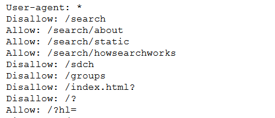
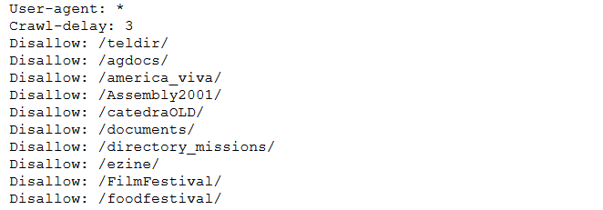
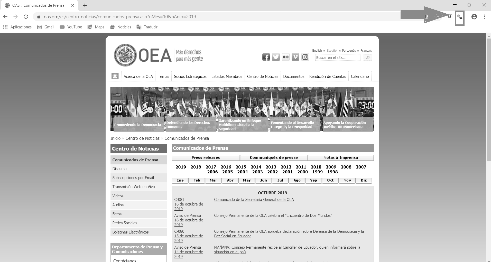
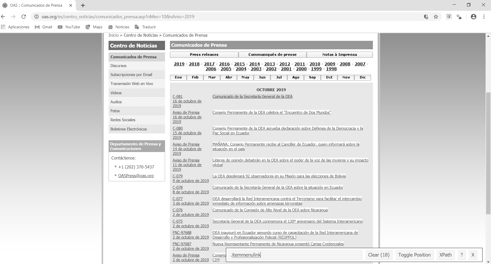

# Minería de datos web {#web-mining}

Gonzalo Barría^[E-mail: ghbarria@uc.cl]

### Lecturas sugeridas {-}

- Calvo, E. (2015). *Anatomía política de Twitter en Argentina. Tuiteando #Nisman*. Buenos Aires: Capital Intelectual.

- Steinert-Threlkeld, Z. (2018). *Twitter as Data (Elements in Quantitative and Computational Methods for the Social Sciences)*. Cambridge: Cambridge University Press.

### Los paquetes que necesitas instalar {-}

- `tidyverse` [@R-tidyverse], `glue` [@R-glue], `rvest` [@R-rvest], `rtweet` [@R-rtweet].

## Introducción

La información en Internet crece exponencialmente cada día. Si el problema de la ciencia política en el siglo XX fue la falta de datos para probar hipótesis, el siglo XXI presenta otro desafío: la información es abundante y está al alcance de la mano, pero hay que saber cómo recopilarla y analizarla. Esta enorme cantidad de datos está generalmente disponible pero de forma no estructurada, por lo que cuando te encuentres con la información tendrás dos retos principales: extraerla y luego clasificarla (es decir, dejarla como *datos organizados (tidy)*).

Una de las técnicas más utilizadas para extraer información de los sitios web es la técnica conocida como *web scraping*.

El web scraping se está convirtiendo en una técnica cada vez más popular en el análisis de datos debido a su versatilidad para tratar con diferentes sitios web. Como podemos ver en el siguiente gráfico, las búsquedas en Google del término "web scraping" han crecido constantemente año tras año desde 200:

```{r echo=F, fig.cap="Búsquedas de 'web scraping' en Google"}
library(readr)

time_trend_2 <- read_csv("00-data/web-mining/gtrends_webm.csv")

library(ggplot2)
 
plot <- ggplot(data = time_trend_2, 
               mapping = aes(x = date, y = hits))+
  geom_line() + 
  labs(x = "Año", y = "Interés de acuerdo a Google") +
  scale_x_datetime(
    breaks = lubridate::ymd_hms(c("2004-01-01 00:00:00",
                                  "2008-01-01 00:00:00",
                                  "2012-01-01 00:00:00",
                                  "2016-01-01 00:00:00",
                                  "2020-01-01 00:00:00")),
    labels = seq(2004, 2020, 4)
  ) 

plot
```

Esto consiste en obtener datos no muy estructurados (HTML) desde un sitio web, que usualmente luego transformamos a un formato estructurado con filas y columnas, con el que es más fácil trabajar. Nos permite obtener datos de fuentes no tradicionales (¡prácticamente cualquier página web!)

- La información que podemos obtener es la misma que podríamos hacer manualmente (copiar y pegar a un documento de Excel, por ejemplo), pero podemos automatizar tareas muy tediosas.

¿Para qué podríamos usar el web scraping? Como ejemplo práctico, vamos a realizar 2 simples ejercicios de extracción de datos. Pero antes de eso es bueno estar familiarizado con las fuentes de información y los múltiples usos que se le pueden dar a los datos extraídos. Algunas otras posibles aplicaciones para las que se puede usar el web scraping son:

1. Por ejemplo, pueden utilizarse para clasificar productos o servicios para crear motores de recomendación, para obtener datos de texto, como en la Wikipedia, para hacer sistemas basados en el Procesamiento del Lenguaje Natural. 

2. Generar datos a partir de etiquetas de imágenes, de sitios web como Google, Flickr, etc. para entrenar modelos de clasificación de imágenes.

3. Consolidar los datos de las redes sociales: Facebook y Twitter, para realizar análisis de sentimientos u opiniones.

4. Extraer comentarios de usuarios y sitios de comercio electrónico como Alibaba, Amazon o Walmart.

## Formas de hacer web scraping

Podemos raspar (scrape) los datos, es decir, obtenerlos, de diferentes maneras:

1. Copiar y pegar: obviamente esto debe ser hecho por un humano, es una manera lenta e ineficiente de obtener datos de la web.
   
2. Uso de APIs: API (por sus siglas en inglés) significa *interfaz de programación de aplicaciones*. Sitios web como Facebook, Twitter, LinkedIn, entre otros, ofrecen una API pública y/o privada, a la que se puede acceder mediante programación, para recuperar datos en el formato deseado. Una API es un conjunto de definiciones y protocolos utilizados para desarrollar e integrar programas informáticos de aplicación. En pocas palabras, es un código que indica a las aplicaciones cómo pueden comunicarse entre sí. Las API permiten que sus productos y servicios se comuniquen con otros, sin necesidad de saber cómo se implementan. Esto simplifica el desarrollo de aplicaciones y ahorra tiempo y dinero.

3. Análisis DOM: DOM significa *Documento Objeto Modelo* y es esencialmente una interfaz de plataforma que proporciona un conjunto estándar de objetos para representar documentos HTML y XML. El DOM permite el acceso dinámico a través de la programación para acceder, añadir y cambiar dinámicamente el contenido estructurado en documentos con lenguajes como *JavaScript*. A través de algunos programas es posible recuperar el contenido dinámico, o partes de sitios web generados por scripts de un cliente. Los objetos DOM modelan tanto la ventana del navegador como el historial, el documento o la página web, y todos los elementos que la propia página puede tener, como párrafos, divisiones, tablas, formularios y sus campos, etc. A través del DOM se puede acceder, mediante Javascript, a cualquiera de estos elementos, es decir, a sus correspondientes objetos para alterar sus propiedades o invocar sus métodos. Sin embargo, a través del DOM, cualquier elemento de la página está disponible para los programadores de Javascript, para modificarlos, borrarlos, crear nuevos elementos y colocarlos en la página. 


### Estándar de exclusión de robot

Antes de entrar en la práctica del *web scraping* tenemos que entender mejor qué es y cómo funciona el archivo *robots.txt* presente en la mayoría de los sitios web. Este archivo contiene el llamado *estándar de exclusión de robot* que es una serie de instrucciones especialmente dirigidas a los programas que buscan indexar el contenido de estas páginas (por ejemplo el bot de Google que "guarda" las nuevas páginas que se crean en Internet). Este método se utiliza para evitar que ciertos bots que analizan sitios de Internet añadan información "innecesaria" a los resultados de las búsquedas. Un archivo *robots.txt* en una página web funcionará como una petición para que ciertos bots ignoren archivos o directorios específicos en su búsqueda. Esto es importante cuando hablamos de *web scraping* ya que siempre es aconsejable revisar el archivo *robots.txt* de una página web antes de iniciar el scraping ya que puede incluir información que necesitaremos más adelante. Un ejemplo de cómo es uno de estos archivos se puede encontrar en el archivo *robots.txt* de Google https://www.google.com/robots.txt

```{r, echo=FALSE, fig.align='center',fig.cap="Vistazo a los estándares de exclusión de Google", out.width = '70%'}

```

En esta imagen encontramos la expresión *Usuario-agente: *. Esto permite a todos los robots acceder a los archivos que se almacenan en el código principal de la página web ya que el comodín (*) significa "TODO". 
A continuación vemos que los robots no pueden indexar o visitar páginas web del tipo */index.html?* o */grupos* por ejemplo. Si encontramos la expresión *Rechazar: /* significa que se le niega el acceso a todos los bots (el comodín */* se aplica automáticamente a todos los archivos almacenados en el directorio raíz del sitio web).


## Web scraping en R

Iremos cargando los paquetes que necesitamos. Ya estás familiarizado con algunos de ellos como `ggplot2`, que es parte del `tidyverse`.  El paquete `rvest` es el que nos permitirá hacer el scraping de datos con R. Es esencialmente una librería que nos permite traer y manipular datos de una página web, usando HTML y XML. Finalmente, el paquete `glue` está diseñado para hacer más fácil interpolar (pegar) datos en *strings¨*

```{r, warning=FALSE, message=FALSE}
library(tidyverse)
library(glue)
library(rvest)
```

Para "leer" datos de diferentes sitios web necesitaremos la ayuda de una herramienta de código abierto (open source tool), un plugin llamado "selectorgadget". Este se utiliza para extraer información de un sitio web. En este caso lo usaremos para seleccionar y resaltar las partes del sitio web que queremos extraer.

Se puede encontrar más información en este enlace https://selectorgadget.com/ y aquí https://cran.r-project.org/web/packages/rvest/vignettes/selectorgadget.html

### Ejemplo aplicado: los comunicados de prensa de la Organización de Estados Americanos (OEA)

Como primer ejemplo haremos un web scraping de un sitio estático. Es decir, un sitio web que tiene texto en HTML y que no cambia. Supongamos que estamos trabajando en un proyecto de diplomacia y relaciones internacionales en el que debemos sistematizar la información sobre la interacción entre los países de América Latina. Uno de los repositorios más útiles para iniciar este tipo de investigación es el sitio web de la Organización de Estados Americanos (OEA). Se puede encontrar en el siguiente link: https://www.oas.org/es/. 

Este sitio ofrece información muy pertinente para los analistas de datos políticos, ya que se trata de datos no estructurados que permiten identificar, por ejemplo, las redes de países, las alianzas, las fuentes de conflicto y las cuestiones que los ministerios de relaciones exteriores consideran pertinentes.

Antes de comenzar con el *web scraping* en sí mismo analizaremos el archivo *robots-txt* del sitio web de la OEA http://oas.org/robots.txt

```{r, echo=FALSE,fig.align='center',fig.cap="Vistazo al archivo robots.txt de la OEA", out.width = '100%'}

```

Encontramos que algunos directorios están prohibidos de ser indexados, pero todos los bots y usuarios están autorizados a visitar el sitio. Lo más importante es la expresión *Crawl-delay: 3* que básicamente nos dice que por cada petición hecha por un robot es aconsejable esperar 3 segundos entre una consulta y otra para no saturar el sitio, lo que puede resultar en que te bloquee.

En este ejemplo en particular, queremos extraer los títulos de los comunicados de prensa que se encuentran en este sitio web. Para simplificar, se recomienda utilizar Google Chrome (https://chrome.google.com/) y la extensión Selector Gadget para este buscador.^[Se puede instalar desde este enlace https://chrome.google.com/webstore/detail/selectorgadget/mhjhnkcfbdhnjickkkdbjoemdmbfginb.] La extensión Selector Gadget también funciona en Firefox y en Safari (así como en otros navegadores), sólo tienes que arrastrar el marcador a tu barra de marcadores.

Primero cargamos la página como un objeto para que luego podamos leerla como un archivo html. En este caso queremos que los títulos de los comunicados de prensa de la Organización de Estados Americanos (OEA) para octubre de 2019
```{r eval=F}
download_html(url  = "https://www.oas.org/es/centro_noticias/
              comunicados_prensa.asp?nMes=10&nAnio=2019", 
              file = "webs/comunicados_oea_10_2019.html")
```

### Caraga el html para trabajar con R

Una vez que descargamos los datos, los importamos en R usando `read_html()`
```{r}
web_comunicados_10_2019 <- read_html("webs/comunicados_oea_10_2019.html", 
                                     encoding = "UTF-8")
```


### Extraer la información con `html_nodes()` + `html_text()`

A continuación, abrimos la página en Google Chrome donde lo primero que veremos es el sitio con las noticias. Allí hacemos clic en la extensión Chrome del Selector Gadget  como se indica en la figura de abajo (es la pequeña lupa en la esquina superior derecha).

```{r, echo=FALSE, fig.cap="Pantallazo del sitio de los comunicados de prensa de la OEA", out.width = '100%'}

```

El primer paso es encontrar el selector de CSS que contiene nuestra información. En la mayoría de los casos sólo usaremos [SelectorGadget](https://selectorgadget.com/). Empecemos con los títulos. Como podemos ver en la figura, seleccionamos la parte del sitio web que queremos extraer. En este caso queremos los títulos de los comunicados de prensa que después de ser seleccionados se destacan en amarillo. Observarán que al hacer clic en uno de ellos, aparece un mensaje ".itemmenulink" en el espacio vacío que hay en el Selector. Estos son los caracteres designados para los títulos en este sitio web

```{r pressure, echo=FALSE, fig.cap="Títulos de los comunicados de prensa que queremos extraer", out.width = '100%'}

```

A continuación creamos un objeto para leer esta información como un objeto html en R. Lo llamaremos `titulos_web_comunicados_10_2019`. Dentro de la función `html_nodes()` añadimos el carácter ".itemmenulink" ya que representa los títulos según el selector.

```{r}
titulos_web_comunicados_10_2019 <- web_comunicados_10_2019 %>% 
  html_nodes(".itemmenulink") %>% 
  html_text()
```

Así es como obtuvimos los titulares de todo el sitio web. 

Ahora revisaremos los primeros 10 resultados para ver cómo se clasificaron los datos. La idea más adelante sería transformar este objeto en un marco de datos. También podemos extraer el contenido de cada noticia, pero para ello necesitaríamos la URL en inglés (o en el idioma que prefieras) de cada comunicado de prensa.

```{r}
head(titulos_web_comunicados_10_2019, n = 10)
```

Para eliminar los enlaces de un elemento, en lugar de su texto, debemos sustituir `html_text()`por `html_attr("href")`:

```{r}
links_web_comunicados_10_2019 <- web_comunicados_10_2019 %>% 
  html_nodes(".itemmenulink") %>% 
  html_attr("href") %>%
  str_c("https://www.oas.org/es/centro_noticias/",.)
links_web_comunicados_10_2019
```

Ahora podemos crear un *marco de datos* (data frame) con toda la información:
```{r}
df_web_comunicados_10_2019 <- tibble(
  titulo = titulos_web_comunicados_10_2019,
  link   = links_web_comunicados_10_2019)

df_web_comunicados_10_2019
```

> **Ejercicio 12A.** Consigue la fecha de cada comunicado de prensa de la OEA para octubre de 2019. Llama al vector "web_date_releases_10_2019". 
>
> **Ejercicio 12B.** Consigue los títulos de las noticias de la página web de la revista *The Economist* como su sección internacional: https://www.economist.com/international/?page=1


### Iteraciones

Las iteraciones nos permiten repetir la misma operación para un conjunto de elementos. Analicemos la sintaxis en el siguiente ejemplo:

```{r results='asis', warning=FALSE, message=FALSE}
print(10)
```

```{r results='asis', warning=FALSE, message=FALSE}
walk(.x = 1:10,
     .f = ~ {
       print(.x)
     })
```

Podríamos descargar varias páginas del sitio web de la OEA con una iteración. Por ejemplo, descarguemos los comunicados de prensa de todos los meses de 2016 a 2018. Para ello, utilizamos la función `cross_df()` para crear un *data.frame* que contiene todas las combinaciones posibles entre meses y años:

```{r eval=F}
iteration_df <- cross_df(list(month = 1:12,year = 2016:2018))
```

Entonces, usamos la función `walk2()` que recibirá 2 argumentos que se iterarán, los meses y los años.

```{r eval=F}
walk2(.x = iteration_df$month,
      .y = iteration_df$year,
      .f = ~ {
        Sys.sleep(2) # stops
        download_html(
          url  = glue("https://www.oas.org/es/centro_noticias/
                      comunicados_prensa.asp?nMes={.x}&nAnio={.y}"),
          file = glue("webs/comunicados_oea_{.x}_{.y}.html"))
      })
```

Nuestros próximos pasos te mostrarán cómo procesar estos sitios web (en este caso haremos 37 URL, pero podrían ser muchos más) para crear una base de datos único. Utilizaremos funciones e iteraciones personalizadas en el proceso.


### Funciones personalizadas (recetas)

Lo que hicimos hasta ahora para obtener nuestro *marco de datos* con información del sitio web de la OEA puede resumirse en los siguientes pasos:

1. Descargar el sitio 

2. Sube el html a la 'R'

3. Extraer los vectores para el título y el enlace usando selectores

4. Crear el *marco de datos* con estos vectores

Esto puede ser pensado como una "receta", que debería funcionar para cualquier archivo. Por lo tanto, lo crearemos como una función personalizada para que trabajes con ella:
```{r}
f_procesar_sitio <- function(file){
  web <- read_html(file, encoding = "UTF-8")
  
  titulos <- web %>% 
    html_nodes(".itemmenulink") %>% 
    html_text()
  
  links <- web %>% 
  html_nodes(".itemmenulink") %>% 
  html_attr("href") %>%
  str_c("https://www.oas.org/es/centro_noticias/",.)
  
  df_info <- tibble(
    titulo = titulos,
    link   = links
  )
  
  return(df_info) # what returns/delivers the function
}
```

Ahora la función toma cualquier archivo como argumento y nos da lo que esperamos:

```{r}
f_procesar_sitio(file = "webs/comunicados_oea_10_2016.html")
```

Así, podemos iterar esta función en nuestros 37 archivos para crear una base de datos completo. En este caso no usaremos `walk()`, sino `map_dfr()` --esta función espera que cada iteración devuelva un *marco de datos*, y (debajo) los pega en orden con `bind_rows()`.
```{r}
archivos <- list.files("webs/", full.names = T)
archivos

df_web_comunicados_2016_2018 <- map_dfr(.x = archivos,
                                 .f = ~ {
                                   f_procesar_sitio(.x)
                                 })
df_web_comunicados_2016_2018
```

## Usando APIs y extrayendo datos de Twitter 

Twitter es una red social fundada en 2006 que permite a los usuarios interactuar entre sí enviando mensajes de no más de 280 caracteres. Es ampliamente usada por servicios públicos y por políticos especialmente en las épocas de campaña electoral. Con las nuevas técnicas de análisis de datos el estudio de la interacción de los usuarios en twitter se ha vuelto muy importante por ejemplo para medir los temas sobre los que está hablando la gente (*trending topics*) y sobre si las opiniones sobre una persona o tema son positivas o negativas. Por ejemplo Ernesto Calvo en su libro *Anatomía Política de Twitter en Argentina: Tuiteando #NISMAN* en el que identifica a través del estudio de los tweets sobre las causas de la muerte del ex fiscal Alberto Nisman que reflejaban (y estaban muy correlacionados con) las divisiones políticas de la oposición del gobiernon. A partir del caso Nisman, Ernesto Calvo analiza los tweets de los usuarios argentinos y muestra que la polarización mezcla política, algoritmos y smartphones.

Si has leído la sección anterior, ya conoces los paquetes R que se utilizarán en esta sección del libro. Para hacer la extracción de datos de Twitter la mejor opción en mano es `Rtweet`, que permite acceder gratuitamente al API de Twitter para descargar información de los usuarios, temas de tendencias y hashtags. Para extraer datos de Twitter con R se recomienda consultar *Twitter as Data*, que contiene algunas rutinas estandarizadas para descargar datos de esta plataforma.

##Algunos antecedentes en APIs

La interfaz de programación de aplicaciones *Application Program Interfaces* (APIs en inglés) son un set de protocolos y funciones que gobiernan ciertas interacciones entre aplicaciones web y usuarios.

las APIs son similares a los navegadores web pero cumplen diferentes propósitos:

    -Navegadores web reproducen contenido de los browsers 
    -Las APIs permiten manipular y organizador datos

Para que las APIs públicas sean utilizadas muchos sitios solo permiten a usuarios autorizados (por ejemplo aquellos que tienen una cuenta en la plataforma). Este es el caso para Twitter, Facebook, Instagram and Github.
    

Si bien estas APIs son ampliamente conocidas no está demás mencionar algunas creadas por la misma comunidad de R especializada en datos políticos. Por ejemplo el paquete `lobbyR` creado por Daniel Alcatruz ^[https://github.com/Dalcatruz/lobbyR] que permite cargar y estructurar datos desde la API lobby que se encuentra en la plataforma de Ley de Lobby (https://www.leylobby.gob.cl/) implementada para el Gobierno de Chile, que permite realizar consultas por ejemplo sobre audiencias en determinados servicios públicos y organismos del estado como el congreso y los municipios. Otro paquete que es necesario mencionar es `inegiR` creado por Eduardo Flores que permite interactuar con la API del INEGI (Instituto Nacional de Estadística y Geografía de México) para realizar consultas específicas. http://enelmargen.org/ds/inegiR/vignette_spa.html


#Extraer los datos

Lo primero es no depender de la API oficial de Twitter, y por lo tanto deberías tener tu propia cuenta de Twitter que puedes crear en (https://twitter.com/i/flow/signup). 
Luego procedes a cargar el paquete `rtweet` que te permitirá extraer datos de Twitter. Te mostraremos esta rutina y extraeremos datos de diferentes usuarios y hashtags.

```{r}
library(rtweet)
```

Por ejemplo podemos obtener los IDs de las cuentas que sigue la ONU en español. Por defecto la función te muestra hasta 5000 usuarios.

```{r}
## Obtener los ID que son seguidos por la cuenta de la ONU en español
friends_ONU_es <- get_friends("ONU_es")
```

Para saber más información de estos usuarios utilizamos la `lookup_users()` 

```{r}
info_friends_ONU_es <- lookup_users(friends_ONU_es$user_id)
```

Podemos obtener información de los seguidores también mediante la función `get_followers()`. Como la cuenta de twitter de ONU en español tiene más de un millón de seguidores, es más comodo hacer un anáisis de una porción de ellos. Para obtener todos los IDs de usuarios que siguen a \@ONU_es, solo necesitas 2 cosas:

- Una conexión estable a Internet
- Tiempo - aproximadamente cinco días y medio

```{r}
followers_ONU_es <- get_followers("ONU_es", n = 200, 
                                  retryonratelimit = TRUE)
```

Aquí obtenemos la información de los usuarios que siguen la cuenta \@ONU_es

```{r}
info_followers_ONU_es<-lookup_users(followers_ONU_es$user_id)
```


#### Buscando tweets especificos

Ahora estamos listos para buscar tweets recientes. Busquemos por ejemplo todos los tweets que lleven el hashtag "#Piñera", en alusión al presidente chileno. Recordemos que un hashtag es una etiqueta que corresponde a una palabra antecedida por el símbolo "#". Esta es utilizada principalmente para encontrar tweets con contenido similar, ya que el fin es que tanto el sistema como el usuario la identifiquen de forma rápida. Utilizaremos la función rtweet::search_tweets(). Esta función requiere los siguientes argumentos

    `q`: la palabra que quieres buscar
    `n`: el número de tweets máximos que quieres extraer. Puedes pedir un máximo de 18.000 tweets cada 15 minutos.

> Tip: Para ver otros argumentos de la función puedes usar el documento de ayuda
>
```{r, warning=FALSE, message=FALSE}
?search_tweets
```

Un aspecto importante que tenemos que aclarar con respecto a las consultas que le hacemos a la API de Twitter es que los resultados obtenidos no podrán reproducir completamente, estos cambiarán, ya que la versión gratuita de Twitter nos permite hacer consultas en un periodo terminado de tiempo en el pasado (por ejemplo una semana) por lo que los resultados de las consultas cambiarán con el tiempo. Si te interesa una cierta agenda o hashtag, un buen consejo es descargarla regularmente y guardarla en un disco duro. No podrás volver a ellas en el futuro.

```{r}
# Look for 500 tweets with the hashtag #piñera
pinera_tweets <- search_tweets(q = "#piñera",
                               n = 1000)
# We see the first 3 columns
head(pinera_tweets, n = 3)
```

Para obtener información de los usuarios que están emitiendo tweets sobre #piñera en el momento que estamos escribiendo este capitulo  

```{r}
lookup_users(pinera_tweets$user_id)
```


Las consultas de tweets pueden hacerse de varias maneras dependiendo en los que estas buscando:

### Buscar una palabra clave

```{r}
query_1 <- search_tweets(q = "piñera", n = 20)
```


### Buscar una frase

```{r}
query_2 <- search_tweets(q = "piñera economia", n = 20)
```


#### Buscar múltiples palabras claves

```{r}
query_3 <- search_tweets(q = "piñera AND bachelet", n = 20)
```

Por defecto `search_tweets()` retorna 100 tweets. Para retornar más el n debe ser mayor, esto se hace con `n =`.

> **Ejercicio 12C.** En lugar de usar AND, usa OR entre los diferentes términos de búsqueda. Ambas búsquedas devolverán tweets muy diferentes. 

#### Busca cualquier mención de una lista de palabras

```{r}
query_4 <- search_tweets("bolsonaro OR piñera OR macri", n = 20)
```

> **Ejercicio 12D.** Buscar tweets en español que no sean retweets

#### Especifica el lenguaje de los tweets y excluye los retweets

```{r}
query_5 <- search_tweets("piñera", lang = "es", include_rts = FALSE, n=20)
```

### Descargando características relacionadas con los usuarios de Twitter

#### Retweets

Un retweet es cuando tú o alguien más comparte un tweet para que tus seguidores puedan verlo. Es similar a la característica de "compartir" en Facebook. Hagamos la misma rutina de antes pero esta vez ignorando los retweets. Lo hacemos con el argumento `include_rts` definido como `FALSE`. Entonces podemos obtener tweets y retweets en un marco de datos separado

>Nota: La opción `include_rts =` es muy útil si estás estudiando los patrones de viralización de ciertos hashtags.

```{r}
# Look for 500 tweets with the hashtag #piñera, but ignore retweets
pinera_tweets <- search_tweets("#piñera", 
                               n = 500,
                               include_rts = FALSE)
# See the first two columns
head(pinera_tweets, n = 2)
```

Ahora veamos quién está twiteando sobre el hashtag "#piñera"

```{r}
# Look at the column with the names - top 6
head(pinera_tweets$screen_name)

unique(pinera_tweets$screen_name)
```

También podemos usar la función `search_users()` para explorar qué usuarios están twiteando usando un hashtag particular. Esta función extrae un data.frame de los usuarios e información sobre sus cuentas.

```{r}
# Which users are tweeting about #piñera?
users <- search_users("#piñera",
                      n = 500)
# see the first 2 users (the data frame is large)
head(users, n = 2)
```

Aprendamos más sobre estas personas. ¿De dónde son? Como vemos, hay 304 lugares únicos por lo que el gráfico que usamos para trazar la información no es addecuado para visualizarlo.

```{r}
# How many places are represented?
length(unique(users$location))
## [1] 304

users %>%
  ggplot(aes(location)) +
  geom_bar() + 
  coord_flip() +
  labs(x = "Frecuencia",
       y = "Ubicación",
       title = "Cuentas de Twitter - Ubicaciones únicas")
```

Ordenemos por frecuencia las ubicaciones más nombradas y las trazamos. Para ello utilizamos `top_n()` que extraerá las localizaciones con al menos 20 usuarios asociados a ella

```{r}
users %>%
  count(location, sort = TRUE) %>%
  mutate(location = reorder(location, n)) %>%
  top_n(20) %>%
  ggplot(aes(x = location, y = n)) +
  geom_col() +
  coord_flip() +
      labs(x = "Frecuencia",
      y = "Ubicación",
      title = "¿De dónde son estas cuentas de Twitter? Ubicaciones únicas")
```

Es mejor si quitamos los NAs para ver los lugares más claramente. En general, la geolocalización en Twitter es bastante mediocre porque es voluntaria y pocas personas la tienen activada en sus teléfonos móviles. Así que lo que vemos es gente que quiere que sepamos su ubicación, lo que significa que hay un sesgo en estos resultados.

```{r}
users %>%
  count(location, sort = T) %>%
  mutate(location = reorder(location,n)) %>%
  na.omit() %>% filter(location != "") %>% 
  top_n(20) %>%
  ggplot(aes(x = location,y = n)) +
  geom_col() +
  coord_flip() +
      labs(x = "Ubicación",
      y = "Frecuencia",
      title = "Usuarios de Twitter - Ubicaciones únicas")
```

Finalmente repetimos el ejercicio usando hashtags que se refieren a Michelle Bachelet, la ex presidenta de Chile:

```{r}
## Buscar tweets que usen el hashtag #bachelet
rt <- search_tweets(
  "#bachelet", n = 600, include_rts = FALSE
)
```

¿Cómo ha sido la tendencia temporal de este hashtag en los últimos días?
```{r}
## Graficar una serie de tiempo de tweets
rt %>%
  ts_plot("3 hours") +
  ggplot2::theme_minimal() +
  ggplot2::theme(plot.title = ggplot2::element_text(face = "bold")) +
  ggplot2::labs(
    x = NULL, y = NULL,
    title = "Frecuencia de #bachelet en los tweets de los últimos 9 días",
    subtitle = "Conteo de tweets usando intervalos de tres horas",
    caption = "Fuente: Datos recolectados desde la API de Twitter, usando el paquete rtweet"
  )
```

Esperamos que este capítulo haya sido útil. En el Capítulo \@ref(qta) te mostraremos cómo explorar más a fondo los datos de Twitter una vez que los hayas descargado.
