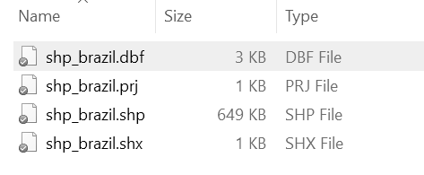
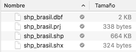
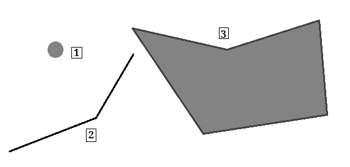
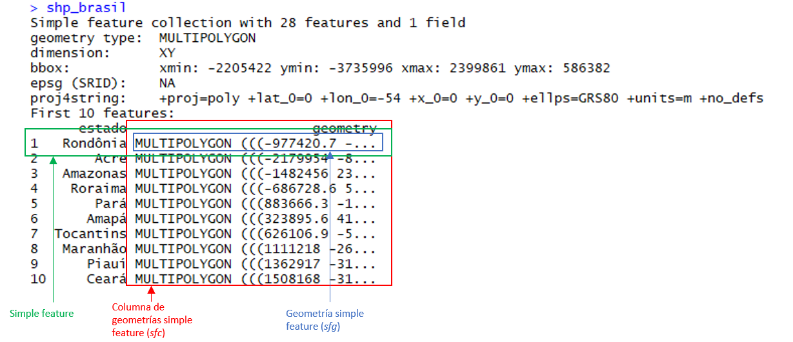
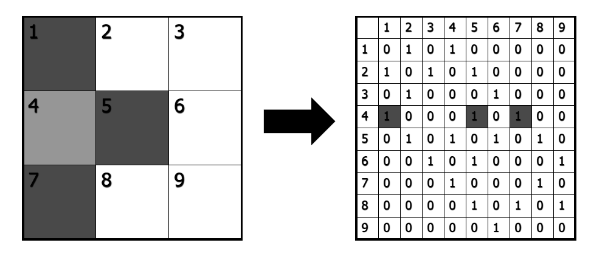
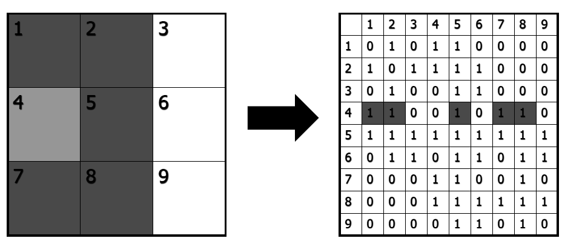
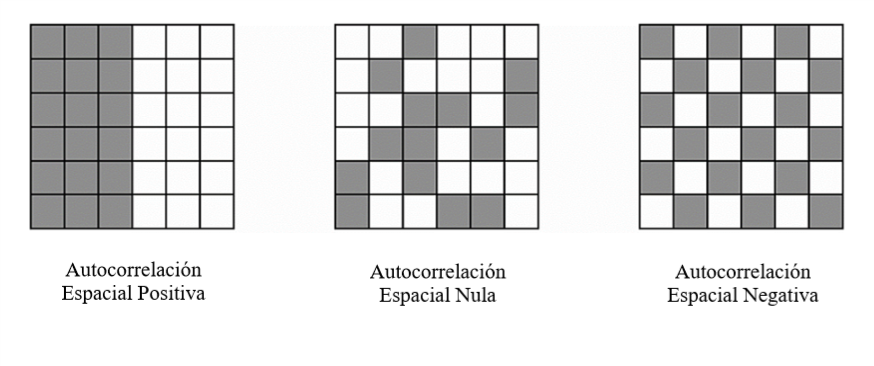

# Mapas y datos espaciales {#maps}

Andrea Escobar^[E-mail: abescobar\@uc.cl] y Gabriel Ortiz^[E-mail: goortiz\@uc.cl]

```{r include=F}
library(ggplot2)
theme_set(cowplot::theme_map(font_size = 11, 
                             font_family = "") +
            theme(legend.position = "top",
                  legend.justification = "right",
                  legend.key.size =  unit(0.2, "inches"),
                  legend.margin = margin(0, 0, 0, 0),
                  legend.box.margin = margin(-5, 10, -10, -10)))
```

### Lecturas sugeridas {-}

- Brunsdon, C. and Comber, L. (2015). *An Introduction to R for Spatial Analysis and Mapping.* SAGE, Thousand Oaks, CA.

- Lansley, G. and Cheshire, J. (2016). *An Introduction to Spatial Data Analysis and Visualisation in R.* Consumer Data Research Centre.

- Lovelace, R., Nowosad, J., and Münchow, J. (2019). *Geocomputation with R.* CRC Press, Boca Raton, FL.

- Pebesma, E. (2018). Simple Features for R: Standardized Support for Spatial Vector Data. *The R Journal,* 10(1):439–446.


### Los paquetes que necesitas instalar {-}

- `tidyverse` [@R-tidyverse], `paqueteadp` [@R-paqueteadp], `sf` [@R-sf], `ggrepel` [@R-ggrepel], `gridExtra` [@R-gridExtra], `rnaturalearthhires` [@R-rnaturalearthhires], `spdep` [@R-spdep].

## Introducción

En este capítulo, aprenderemos a trabajar con datos espaciales usando R y `tidyverse`. Nos centraremos en la riqueza que tienen los datos espaciales, tanto como herramienta para el análisis de datos exploratorios sobre diversos fenómenos, como para visualizar y comunicar nuestros hallazgos de una forma atractiva y efectiva. Como tal, este capítulo tiene los siguientes objetivos:

a. Describir el formato de los datos espaciales.

b. Explicar por qué estos datos son interesantes para ser utilizados en el análisis de las ciencias políticas.

c. Su manejo y manipulación en R, centrándose en su visualización mediante la creación de mapas estáticos y dinámicos con `ggplot2`.

d. No entraremos en la elaboración de modelos estadísticos inferenciales a partir de datos espaciales (Modelos con lag espacial), ni tampoco en la generación de datos geográficos, ya que trabajaremos sobre conjuntos de datos geográficos ya creados.

El conjunto de datos que utilizaremos en este capítulo será un shapefile (formato que explicaremos más adelante) de los estados de Brasil, obtenido del [*Spatial Data Repository of New York University*](https://geo.nyu.edu/catalog/stanford-ys298mq8577), que se fusionará con los datos de @freireEvaluatingEffectHomicide2018.

Por un lado, el depósito de datos espaciales de la Universidad de Nueva York proporciona muchos datos espaciales de diferentes países, así como de divisiones supranacionales y subnacionales. En este caso, utilizaremos una base de datos de las fronteras estatales de Brasil en el año 1991, proporcionadas por el *Instituto Brasileño de Geografía y Estadística*. Por otro lado, el trabajo de Freire (2018) explica la causa de la disminución de la tasa de homicidios en el estado de Sao Paulo como resultado de la implementación de políticas estatales para la reducción del crimen. Este trabajo es útil ya que recoge datos a nivel estatal de diferentes indicadores socioeconómicos como el PIB, el Índice de Gini, el promedio de años de escolaridad, entre otros, en un período de veinte años (1990-2010). Estos datos se unirán a nuestro *shapefile* para trazar estas variables en mapas.

También presentamos una serie de ejercicios que te ayudarán a ganar experiencia utilizando un *shapefile* de América del Sur fusionado con datos del PIB per cápita y la calidad de la democracia electoral de cada país tomados de la base de datos de V-Dem.

### Datos espaciales: ¿qué son?

Los datos espaciales, o más bien los datos *geoespaciales*, se refieren a los datos obtenidos de lugares geográficos, es decir, de zonas de la superficie de la Tierra. El uso de este tipo de datos reconoce "la importancia de conceptos espaciales como distancia, ubicación, proximidad, vecindad y región en la sociedad humana", permitiéndonos enfrentar los fenómenos desde una perspectiva multivariante y multidimensional, proporcionándonos información adicional para nuestras observaciones [@csiss]. 

En ciencia política, la perspectiva espacial para el análisis de datos ha avanzado gracias a trabajos como el de Gary King [-@kingSolutionEcologicalInference1997] sobre cómo hacer inferencias ecológicas, y el de Gimpel y Schuknecht [-@gimpelPoliticalParticipationAccessibility2003] sobre la accesibilidad a los lugares de votación. Este tipo de datos permite responder a preguntas como la influencia de la proximidad de los países vecinos en la difusión de ciertas políticas, pero también resulta ser una herramienta clave en la exploración de datos para observar la existencia de patrones territoriales en otros estudios.

En los últimos años, los datos espaciales se han difundido ampliamente, sobre todo gracias a las iniciativas de los gobiernos que proporcionan datos para diversos procesos sociales y económicos del país. Las nuevas plataformas de acceso abierto, como Google Maps o [Open Street Map](https://www.openstreetmap.org/), y las redes sociales como Twitter y Facebook también contribuyeron al interés por los datos espaciales. Mientras tanto, para los investigadores y estudiantes, las bases datos como la ya mencionada del Depósito de Datos Espaciales de la Universidad de Nueva York proporcionan archivos *shapefile* de fácil acceso y manipulación para generar visualizaciones y unir datos georreferenciados de otras bases de datos.

### Estructura de datos espaciales

Los archivos que contienen datos espaciales se conocen comúnmente como *shapefiles*, que generalmente se colocan en una carpeta que contiene al menos tres archivos con las extensiones .shp, .dbf y .shx.

```{r shp-windows, echo=F, fig.width=7.4, fig.cap="Ejemplo de una carpeta que contiene un shapefile en Windows. Ten en cuenta que el archivo .shp contiene la gran mayoría de la información.  Además, esta carpeta contiene un archivo .prj adicional"}

```

<!-- ```{r shp-mac, echo=F, out.width="60%", fig.cap=" Ejemplo de una carpeta que contiene un shapefile en macOS "} -->
<!--  -->
<!-- ``` -->

En R, los shapefiles se suelen representar mediante vectores, que consisten en la descripción de la geometría o forma (*shape*) de los objetos. Generalmente contienen variables adicionales, llamadas atributos, sobre los mismos datos. Usando como ejemplo los datos que serán analizados a lo largo de este capítulo, nuestra base de datos describe las fronteras de los estados de Brasil (geometría), y también contiene información de la tasa de homicidios más otros datos socioeconómicos (atributos). Los datos espaciales son diversos en sus características y generalmente se dividen en tipos de vectores que en cada caso consisten en un conjunto de pares de coordenadas (x,y):

* Puntos: Una sola ubicación descrita por un punto como la dirección de una casa geocodificada.

* Líneas: Un segmento compuesto por una serie de puntos conectados entre sí que no forman un objeto cerrado.

* Polígonos: Una superficie plana compuesta por una serie de líneas conectadas entre sí que forman un objeto cerrado.

* Multi-polígonos: Multi-superficies compuestas de polígonos que no necesariamente se intersectan.

```{r figure-forms, echo=F, out.width="60%", fig.cap="Tipos de formas en los datos espaciales. (1) Punto, (2) Línea, (3) Polígono"}

```

> **Tip.** Como hemos dicho, el [Repositorio de Datos Espaciales de la Universidad de Nueva York](https://geo.nyu.edu/) puede ser una buena alternativa si quieres empezar a trabajar con datos espaciales de tu país, estado o municipio. Puede buscar fácilmente archivos de forma entrando en la página web del Repositorio y seleccionando "Polígono" en la categoría "Tipo de datos". Después de eso, tienes que introducir el nombre del área de interés en el buscador, seleccionar un resultado y presionar "Descargar Shapefile" en la esquina superior derecha de la página. Otra ventaja de estos datos es que los archivos suelen ser livianos, pero de suficiente calidad, lo que resulta conveniente en el caso de los equipos con limitaciones para procesar archivos de datos de gran tamaño.

## Datos espaciales en R

En los últimos años, R ha mejorado considerablemente sus herramientas para manipular y analizar datos geográficos de manera que sean compatibles con la sintaxis y las funcionalidades de otros paquetes del programa. En el pasado, estas tareas eran demasiado desafiantes. En este capítulo, nos centraremos en el paquete `sf`, que fue creado en 2016 sobre las funcionalidades base de tres paquetes anteriores: `sp`, `rgeo` y `rgdal`, y que implementa el modelo estándar de código abierto *características simples*^[Las características simples se refieren a un estándar de formato (ISO 19125-1:2004) que describe cómo los objetos del mundo real pueden ser representados en las computadoras. Ver r-spatial.github.io/sf/articles/sf1.html.]. `sf` permite la representación de objetos del mundo real en el ordenador, que poseen atributos tanto espaciales como no espaciales, basados en la geometría 2D con interpolación lineal entre vértices [@pebesmaSimpleFeaturesStandardized2018].

### Características simples en R

La principal ventaja que proporciona el paquete `sf` es que nos permite trabajar con datos espaciales dentro del `tidyverse`, es decir, podemos manejar los datos espaciales como si fueran cualquier otro tipo de base de datos. Podemos hacerlo mediante funciones de R contenidas en el metapaquete `tidyverse`, como `ggplot2` y `dplyr`, en línea con lo que hemos aprendido a lo largo del libro^[Algunas opciones alternativas para construir mapas en R son los paquetes `tmap` y `cartogram`, que se explican en profundidad en el Capítulo 8 de "Geocomputación con R" de^[@lovelaceGeocomputation2019].

Es importante tener la última versión de `tidyverse` para ejecutar las utilidades de `ggplot2` que se usarán en este capítulo. Puedes actualizarlo a la última versión con el comando `install.packages("tidyverse")`:

```{r, message = F, warning = F}
library(tidyverse)
```

Ahora tenemos que instalar el paquete `sf`. Para que esto funcione en Mac y Linux necesitas las últimas versiones de FDAL, GEOS, Proj.4 y UNDUNITS ya instaladas^[Para más información, consulta https://github.com/r-spatial/sf#installling]. Una vez hecho esto podemos instalar el paquete `sf`:

```{r, eval= F}
devtools::install_github("robinlovelace/geocompr")
install.packages("sf")
library(sf)
```

```{r, echo=F, message = F, warning = F}
library(sf)
```

### Estructura

Para ver la estructura de los objetos de tipo `sf` cargamos nuestra base de datos en el formato shapefile, usando la función `read_sf()` (nota que estamos cargando el archivo `shp_brasil.shp` contenido en la carpeta `shp_brasil`):

```{r, eval=F}
shp_brasil <-  read_sf("datos_espaciales/shp_brasil.shp")
```

```{r, echo=F}
shp_brasil <-  read_sf("00-data/maps/shp_brazil2/shp_brazil2.shp") %>% 
  rename(estado = state)
```

En la siguiente imagen, detallamos las partes de nuestro shapefile con sus nombres:

```{r sf-structure, echo=F, out.width="95%", fig.cap=" Estructura de un objeto sf"}

```

Como se puede observar en la figura anterior, las características simples se guardan por `sf` en un formato data.frame y con un formato adicional de clase `sf`. Entonces, como se ha dicho antes, podemos dirigir este conjunto de datos como cualquier otro dentro del `tidyverse`, usando sus funciones, pipas (pipes o %>%), etc. Aquí, cada fila consiste en una simple característica, y cada columna consiste en un atributo. La diferencia con una base de datos normal es que aquí encontramos una nueva columna de geometrías de rasgos simples (*single-featured geometry column* - `sfc`), lo que resulta en un marco de datos con una columna extra para información espacial.

Podemos verificar esto comprobando el tipo de archivo que hemos cargado con la función `class()`. Observe que `shp.brasil` es, al mismo tiempo, un archivo de tipo `sf` y un `data.frame`:

```{r}
class(shp_brasil)
```

Ahora, si exploramos nuestros datos con mayor detalle encontraremos que este estándar puede ser implementado en diferentes tipos de geometría en nuestra base de datos:

* Un vector numérico para un solo punto (POINT)
* Una matriz numérica (cada fila es un punto) para una serie de puntos (MULTIPOINT o LINE)
* Una lista de matrices para un grupo de conjuntos de puntos (MULTILINESTRING, POLYGON)
* Una lista de matrices (MULTIPOLYGON) que se convierte en la más utilizada cuando los datos geográficos se representan como forma y ubicación de los países u otras unidades administrativas de éstos.
* Una lista de cualquiera de los elementos anteriormente mencionados (GEOMETRYCOLLECTION)

Usando la función `st_geometry()` podemos ver la geometría incluida en nuestro shapefile:

```{r}
st_geometry(shp_brasil)
```

Una vez cargado nuestro shapefile, podemos empezar a generar mapas. Ten en cuenta que la forma de hacerlo se basa en `ggplot2`; sólo tenemos que seleccionar nuestra base de datos y añadir el geom `geom_sf()`^[Puede que veas las coordenadas en los ejes. Esto puede ser útil para análisis exploratorio de datos, pero deberías eliminarlos si quieres compartir tu mapa, lo que se puede realizar añadiendo `... + theme_void()`].

```{r, fig.align='center', fig.cap=" Mapa de los estados de Brasil"}
ggplot(data = shp_brasil) +
  geom_sf()
```

> **Ejercicio 16A.** 
> 1. Descarga el shapefile de Sudamérica de [ArcGIS](https://www.arcgis.com/home/item.html?id=d3d2bae5413845b193d038e4912d3da9) y cárgalo en R usando `read_sf()`. Selecciona sólo las variables "CNTRY_NAME", "ISO_3DIGIT" y "geometry".
> 2. Filtra la base de datos por la variable 'CNTRY_NAME' para eliminar las observaciones de "South Georgia & the South Sandwich Is." y "Falkland Is.".
> 3. Trazar el shapefile usando `ggplot()` y `geom_sf()`.

## Gestión de Datos Espaciales

Ya aprendimos a cargar archivos de forma con `read_sf()`. Ahora que hemos cargado el archivo, procederemos a aprender qué tipo de modificaciones podemos hacer para generar nuevos datos a partir de la información que ya tenemos. También mostraremos cómo unir datos de otras bases de datos a nuestro shapefile. 

### Modificaciones

Hay dos maneras de hacer modificaciones en nuestra base de datos georeferenciada. La primera consiste en aplicar las técnicas que ya hemos aprendido usando el `tidyverse`, mientras que la segunda consiste en usar las funciones incorporadas en el paquete `sf`. En este paquete, todas las funciones empiezan con `st_`, para que puedan ser fácilmente comprendidas en la herramienta de *completado* de RStudio. Estas funciones se utilizan principalmente para transformar y realizar operaciones geográficas. En estas secciones combinaremos ambas técnicas para generar nuevas variables y datos asociados a nuestra base de datos.

#### Filtrar y seleccionar por unidades geográficas

Una de las primeras funciones que podemos utilizar las funciones de `dplyr` para seleccionar datos dentro de nuestra base. Así, por ejemplo, podemos ocupar `filter()` para seleccionar ciertos estados de Brasil, como por ejemplo el estado de São Paulo:

```{r}
shp_brasil %>%
  filter(estado == "São Paulo")
```

Un desafío común que a menudo enfrentamos cuando trabajamos con shapefiles de países enteros es la existencia de regiones o zonas insulares que forman parte del territorio administrativo pero que están aisladas geográficamente, por ejemplo, la Isla de Pascua en Chile o las Islas Galápagos en Ecuador.  Por diversas razones, el acceso a los datos de esas regiones es limitado y a menudo se dejan fuera del análisis. Por lo tanto, estamos interesados en sacar estas regiones de nuestro shapefile. En Brasil, el Distrito Estatal de Fernando de Noronha, un archipiélago de 21 islas situado en el Océano Atlántico es uno de este tipo de casos (es posible identificarlo como un pequeño punto en la parte superior derecha del mapa anterior). Podemos eliminar fácilmente este tipo de datos de nuestro shapefile, de nuevo, con la función `filter()`.

```{r}
shp_brasil <- shp_brasil %>%
  filter(estado != "State District of Fernando de Noronha (PE)")
```

Esto se reflejará en los siguientes mapas:

```{r, fig.cap= " Mapa de los estados brasileños excepto el Distrito Estatal de Fernando de Noronha", fig.align='center'}
ggplot(data = shp_brasil) +
  geom_sf()
```

#### Generar nuevas unidades con `st_union()`

Otra opción interesante es generar nuevas variables que agrupen múltiples unidades geográficas. Al hacer esto, estaremos generando efectivamente nuevas unidades geográficas más allá de la información inicial contenida en nuestro shapefile. Por ejemplo, en 1969 el *Instituto Brasileño de Geografía y Estadística* dividió el país en 5 regiones que agrupan los 27 estados del país. Dado que se trata de una división con fines académicos, y no reconocida en términos político-administrativos, no es posible encontrar archivos de tipo shapefile que muestren estas regiones. Sin embargo, usando `mutate()` y `case_when()`, podemos generar fácilmente esta categoría nosotros mismos:

```{r}
shp_brasil <- shp_brasil %>%
  mutate(region = case_when(
    estado %in% c("Goiás", "Mato Grosso", "Mato Grosso do Sul",
                 "Distrito Federal") ~ "Centro-Oeste",
    estado %in% c("Acre", "Amapá", "Amazonas", "Pará", "Rondônia", "Roraima",
                 "Tocantins") ~ "Norte",
    estado %in% c("Alagoas", "Bahia", "Ceará", "Maranhão", "Paraíba",
                 "Pernambuco", "Piauí", "Rio Grande do Norte",
                 "Sergipe") ~ "Noroeste",
    estado %in% c("Espírito Santo", "Minas Gerais", "Rio de Janeiro",
                 "São Paulo") ~ "Sudeste",
    estado %in% c("Paraná", "Rio Grande do Sul",
                 "Santa Catarina") ~ "Sur")
)
```

Una vez generada, podemos incorporar esta variable a nuestro mapa:

```{r, fig.cap= " Mapa de los estados brasileños agrupados por región", fig.align='center', fig.width=8}
ggplot(data = shp_brasil)+
  geom_sf(aes(fill = region))+
  labs(fill = "Región")
```

Mejor aún, podemos usar esta categoría para generar nueva geometría con `group_by()`, `summarize()` y `st_union()`:

```{r}
shp_brasil_regions <-  shp_brasil %>%
  group_by(region) %>%
  summarize(geometry = st_union(geometry)) %>%
  ungroup()
```

Podemos graficar este resultado con `ggplot()`:

```{r, fig.cap= " Mapa de las regiones del Brasil", fig.align='center', fig.width=8}
ggplot(shp_brasil_regions) +
  geom_sf(aes(fill = region))+
  labs(fill = "Región")
```

Observa que esto no genera objetos completamente "planos", es decir, todavía podemos observar algunas líneas dentro de ellos, probablemente porque los polígonos de nuestro shapefile no se superponen perfectamente. Esta es una dificultad común cuando se realizan este tipo de operaciones, e incluso puede ocurrir cuando se trabaja con shapefiles sofisticados. A pesar de las dificultades, estas operaciones son beneficiosas cuando, por ejemplo, se elaboran distritos electorales compuestos por varias provincias o municipios.

#### Crear nuevos shapefiles con `st_write()`

Podemos guardar este nuevo shapefile con las funciones `st_write()`, en las que sólo tenemos que seleccionar el objeto que queremos guardar y la ruta donde queremos que se guarde.  En este caso, guardaremos el archivo `shp_brasil_regions.shp` en una carpeta con el mismo nombre. Esto generará automáticamente no sólo el .shp, sino también todos los demás archivos que constituyen el shapefile:

```{r, eval = F}
dir.create("shp_brasil_regions/")
st_write(shp_brasil_regions, "shp_brasil_regions/shp_brasil_regions.shp")
```


> Advertencia: El comando `st_write()` no puede sobreescribir los archivos existentes y al intentarlo se informará automáticamente de un error. Si quieres modificar un shapefile ya generado, tienes que borrarlo manualmente de su carpeta antes de generar los nuevos archivos.

### Añade datos de otras bases de datos con `left_join()`

En primer lugar, aprenderemos a añadir datos de otras bases de datos a nuestro shapefile, ya que normalmente querremos conocer los *atributos* de nuestras ubicaciones geográficas para generar un análisis de inferencia exploratorio o estadístico. Para ejemplificarlo, cargaremos la base de datos de Freire (previamente eliminamos algunos datos para simplificar las base de datos):

```{r, message=F}
library(paqueteadp)
data("estados_brasil")
```

Nota que nuestra base de datos contiene la variable `estado`. Esta misma variable se encuentra en nuestro shapefile:

```{r}
head(estados_brasil$estado)
head(shp_brasil$estado)
```

Nos hemos asegurado previamente de que las observaciones estén codificadas de la misma manera tanto en la base de datos como en el shapefile.^[Si en tu trabajo encuentras que esto no es así, deberás usar la herramienta de unión fuzzy que mostramos en el capítulo de manejo avanzado de datos.] Haciendo esto, podemos unir ambas bases de datos con el comando `left_join()`:

```{r}
shp_brasil_data <- shp_brasil %>%
  left_join(estados_brasil)
```

Usando `head()` podemos ver el resultado de esta operación:

```{r, tidy = T}
head(shp_brasil_data)
```

Una vez que la información de Freire se incorpore a nuestro shapefile, estos datos serán útiles cuando empecemos a mapear las variables.

> **Ejercicio 16B.** 
> 1. Selecciona los países del Cono Sur (Chile, Argentina y Uruguay) y grafícalos.
> 2. Genera un nuevo shapefile con las subregiones de América del Sur. Sugerimos lo siguiente:
>    + Mar Caribe, correspondiente a Colombia, Venezuela, Surinam, Guayana y Guayana Francesa.
>    + Región Andina, correspondiente a Bolivia, Ecuador, Perú y Colombia.
>    + Región Oriental, correspondiente a Brasil y a Paraguay.
>    + Cono Sur, correspondiente a Chile, Argentina y Uruguay.
> 3. Descarga la base de datos ampliada ('Country-Year: V-Dem Full+Others') de [V-Dem](https://www.v-dem.net/en/data/data-version-9/) y selecciona sólo las siguientes variables: 'country_name', 'country_text_id', 'year’, 'v2x_polyarchy’,' e_migdppc'. Fíltralas para considerar sólo el período entre 1996 y 2016 (los últimos 20 años, para los que hay datos disponibles para todas las variables).
> 4. Usando `left_join()`, añade el shapefile original a la base de datos cargada del ejercicio anterior. Consejo: utiliza los argumentos `by.x="ISO_3DIGIT"` y `by.y="country_text_id"")`. Revisa la base de datos. Notarás que falta un país. ¿Cuál es?

## Mapeo 

Los mapas han sido históricamente la principal técnica para almacenar y comunicar datos espaciales, y los objetos y sus atributos pueden ser fácilmente moldeados de manera que el ojo humano pueda reconocer rápidamente patrones y anomalías en un mapa bien diseñado. [(ver Spatial Analysis Online)](http://www.spatialanalysisonline.com/HTML/index.html). En esta sección, aprenderás a hacer diferentes tipos de mapas (tanto estáticos como animados) a partir de datos geográficos y sus atributos, utilizando el formato `ggplot2` como base.

### Generando centroides

La primera opción es generar nuevas variables asociadas a nuestras unidades usando el comando `mutate`. Una acción común es generar lo que se llama "centroides", es decir, puntos situados en el centro de nuestras unidades. Para generar los centroides, necesitamos crear las siguientes variables asociadas a nuestros geoms: `centroid`, `coords`, `coords_x` y `coords_y`. Podemos hacer esto con los comandos `map()` y `map_dbl()`, del paquete `purr`, y los comandos `st_centroid()` y `st_coordinates()`, del paquete `sf`.

```{r, tidy = T}
shp_brasil <- shp_brasil %>% mutate(
  centroid = map(geometry, st_centroid),
  coords   = map(centroid, st_coordinates),
  coords_x = map_dbl(coords, 1),
  coords_y = map_dbl(coords, 2)
)

head(shp_brasil)
```

Una vez generadas, podemos graficar estas variables con `ggplot()` y el paquete `ggrepel` para generar el texto:

```{r, message=F,warning=F}
library(ggrepel)
```

```{r, fig.cap= "Mapa de Brasil con los nombres de sus estados", fig.align='center', fig.width=8.5, fig.height=6.5}
ggplot(data = shp_brasil) +
  geom_sf()+
  geom_text_repel(mapping = aes(coords_x, coords_y, label = estado), 
                  size = 4, min.segment.length = 0)+
  labs(x = "", y = "")
```

### Mapeando variables

Podemos generar visualizaciones más complejas de elementos que ya hemos visto en secciones anteriores. Por ejemplo, podemos mapear una variable continua de acuerdo a un color, usando el mapeo estético `fill =` de `ggplot2`:

```{r, fig.cap= "Mapa de Brasil sin coordenadas y líneas cartesianas", fig.align='center'}
ggplot(data = shp_brasil_data) +
  geom_sf(aes(fill = gini)) +
  labs(fill = "Índice Gini")
```

### Mapeando puntos

Si, aparte de los polígonos, tenemos datos que denotan las ubicaciones de los eventos que han ocurrido dentro del espacio que cubre todo nuestro shapefile, también es posible graficar toda esa información en un grupo. En este caso, aprenderemos dos maneras de realizar esta tarea; una usando `geom_sf`, y la otra, usando un geom que ya hemos visto anteriormente en el libro: `geom_point()`.

Para este ejemplo, utilizaremos un ejemplo adaptado de @freireDeathsDisappearancesPinochet2019 que corresponde a un estudio que georeferencia las víctimas mortales del periodo dictatorial de Augusto Pinochet entre 1973 y 1990. Este paquete, bajo el nombre de `pinochet`, está subido al depósito de CRAN. Para empezar, instalemos este paquete junto con el paquete `rnaturalearthhires`, que nos proporciona la forma de todos los países del mundo desde la página web de [Natural Earth Data's](http://www.naturalearthdata.com/):

```{r, eval=F}
install.packages("pinochet")
install.packages("rnaturalearthhires",
                 repos="http://packages.ropensci.org", type = "source")
```

> Tip: El paquete `rnaturalearthhires` puede ser de gran utilidad si se posee una base de datos con variables que puedan ser comparadas entre países, usando las técnicas que ya se han aprendido.

A continuación, filtraremos la base de datos para seleccionar Chile y sus países vecinos:

```{r}
chile <- rnaturalearthhires::countries10 %>%
  st_as_sf() %>%
  filter(SOVEREIGNT %in% c("Chile", "Argentina", "Peru", "Bolivia"))
```

A continuación, cargamos la base de datos `pinochet` y seleccionamos las variables que se utilizarán, que corresponden al tipo de lugar donde la víctima fue atacada, así como la latitud y la longitud del lugar. También contiene una descripción de los lugares, que se utilizará más adelante en un ejercicio.

```{r}
pinochet <- pinochet::pinochet %>%
  select(last_name, first_name, place_1, longitude_1, latitude_1, 
         location_1)

head(pinochet)
```

Luego, usamos la función `st_as_sf()` para transformar las variables de longitud y latitud en geometrías del tipo `sf`. El argumento crs representa el tipo de Sistema de Referencia de Coordenadas (CRS, por sus siglas en inglés) según su código llamado EPSG. En este caso, utilizaremos el código "4326", que corresponde al estándar WGS84, el más común. Por otro lado, usamos el comando `remove = F` para que la función no elimine las variables originales de latitud y longitud de la base de datos, de tal forma que se pueda usar para generar puntos con `geom_points`. También eliminaremos previamente los valores `NA`.

> Tip: Cuando repliques este ejercicio, ten en cuenta que en el argumento `coords` siempre tienes que poner primero la longitud y la latitud. De lo contrario, tus variables pueden quedar con sus coordenadas invertidas.

```{r}
pinochet_sf <- pinochet %>%
  filter(place_1 != "NA" & !is.na(longitude_1) & !is.na(latitude_1)) %>%
  st_as_sf(coords = c("longitude_1", "latitude_1"), crs = 4326, remove = F)

head(pinochet_sf)
class(pinochet_sf)
```

Observa que con esta acción hemos transformado la base de datos en un shapefile.
A continuación, generamos el mapa con `geom_sf`, usándolo en dos instancias: primero, para mapear los polígonos de los países, y segundo, para graficar los puntos espaciales. Usamos el atributo `size` para el tamaño del punto. Considera que usamos el argumento `coords_sf` para delimitar el área que se mostrará en el mapa. Haciendo esto, también podemos identificar las víctimas atacadas fuera del territorio nacional de Chile, sin perder el foco en este país.

```{r, fig.cap=" Mapa de la ubicación de las víctimas de la dictadura de Pinochet en Chile y sus países vecinos", fig.align='center', out.extra='angle=90', fig.height=5.5}
ggplot() +
  geom_sf(data = chile) +
  geom_sf(data = pinochet_sf, size = 1) +
  coord_sf(xlim = c(-75.6, -67), ylim = c(-55, -19)) +
  scale_x_continuous(breaks = c(-76, -67)) # también limpiar la escala x
```

Podemos obtener un resultado similar con `geom_point()`. En este caso, añadimos el argumento `color =` para mostrar el tipo de lugar donde la víctima fue atacada.

```{r, eval=F, fig.cap=" Mapa de la ubicación de las víctimas de la dictadura de Pinochet en Chile y sus países vecinos, codificado por color según el tipo de lugar", fig.align='center', out.extra='angle=90', fig.height=5.5}
ggplot() +
  geom_sf(data = chile) +
  geom_sf(data    = pinochet_sf, 
          mapping = aes(color = place_1), 
          size    = 1) +
  coord_sf(xlim = c(-75.6, -67), ylim = c(-55, -19)) +
  scale_x_continuous(breaks = c(-76, -67)) +
  labs(color = "") # también limpiar la escala x
```

```{r, echo=F, fig.cap=" Mapa de la ubicación de las víctimas de la dictadura de Pinochet en Chile y sus países vecinos, codificado por color según el tipo de lugar", fig.align='center', out.extra='angle=90', fig.height=5.5}
ggplot() +
  geom_sf(data = chile) +
  geom_sf(data    = pinochet_sf, 
          mapping = aes(color = place_1), 
          size    = 1) +
  coord_sf(xlim = c(-75.6, -67), ylim = c(-55, -19)) +
  scale_x_continuous(breaks = c(-76, -67)) +
  labs(color = "") +
  scale_color_discrete(
    guide = guide_legend(
      direction = "vertical", 
      label.position= "bottom", 
      label.theme = element_text(angle = 270),
      ncol = 2)
  ) +
  theme_set(cowplot::theme_cowplot(font_size = 11)) +
  theme(legend.position = "right",
        legend.justification = "right",
        legend.key.size =  unit(0.2, "inches"),
        legend.margin = margin(0, 0, 0, 0),
        legend.box.margin = margin(-5, 10, -10, -10)) 
```

> **Ejercicio 16C.** 
>
> 1. Generar centroides para los países (Tip: usar `CNTRY_NAME`).
> 2. Generar un mapa usando el argumento `fill` de `ggplot()` para usar un color diferente para cada país.
> 3. Grafique un mapa combinando los atributos de los dos ejercicios anteriores.
> 4. Crear un mapa con el PIB per cápita (`e_migdppc`) de cada país en el año 2016. ¿Cuáles son los países que no tienen datos para el 2016?
> 5. Crear una tabla con el valor de Democracia (`v2x_polyarchy`) de cada país en los años 2013, 2014, 2015 y 2016.

## Inferencia a partir de datos espaciales

Más allá del análisis exploratorio y descriptivo que se puede hacer con los datos espaciales, éstos son también de gran utilidad para hacer inferencias sobre la relación de varios fenómenos. La inferencia basada en los datos espaciales parte del reconocimiento de que las observaciones espaciales no pueden asumirse como mutuamente independientes, ya que las observaciones que están cerca unas de otras tienden a ser similares. Por lo tanto, debemos prestar mucha atención a las diferentes pautas de asociación que existen en los fenómenos que estamos estudiando.

Estas pautas espaciales (*autocorrelación espacial*), miden la influencia de la distancia sobre una determinada variable, y pueden utilizarse como información relevante de los tipos de influencia que aún no se han observado o considerado [@bivandAppliedSpatialData2013, p. 11].

### Indicador local de asociación espacial (LISA, por sus siglas en inglés)

En esta sección encontrarás los mecanismos básicos para entrar en la correlación espacial, basados en el Indicador Local de Asociación Espacial (LISA), introducido por Luc Anselin [-@anselinLocalIndicatorsSpatial1995]. Éstos permiten indicar la similitud (correlación) existente entre observaciones cercanas entre sí, es decir, si están agrupadas en cluster espacialmente. Para ello, Anselin indica que:

* El LISA para cada observación da un indicador del grado de agrupación espacial significativa de valores similares alrededor de esa observación.
* La suma de los LISA de las observaciones es proporcional a un indicador de correlación espacial global.

Mediante la prueba de la significancia estadística de estos indicadores podemos identificar los lugares en los que hay un grado significativo de clusterización  [@brunsdonIntroductionSpatialAnalysis2015, p. 249]. Se dice que las variables tienen una correlación espacial positiva cuando los valores similares tienden a estar más cerca unos de otros que los valores diferentes [@lansleyIntroductionSpatialData2016, p. 77]

### Matriz de pesos espaciales

El primer paso para hacer este tipo de análisis es determinar el conjunto de vecindarios para cada observación, es decir, identificar los polígonos que comparten fronteras entre ellos. Luego, necesitamos asignar un peso para cada relación de vecindad, lo que permite definir la fuerza de esta relación basada en la proximidad. En las matrices de pesos, los vecinos se definen de forma binaria [0,1] en cada fila, indicando si existe o no una relación.

Para hacer este tipo de análisis, primero tenemos que cargar el paquete `spdep`, y guardar las coordenadas de las unidades en nuestro mapa:
```{r, message=F,warning=F}
library(spdep)
```

```{r}
coords <- coordinates(as((shp_brasil), 'Spatial'))
```

En esta sección, también trabajaremos con el shapefile al que hemos añadido datos de la base de datos de Freire [-@freireEvaluatingEffectHomicide2018], `shp_brasil_data`, pero sólo utilizaremos los datos del último año disponible, 2009:

```{r}
shp_brasil_data <- shp_brasil_data %>% filter(anio == 2009)
```

Hay tres criterios diferentes para calcular los barrios:

#### El criterio Rook (de la torre)

El criterio Rook considera como vecinos a cualquier par de células que compartan un borde. Piensa en una torre en un tablero de ajedrez. 

```{r rook, echo=F, out.width="60%", fig.cap=" El criterio Rook de vecindad "}

```

Para generar este criterio, usamos la función `poly2nb()` del paquete `spdep`.  Tenemos que asegurarnos de que el argumento `queen = ` está configurado como `F`.
```{r}
rook_brasil <- poly2nb(as(shp_brasil_data, 'Spatial'), queen = FALSE)
```

Podemos graficar esto sobre nuestro mapa con `ggplot()`. Primero, necesitamos pasar nuestras coordenadas a un marco de datos con esta función de [Maxwell B. Joseph](https://mbjoseph.github.io/2015/06/15/nb_ggmap.html).

```{r}
nb_to_df <- function(nb, coords){
  x <- coords[, 1]
  y <- coords[, 2]
  n <- length(nb)

  cardnb <- card(nb)
  i <- rep(1:n, cardnb)
  j <- unlist(nb)
  return(data.frame(x = x[i], xend = x[j],
                    y = y[i], yend = y[j]))
}

```

Generamos el dataframe:

```{r}
rook_brasil_df <- nb_to_df(rook_brasil, coords)
```

Ahora, podemos generar el gráfico con `geom_point()` y `geom_segment()`:

```{r, fig.cap= " El criterio Rook de vecindad en Brasil", fig.align='center'}
ggplot(shp_brasil_data) +
  geom_sf()+
  geom_point(data = rook_brasil_df,
             mapping = aes(x = x, y = y))+
  geom_segment(data = rook_brasil_df,
               mapping = aes(x = x, xend = xend, y = y, yend = yend))+
  labs(x = "",y = "")
```

#### Criterio Queen (de la Reina)

El criterio de la reina considera como vecinos a cualquier par de celdas que compartan un borde o un vértice. 

```{r queen, echo=F, out.width="60%", fig.cap=" El criterio Queen de vecindad "}

```

Para generar este criterio, también usamos la función `poly2nb()`, y después el dataframe:

```{r}
queen_brasil <- poly2nb(as(shp_brasil_data, 'Spatial'), queen = T)

queen_brasil_df <- nb_to_df(queen_brasil, coords)
```

Ahora podemos generar el gráfico, lo cual hacemos directamente sobre nuestro mapa de Brasil:

```{r, fig.cap= " El criterio Rook de vecindad en Brasil", fig.align='center'}
ggplot(shp_brasil_data) +
  geom_sf()+
  geom_point(data = queen_brasil_df,
             mapping = aes(x = x, y = y))+
  geom_segment(data = queen_brasil_df,
               mapping = aes(x = x, xend = xend, y = y, yend = yend))+
  labs(x = "", y = "")
```

#### Criterio k-cercanos (*K-nearest*)

En el criterio K-más cercano se generan barrios basados en la distancia entre vecinos, donde 'k' se refiere al número de vecinos de un lugar en particular, calculado como la distancia entre los puntos centrales de los polígonos. Se suele aplicar cuando las áreas tienen diferentes tamaños, de modo que cada ubicación contiene el mismo número de vecinos, independientemente del tamaño de las áreas vecinas (Fuente: https://geodacenter.github.io/glossary.html).

En este caso, usaremos los seis vecinos más cercanos. Podemos hacerlo con el comando `knn2nb`. También generamos inmediatamente el dataframe:

```{r}
kn_brasil <- knn2nb(knearneigh(coords, k = 6))
kn_brasil_df <- nb_to_df(kn_brasil,coords)
```

Entonces, genera el mapa con `ggplot()`:

```{r, fig.cap= " Mapa de los vecinos, criterio de cercanía", fig.align='center'}
ggplot(shp_brasil_data) +
  geom_sf()+
  geom_point(data = kn_brasil_df, mapping = aes(x = x, y = y))+
  geom_segment(data = kn_brasil_df,
               mapping = aes(x = x, xend = xend, y = y, yend = yend))+
  labs(x = "", y = "")
```

Obsérvese que, mientras que Rook y Queen generan, para nuestro caso, resultados similares en términos de vecindad en nuestro mapa, el modelo de k-cercanos añade muchas más relaciones.

### I de Moran

La I de Moran es la estadística más utilizada para identificar la correlación espacial:

$$ I = \frac{n}{\sum_{i=1}^{n}(yi - \bar{y})^2} \frac{\sum_{i=1}^{n}\sum_{j=1}^{n}wij(yi - \bar{y})(yj - \bar{y})}{\sum_{i=1}^{n}\sum_{j=1}^{n}wij}$$

Esta fórmula, aunque parece compleja, no es más que una versión ampliada de la fórmula para calcular el coeficiente de correlación, a la que se añade una matriz de peso espacial^[ [REspatial](http://rspatial.org/analysis/rst/3-spauto.html)]. A través de ella, podemos probar y visualizar la presencia de la autocorrelación espacial.
 Primero, haremos una prueba global que crea una única medida de correlación espacial. Este test de Moran crea una correlación entre -1 y 1, en la que:

- 1 determina una perfecta correlación espacial positiva (indica que nuestros datos están agrupados en clusters).

- 0 significa que nuestros datos están distribuidos aleatoriamente.

- -1 representa una correlación espacial negativa (valores disímiles que están cerca unos de otros).

```{r sp-autocorrelation, echo=F, out.width="80%", fig.cap=" Ilustración de la autocorrelación espacial"}

```

Utilizando una simulación de Monte Carlo, en la que los valores se asignan aleatoriamente a los polígonos para calcular el I de Moran, la simulación se repite muchas veces para establecer una distribución de los valores esperados. Después de esto, el valor del I de Moran observado se compara con la distribución simulada para ver cuán probable es que los valores observados puedan considerarse aleatorios, lo que permite determinar si existe una autocorrelación espacial significativa (RSpatial).

Para ejecutar el test del I de Moran utilizamos el comando `moran.test`. La variable para la que diagnosticaremos la correlación espacial es el índice de Gini, y utilizaremos un criterio Queen. Antes, necesitamos generar un objeto tipo `listw` (matriz de peso), basado en el criterio Queen.
```{r}
queen_brasil_lw <- nb2listw(queen_brasil)
```

Con este objeto podemos ejecutar el test I de Moran, donde seleccionamos la matriz de peso que acabamos de crear:

```{r}
moran.test(shp_brasil_data$gini, listw = queen_brasil_lw)
```

El resultado del test I de Moran muestra que hay una ligera relación de correlación positiva, frente a la expectativa de una ligera relación negativa. Sin embargo, el test resulta no ser estadísticamente significativo, ya que tiene un valor p inferior a un umbral de significativo de 0,05. Por lo tanto, podemos indicar que la tasa de homicidios no presenta altos grados de autocorrelación espacial al analizar estos datos a nivel estatal en Brasil. Lo más probable es que muestre una correlación espacial si utilizamos una unidad de análisis más pequeña (microrregiones dentro de los estados, por ejemplo).

También creamos un gráfico de dispersión para visualizar el signo y la fuerza de la correlación espacial. Para generar un gráfico de dispersión utilizamos el comando `moran.plot()`:

```{r, fig.cap= " Correlación espacial del índice de Gini en Brasil a nivel estatal ", fig.align='center', fig.height=3.5}
moran.plot(shp_brasil_data$ratio_homicidios, listw = queen_brasil_lw,
           xlab = "Tasa de homicidios", 
           ylab = "Tasa de homicidios (con corr. espacial)")
```

En este mapa, la línea sólida del gráfico indica el valor del I de Moran, es decir, la medida global de autocorrelación espacial en nuestros datos. Como vimos en la prueba anterior, es ligeramente positivo. El eje horizontal del gráfico muestra los datos de la tasa de homicidios a nivel estatal en Brasil, y el eje vertical muestra los mismos datos, pero con retraso espacial. Los cuatro cuadrantes del gráfico describen el valor de la observación en relación con sus vecinos: alto-alto, bajo-bajo (autocorrelación espacial positiva), bajo-alto o alto-bajo (autocorrelación espacial negativa), y el gráfico también señala los valores considerados atípicos en esta relación, como el Distrito Federal o Acre.^[Fuente: https://geodacenter.github.io/glossary.html]

Si bien el test I de Moran nos permite identificar la existencia de clusters a nivel global, no permite identificar si existen clusters locales significativos en la variable que estamos analizando [@lansleyIntroductionSpatialData2016, p. 78]. Por eso queremos hacer un test I de Moran a nivel local, donde se calculan los indicadores locales de asociación espacial para cada unidad de nuestros datos, y se prueba la relación para probar su significancia estadística. Esto nos da datos sobre el patrón geográfico de la relación de los datos espaciales, y si hay desviaciones locales de los patrones globales de autocorrelación espacial.

Después de crear un nuevo `listw` de objeto de vecinos, este tipo con el argumento `style = "B"` para indicar una clasificación binaria, utilizamos `localmoran()` para ejecutar el test I de Moran. Añadimos sus resultados (estimación y valor p) a nuestro objeto `sf` existente con el conocido `mutate()`:

```{r}
queen_brasil_b_lw <- nb2listw(queen_brasil, style = "B")

shp_brasil_data <- shp_brasil_data %>% 
  mutate(lmoran = localmoran(x = gini, listw = queen_brasil_b_lw)[, 1],
         lmoran_pval = localmoran(x = gini, listw = queen_brasil_b_lw)[, 5]
  )
```

A continuación, mapeamos los resultados con `ggplot2`:

```{r, fig.cap=" El test de Moran a nivel local para diferentes valores de Gini", fig.align="center"}
ggplot(shp_brasil_data) +
  geom_sf(aes(fill = lmoran))+
  labs(fill = " Estadística local de Moran") +
  scale_fill_viridis_c()
```

Este mapa nos permite observar la variación de la autocorrelación en todo el espacio, pero no permite identificar si los patrones de autocorrelación son cúmulos con valores altos o bajos. Esto permitiría analizar el tipo de autocorrelación espacial que existe y su significado.  Para ello necesitamos crear un mapa de clusters LISA, el cual creará una etiqueta basada en los tipos de relación que comparte con sus vecinos (alto-alto, bajo-alto, insignificante, etc.) en concordancia con los valores de la variable que estamos analizando (Gini).

Para ello, necesitamos hacer una serie de transformaciones que detallamos a continuación:

```{r}
shp_brasil_data <- shp_brasil_data %>% 
  mutate(
    # Estandarizar el Gini y el Moran local a sus valores medios:
    st_gini = gini - mean(gini),
    st_lmoran = lmoran - mean(lmoran),
    # Crear la nueva variable categórica:
    cuadrante = case_when(
      lmoran_pval > 0.05 ~ "Insignificante",
      st_gini > 0 & st_lmoran > 0 ~ "Alto-Alto",
      st_gini < 0 & st_lmoran < 0 ~ "Bajo-Bajo",
      st_gini < 0 & st_lmoran > 0 ~ "Bajo-Alto",
      st_gini > 0 & st_lmoran < 0 ~ "Alto-Bajo"
    )
  )
```

Ahora podemos generar el gráfico con `ggplot()`. Nota que usamos `scale_fill_manual()` para cambiar los colores para que reflejen la intensidad de la autocorrelación:

```{r, fig.cap=" Patrones geográficos de agrupación para diferentes valores de Gini", fig.align="center"}
ggplot(shp_brasil_data, aes(fill = cuadrante)) +
  geom_sf()+
  labs(fill = "Cuadrante")+
  scale_fill_manual(values = c("red", "lightblue", "white"))
```

Este mapa nos proporciona mayor información sobre los patrones geográficos de autocorrelación espacial. Este mapa nos muestra la existencia de clusters; por lo tanto, muestra regiones agrupadas en lugar de ubicaciones individuales. Es importante señalar que estos mapas no son significativos, pero nos permiten encontrar ubicaciones o relaciones que pueden ser interesantes para un análisis más profundo.

En este caso, podemos interpretar que en la mayor parte de Brasil no existe una correlación espacial para los valores de Gini a nivel estatal, es decir, su valor no está influenciado por la proximidad de otros valores similares. Sin embargo, en algunos estados situados en el noreste de Brasil, podemos observar la existencia de un cluster donde se concentran altos valores de Gini, que tienen vecinos que también tienen altos valores en la misma variable (*puntos calientes*). Esto indica que estas regiones contribuyen significativamente a una autocorrelación espacial positiva global. Por otro lado, en los estados que están coloreados en azul claro encontramos clusters que concentran valores bajos de Gini donde sus vecinos tienen valores altos de las mismas variables y, por lo tanto, contribuyen significativamente a una autocorrelación espacial global negativa (ya que esto ocurre cuando los valores disímiles están próximos entre sí).


> **Ejercicio 16D.**
>
> 1. Genera y objeta con las coordenadas del shapefile usando la función `coordinates()`.
>
> 2. Filtra la base de datos para usar sólo los datos del 2018.
>
> 3. Genera una matriz de peso siguiendo el criterio Queen usando `poly2nb`. Genera el marco de datos usando `nb_to_df()` y grafícalo usando `geom_point()` y `geom_segment()`.
>
> 4. Realiza el test I de Moran con el comando `moran.test()` usando la base de datos y la variable de Democracia Electoral. Grafícalo usando `moran.plot()`.
>
> 5. Realiza el test I de Moran local con el comando `localmoran` (usa los parámetros del ejercicio anterior), átalo al conjunto de datos con `cbind()` y grafica el resultado con `ggplot()`.

### Comentarios finales: Referencias para un mejor análisis de datos espaciales {-}

Como dijimos al principio, el objetivo de este capítulo era hacer una introducción al análisis de datos espaciales en R, centrándose en la creación de mapas como un valioso instrumento para el análisis descriptivo de los datos políticos. Sin embargo, el análisis de los datos espaciales no comienza ni termina con lo que se explicó en este capítulo. Si estás interesado en aprender más sobre ciertos temas como el aprendizaje estadístico y el modelado de bases de datos geográficos, la interacción con otros softwares de análisis de datos geográficos como QGIS, y la aplicación de éstos en áreas como el transporte o la ecología, le recomendamos que eches un vistazo a Geocomputación en R [@lovelaceGeocomputation2019], un libro donde encontrarás una guía de introducción a estos temas. También te recomendamos [mirar en](http://jkunst.com/highcharter/index.html) el envoltorio de R `highcharter` para la librería de JavaScript *Highcharts* si quieres encontrar nuevas formas de visualizar los datos espaciales y crear mapas más complejos.
