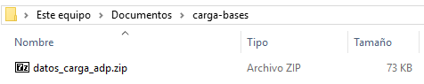
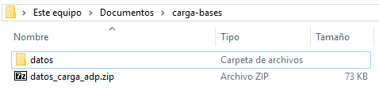
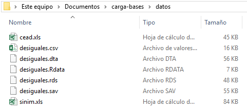
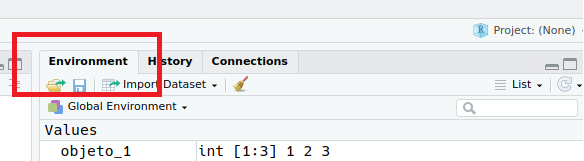
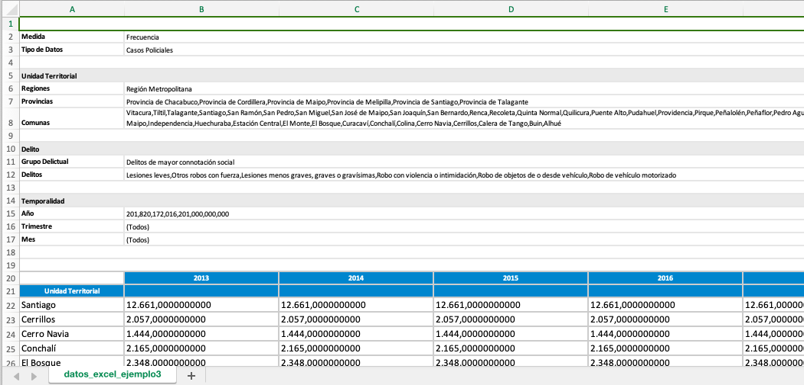

# Carga de bases {#carga}
*Por Soledad Araya y Andrés Cruz*

## Introducción {#carga-intro}

Cargar bases de datos no es siempre una tarea fácil. Quienes crean bases de datos utilizan distintos formatos de archivo, tratando de optimizar diferentes parámetros (usabilidad por usuarios de ofimática, tamaño, etcétera). A veces, la información que necesitas está distribuida en múltiples bases de datos pequeñas. En otros casos, el problema es la magnitud de los datos, con bases de datos que, utilizando los métodos usuales de carga, atentan contra la integridad de tu computador personal. Las siguientes tres subsecciones esperan guiarte en la resolución de estos desafíos.

A diferencia de los otros capítulos del libro, en este se requiere que descargues las bases de datos directamente en tu computador, sin usar nuestro paquete asociado. ¡La idea es que aprendas a cargar datos en el mundo real! Comienza creando una carpeta en tu computador, que será la carpeta del proyecto. Nosotros llamaremos a nuestra carpeta del proyecto, muy originalmente, `carga-bases`. Luego, descarga desde [este link](https://arcruz0.github.io/adp-bookdown/00-archivos/datos_carga_adp.zip) el archivo .zip con las bases de datos para el capítulo, y guárdalo en la carpeta que creaste antes. En Windows, por ejemplo, esto debería verse parecido a la siguiente imagen:
 
```{r carpeta-1, echo=FALSE, out.width='65%', fig.cap="Carpeta con archivo .zip"}

```

Luego, debes descomprimir el contenido del archivo .zip. La forma exacta de hacer esto dependerá de tu sistema y sus programas, pero suele ser algo similar a `Click Derecho > Descomprimir aquí`. Deberías tener ahora una subcarpeta llamada "datos":

```{r carpeta-2, echo=FALSE, out.width='65%', fig.cap="Carpeta con subcarpeta ya descomprimida"}

```

Revisa esta nueva subcarpeta. Están las bases de datos a utilizar en este capítulo. Como verás, aprenderemos a cargar y utilizar múltiples formatos comunes:

```{r carpeta-3, echo=FALSE, out.width='65%', fig.cap="Subcarpeta con archivos de datos"}

```

¡Casi terminamos! Como se justifica y explicamos en mayor detalle en el Capítulo \@ref(manejo-de-datos), haremos uso de *RStudio Projects* para ordenar nuestro trabajo. A continuación, crea un proyecto de RStudio haciendo click en la parte superior derecha de RStudio, "Project…", y luego "New Project". Seleccionando "Existing Directory" en la siguiente ventana podrás vincular al proyecto la carpeta que creaste antes (en nuestro caso, `carga-base`):

```{r rstudio-projects, echo=FALSE, out.width="60%", fig.cap="Crear nuevo proyecto de RStudio en carpeta existente."}
knitr::include_graphics("00-images/carga/rstudio_projects.png")
```

¡Perfecto, ahora deberías tener tu nuevo proyecto para comenzar a trabajar ordenadamente, con los datos del capítulo!

## Distintos formatos de bases {#carga-formatos}

En esta subsección aprenderás a cargar distintos formatos de bases de datos en `R`: separados por delimitadores, creados en R, creados con etiquetas en Stata o SPSS, y nativos de Excel.

### Archivos separados por delimitadores (.csv y .tsv)

Un archivo de texto plano (o *flat file dataset* en inglés) es un archivo formado sólo por texto o caracteres. Es un formato soportado por distintos programas, y muy fácil de trabajar. La única diferencia es en el tipo de separador que utilizan: (1) en el caso de .csv, el separador es una coma (,) y (2) en el caso de .tsv es separado por una tabulación (o topes) que se expresan con `<TAB>` o `\t`. Por su masividad, es importante saber cómo tratar estos archivos dependiendo de sus características. 

#### R base

R base tiene funciones para leer este tipo de archivos. Quizás, más de alguna vez te has encontrado con `read.table` o `read.csv`, que es una función específica para leer archivos csv del paquete integrado `utils` de R. El primero debería ser suficiente para abrir cualquiera de estos archivos. Solo hay que tener especial preocupación con las características de cada uno. Como habíamos mencionado, las separaciones de estos archivos suelen ser diferentes, y esta función nos da la posibilidad de especificar el tipo de separación (",", ";", "|" o "\t") con el argumento `sep =`.

Sin embargo, existen mejores opciones para cargar este tipo de bases de datos. Si bien `read.table()` puede resultar amigable cuando estás recién empezando, cuando necesitas trabajar con archivos mucho más grandes y pesados, no es suficiente. Una segunda desventaja de `read.table()` es que, normalmente, no suele funcionar adecuadamente con archivos que tienen caracteres especiales, ¡una gran desventaja para nosotros los hispanohablantes!

Para esos casos, tenemos diferentes alternativas que presentaremos a continuación.

#### `readr` {#carga-readr}

El paquete `readr` es el encargado de introducir una serie de funciones para leer distintos tipos de archivos. A primera vista, la diferencia entre las funciones de `utils` y las de `readr` es un guión bajo. Aun así, las funciones de `readr` suelen trabajar mejor con bases grandes, y su velocidad es mucho mayor al momento de leerlas. `readr` al igual que muchos de los paquetes ya presentados, es parte de los paquetes del núcleo de `tidyverse`. Así que puedes decidir si llamarlo por sí solo, o con las herramientas de su universo.

```{r}
library(tidyverse)
# library(readr) # ¡esto también funcionaría, pero no cargaría lo demás!
```

Comencemos presentando una de las fuentes de datos que ocuparemos en este capítulo, proveniente del proyecto [Desiguales]((https://www.desiguales.org/)) del PNUD, que buscó mapear las complejidades de la desigualdad en Chile ayudándose de una encuesta aplicada el año 2016. Utilizaremos una pequeña subsección de su base de datos, que contiene información para 300 encuestados y encuestadas a lo largo de 20 variables. Como pudiste revisar antes, contamos con la base de datos en seis formatos diferentes para el desarrollo de este capítulo:

```{r carpeta-3-2, echo=FALSE, out.width='65%', fig.cap="Subcarpeta con archivos de datos"}

```

¿Cómo cargar la base en formato .csv, entonces? Como sospecharás, comenzamos con la base más simple de cargar. Gracias a la función `read_csv()` de `readr`, solo necesitaremos poner la ruta del archivo dentro de nuestro proyecto:

```{r echo=F}
df_desiguales_csv <- read_csv("00-datos/carga/desiguales.csv")
```

```{r eval=F}
df_desiguales_csv <- read_csv("datos/desiguales.csv")
```

Comenzamos el nombre del objeto con "df" como abreviatura de *dataframe*. Para confirmar que nuestro archivo está en el ambiente como objeto, ocuparemos `ls()`. Con esta función puedes ver la lista de objetos que has creado o cargado. También puedes revisar esto en el panel de `Environment` de RStudio.
```{r solapa-env, echo=FALSE, out.width='60%', fig.cap="Solapa de Environment, arriba a la derecha"}

```

```{r}
ls()
```

Ahora que confirmamos que nuestro archivo cargó, necesitamos saber si es o no un objeto de clase *dataframe*. Como ya han visto en capítulos anteriores, en `R` podemos utilizar diferentes tipos de objetos (por ejemplo, vectores). Que no son siempre dataframes. Por eso es necesario revisar si lo que cargamos es o no el objeto que deseábamos. Para esto, ocuparemos la función `class()`.


```{r}
class(df_desiguales_csv)
```

Esta vez, comprobamos con `class()` que este archivo está en formato *dataframe* y *tibble*. Como seguiremos utilizando las herramientas propias del `tidyverse`, nos es útil trabajar con este formato.

Es ideal conocer un poco más de la función para capear posibles obstáculos cuando cargas bases de datos en este formato. Para empezar, puede que tu archivo esté separado por otro tipo de separador. Esto lo puedes definir con `delim =` que cumple la misma función que `sep =` en `read.table`. También, cuando manejas archivos con algún tipo de digitación diferentes, resulta útil conocer `locale` para especificar separador de decimales y miles.

Una segunda acotación: Probablemente al escribir`read_csv` en `R` vieron que también apareció sugerida la función `read_csv2()`. La única diferencia es el caracter con el que estamos delimitando nuestros datos: `read_csv2()` tiene como delimitador por defecto ";", mientras que en `read_csv()` es ",". Para archivos .tsv, está la función `read_tsv()`, función que no viene por defecto en el paquete `utils`.

Las funciones más comunes para explorar las bases de datos son `head()`, `str()`, `summary()` y `dim()`. También la función `glimpse()` del paquete `dplyr`.

Exploremos brevemente los datos que estamos manejando con `glimpse`. Las herramientas del paquete `dplyr` deberían estar disponibles ya, dado que ya cargaste el `tidyverse` antes. Ocuparemos `glimpse` para ver una breve panorámica de las primeras 10 columnas de nuestros datos:

```{r}
df_desiguales_csv %>% select(1:10) %>% glimpse()
```

¡Todo se ve bien! Sigamos explorando otras formas de cargar datos a R.

### Archivos creados con R (.Rdata y .rds) {#carga-r}

Ahora centraremos nuestra atención en los archivos creados con R, que tienen por extensión .Rdata (.Rda también es válido) o .rds. Estos formatos de archivo permiten almacenar *cualquier* objeto de R, ya sea un vector, *dataframe*, matriz, lista, etcétera. Tras leer el archivo, R cargará el objeto tal como fue guardado. De esta forma, los archivos en este formato destacan por (a) su flexibilidad a la hora de qué almacenan, no estando limitados a bases de datos, y (b) su compatibilidad perfecta con R: por ejemplo, podrás estar seguro de que cada variable en una base de datos .rds será cargada en el formato que corresponde (los vectores numéricos como numéricos, los factores como factores, y así^[Esto no es necesariamente cierto en un archivo .csv, por ejemplo, que no contiene esta información almacenada. Lo que R debe hacer para dicho formato --y otros --es inferir el tipo de archivo.]).

La diferencia entre un archivo .Rdata (o .Rda) y uno .rds es simple, pero importante: mientras que el primero puede contener cualquier número de objetos, el segundo está limitado a un objeto. A continuación aprenderás a cargar archivos creados con R, en cualquiera de estos dos formatos.

#### Archivos .Rdata (uno o más objetos) {#carga-rdata}

Los archivos .Rdata, crucialmente, pueden contener más de un objeto. Aunque esto suena conveniente, incluye una limitante: al cargar los objetos, estos automáticamente adoptarán el nombre con el que fueron creados. A modo de ejemplo, en el archivo .Rdata para la base de Desiguales hemos guardado dos objetos: el *dataframe* que vimos antes (ahora llamado `df_desiguales_rdata`) y un vector numérico con las edades de las personas encuestadas (llamado `vector_edades`). Para cargar el archivo basta con utilizar la función `load()`.

```{r echo=F}
load("00-datos/carga/desiguales.Rdata")
```

```{r eval=F}
load("datos/desiguales.Rdata")
```

Como habíamos visto, puedes revisar con el comando `ls()` si los objetos se cargaron correctamente en la sesión de R. Si los dos objetos se cargaron apropiadamente, ambos deberían aparecer nombrados, sumándose al anterior dataframe originado desde un archivo .csv.

```{r}
ls()
```

#### Archivos .rds (solo un objeto)

Los archivos .rds están limitados a almacenar un solo objeto. Aunque suene menos prometedor que la flexibilidad de .Rdata, este formato destaca por su modularidad, ayudando a mantener el orden en tus archivos. Otra cualidad positiva de .rds es que la sintaxis para cargarlos es familiar, muy similar a la que ya usaste antes para cargar el archivo .csv. ¡Ahora sí puedes nombrar el objeto al crearlo! El comando es el siguiente, usando la función `read_rds()` (que cargamos antes con `library(tidyverse)`):

```{r echo=F}
df_desiguales_rds <- read_rds("00-datos/carga/desiguales.rds")
```

```{r eval=F}
df_desiguales_rds <- read_rds("datos/desiguales.rds")
```

Nuevamente, puedes utilizar el comando `ls()` o RStudio para asegurarte de que el objeto se creó sin problemas en la sesión:

 ```{r}
ls()
```

¡Todo bien! Con la función `class()`, por cierto, puedes comprobar que el nuevo objeto `df_desiguales_rds` es, en efecto, un dataframe (¡y un tibble!).

 ```{r}
class(df_desiguales_rds)
```

### Datos con etiquetas (Stata o SPSS) {#carga-etiquetas}

Los datos con etiquetas son comunes en las ciencias sociales, ampliamente utilizados en los archivos de SPSS (.sav) y Stata (.dta). La idea principal es relativamente simple: en el archivo se guarda información explicativa adicional a los valores de la base de datos. Por ejemplo, la variable `p2` de la base de Desiguales, correspondiente a la segunda pregunta de la encuesta, podría tener asignada una etiqueta que describa la pregunta ("Estado civil") o la registre explícitamente ("Independiente  de  si  usted  tiene  o  no  tiene  pareja  actualmente, ¿podría decirme cuál es su estado conyugal o civil actual?"). Llamaremos a este tipo de etiquetas *etiquetas de variable*. 

Por otro lado, las etiquetas también pueden registrar información sobre los valores de las variables. Por ejemplo, en la misma pregunta `p2`, las siguientes respuestas eran posibles entre los y las encuestadas:

Valor | Etiqueta
----- | ---------------------------------
1     | Casado(a) por primera vez
2     | Casado(a) por segunda vez o más
3     | Casado(a) legalmente, pero separado de hecho
4     | Divorciado
5     | Soltero(a), nunca se ha casado
6     | Soltero(a), pero con un matrimonio legalmente anulado
7     | Viudo(a)
8     | Conviviente o pareja
88    | No Sabe
99    | No Responde

Una base de datos puede registrar simplemente los valores numéricos que registraron los y las encuestadoras, guardando en etiquetas la información explicativa. De esta forma, aunque la base de datos solo registra un "4" en la variable `p2` para una encuestada, la etiqueta ayuda a identificar que identificó su estado civil como divorciada. Llamaremos a este tipo de etiquetas *etiquetas de valores*.

A continuación, aprenderás a cargar bases de datos con etiquetas a R, provenientes de SPSS (.sav) o Stata (.dta). Esto te permitirá informar tu análisis por medios de las etiquetas, tanto de variables como de valores. Para esto necesitarás el paquete `haven`. Si es que ya instalaste el `tidyverse`, entonces tienes acceso a `haven`. Sin embargo, `library(tidyverse)` no bastará para cargarlo, debes hacerlo aparte^[Aunque `haven` es parte del `tidyverse`, no es miembro del "núcleo" de este. El núcleo del `tidyverse` incluye unos pocos paquetes, los más utilizados. El resto de los paquetes, como `haven`, deben cargarse (pero no instalarse) por separado.]: 

```{r}
library(haven)
```

Los comandos para cargar datos con etiquetas son similares a los que utilizaste anteriormente para cargar archivos .csv y .rds. Mientras que para SPSS la función es `read_spss()`, para Stata es `read_stata()`. Carguemos inmediatamente ambas bases:

```{r echo=F}
df_desiguales_spss <- read_spss("00-datos/carga/desiguales.sav")
```

```{r eval=F}
df_desiguales_spss <- read_spss("datos/desiguales.sav")
```

```{r echo=F}
df_desiguales_stata <- read_stata("00-datos/carga/desiguales.dta")
```

```{r eval=F}
df_desiguales_stata <- read_stata("datos/desiguales.dta")
```

Puedes, nuevamente, revisar que se crearon los objetos utilizando `ls()` o el panel "Environment" de RStudio. Además, puedes chequear que, en efecto, son *dataframes* y tibbles:

```{r}
ls()
class(df_desiguales_spss)
class(df_desiguales_stata)
```

Las bases de datos con etiquetas se distinguen de otras no en la clase de objeto, sino que en sus variables. Utilizando herramientas que aprendiste en el [capítulo de manejo de datos](), puedes explorar las diez primeras variables de cualquiera de las bases (ambas darán el mismo resultado, por lo que de ahora en adelante nos centraremos en la proveniente de SPSS).

```{r}
df_desiguales_spss %>% select(1:10) %>% glimpse()
```

Como puedes notar, la mayoría de las variables no son solo vectores numéricos ("dbl" o "double"^[Esta es una forma de llamar a los números reales en computación]), sino que también incluyen etiquetas (+ "lbl" o "label", etiqueta en inglés). Ocupando el comando `head()`, obtengamos los seis primeros valores y más información de nuestra variable etiquetada `p2`:

```{r}
head(df_desiguales_stata$p2)
```

Analicemos brevemente el resultado que reporta la consola. En primer lugar, se muestra nuevamente que la variable en cuestión es un vector numérico con etiqueta ("<Labelled double>"). Luego, tras dos puntos, se registra la *etiqueta de variable*: "P2 - ¿podria decirme cual es su estado conyugal o civil actual?". A continuación se encuentran los seis primeros valores de la variable, como se requirió a través de `head()`. Por último se hallan las *etiquetas de valores*, que entregan información sobre qué significa cada número en el contexto de la variable. 

De esta forma, obtuvimos toda la información que registran las etiquetas para esta base. Con los comandos que viste anteriormente puedes tener claridad de qué significa cada valor en tu base de datos etiquetados. Para terminar, nota que R, con la ayuda de `haven`, también mostrará las etiquetas en otros casos, cuando sea conveniente. Por ejemplo, a continuación veamos un resumen simple de las dos primeras variables de la base de datos. ¡Nota lo fácil que es de leer!

```{r}
df_desiguales_stata %>% select(region, p2)
```

### Archivos de Excel {#carga-excel}

Si bien la mayoría del tiempo utilizaremos bases de datos que vienen en los formatos anteriores, tenemos que tener en consideración que no todas las instituciones presentan su información así. Muchas veces tendrás que enfrentarte a formatos que generan dolores de cabeza. Por ejemplo, Excel. En Chile, muchas organizaciones gubernamentales aún trabajan con Excel y el problema en sí no es el formato, sino la estructura usual de las bases.

La mayoría del tiempo nos enfrentaremos a algo así:

```{r ejemplo-excel-1, echo=F, out.width="75%", fig.cap = "Base de datos del Sistema Nacional de Información Municipal (SINIM)"}
knitr::include_graphics("00-images/carga/ejemplo_sinim.png")
```

O así:

```{r ejemplo-excel-2, echo=F, out.width="75%", fig.cap = "Base de datos del Centro de Estudios y Análisis del Delito (CEAD)"}

```

Es en ese momento donde empiezan los problemas.

Para empezar, carguemos uno de los paquetes más usados para leer archivos de Excel (.xls o .xlsx) es `readxl`, un paquete del `tidyverse`^[Al igual que `haven`, `readxl` es parte del `tidyverse`, pero no es miembro del "núcleo" de este. Por lo tanto, es necesario cargarlo por separado]:

```{r}
library(readxl)
```

Para el siguiente ejemplo, ocuparemos la base de datos del [Centro de Estudias y Análisis del Delito (CEAD)](http://cead.spd.gov.cl/estadisticas-delictuales/). Esta base es la que, por defecto, se puede bajar desde su página web. 

Para cargar el archivo, ocuparemos `read_excel()` de `readxl`. Sólo es necesario poner la ruta de acceso al archivo .xls o .xlsx:

```{r echo=F}
df_cead_excel <- read_excel("00-datos/carga/cead.xls")
```

```{r eval=F}
df_cead_excel <- read_excel("datos/cead.xls")
```

Primero, revisamos que los datos se hayan cargado de forma correcta en el Environment con `ls()`. Luego, ocuparemos `glimpse` para tener un "vistazo" de las primeras observaciones en nuestra base de datos:

```{r}
ls()
df_cead_excel %>% glimpse()
```
Algo no se ve bien.

Si miramos nuevamente la imagen de la base de datos del CEAD, nos daremos cuenta qué está ocurriendo. Para empezar, el archivo Excel tiene en sus filas iniciales información de la base, pero estas no son observaciones. 

```{r ejemplo-excel-3, echo=F, out.width="75%", fig.cap = "Base de datos del Sistema Nacional de Información Municipal SINIM."}

```

Para solucionar esto, es necesario utilizar `skip =`. Este argumento nos ayudará a saltarnos las filas que no nos interesan, en este caso, 18:

```{r echo=F}
df_cead_excel_v2 <- read_excel("00-datos/carga/cead.xls", skip = 18)
```

```{r eval=F}
df_cead_excel_v2 <- read_excel("datos/cead.xls", skip = 18)
```

Otra forma de hacer lo mismo, es delimitar la información que queremos cargar a través del rango. Así, demarcamos el rango con `range` y obtendremos sólo la información dentro del rectángulo que especifiquemos. El rango lo delimitamos con la letra de la columna y el número de fila del archivo .xls o .xlsx.

```{r echo=F}
df_cead_excel_v3 <- read_excel("00-datos/carga/cead.xls", range = "A20:G81")
```

```{r eval=F}
df_cead_excel_v3 <- read_excel("datos/cead.xls", range = "A20:G81")
```

Verificamos que se haya cargado correctamente con `ls()` y luego vemos el tipo de archivo con `class()`. Para efectos del capítulo, ocuparemos sólo la última versión del archivo .xls cargado (df_cead_excel_v3).

```{r}
ls()
class(df_cead_excel_v3)
```

Como puedes observar, es muy fácil cargar este tipo de archivos después de practicar un poco. Por ahora, eso es lo que necesitas saber para cargar archivos .xls o .xlsx. Puede que tengas que lidiar con problemas de digitación, con nombres de variables imposibles o con errores de tipeo que pueden causar más de un problema cuando trabajas con `skip` (¿Por qué hay tantas variables si solo eran 15 columnas? ¡Alguien metió mal el dedo!). Pero ya manejas herramientas del `tidyverse`que te pueden ayudar con eso.

Trataremos de hacer algunos cambios básicos a la base del CEAD:

```{r}
names(df_cead_excel_v3)
```

El primer problema es el nombre de la columna que indica el municipio. El segundo problema es que, al menos que queramos tener una base de datos *ancha*, ¡No nos sirve tener los años como columnas! Para el primer problema ocupamos `rename` y para el segundo `gather`. De esta forma, nos quedamos con una base *larga*. 

```{r}
df_cead_excel_v2 <- df_cead_excel_v3 %>% 
  rename(county = "..1") %>% 
  gather(key = year, value = n_crime, -county)
```

Otro tipo de problema al usar archivos de Excel es que la información puede estar dividida en distintas hojas. Como verás, `read_excel()` se hace cargo de esto de una manera muy simple. Para demostrar esto, utilizaremos la base del [Sistema Nacional de Información Municipal SINIM](http://datos.sinim.gov.cl/index.php):

```{r echo=F}
df_sinim_excel <- read_excel("00-datos/carga/sinim.xls", 
                             sheet = 2, skip = 2, na = "No Recepcionado")
```

```{r eval=F}
df_sinim_excel <- read_excel("datos/sinim.xls", 
                             sheet = 2, skip = 2, na = "No Recepcionado")
```

Con el argumento `sheet =` seleccionamos la hoja que queremos cargar a `R`. Podemos cargarla tanto con el número de la posición como con el nombre de la hoja. Como ya vimos, con `skip` seleccionamos el número de filas que nos saltaremos al cargar la base, y con `na` damos a entender qué otra frase, palabra o situación queremos catalogar como NA aparte de las celdas en blanco.

Una de las tareas principales cuando trabajas con Excel es la limpieza de la base de datos. Lamentablemente, estos dos ejemplos son muy comunes, y para lidiar con algunos de estos problemas está `janitor`. 

Normalmente, los nombres de las variables en Excel suelen venir de forma detallada y/o descriptiva: pueden tener espacios, caracteres especiales y mayúsculas que dificultan trabajar fácilmente con las variables de interés. Por ejemplo, los nombres de las columnas en esta base de datos tienen tienen todo lo mencionado:

```{r}
names(df_sinim_excel)
```

¿Se imaginan tener que escribir esos nombres cada vez que queramos hacer algún tipo de análisis? 

Para eso tenemos la función `clean_names()` del paquete `janitor`. Este es un paquete creado para facilitar la limpieza de datos y, sin ser un paquete del `tidyverse`, puede usarse sin problemas con los pipes. Y, para nuestra suerte, está optimizado para funcionar con `readr` y `readxl`.

La función `clean_names()` funciona de manera simple, luego de haber instalado `janitor` (con `install.packages("janitor")`:

```{r}
df_sinim_excel_v2 <- df_sinim_excel %>% janitor::clean_names()
```

Ahora, revisemos nuevamente los nombres de las variables:

```{r}
names(df_sinim_excel_v2)
```

¡Esto se ve mucho mejor!

Esta función hace más simple y amigable el trabajo en R, independiente de tu nivel de conocimiento y lo que busques hacer. Trabajar con los nombres de las variables puede ser un dolor de cabeza, y esta herramienta te evitará trabajar demás y así concentrarte en lo sustantivo de tu análisis (que, definitivamente, no debería ser el nombre de las columnas).

Con estas herramientas que te hemos entregado, deberías estar más que preparado para enfrentarte al terrible mundo de trabajar con Excel.


## Múltiples bases de datos a la vez

**PENDIENTE**

## Bases de datos tabulares grandes {#carga-grandes}

Las bases de datos grandes cada vez se encuentran más al alcance de los y las cientistas sociales, de la mano de los avances en los procesadores y la velocidad de las conexiones a internet. Sin embargo, las herramientas usuales de manejo de datos tabulares a menudo no funcionan correctamente en bases de datos grandes, y es necesario buscar alternativas. Qué tan complejo es lidiar con el tamaño de una base de datos depende de múltiples factores (la naturaleza de los datos y las características del computador, por ejemplo), pero, en general, podemos aventurar que una base de datos tabular de más 1 GB de tamaño le dará problemas a `R` en un computador personal regular. ¿Qué hacer para lidiar con este tipo de base de datos?

A continuación trabajarás con la base de Desiguales en formato .csv, como lo hiciste en la subsección \@ref(carga-formatos) de este capítulo. Asumiremos que se podría tratar de una "base de datos grandes", aunque sus escuálidos 15 KB de tamaño digan lo contrario. Por cierto, si quieres probar a hacer los siguientes análisis con bases de datos grandes reales de interés politológico, puedes encontrar varias para descargar en el [Observatorio de Complejidad Económica](https://atlas.media.mit.edu/es/), que registran comercio bilateral por distintas categorías productivas^[Estas se encuentran en formato .tsv, por lo que deberás alterar ligeramente la sintaxis siguiente, como viste en la subsección para archivos .csv/.tsv (\@ref(carga-formatos)).].

¿Cómo lidiar con una base de datos grande, entonces? Una primera alternativa a evaluar es si se necesita hacer uso de la base completa en el análisis, o si esta se puede hacer más pequeña antes. Para comenzar un análisis exploratorio que ayude a clarificar esto, recomendamos utilizar el argumento `n_max = ` en `read_csv()` y sus funciones hermanas (por ejemplo, `read_tsv()`). De la siguiente forma podemos solo leer las primeras cien observaciones de la base de datos en cuestión, haciendo el proceso computacional ostensiblemente menos costoso:

```{r echo=F}
df_desiguales_grande_100 <- read_csv("00-datos/carga/desiguales.csv", n_max = 100)
```

```{r eval=F}
df_desiguales_grande_100 <- read_csv("datos/desiguales.csv", n_max = 100)
```

Seguramente tu sistema podrá manejar con facilidad esta nueva base de datos reducida. Ahora bien, ¿qué pasa si, tras revisar los datos, te das cuenta de que solo necesitas un par de variables para tu análisis? Recortar la base de datos te permitirá hacer un uso más eficiente de tus recursos computacionales. Nota que ahora el argumento `n_max = ` no servirá, pues esta recorta filas en vez de columnas. Por ejemplo, supongamos que de la base de Desiguales ("grande" en nuestro ejemplo) solo necesitas las variables `edad` y `p2`. Con la ayuda de una función de asistencia de nuestro paquete `paqueteadp` (`cols_only_chr()`), puedes hacer que `read_rds()` cargue la base solo con dichas variables, obviando todas las demás y el costo computacional que ellas significan:

```{r message=F}
library(paqueteadp)
```

```{r echo=F}
df_desiguales_grande_2vars <- read_csv("00-datos/carga/desiguales.csv",
                                       col_types = cols_only_chr(c("edad", "p2")))
```

```{r eval=F}
df_desiguales_grande_2vars <- read_csv("datos/desiguales.csv",
                                       col_types = cols_only_chr(c("edad", "p2")))
```

Ahora la nueva base `df_desiguales_grande_2vars` tendrá todas las observaciones, pero solo se habrán cargado las dos variables requeridas, como puedes chequear con un resumen simple:

```{r}
df_desiguales_grande_2vars
```

¿Qué pasa si las variables a cargar son varias, y se hace tedioso añadir todos los nombres "a mano"? Supongamos que solo quieres las primeras 15 variables de la base para tu análisis. Los siguientes comandos solucionarán el problema, obteniendo primero los nombres de las variables (`names()`) a partir de tu base de análisis preliminar,  `df_desiguales_grande_100`:
```{r}
nombres_variables <- df_desiguales_grande_100 %>% 
     select(1:15) %>% 
     names()
```

```{r echo=F}
df_desiguales_grande_20vars <- read_csv("00-datos/carga/desiguales.csv",
                                        col_types = cols_only_chr(nombres_variables))
```

```{r eval=F}
df_desiguales_grande_20vars <- read_csv("datos/desiguales.csv",
                                        col_types = cols_only_chr(nombres_variables))
```


Ahora bien, es posible que algunos análisis no puedan prescindir de variables, o incluso que después de procedimientos como el anteriormente presentado las bases de datos sigan siendo demasiado pesadas. En estos casos, el ecosistema de `R` también provee de alternativas, que presentaremos brevemente a continuación.

Una primera opción es la función `fread()` del paquete `data.table`. Esta función, optimizada para obtener velocidad, es casi siempre más rápida que `read_csv()` y asociados, aunque no tiene el mismo rango de opciones ni facilidad de uso de estas. Una vez que `data.table` esté instalado en nuestro sistema --es decir, después de `install.packages("data.table")`--, el siguiente comando nos permitirá cargar la base de datos:

```{r message=F}
library(data.table)
df_desiguales_grande_fread <- fread("00-datos/carga/desiguales.csv")
```

Nota que, aunque el objeto creado es un *dataframe*, también es de un tipo especial llamado `data.table`:

```{r}
class(df_desiguales_grande_fread)
```

El paquete `data.table` tiene diversas funciones para lidiar con este tipo de objetos, que suelen ser más eficientes computacionalmente que las usuales --aunque, a menudo, menos intuitivas y legibles. Si es que quieres aprender más sobre `data.table`, puedes revisar las múltiples [viñetas](https://cran.r-project.org/web/packages/data.table/index.html) disponibles en la página del paquete, en inglés.

Por último, si incluso `data.table` no es lo suficientemente eficiente como para lidiar con tus datos, tenemos otra opción para presentarte. El paquete `ff`, con más de diez años de existencia, provee una solución interesante al problema de las bases de datos grandes: en vez de cargarlas en la memoria RAM, como hacen `R` y los paquetes que hemos visto, ocupa directamente el disco duro (que usualmente tiene mucho más espacio disponible). Aunque esto haga que la mayoría de las operaciones tradicionales de `R` no funcionen, `ff` abre la puerta al uso de bases gigantes: el paquete aporta toda una nueva familia de funciones de análisis *ad hoc*, inspiradas en las de `R`.

Puedes encontrar más información en inglés sobre `ff`, si lo requieres para un proyecto, en su [sitio web](http://ff.r-forge.r-project.org/) y su [archivo de ayuda](https://cran.r-project.org/web/packages/ff/ff.pdf) oficial de R. Si primero quieres comprobar cómo funciona el cargar tu base con este paquete, puedes utilizar el siguiente comando^[Es importante aquí la inclusión del argumento `file =`, pues este no es el primer argumento que recibe la función en cuestión.] --asumiendo que el paquete está instalado, con `install.packages("ff")`:

```{r message=F}
library(ff)
df_desiguales_grande_ff <- read.csv.ffdf(file = "00-datos/carga/desiguales.csv")
```

```{block, type="books"}
**Ejercicios antes de continuar al próximo capítulo**
- Desde la página web de [Latinobarómetro](http://www.latinobarometro.org/latContents.jsp) baja la edición de 2017 en formato SPSS (.sav) e impórtala a `R`. ¡Cuidado con las etiquetas!

- Ahora, repetí el proceso bajando la base en formato de Stata (.dta).
```

