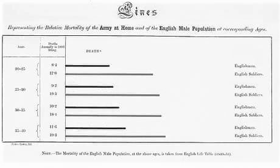

# Visualización de datos {#dataviz}

*Por Soledad Araya*

***

**Lecturas de referencia**

- Kastellec, J. P., & Leoni, E. L. (2007). Using graphs instead of tables in political science. *Perspectives on Politics, 5*(4), 755-771.

- Tufte, E. R. (2006). *Beautiful evidence* (Vol. 1). Cheshire, CT: Graphics Press.

***

## ¿Por qué quiero visualizar mis datos?

Ya aprendiste a manejar comandos del `tidyverse` y tienes ganas de, rápidamente, sumergirte en el mundo de los gráficos y aplicar el conocimiento adquirido en tu propia base de datos. Con el `tidyverse` y `ggplot2` el manejo de datos en R se simplifica de una manera impresionante, pero hay pasos anteriores que debes realizar antes de empezar a escribir tu código. Por ejemplo, conocer tus variables. ¿Son variables continuas o categóricas?Y si es categórica ¿tiene dos o más niveles?, y esos niveles ¿están ordenados o no?. Y estas no son las únicas preguntas. Parece muy simple, pero si no tienes considerado esto previo a tu trabajo con `ggplot2` las cosas se pueden poner feas muy rápido. Ejemplos de esto hay en [accidental aRt](https://twitter.com/accidental__aRt). 

Pregunta rápida: ¿por qué representamos gráficamente nuestros datos?

Primero, sé que a muchos nos interesa representar nuestros datos gráficamente porque es una forma atractiva de hacerlo. Pero tener buen o mal gusto no significará una real diferencia si nuestros datos no están expresados de la forma correcta. Por lo tanto, es necesario *entender* qué queremos expresar y eso, a veces, puede ser una tarea titánica si no comprendemos por qué estamos  haciendo este tipo de representación. A veces, podemos usar tablas para establecer cantidades y/o patrones, pero el manejo de datos en la actualidad convierte esto es una tarea compleja e ineficiente.

Por eso, volvamos a la pregunta central: ¿por qué visualizar? ¿por qué no simplemente hacer tablas que expresen lo que queremos decir? A través de la visualización podemos entender otro tipo de problemáticas que los números por sí solos no nos muestran. Al visualizar, queremos explorar y entender nuestros datos. Graficar, además, nos puede ayudar con la interpretación de patrones, tendencias, distribuciones, etcétera. No son pocos los ejemplos de cómo la visualización ayudó a detectar un problema en un momento dado. Es más, la visualización nos puede ayudar a generar una reacción en nuestro receptor, y muchas veces es esta reacción la principal razón por la cual buscamos otra forma de ilustrar nuestros datos. 

```{r florence-nightingale, echo=F, out.width="30%", fig.cap="Estatista Florence Nightingale (1820-1910)."}
knitr::include_graphics("00-images/dataviz/florence_nightingale.jpg")
```

Florence Nightingale (1820-1910) fue una enfermera y estadista que ayudó a reorganizar la administración de los hospitales cívicos y militares en Gran Bretaña. Ella, con ayuda de un equipo, logró hacer un registro de las muertes y enfermedades en los hospitales militares en la Guerra de Crimea. Para su sorpresa, la gran mayoría de las muertes eran evitables, y la gran causa de ellas eran las condiciones paupérrimas del sistema de salud. Uno de los reportes hechos para el gobierno de Gran Bretaña era el siguiente gráfico:

```{r mortality-nightingale1, echo=F, out.width="60%", fig.cap="Diagrama sobre causas de mortalidad de la armada."}
knitr::include_graphics("00-images/dataviz/nightingale_mortality.jpg")
```

En el primer gráfico, podemos ver las causas principales de mortalidad de la armada británica. En rojo, muerte por heridas de guerra, en azul, enfermedades prevenibles y en negro, otro tipo de causas. Este gráfico no sólo nos entrega información cuantitativa de las muertes, también señala un problema sustantitivo del sistema de salud militar en ese entonces.

```{r mortality-nightingale2, echo=F, out.width="60%", fig.cap="Gráfico de barras diferenciando la mortalidad de los soldados británicos y los civiles."}

```

Ambos gráficos dieron a conocer el problema, lo cual fue el pie inicial para la formulación de reformas. Así, la visualización se convierte en una herramienta aplicable a todos los pasos de la investigación. Es importante en un primer momento para la exploración de los datos y entender cómo se relacionan entre ellos, sus distribuciones y frecuencias. Luego, la visualización nos es útil para mostrar al lector posibles tendencias o patrones en los datos. Finalmente, la visualización es una gran herramienta de difusión del conocimiento. Pero recuerda: un gran poder conlleva una gran responsabilidad, y las relaciones espurias dejan de ser entretenidas cuando las personas se las creen. 

Aun así, siempre es entretenido ver cómo existe una correlación entre el [consumo de queso per cápita y el número de personas que mueren estranguladas por sus sábanas en Estados Unidos](http://tylervigen.com/spurious-correlations). 

[James E. Monogan III, (2015)](https://link.springer.com/chapter/10.1007%2F978-3-319-23446-5_3) ya resumía de forma muy simple, y para cientistas sociales, por qué la visualización de datos es importante al momento de trabajar con datos cuantitativos. En la introducción del capítulo, Monogan en simples líneas nos habla de la importancia y la ventaja que conlleva trabajar con imágenes, desde la simple distribución de las variables, sus outliers o sesgos; hasta el cambio de ellas a través del tiempo. Por esta razón, la visualización de datos es una herramienta fundamental para cualquiera que trabaje con datos. No es, por ningún motivo, un "movimiento estético"; graficar es extremadamente útil.

Aun así, para algunos, la visualización de datos es tanto un elemento funcional al análisis como un elemento estético por excelencia. Para [Edward R. Tufte, (2006)](http://pages.mtu.edu/~hcking/Tufte_hKing.pdf) visualizar datos de forma efectiva tiene un componente artístico inevitable. Con formación de estadista y Doctor en Ciencia Política de la Universidad de Yale, Edward Tufte se dedicó a entender y explicar cómo la ciencia y el arte tienen en común *la observación a ojos abiertos que genera información empírica*. Su libro [Beautiful Evidence](https://www.amazon.com/gp/product/0961392177/102-6444562-7552168?) describe el proceso de cómo *ver* se transforma en *mostrar*, y cómo la observación empírica se transforma a su vez en explicaciones y evidencia.

```{r beautiful-evidence, echo=F, out.width="60%", fig.cap="Portada de 'Beautiful Evidence'."}
knitr::include_graphics("00-images/dataviz/beautiful_evidence.jpg")
```

Tenemos que entender que la visualización de datos es un lenguaje como cualquier otro. Como emisores, tenemos que conocer a nuestra audiencia: quiénes son los receptores del mensaje, si es un público experto o simplemente gente de a pie. En cualquier circunstancia nosotros adecuaríamos nuestro mensaje al tipo de receptor. Lo mismo sucede cuando visualizamos datos. Los gráficos que hacemos tienen que adecuarse a nuestro público. Pero incluso con la gente más entendida no hay que abusar: no se trata de aplicar todo lo que sabemos a la vez, sino de entender qué estamos tratando de proyectar. Por lo tanto el código --entendido como los signos y reglas-- tiene que tener un sentido e insertarse en un contexto específico. Entender las funciones del lenguaje es fundamental.

Tanto el código como el canal tienen que ser adecuados para que todos entiendan lo que estoy intentando mostrar con mis datos. Por eso, vale preguntarse:

1. ¿Mis datos están siendo bien *representados*? ¿Escogí el tipo de gráfico *adecuado* para mis datos?
2. Este tipo de representación ¿es *efectiva*? ¿Estoy *comunicando* lo que quiero comunicar?
3. Los elementos visuales ¿se *entienden*? ¿Se *leen* de forma correcta?

El buen uso de las funciones del lenguaje no sólo sirve para rendir y aprobar exámenes escritos, sino que también es muy útil para entender que el mensaje no se construye sólo con código. Hay mucho más detrás de eso.

En el siguiente ítem, hablaremos de cómo funciona `ggplot2` para entenderlo un poco más. De ahí en adelante, empezaremos con lo práctico. Para empezar, los tipos más comunes de representaciones visuales como lo son el histograma, el gráfico de barras, de densidad, de línea, entre otros. Además, introduciremos otros paquetes de utilidades para hacer gráficos más sofisticados. Finalmente, veremos algunos otros paquetes que nos pueden ser útiles dentro de las ciencias sociales, y la ciencia política en particular, como lo son `sf` y `ggparliament`.

Si quieres aprender más sobre visualización de datos, revisa [Data Visualization: A Practical introduction](http://socviz.co) de Kieran Healy, un libro disponible de forma gratuita, que es entretenido y didáctico para enseñar `ggplot2` paso a paso. En este libro no sólo encontrarás la parte teórica, sino también la práctica. Por otro lado, la página [From Data to Viz](https://www.data-to-viz.com/) puede hacerte de ayuda para saber cómo quieres presentar tus datos, pero no sólo eso: ya sea que trabajes con R o Python, puedes encontrar los paquetes y códigos para su aplicación.

## Primeros pasos

Ahora que entendemos el proceso previo a la construcción del gráfico, tenemos que familiarizarnos con `ggplot2`. [A Layered Grammar of Graphics](https://byrneslab.net/classes/biol607/readings/wickham_layered-grammar.pdf) de Hadley Wickham, explica de forma detallada el funcionamiento de esta nueva "gramática" para hacer gráficos. Si dominas inglés, te recomiendo que leas de primera fuente cómo se pensó este paquete y cómo entender el uso de las capas en la construcción de los gráficos.

A pesar de que el uso de `ggplot2` se expandió rápidamente, dentro de la comunidad de R hay constantes discusiones sobre la enseñanza de `ggplot2` como primera opción, por sobre los gráficos de R base. Por ejemplo, [David Robinson](http://varianceexplained.org/r/why-I-use-ggplot2/) en su blog tiene diferentes entradas sobre este tema, en las cuales expone de forma contundente las ventajas de `ggplot2` por sobre las otras opciones. Si recién estás empezando a familiarizarte con R, empezar con `ggplo2` te brindará herramientas muy poderosas y la curva de aprendizaje no es tan elevada como lo requeriría R base.

Algunas de las ventajas que menciona David Robinson en "Why I use ggplot2" son:

* ¡Leyendas! R base requiere de más conocimientos de los usuarios para poder hacer leyendas en los gráficos. Nuestro amigo `ggplot2` las hace automáticamente.
* ¡Faceting! Suena extrañísimo, pero no encontré una traducción que le hiciera justicia. Básicamente, podemos crear subgráficos con terceras o cuartas variables que nos permita entender mejor el comportamiento de nuestros datos. 
* Trabaja en conjunto con el `tidyverse`. Eso quiere decir que podemos hacer más por menos. Al final del capítulo entenderás a lo que me refiero. Hay atajos para todo.
* Estéticamente, es mejor. Ni hablar de las miles de opciones de paletas cromáticas, temas, fuentes, etc. Si no te gusta, existe una forma de cambiarlo. 

Teniendo esto en consideración, comencemos con lo práctico.

### Las capas del multiverso ggplotidiano

Entremos al tema que nos interesa: ¿Cómo funciona `ggplot2`? Este paquete viene incluido en el `tidyverse`, por lo que no es necesario cargarlo de forma separada. Además, usaremos las herramientas de ambos paquetes durante todo el capítulo. El primer paso entonces es cargar el paquete:

```{r, message = FALSE}
library(tidyverse)
```

La intuición detrás de`ggplot2` es muy simple. La construcción de los datos se hace en base a capas que contienen cierto tipo de información. 

#### Datos

La primera capa son los datos que utilizaremos. Para hacer esto un poco más demostrativo, cargaremos los datos que usaremos a través de todo el capítulo.

```{r message=F}
library(paqueteadp)
```

```{r}
data(municipios_chile)
```

Ahora la base se ha cargado en nuestra sesión de R:

```{r}
ls()
```

Estos datos corresponden a información sobre las municipalidades chilenas. Algunos son del [Servicio Electoral](http://www.servel.cl) y otros del [Sistema Nacional de Información Municipal](http://datos.sinim.gov.cl/datos_municipales.php) de Chile. En la primera base encontramos los resultados de las elecciones locales, regionales y nacionales del país; y en la segunda, encontramos características económicas, sociales y demográficas de los municipios chilenos. En este caso, contamos con los datos electorales comunales desde 1992 al 2012, y además con datos descriptivos como la población, los ingresos totales de la municipalidad, el gasto en asistencia social y el porcentaje de personas en situación de pobreza según el total comunal de la Encuesta de Caracterización Socioeconómica Nacional, CASEN.

```{r}
str(municipios_chile)
```

Al mirar la base, encontramos que hay datos continuos (numéricos) y categóricos (factores). Saber qué tipo de variable manejamos es esencial para el siguiente paso.

#### Estética

La segunda capa corresponde al mapeo de las variables dentro del espacio. En este paso, utilizamos `mapping = aes()`, el cual contendrá la variable que tendremos en nuestro eje x y nuestro eje y. Para `aes()` hay muchas más opciones que iremos viendo dentro del capítulo: algunas de ellas son, por ejemplo, `fill`, `color`, `shape`, y `alpha`. Todas estas opciones son un conjunto de signos que nos permitirán traducir de mejor manera lo que queremos decir a través de nuestro gráfico. Normalmente, a estas opciones se le llaman *aesthetics* o `aes()`.

```{r, results='hide', warning=FALSE, fig.align='center'}
ggplot(data    = municipios_chile, 
       mapping = aes(x = year, y = casen))
```

El resultado muestra un cuadro vacío. Eso es porque no lo hemos dicho qué objeto geométrico es el que usaremos.

#### Objeto geométrico

Suena extraño, pero cuando hablamos de objeto geométrico o `geom`, estamos hablando del tipo de gráfico que queremos hacer, ya sea un gráfico de línea, uno de barra, un histograma, un gráfico de densidad, o de puntos, o si queremos hacer un boxplot. Esta es la tercera capa. En este caso, como tenemos los datos de la encuesta CASEN, haremos un boxplot para ver cómo se distribuyen los municipios de nuestra muestra. 

```{r, results='hide', warning=FALSE, fig.align='center'}
ggplot(data    = municipios_chile, 
       mapping = aes(x = year, y = casen)) +
  geom_boxplot()
```

Lo primero que notamos es la ausencia de datos para tres periodos. Lamentablemente, en el SINIM no hay datos anteriores al 2002, por lo que no hay registros para esos años. Por este motivo, parece una buena idea filtrar y dejar solo los años que tengan datos sobre la encuesta CASEN. Además de eso, nuestro gráfico no nos dice mucho sobre el porcentaje de pobreza y su distribución. Considerando la geografía chilena, sería una buena idea que vieramos la distribución por zona.  

#### Faceting

Ahora ocuparemos nuestras habilidades para hacer dos cosas: primero, ocuparemos `filter` para dejar sólo los años que nos interesan. Segundo, dividiremos los resultados por zona usando `facet_wrap`, que corresponde a la cuarta capa que podemos usar para armar un gráfico con `ggplot`. No siempre es necesaria, pero siempre es útil mostrar lo que puede lograr. Cuando utilizamos esta capa, lo que buscamos es organizar las geometrías que estamos utilizando en función de una variable categórica. En este caso, zona. Pero el *faceting* como acción es mucho más que esto. `facet_wrap` y `facet_grid` pueden tomar una serie de argumentos, donde el primero es el más importante. La sintaxis que usamos en este caso es la usada para fórmulas en R, y denotamos el primer argumento con el signo "~". Con `nrow` y `ncol` podemos especificar cómo queremos ordenar nuestro gráfico.

Finalmente, agregamos dos líneas de código, una para filtrar y otra para subdividir nuestra información. Esto es lo que logramos:

```{r, warning=F, fig.align='center'}
ggplot(data    = municipios_chile %>% filter(year == c(2004, 2008, 2012)),
       mapping = aes(x = year, y = casen)) +
  geom_boxplot() +
  facet_wrap(~ zona, nrow = 1)
```

Tanto con `facet_wrap` como con `facet_grid` podemos usar más de un argumento, pero los resultados son distintos. `facet_grid` no sólo ordena las geometrías, sino que es capaz de cruzarlas creando gráficos con dos o más dimensiones utilizando variables categóricas. Observen el siguiente ejemplo:

`facet_wrap`
```{r, warning=F, fig.align='center'}
ggplot(data    = municipios_chile %>% filter(year == c(2004, 2008, 2012)),
       mapping = aes(x = year, y = casen)) +
  geom_boxplot() +
  facet_wrap(zona ~ genero)
```

`facet_grid`
```{r, warning=F, fig.align='center'}
ggplot(data    = municipios_chile %>% filter(year == c(2004, 2008, 2012)),
       mapping = aes(x = year, y = casen)) +
  geom_boxplot() +
  facet_grid(zona ~ genero)
```

Este gráfico nos muestra que, por zona, el porcentaje de pobreza ha variado considerablemente desde el 2004 al 2012 y que hay una alta variabilidad intraregional. Además, nos muestra cómo `ggplot` entrega resultados de calidad sin mayores complejidades. La función `facet_wrap` es una capa opcional dentro de las múltiples capas de "A Layered Grammar of Graphics", pero es importante recordar que las otras tres capas deben estar presentes para cualquier tipo de resultado. 

#### Transformaciones

Otra capa que puedes utilizar es una capa que te permitirá hacer transformaciones de escala en tus variables. Normalmente aparecerá con el nombre `scale_x_discrete`, la cual va variando dependiendo de la estética que estemos utilizando dentro de nuestro mapeo. Así, podremos encontrarnos con `scale_fill_continuos` o `scale_y_log10`. Por ejemplo, podemos ver cómo se distribuye el ingreso de las municipalidades según el porcentaje de pobreza de nuestra muestra. Normalmente esto lo haríamos de la siguiente manera:

```{r, warning=F, fig.align='center'}
ggplot(data    = municipios_chile %>% filter(year == c(2004, 2008, 2012)),
       mapping = aes(x = casen, y = ingresos)) +
  geom_point() 
```

Teóricamente, cuando ocupamos una variable que tiene relación con dinero, le aplicamos una transformación logarítmica. Pero ¿cómo se traduce eso en nuestra imagen?

```{r, warning=F, fig.align='center'}
ggplot(data    = municipios_chile %>% filter(year == c(2004, 2008, 2012)),
       mapping = aes(x = casen, y = ingresos)) +
  geom_point() +
  scale_y_log10()
```

Esto es de lo que hablamos cuando hablamos de escalas.

#### Sistema de coordenadas

Normalmente, trabajaremos con un eje x y un eje y. Existen funciones en `ggplot2` como `coord_flip` que nos permitirá cambiar el sentido de nuestro gráfico. Pero también podemos usar este tipo de capa cuando trabajamos con datos geográficos o cuando, por ejemplo, queremos hacer un gráfico de torta. Aunque, normalmente, [no queremos hacer gráficos de torta](https://www.datapine.com/blog/common-data-visualization-mistakes/). Entre más utilices `ggplot2`, más aprenderás de cada una de las opciones. 

#### Temas

Cuando mapeamos los datos, usamos opciones estéticas. Cuando queremos cambiar cómo luce el gráfico, cambiamos el tema. Esto se puede hacer a través de `theme`, el cual te permite modificar cuestiones que no se relacionan con el contenido del grafico. Por ejemplo, los colores del fondo o el tipo de letras de los ejes. También puedes cambiar dónde se ubicará la leyenda o la ubicación del título. También, puedes cambiar el título, el nombre de los ejes, agregar anotaciones, etc. Solo necesitas conocer `labs`, `annotate` y `ggtitle`.  

Ahora, a aplicar todo lo que *al parecer* entendemos.

## Elecciones locales y visualización de datos

Como habíamos mencionado, lo principal es entender que la visualización nos sirve para explorar nuestros datos y contestar preguntas sustantivas de nuestra investigación. Muchas veces las medias, desviaciones estándar u otro tipo de parámetro no nos dicen mucho. Esos mismos datos podemos expresarlos a través de la visualización. Por ejemplo, un boxplot puede ser útil para representar la distribución de los datos que tenemos y ver sus posibles outliers, mientras que un gráfico de barras nos ayudará a ver la frecuencia de nuestros datos categóricos, y un gráfico de línea nos sirve para entender cambios en el tiempo. Y esos son sólo algunos ejemplos dentro de una variada gama de posibilidades.

En esta tercera parte, aprenderemos a visualizar diferentes tipos de gráficos con los datos de reelección municipal en Chile. Para contextualizar, en Chile la divisón político-administrativa más pequeña es la comuna o municipio que cada cuatro años escoge a sus autoridades locales: un alcalde y un concejo municipal. Desde 1992 al 2000, los alcaldes fueron electos de forma indirecta, y desde el 2004 en adelante empiezan a ser electos directamente por la ciudadanía. 

Ya que conocemos nuestros datos, podemos empezar por lo más simple. Una buena idea, por ejemplo, es ver la cantidad de mujeres electas como alcaldesas versus el número de hombres electos. Para eso, podemos usar un gráfico de barras. Como bien vimos en el ítem anterior, para armar cualquier tipo de gráfico necesitamos conocer la o las variables que queremos usar y cuál geometría o `geom` nos permite representar lo que queremos conocer. En este caso, usaremos `geom_bar` para ver cuántos hombres y cuántas mujeres han sido electos desde 1992.

### Gráfico de barras

```{r, fig.align='center'}
plot_a <- ggplot(municipios_chile, mapping = aes(x = genero))

plot_a + geom_bar()
```

Como vemos, armar un gráfico de barras es muy simple. Podemos ver que, desde el 2004, han sido electos más de 800 hombres como alcaldes, una cifra que supera largamente al número de mujeres que han sido electas para el mismo cargo en la misma cantidad de tiempo. 

Pero, quizás, esta cifra ha variado en el tiempo y no lo podemos ver en un gráfico de este tipo. Esta parece ser una buena razón para usar `facet_wrap`. 

```{r, fig.align='center'}
plot_a + 
  geom_bar() + 
  facet_wrap(~year, nrow = 1)
```

Como podemos ver, el número de alcaldesas parece aumentar. Aunque es un aumento mucho menor al esperado. Esta parece ser una problemática sustantiva al momento de hacer un análisis de gobiernos locales en Chile. 

Las geometrías `geom_bar` o `geom_col`, `geom_density` y `geom_histogram` no suelen llevar el eje y explicitado en las estéticas, ya que son un conteo sobre el eje x. Aun así, uno puede modificar el eje y en estas geometrías aplicando algún tipo de transformación. Por ejemplo, al especificar `y = ..prop..` como estética dentro del objeto geométrico, estamos ordenando el cálculo de la proporción, no la cuenta. Normalmente, usaremos `aes()` en conjunto con los datos en `ggplot()`, pero dependiendo de la preferencia que tengas, es posible usarlo también con los `geom`. Esto último es más común cuando ocupamos más de una base de datos o cuando queremos hacer algún tipo de transformación.

Por ejemplo, nos podria interesar el número de autoridades locales por zona geográfica. Para eso, nos sería útil usar la proporción, ya que cada zona geográfica está compuesta por una diferente cantidad de comunas. De esta forma, comparar la situación entre zonas sería más simple.

```{r, fig.align='center'}
plot_a + 
  geom_bar(mapping = aes(y = ..prop.., group = 1)) +
  facet_wrap(~zona, nrow = 1)
```

Pero, ¿por qué ocupamos `group = 1`?

Cuando queremos calcular la proporción con  `y = ..prop..`, tenemos que tener un cuidado especial si estamos usando `facet_wrap`. Esta función no la calcula en base a la suma de ambos géneros por zona, sino en base a sí misma. Por ejemplo, esta función registra que hay 89 hombres electos y 13 mujeres electas en el Norte Grande y concluye que "en el Norte Grande los 89 hombres corresponden al 100% de hombres electos, y las 13 mujeres corresponden al 100% de mujeres electas". Claramente, eso no es lo que queremos lograr representar en este grafico. Por esa razón, utilizamos `group = 1`. Intenta ver el resultado sin `group = 1` para ver qué resulta.

¡Ahora sí lo logramos! Vemos que no hay grandes diferencias, siendo el "Norte Chico" el que cuenta con más mujeres en la alcaldía en relación a los hombres, algo que podría resultar hasta contraintuitivo. A pesar de esto, no hay grandes diferencias de zona a zona y parece que se replicaran los resultados que vimos en nuestro primer gráfico de barras. 

Ahora, podríamos arreglar la presentación del gráfico. Todo buen gráfico debe llevar, por ejemplo, un título explicativo, la fuente de los datos y el detalle de los ejes.

```{r, fig.align='center'}
plot_a + 
  geom_bar(mapping = aes(y = ..prop.., group = 1)) +
  facet_wrap(~zona, nrow = 1) +
  labs(title = "Proporción de mujeres y hombres electos alcaldes (2004-2012)\nPor zonas económicas de Chile", 
       x = "Género", y = "Proporción", 
       caption = "Fuente: base de elaboración propia con datos del SERVEL y SINIM (2018)") 
```

Ahora, sólo nos falta agregar las etiquetas del eje x. Eso lo podemos hacer fácilemente con `scale_x_discrete`. Tienes que tener en consideración qué estética de `aes()` modificarás, ya que eso cambiará el `scale` que necesites. Si estuviéramos viendo las etiquetas de `fill`, tendríamos que usar `scale_fill_discrete`, por ejemplo. También tienes que tener en consideración qué tipo de variable estás usando. Que `scale_x_dicrete` tenga "discrete" al final no es una decisión aleatoria. Como comprenderás, depende totalmente del tipo de variable que estemos manejando.

```{r, fig.align='center'}
plot_a + 
  geom_bar(mapping = aes(y = ..prop.., group = 1)) +
  facet_wrap(~zona, nrow = 1) +
  scale_x_discrete(labels = c("Hombres", "Mujeres")) +
  labs(title = "Proporción de mujeres y hombres electos alcaldes (1992-2012)\nPor zonas económicas de Chile", 
       x = "Género", y = "Proporción", 
       caption = "Fuente: base de elaboración propia con datos del SERVEL y SINIM (2018)") 
```

Con `labels` podemos cambiar las etiquetas. Ten en consideración el número de `breaks` de tu variable categórica para que calcen a la perfección y no te sobre (o te falte) alguna categoría.

### Gráfico de Línea

En el gráfico final de la sección anterior, vimos que si bien la elección de mujeres alcaldesas en Chile ha aumentado, este aumento no parece ser significativo: en el 2012, sólo un 13% de los alcaldes electos eran mujeres. Quizás esto puede deberse a que los cambios socioeconómicos no han repercutido en la percepción sobre los roles de género en la sociedad. Tal vez, mirar los datos económicos de ingresos municipales o de porcentaje de pobreza según la CASEN nos ayuden a entender por qué no ha aumentado sustantivamente la elección de mujeres en las elecciones municipales. Para esto podemos usar `geom_line`, el objeto geométrico que nos permitirá ver la evolución en el tiempo de nuestro objeto de estudio. La intuición sería hacer la figura de esta manera:

```{r, fig.align='center', warning=F}
plot_b <- ggplot(data    = municipios_chile, 
                 mapping = aes(x = year, y = ingresos)) 

plot_b + 
  geom_line()
```

El problema es que no nos entrega el resultado esperado. La intuición es correcta, pero nosotros tenemos que ayudar a `geom_line` con ciertas especificaciones. `geom_line` agrupa las observaciones para crear el gráfico de línea. En este caso, las agrupa por lo que cree tiene más sentido: el año. Por esta razón, tenemos que especificar cuál es la variable que agrupa toda la información y, como sabemos, la información que tenemos está agrupada por municipio. Cuando agregamos esta información como `geom_lines(aes(group = comuna))`, el resultado cambia y se asemeja a lo que buscábamos:

```{r, fig.align='center', warning=F}
plot_b + 
  geom_line(mapping = aes(group = comuna))
```

Uno de los problemas que surge a primera vista es que, considerando que Chile tiene 345 comunas, parece imposible tenerlas todas en un solo gráfico.

Ahora, podemos separar el gráfico como lo habíamos hecho anteriormente. Se puede hacer por zona o por región, pensando en cuál resultado te interesa más. Ya que hemos visto diferentes resultados por zonas, sería interesante ver el ingreso de la misma manera.

```{r, fig.align='center', warning=F}
plot_b + 
  geom_line(aes(group = comuna)) +
  facet_wrap(~zona, nrow = 1)
```

Como son pocos los años que tenemos en la muestra, no podemos ver mucha variabilidad y a primera vista, parece que los ingresos de todos los municipios han incrementado considerablemente. Quizás, podemos seguir mejorando nuestro gráfico. Probablemente, no estés muy familiarizado con la notación científica y te sientes más cómodo leyendo números más grandes. Quizás sabes que es mejor trabajar todo tipo de variable monetaria con su transformación logarítmica, como nos han enseñado en diferentes cursos de métodología. Puede, también, que quieras agregar otro tipo de información a este gráfico, como por ejemplo, las medias.

¿Qué te parece el siguiente gráfico?

```{r, fig.height = 6, fig.width = 10, fig.align='center', warning=F}
medias <- municipios_chile %>% 
  group_by(zona) %>% 
  summarise(mean = mean(ingresos, na.rm = T))

plot_b + 
  geom_line(color = "gray70", aes(group = comuna)) +
  geom_hline(aes(yintercept = mean), data = medias, color = "dodgerblue3") +
  scale_x_discrete(expand = c(0,0)) +
  scale_y_log10(labels = scales::dollar) +
  facet_wrap(~ zona, nrow = 1) +
  labs(title = "Ingresos municipales en años electorales (2004-2012)",
       y = "Ingresos",
       x = "Años") +
  theme(panel.spacing = unit(2, "lines"))
```

¿Qué especificamos?

1. Primero, creamos una base de datos ("medias") que contiene los promedios de ingresos por cada zona. Esto lo hicimos utilizando `group_by` y `summarise` del `tidyverse`.

```{r}
municipios_chile %>% 
  group_by(zona) %>% 
  summarise(mean = mean(ingresos, na.rm = T))
```

2. Especificamos el color de `geom_line`.

3. Agregamos a nuestro código `geom_hline`. Este objeto geométrico, como `geom_vline` o `geom_abline`, nos sirven para agregar líneas con información. En este caso, lo usé para agregar el promedio de ingresos de cada zona. Especificamos la variable que contiene los promedios `yintercept = mean`, de la base `medias`, y además, especificamos el color con `color = "dodgerblue3"`.

4. Usamos `scale_x_discrete` para especificar la expansión de los paneles. Si antes se veía un espacio gris sin información, lo sacaremos. Esto es estético.

5. Utilizamos `scale_y_log10` para escalar nuestros datos. Como los presentábamos, no lográbamos ver más allá de aquellos municipios con un altísimo ingreso, mientras que las demás comunas quedaban apiladas en el fondo del panel. Esta es una transformación logarítmica que normalmente se hace cuando trabajamos modelos lineales que contienen datos monetarios. Además, cambiamos las etiquetas del eje y: ya no aparece la notación científica. Esto se hace con un paquete llamado `scales`. Aquí llamamos directamente la función con `scales::dollar`.

6. Agregamos el título y los nombres del eje x y eje y con `labs`.

7. Especificamos información del tema. Sin él, los años entre un panel y otro chocarían. Para eso, especificamos con `panel.spacing = unit(2, "lines")` en la capa `theme`.

### Boxplot

Ya vimos que los ingresos de los municipios crecieron entre el 2004 y el 2012. Cuando observamos el gráfico sin la transformación funcional, notamos que habían algunas comunas que tenían ingresos muy por sobre el resto y sobresalían dentro de sus zonas. La intuición nos dice que posiblemente sean *outliers*. Podríamos ver esto más claramente con un boxplot, el cual nos sirve para graficar diferentes datos descriptivos de nuestras variables como son la mediana, el mínimo y el máximo. En este caso, lo utilizaremos para ver si nuestra intuición era acertada o no.

Filtramos los datos como lo hicimos con el gráfico anterior. En nuestro eje x pondremos las zonas de Chile y en el eje y los ingresos. Además, ocuparemos otro tipo de estética: `color`, la cual usaremos para identificar de mejor manera cada zona. Propiedades estéticas como `fill`, `color`, `size`, cambian al ser utilizadas con variables discretas o continuas. 

Este es el resultado que trabajaremos:

```{r, warning=F, fig.align='center'}
plot_c <- ggplot(data    = municipios_chile %>% 
                   filter(year %in% c(2004, 2008, 2012)),
                 mapping = aes(x = zona, y = ingresos, color = zona)) +
  geom_boxplot() +
  facet_wrap(~year, ncol = 1)

plot_c
```

Uno de los problemas que podríamos tener con este gráfico, es que no nos permite observar bien los outliers, ya que la expansión del eje y es muy pequeña. Para solucionar esto podemos usar `coord_flip`, una función que nos permite dar vuelta los ejes de nuestro gráfico:

```{r, warning=F, fig.align='center'}
plot_c + 
  coord_flip() 
```

Ahora ya podemos observar mejor algunos de los *outliers* presentes. Quizás, después de ver estos resultados, nos gustaría identificar qué comunas son las que reciben más ingresos totales. Para eso podemos usar otra estética, `label` dentro de `geom_text`. Para nombrar sólo los outliers, tenemos que hacer un subset de los datos.

```{r, fig.align='center', warning=F}
plot_c + 
  coord_flip() +
  geom_text(data    = municipios_chile %>% filter(ingresos > 50000000),
            mapping = aes(label = comuna))
```

Lamentablemente, las etiquetas están por encima de los puntos y, en algunos casos, se pierden cuando estos están muy juntos. Una de las soluciones es con el paquete `ggrepel` que tiene el elemento geométrico `geom_text` "mejorado" para que las etiquetas no choquen entre sí. También, cambiaremos el color de las letras para que sea posible leerlas sin mayor dificultad. Como ven, este `color` va afuera de la estética de `geom_text_repel`, ya que definimos el color para todo el objeto. Cuando va dentro de `aes()`, el color se modifica según la candidad de, por ejemplo, ingresos o por el tipo de, por ejemplo, zona.

```{r, warning=FALSE, fig.align='center'}
library(ggrepel)

plot_c + 
  coord_flip() +
  geom_text_repel(data    = municipios_chile %>% 
                    filter(ingresos > 50000000),
                  mapping = aes(label = comuna), color = "black")
```

El corte puede ser en los $50.000.000 o en números más grandes o más pequeños. Depende completamente de lo que queremos observar. Además, con `geom_text` o `geom_text_repel` no solo puedes modificar el color, sino también el el tipo de fuente de la letra, o si debe estar en negrita, cursiva o subrayada. Para ver más opciones, debes ingresar `?geom_text` o llamar a `help("geom_text")`.

También podríamos agregar otro tipo de información o cambiar cómo está presentado lo que ya tenemos. 

```{r, fig.height = 6, fig.width = 10, fig.align='center', warning=F}
plot_c + 
  coord_flip() +
  geom_text_repel(data = municipios_chile %>% 
                  filter(ingresos > 50000000), 
                  mapping = aes(label = comuna), 
                  color   = "black", 
                  size    = 3) +
  scale_y_continuous(labels = scales::dollar) +
  labs(title = "Ingresos de las municipalidades según zona (2004-2012)",
       x = "Ingresos", y = "Zona", 
       caption = "Fuente: Elaboración propia en base a datos del SINIM (2018)") +
  guides(color = F)
```

Otras especificaciones:

1. Agregamos la información descriptiva del gráfico.

2. Cambiamos el tamaño de la letra. Esto era importante por la cantidad de comunas que están por sobre los $50.000.000 en ingresos.

3. Nuevamente, cambiamos las etiquetas del eje y con `scales::dollar`.

4. Por último, con `guides` y especificando el `aes()` que buscamos afectar, escribimos el código `color = F` para eliminar la leyenda, ya que era información que se repetía dentro del gráfico que realizamos.

Te invito a jugar con `geom_text`: cambia los colores, el tamaño, la fuente, etc. También, te insto a instalar paquetes que te permitirán personalizar aun más tus gráficos: `ggthemes` de [jrnorl](https://github.com/jrnold/ggthemes) tiene temas para gráficos de programas y revistas conocidas como Excel o The Economist. Por otro lado, `hrbrthemes` de [hrbrmstr](https://github.com/hrbrmstr/hrbrthemes) ha elaborado algunos temas minimalistas y elegantes que harán que todos los gráficos que hagas luzcan mejor. Si tienes algo por los colores, puedes mirar el paquete `wespalette` de [karthik](https://github.com/karthik/wesanderson) una paleta cromática basada en las películas de Wes Anderson o crear tus propias paletas según imágenes con `colorfindr`. Puedes averiguar más sobre este último en el siguiente [vínculo](https://github.com/zumbov2/colorfindr).

### Histograma

Según lo que pudimos observar en nuestro boxplot, muchas comunas --especialmente de la zona central--, están muy por encima de los ingresos medianos por zona. Podríamos ver la distribución de estos datos a través de un histograma. Hacer un histograma es muy fácil, y como lo había mencionado anteriormente, `geom_histogram` no lleva el eje y de forma explícita ya que cuenta la frecuencia de un evento dentro de cierto intervalo.

Cuando creamos el histograma según nuestra intuición, este es el resultado:

```{r, fig.align='center'}
ggplot(data    = municipios_chile, 
       mapping = aes(x = ingresos)) +
  geom_histogram()
```

Como podemos observar, el gráfico nos tira un "Warning" que nos indica que hay "738 filas que contienen valores no-finitos". Esta advertencia se ha repetido constantemente durante el capítulo, y no quiere decir nada más que "Hay valores 0 o desconocidos dentro de esta variable" y se debe, como sabemos, a que los primeros periodos no cuentan con información. Así que tranquilo, si filtráramos los datos con `filter(!is.na(ingresos))` lo más seguro es que la advertencia desaparezca. 

También, la consola nos dice este mensaje: *`stat_bin()` using `bins = 30`. Pick better value with `binwidth`*. Simplemente, nos dice que es posible modificar el número de intervalos.

Lo siguiente que haré será modificar el eje x. Nunca se me ha dado bien leer los números con la notación científica. Por otro lado, probaremos cambiando el número de intervalos con `bins`.

```{r, fig.align='center'}
ggplot(data    = municipios_chile, 
       mapping = aes(x = ingresos)) +
  geom_histogram(bins = 50) +
  scale_x_continuous(labels = scales::dollar) 
```

¿Qué pasa cuando ponemos `bins = 15` intervalos? 

Lo que haremos a continuación es hacer un subset de los datos. Teniendo en consideración el número de outliers que nos encontramos, eliminaremos los municipios que tienen ingresos mayores a los $50.000.000. También podemos ver la frecuencia por zona. Al igual que cuando ocupamos `color` con `geom_boxplot`, ocuparemos `fill` con `geom_histogram`.

```{r, warning=F, fig.align='center', fig.height = 6, fig.width = 10}
ggplot(data    = municipios_chile %>% filter(ingresos < 50000000), 
       mapping = aes(x = ingresos, fill = zona)) +
  geom_histogram(alpha = 0.5, bins = 50) +
  scale_x_continuous(labels = scales::dollar) +
  labs(title = "Número de municipalidades según sus ingresos anuales (2004-2012)",
       x = "Ingresos", y = "Número de municipios", 
       caption = "Fuente: Elaboración propia en base a datos del SINIM (2018)")
```

### Relación entre variables

Probablemente una de tus mayores preocupaciones es si las dos variables que estás estudiando se relacionan de algún modo. Con `ggplot` esto es muy simple de comprobar. En este caso, tenemos dos variables continuas: el porcentaje de pobreza de la CASEN y los ingresos municipales. Según la teoría, debería existir un tipo de relación: a mayor ingreso municipal, menor debería ser el porcentaje de pobreza en la comuna. Creamos nuestros datos:

```{r, warning=F}
plot_f <- ggplot(data    = municipios_chile, 
                 mapping = aes(x = casen, y = log(ingresos)))
```

Para este tipo de gráfico, utilizamos `geom_smooth`. Con este objeto, puedes modificar la forma en que se relacionan las variables a través de `method`. Incluso puedes poner tu propia fórmula. Por defecto, viene especificada una relación lineal entre las variables, así que no es necesario escribirlo. 

```{r,  fig.align='center', warning=F}
plot_f + 
  geom_smooth(method = "lm", color = "dodgerblue3") 
```

Se ve un poco vacío, ¿no? Normalmente, ocuparemos `geom_smooth` con otra figura geométrica `geom_point`, para indicar la posición de las comunas dentro del espacio. Ocuparemos `alpha` para que veamos la sobreposición de los puntos. Sin ser muchos, no hay problemas en ver cómo se distribuyen.

```{r,  fig.align='center', warning=F}
plot_f + 
  geom_point(alpha = 0.3) +
  geom_smooth(method = "lm", color = "dodgerblue3") 
```

Ahora podríamos hacer dos especificaciones. Primero, pondremos el título y el nombre de los ejes. Segundo, en `geom_x_continuous` especificaremos donde tiene que empezar y terminar nuestro gráfico. Esto ya lo habíamos usado con `geom_line`.

```{r,  fig.align='center', warning=F}
plot_f + 
  geom_point(alpha = 0.3) +
  geom_smooth(method = "lm", color = "dodgerblue3") +
  scale_x_continuous(expand = c(0,0)) +
  labs(title = "Relación entre ingresos y porcentaje de pobreza CASEN, Chile (2004-2012)", 
       x = "Porcentaje de Pobreza CASEN", y = "Ingresos", 
       caption = "Fuente: Elaboración propia en base a datos del SINIM (2018)") 
```

Claramente, hay una correlación negativa entre ambas variables. Era lo que esperábamos. Ahora, podemos calcular la correlación entre ambas para estar más seguros de los resultados obtenidos:

```{r}
cor(municipios_chile$casen, municipios_chile$ingresos, 
    use = "pairwise.complete.obs")
```

La correlación entre ambas variables es de -0.27. Sería interesante agregar esta información al gráfico. Esto lo podemos realizar con `annotate`. Sólo tenemos que especificar el tipo de objeto geométrico que queremos generar. En este caso, lo que queremos crear es texto `text`, pero podría ser un cuadro resaltando un punto específico en el gráfico `rect` o una línea `segment`. Especificamos donde lo ubicaremos y, finalmente, anotamos lo que queremos anotar. 

```{r, fig.align='center', warning=F}
plot_f + 
  geom_point(alpha = 0.3) +
  geom_smooth(method = "lm", color = "dodgerblue3") +
  scale_x_continuous(expand = c(0,0)) +
  labs(title = "Relación entre ingresos y porcentaje de pobreza CASEN, Chile (2004-2012)", 
       x = "Porcentaje de Pobreza CASEN", y = "Ingresos", 
       caption = "Fuente: Elaboración propia en base a datos del SINIM (2018)") +
  annotate("text", x = 50, y = 15, label = "Correlación:\n-0.27")
```

## Para seguir aprendiendo

Para visualizar tus datos, hay diferentes caminos. En esta entrada, pudiste conocer las principales funciones de `ggplot2` un paquete del `tidyverse`, pero hay muchos paquetes que pueden ser de ayuda en otro tipo de visualizaciones. Si bien `ggplot2` puede no tener todos los obetos geométricos que necesites, hay otros paquetes para visualizar otro tipo de datos que funcionan bajo `ggplot` y las capas que componen esta forma "gramatical".

### Otros paquetes:

####`sf` 

Permite visualizar elementos espaciales. Para `ggplot` actúa con `geom_sf`. Permite crear figuras geográficas con diferentes tipos de datos espaciales. En el capítulo 16 sobre datos espaciales, Andrea y Gabriel entregan las herramientas para trabajar con `sf`, sus principales funciones y directrices. [Aquí](https://github.com/r-spatial/sf) puedes encontrar más detalles sobre cómo instalarlo y su funcionamiento dependiento de tu ordenador. 

#### `ggparliament`

Probablemente, todos los cientistas políticos deberíamos conocer este paquete. Este paquete permite hacer visualizaciones con la composición del poder legislativo. Soñado para quién trabaja con ese tipo de información. Te permite especificar el número de escaños, el color de cada uno de los partidos, y añadir diferentes características a tus gráficos. El siguiente es un ejemplo:

```{r tweet-ggparl, echo=F, out.width="60%", fig.cap="Gráfico de barras diferenciando la mortalidad de los soldados británicos y los civiles."}
knitr::include_graphics("00-images/dataviz/tweet_ggparl.png")
```


[Aquí](https://github.com/RobWHickman/ggparliament) puedes encontrar más detalles sobre las herramientas de `ggparliament`. 

#### `ggraph`

Si estudias redes y conoces el funcionamiento de `ggplot2`, este paquete puede convertirse en tu nuevo mejor amigo. Está hecho para todo tipo de datos relacionales, y si bien funciona con la lógica de `ggplot2`, tiene su propio conjunto de objetos geométricos, *facets*, entre otros. [Aquí](https://github.com/thomasp85/ggraph) puedes encontrar más información. En el capítulo de análisis de redes del libro, el \@ref(redes), 


```{block, type="books"}
**Ejercicios antes de continuar al próximo capítulo**

- Ya sabes como hacer gráficos y, por básico que parezca, ahora cuentas con muchas herramientas para seguir trabajando. Pero hay algunas cosas que se quedaron en el tintero:

- Ya vimos cómo hacer un histograma, aun así, los gráficos de densidad suelen ser más usados para ver la distribución de una variable. Utilizando las mismas variables, haz un gráfico de densidad con `geom_density()`.

- Muchas veces los gráficos de barras suelen presentarse con la frecuencia o proporción dentro de la barra. Esto también lo podemos hacer con `ggplot2`. Usando `geom_bar()` y `geom_text()`, anota el número de alcaldes y alcaldesas por zona geográfica. Una pequeña ayuda: hay que hacer cálculos con `tidyverse` antes de agregar esa información al plot.

- Escogiendo un sólo año, haz un gráfico de línea con `geom_smooth()` que indique la relación de ingresos y el porcentaje de pobreza. Ahora, con `annotate` harás un recuadro que encerrará a las comunas con mayor porcentaje de pobreza y, sobre él, anotarás a las comunas que corresponden.
```

