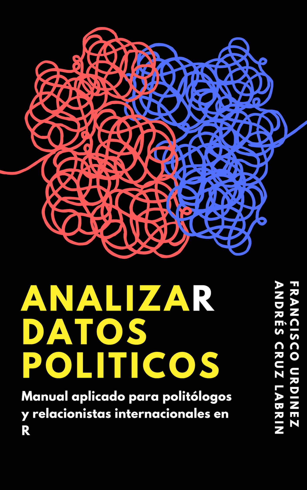
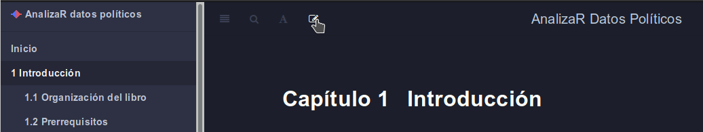
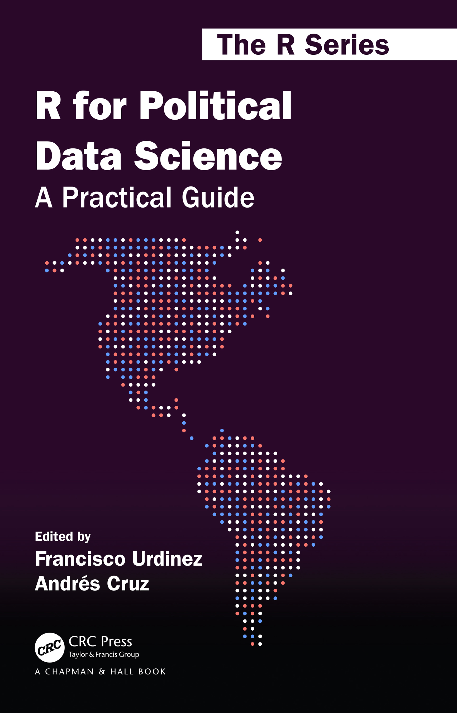

--- 
title: "AnalizaR Datos Políticos (v1.0)"
author: "Francisco Urdinez y Andrés Cruz Labrín (editores)"
date: "2020-08-17"
site: bookdown::bookdown_site
output:
  bookdown::gitbook:
    split_by: chapter
    includes:
      in_header: style.html
    highlight: espresso
documentclass: book
bibliography: [libroadp.bib, packages.bib]
biblio-style: apalike
nocite: | 
  @kastellecUsingGraphsInstead2007, @henshawDataAnalysisData2018, @angristMostlyHarmlessEconometrics2008, @lewis-beckAppliedRegressionIntroduction2016, @glasgowDiscreteChoiceMethods2008, @longRegressionModelsCategorical1997, @henningsenAnalysisPanelData2019, @brostromEventHistoryAnalysis2012, @allisonEventHistorySurvival2014, @Shalizi:2019, @MorganWinship:2007, @lallHowMultipleImputation2016, @grahamInternationalPoliticalEconomy2019, @steinert-threlkeldTwitterData2018, @newmanNetworks2018, @scottSocialNetworkAnalysis2013, @abeyasekeraMultivariateMethodsIndex2005, @bryantAssessingValidityMeasurement2000, @collierTypologiesFormingConcepts2008, @goertzSocialScienceConcepts2006, @jackmanMeasurement2008
link-citations: yes
favicon: "favicon.ico"
---

# Introducción {-}

## Inicio {-}



**AnalizaR Datos Políticos** es un libro que podrás usar como manual de referencia cuando estés quebrandote la cabeza usando `R`. Por eso, decidimos que sea más aplicado que teórico, y hemos considerado tanto temas de ciencia política como de relaciones internacionales. De ahí el subtítulo del libro: "Manual aplicado para politólogos y relacionistas internacionales en R". Una gran ventaja del libro es que utiliza para cada tarea la opción más actualizada y sencilla disponible en la red. ¡Además, ocupa cada vez que es posible el `tidyverse`, el grupo de paquetes que ha revolucionado el uso de `R` recientemente por su sencillez!

Construido gracias a la tecnología de libro digital llamada [bookdown](https://github.com/rstudio/bookdown) e inspirado por la filosofía de software libre y código abierto, este libro es de uso libre y gratuito. Esto garantiza que sus contenidos sean reproducibles y accesibles públicamente para personas de todo el mundo. La versión del libro que estás leyendo ahora (1.0) se construyó en abril de 2020 luego de dos años de trabajo. A medida que el libro reciba retroalimentación de los usuarios iremos actualizando los contenidos. 

<hr>

```{r cc, echo=FALSE, out.width='15%', fig.align='left'}
knitr::include_graphics("00-images/index/cc.png")
```

Este libro digital se encuentra bajo una licencia [Creative Commons Atribución-NoComercial-SinDerivadas 4.0 Internacional](https://creativecommons.org/licenses/by-nc-nd/4.0/deed.es).

<hr>

## ¿Cómo contribuir? {-}

`bookdown` hace que la edición de un libro sea tan fácil como editar un wiki, siempre que tengas una cuenta de [GitHub](https://github.com/). Puedes proponer cambios en el libro desde el foro "Issues" en [el repositorio del libro en GitHub](https://github.com/arcruz0/libroadp), que contiene todo el código utilizado para generarlo. 

Adicionalmente, si tienes más experiencia con GitHub y git, también puedes proponer *pull requests*.  Haciendo click en el ícono de edición, como se aprecia en la siguiente figura, puedes rápidamente crear un fork del repositorio y comenzar a editar. ¡Creemos que las contribuciones --a través de *issues* o *pull requests*-- nos ayudarán muchísimo a mejorar el libro!

```{r edit-bookdown, echo=FALSE, fig.cap="Botón de 'Editar' en cada capítulo"}

```

Adicionalmente, si encuentras el libro útil, por favor apóyalo de alguna de estas formas:

- Leyéndolo.

- Recomendándolo o compartiéndolo en redes sociales.

- Citando la versión del libro que hemos publicado en inglés: Urdinez, F. and Cruz, A. (Eds.) (2020). *Political Data Science Using R: A Practical Guide*. CRC Press. Si deseas, puedes recomendar a la biblioteca de tu universidad que compre la [versión en papel del libro](https://www.routledge.com/R-for-Political-Data-Science-A-Practical-Guide/Urdinez-Cruz/p/book/9780367818890).

```{r tapa-ingles, echo=FALSE, fig.cap="Tapa del libro editado en inglés por CRC Press", out.width='30%'}

```

### Sobre los autores y autoras {-}

Este libro está editado por Francisco Urdinez, Profesor Asistente del [Instituto de Ciencia Política](www.cienciapolitica.uc.cl/) de la Pontificia Universidad Católica de Chile, y Andrés Cruz, Instructor Adjunto de Análisis de Datos en la Escuela de Ciencia Política de la Universidad Diego Portales, Chile. La mayoría de los autores que contribuyeron con capítulos a este volumen son politólogos afiliados al [Instituto de Ciencia Política](www.cienciapolitica.uc.cl/) de la Pontificia Universidad Católica de Chile, y muchos son investigadores y colaboradores del [Instituto de la Fundación Millennium Data](https://imfd.cl/es/), institución que tiene como objetivo la recolección, depuración y análisis de datos públicos para apoyar  políticas públicas. Andrew Heiss está afiliado al Departamento de Gestión y Política Pública de Georgia State University y se unió a este proyecto contribuyendo con un capítulo sobre la inferencia causal. Andrew suele compartir mucho de su trabajo en R en su [sitio web](www.andrewheiss.com). Sobre todo, todos los autores son usuarios entusiastas de R.

## Prefacio {-}

Este libro nació haciendo análisis de datos políticos. Es decir, es hijo de la praxis. Por ello su naturaleza es aplicada, y tiene su foco puesto en ser una caja de herramientas para el lector. **AnalizaR Datos Políticos** está pensado para ser un manual de referencia que podrá ser consultado tanto por un estudiante universitario viviendo en Bogotá, como por un consultor político viviendo en México D.F. o un o funcionario público en Brasilia, todos con la necesidad de transformar sus bases de datos en conclusiones sustantivas y fácilmente interpretables.

Trabajando juntos en la cátedra de Análisis Cuantitativo de Datos II del Instituto de Ciencia Política de la Universidad Católica de Chile encontramos que ni aquí, ni en otras universidades de la región, había material didáctico y aplicado hecho en casa para enseñar a nuestros alumnos de ciencia política cómo extraer conclusiones a partir de datos duros. Todo el material utilizado en nuestra cátedra era publicado en inglés, por politólogos anglosajones trabajando en universidades anglosajonas. Por ello **AnalizaR Datos Políticos** tiene como público imaginario al politólogo latinoamericano, ya sea alumno de pregrado o posgrado, o ya en el mercado. Hemos querido que nuestro libro esté disponible en español y portugués, y esto lo hace extensible a otras universidades de realidades similares fuera de América Latina, como en los países lusófonos de África y en la región ibérica.

Los autores son todos politólogos que tuvieron que enfrentarse a problemas aplicados y tuvieron curvas de aprendizaje, más o menos empinadas, en el uso de `R`. Algunos han migrado de otros software de análisis de datos, otros han comenzado su experiencia directamente en `R`. Algunos son hábiles usuarios, otros, usuarios funcionales, pero todos tienen en común que tienen conocimiento aplicado que será de utilidad a quien quiera tener material de apoyo. 

Las universidades latinoamericanas han hecho grandes esfuerzos en que sus alumnos de politología se alfabeticen en herramientas estadísticas y de análisis de datos, algo que hasta hace diez años era algo poco frecuente. Hoy las cinco mejores universidades de la región, según el ranking de [*Times Higher Education*](https://www.timeshighereducation.com/digital-editions/latin-america-university-rankings-2018-digital-edition), tienen cursos de análisis cuantitativo de datos en sus programas de ciencia política. Algunos departamentos, como el Departamento de Ciencia Política de la Universidad de São Paulo, que co-organiza la escuela de verano de IPSA en métodos, el Instituto de Ciencia Política de la Universidad Católica de Chile, que organiza su escuela de verano en Métodos Mixtos, o la División de Estudios Políticos del CIDE, han hecho esfuerzos por exponer a sus alumnos a profesores norteamericanos y europeos que cuentan con muchas décadas de tradición cuantitativa en sus programas. Lo bueno es que poco a poco comienzan a aparecer metodólogos nacidos y formados en América Latina. Entendemos que, hoy por hoy, ningún politólogo puede salir al mercado laboral sin saber utilizar con holgura software de análisis cuantitativo, y es a esa demanda a la que apuntamos aquí.

Ahora mismo, `R` es probablemente la mejor opción que el mercado provee para análisis estadístico de datos. Esto puede ser sorpresivo para un lector recién salido de una máquina del tiempo: hace diez años, o tal vez menos, R era simplemente mirado como la alternativa gratis a los programas comerciales de verdad, que sí podían realizar análisis cuantitativo serio. Sin embargo, esto ha cambiado drásticamente en los últimos años. La Figura \@ref(fig:pref-gtrends) muestra las tendencias de búsqueda en Google en América Latina para los programas más comúnmente utilizados en ciencia. `R` ha pasado a ocupar un lugar en el mercado que hace 15 años le correspondía a SPSS, y los programas de nicho -como Stata y Minitab- son cada vez menos buscados. La tendencia sugiere que `R` será cada vez más popular en la ciencia latinoamericana, siguiendo una tendencia global. 


```{r pref-gtrends, echo=FALSE, message=F, fig.cap="Elaborada por los autores usando el paquete ggplot2 de R, y datos extraídos de Google Trends. Los datos corresponden a promedios anuales para países latinoamericanos en el sector 'ciencia'", out.width='80%'}
library(tidyverse)
library(directlabels)

gtrends <- read_csv("00-data/intro/gtrends_preface.csv")

p <- ggplot(gtrends, aes(x = date, y = hits, alpha = keyword, label = keyword)) +
  geom_line(size = 0.8) +
  labs(x = "Año", y = "Interés promedio en Google",
       alpha = "Software") +
  geom_dl(method = list(dl.trans(x = x + 0.1),
                        "last.points")) +
  scale_alpha_manual(breaks = c("R", "SPSS", "Stata"),
                     values = c(1, 0.33, 0.66)) +
  scale_x_datetime(
    breaks = lubridate::ymd_hms(c("2004-01-01 00:00:00",
                                  "2008-01-01 00:00:00",
                                  "2012-01-01 00:00:00",
                                  "2016-01-01 00:00:00",
                                  "2020-01-01 00:00:00")),
    labels = seq(2004, 2020, 4),
    expand = c(.1, .1)
  ) +
  coord_cartesian(clip = 'off') +
  theme(legend.position = "none")

p
```

El modelo de software libre en el que se basa `R` —con licencias de derechos de autor permisivas, que ponen prácticamente todas las herramientas en forma gratuita a disposición del público, tanto para su uso como para su reformulación— finalmente rindió frutos. Una activa comunidad de desarrolladores se ha anclado en `R`, añadiéndole nuevas funcionalidades que lo han dotado de elegancia, simplicidad y flexibilidad. `R` ya no solo brilla en la generación de modelos estadísticos, sino que hoy es hogar de un vasto universo de herramientas que permite al usuario importar, ordenar, transformar, visualizar, modelar y comunicar los datos que le interesen, sin tener que cambiar de herramienta. 

Es esta la novedad tecnológica que queremos acercar al lector interesado en el análisis político, con la esperanza de que contribuya a optimizar el proceso entre la pregunta que le quita el sueño (y/o le promete el pan) y su solución. Esto sin desconocer, claro está, que el beneficio inicial de `R`, el que estaba incluso cuando nadie quisiera usarlo si no era a regañadientes, permanece. Sabemos que el lector —y tal vez su casa de estudios— agradecerá la amable coincidencia de que el mejor software disponible en términos de calidad es también el mejor para su bolsillo.

Francisco Urdinez y Andrés Cruz.

Santiago de Chile, 2020.

### Agradecimientos {-}

Agradecemos a todos los prestigiosos académicos que permitieron usar sus bases de datos para ejemplificar nuestros capítulos. Queremos agradecer a Matías Piña, Eliana Jung, Vicente Quintero y Beatriz Urrutia por ayudar con correcciones y la edición del libro y a Daniel Alcatruz, Javiera Venegas, Santiago Olivella, Laura Levick y Carsten Schulz por sus comentarios sobre varios capítulos. Queremos agradecerle al [Instituto Milenio Fundamentos de los Datos](https://imfd.cl/) por apoyar a los alumnos de doctorado que participaron en este proyecto, así como a la Vicerrectoría de Investigación de la Pontificia Universidad Católica de Chile por apoyar su edición en la versión en inglés, publicada por CRC press como parte de [R Series](https://www.routledge.com/R-for-Political-Data-Science-A-Practical-Guide/Urdinez-Cruz/p/book/9780367818890).


## Qué esperar del libro {-}

El análisis cuantitativo de datos es una de las tantas herramientas que los investigadores tenemos para abordar las preguntas que nos interesan, ya sea en el mundo profesional o en la academia (o “por amor al arte” en muy encendidas noches de viernes, por qué no). Es por esto que **AnalizaR Datos Políticos** tiene un fuerte énfasis en ejemplos politológicos aplicados. Utilizar ejemplos de texto trillados e idealizados sobre autitos o islas imaginarias sería una falta de respeto para el lector, a quien sabemos ávido por ocupar las herramientas de este libro en las preguntas de investigación política que le parecen importantes. Por el contrario, queremos mostrar el potencial de dichas herramientas metiendo las manos en la masa, con datos de verdad, investigaciones que colegas ya han realizado y dificultades particulares de llevar el análisis de datos a preguntas políticas. Será bueno que nos acompañe a lo largo del libro con `RStudio` abierto en su computador, nada mejor que aprender juntos. 

El libro se alimenta del avance enorme que se ha hecho en los últimos años a partir de la creación del lenguaje de [`tidyverse`](https://www.tidyverse.org/) y de la publicación de *R for Data Science*, el cual puede ser accedido de manera gratuita en español gracias al trabajo colaborativo de sus usuarios en el siguiente [link](http://es.r4ds.hadley.nz/). Todo el trabajo hecho por Garrett Grolemund y Hadley Wickham por facilitar la sintaxis de `R` es una excelente invitación para quienes nunca han utilizado software estadístico o para quienes quieren mudarse de otras alternativas como Stata o SPSS. 

## Estructura del libro {-}

```{r echo=FALSE, message=FALSE}
library(dplyr)
library(kableExtra)
df_aut <- tibble::tribble(~`Capítulo`, ~`Autores`,
                # I. Introducción a R
                "R básico", "Andrés Cruz",
                "Manejo de datos", "Andrés Cruz",
                "Visualización de datos", "Soledad Araya",
                "Carga de bases", "Soledad Araya y Andrés Cruz",
                # II. Modelos
                "Modelos lineales", "Inés Fynn y Lihuen Nocetto",
                "Selección de casos basada en regresiones", "Inés Fynn y Lihuen Nocetto",
                "Modelos de panel", "Francisco Urdinez",
                "Modelos logísticos", "Francisco Urdinez",
                "Modelos de supervivencia", "Francisco Urdinez",
                "Inferencia causal", "Andrew Heiss",
                # III. Aplicaciones
                "Manejo avanzado de datos políticos", "Andrés Cruz y Francisco Urdinez",
                "Minería de datos web", "Gonzalo Barría",
                "Análisis cuantitativo de textos políticos", "Sebastián Huneeus",
                "Análisis de redes", "Andrés Cruz",
                "Análisis de componentes principales", "Caterina Labrin y Francisco Urdinez",
                "Mapas y datos espaciales", "Andrea Escobar y Gabriel Ortiz") %>% 
  mutate(`#` = 1:nrow(.)) %>% 
  dplyr::select(3,1,2)

kableExtra::kable(df_aut, format = "html") %>%
  kable_styling() %>% 
  group_rows("I. Introducción a R", 1, 4, 
             label_row_css = "text-align:center") %>% 
  group_rows("II. Modelos", 5, 10,
             label_row_css = "text-align:center") %>% 
  group_rows("III. Aplicaciones", 11, nrow(df_aut),
             label_row_css = "text-align:center")
```

El libro está organizado en tres secciones temáticas. Dentro de las secciones, cada capítulo se esfuerza por resolver problemas puntuales, balanceando teoría y práctica en `R`. Al iniciar el capítulo recomendamos literatura que te ayudará a profundizar en el tema si es que te interesó. También te invitamos a que reproduzcas los capítulos con tus propios datos a modo de ejercicio práctico.

<Descripción de los capítulos de la sección I>
La sección I está dedicada al manejo de datos. Lo ideal es que el lector consiga algo más que mirar una base de datos con cara de “no entiendo nada”. Introduciremos `R` desde su instalación y aprenderemos a sacarle el jugo para obtener datos, conocerlos en profundidad, transformarlos de acuerdo a las preguntas que nos interesan y representarlos gráficamente en formas tanto funcionales como atractivas.

<Descripción de los capítulos de la sección II>
En la sección II está el corazón del libro. Veremos cómo responder a preguntas políticas desde una perspectiva estadística —siempre podemos contestar desde nuestra intuición aunque esto suela ser menos serio y poco científico—. En general, la sección trata modelos estadísticos, que intentan explicar y predecir la variación de ciertas variables (dependientes) de acuerdo a cómo varía otras variables (independientes). Exploraremos distintos tipos de modelos de acuerdo a las distintas formas de variables dependientes que se encuentran comúnmente en la arena de lo político. Revisaremos cómo interpretar resultados y presentarlos en forma clara y atractiva, cómo elegir entre modelos competidores y cómo comprobar simplemente algunos de los supuestos estadísticos necesarios para que los modelos funcionen. Debemos notar que este no es un libro de econometría, claro está, por lo que para cada modelo haremos referencia a trabajos más avanzados en términos teóricos, con el fin de que el lector pueda profundizar por su cuenta si cree que debe utilizar algún modelo en específico para responder a sus preguntas de interés.

<Descripción de los capítulos de la sección III>
Por último, en la sección III dejaremos el mundo ideal y nos adentraremos en la resolución de problemas. Ya sea porque un colega nos prestó su base de datos y se ve más bien como una obra de arte surrealista, o simplemente porque la dificultad de los problemas a los que nos enfrentamos deja corto lo que aprendimos al principio del libro, aquí presentaremos un popurrí de herramientas para que el lector integre en su flujo de trabajo cotidiano. Estas han sido seleccionadas desde nuestra experiencia y son cuáles creemos las más requeridas en la práctica del análisis de datos políticos.

## ¿Cómo utilizar el libro en un curso de métodos? {-}

Si este libro te ha interesado como recurso pedagógico, y deseas utilizarlo para estructurar tu clase de métodos cuantitativos o de análisis de datos en ciencia política, te ofrecemos dos alternativas, para diagramar un curso semestral de 10 clases, según donde se quiera poner el foco. Los capítulos de la sección II y III sugieren lecturas que son fuertemente recomendadas para dar robustez a los contenidos del libro. Recuerda que éste no es un libro de metodología, sino que es un libro aplicado de R, por lo tanto, es importante que las lecturas cubran bien la parte teórica de cada tema. 

### Primera opción: Curso semestral de análisis de datos políticos {-}

>Ésta es una diagramación para un curso donde el énfasis está puesto en que el alumno aprenda a utilizar R, y rápidamente sacar conclusiones descriptivas de los datos que se usen. 
>Nota: antes de comenzar el curso los alumnos deben haber leído el capítulo 1 “R Básico” y tener instalado RStudio y el paquete del libro. Es importante siempre llevar scripts listos a clases para que los alumnos rápidamente se pongan a trabajar sin sufrir la codificación, que se aprenderá de a poco en casa. Otra opción a considerar es [RStudio Cloud](https://rstudio.cloud), que permite a los estudiantes trabajar directamente en el navegador.

+ *Clase 1*. Utilice el Capítulo 2 para trabajar con la base de datos de aprobación presidencial hasta cubrir `mutate()`, pasando por `arrange()`, `filter()`, `rename()`, `select()` y `skim()`. Es fundamental que en esta primera clase la alumna salga de ella sintiendo que ha aprendido algo sustantivo de la base de datos. Es recomendable ofrecer el script ya redactado para evitar frustraciones con la sintaxis.

+ *Clase 2*. Continúe con el Capítulo 2. Utilizando `summarize()` por grupos, el estudiante debe comenzar a interpretar medias, valores máximos y mínimos y compararlos entre grupos de interés. Puede pedirles crear una variable dicotómica para comparar dos grupos de interés. Haga énfasis en el potencial de combinar `mutate()` con `if_else()` y no se detenga en la idea de pivotear. Es recomendable ofrecer el script ya redactado para evitar frustraciones con la sintaxis, el alumno podrá ponerlos en práctica si se le pide hacer los ejercicios del capítulo en casa.

+ *Clase 3*. Comience el Capítulo 3, introduciendo el mundo de capas de `ggplot2`.  Ofrezca un script con la base de datos de las dos clases previas, a saber, la base de datos de aprobación presidencial, y deje la base de datos que utiliza el capítulo para que el alumno la analice en casa. Ejemplifique la idea de los mapeos estéticos con `geom_boxplot()`, `geom_bar()` y `geom_line()`, y combine las tres con `patchwork`. Con lo aprendido previamente cree variables categóricas para agrupar países, lo que a continuación puede servir para introducir la idea de las facetas. Termine la clase demostrando opciones de temas de `ggplot2`. 

+ *Clase 4*. Continúe con el Capítulo 3 a partir de `geom_histogram()`. Combine esta herramienta con `skim()` y `filter()`. Nuevamente, ofrezca un script redactado, pero permita que de a poco los alumnos tengan que participar activamente en la sintaxis de los comandos. Incorpore las opciones complementarias como `labs()` y `scale_x_continuous()`. Combine `geom_point()` y `geom_smooth()` para analizar la correlación entre varias variables. Invite a los alumnos a sacar conclusiones de los datos y, si desea, aproveche a profundizar en el concepto de correlación y su cálculo.  

+ *Clase 5*. Cubra el Capítulo 4 en una sola clase. La carga de datos puede ser frustrante, es importante preparar un ejercicio práctico para llevar a la clase y enfatizar sobre la importancia de trabajar con RStudio Projects. Cree versiones en Excel y .csv de la base de aprobación presidencial y ejemplifique cómo se importan a su proyecto. Luego, repita el proceso con versiones de su base en Stata y SPSS. Para finalizar, haga a los alumnos cargar una base y responder a preguntas sobre los datos utilizando lo aprendido en las cuatro clases previas. Ahora sí, los alumnos están listos para redactar su propio código. 

+ *Clase 6*. Usando el contenido del capítulo 12 enseñe a los alumnos a extraer datos de Twitter utilizando APIs con `rtweet`. Ejemplifique el paso a paso del uso de las funciones `search_tweets()`, `get_followers()` y `lookup_users()` y luego deje un espacio de tiempo para que cada alumno replique este ejemplo con el tema que sea de su interés. Con lo aprendido en la clase 5 pida a los alumnos que guarden sus bases para ser usadas en la próxima clase. 

+ *Clase 7*. Usando el contenido del Capítulo 12 analice la base creada en la clase anterior con el paquete `tidytext`, introduciendo análisis de frecuencias de palabras y tf-idf. Retome lo cubierto en clase dos sobre combinar `mutate()` con `if_else()` para agrupar tweets por variables de interés. A esta altura del curso es importante que el alumno intente escribir código por sí solo, y es bueno exigir el uso de opciones estéticas en las figuras creadas con `ggplot2`. 

+ *Clase 8*. Profundice en análisis de texto, centrándose en modelamientos de tópicos sencillos. Demuestre cómo utilizar en conjunto los paquetes `tidytext`, `lubridate` y `stm` con un ejemplo creado previamente, y luego invite a los alumnos a aplicar estas funciones en su base de datos.

+ *Clase 9*. En esta clase retomaremos lo visto en clases 3 y 4 para avanzar sobre el contenido del capítulo 16. Parta explicando la lógica de un shapefile, y ejemplifique como visualizarla con `geom_sf()`. Para una primera experiencia con el tema recomendamos un shapefile de América Latina con sus fronteras políticas. Usando la base de aprobación presidencial demuestre cómo agregar variables a su shapefile utilizando `left_join()`. En este curso debe asegurarse que la variable de unión coincida lo mejor posible en ambas bases. No querremos cubrir temas de fuzzy join, por ejemplo.

+ *Clase 10*. En esta clase cubra ideas de LISAs y clusters espaciales utilizando `spdep`. Recomendamos también cubrir la utilidad de `geom_point()`, que puede ejemplificarse utilizando el paquete `pinochet` y `rnaturalearthhires`. A modo de trabajo final del curso sería bueno pedir un R Markdown que sintetice este ejercicio y que incorpore la mayor cantidad de herramientas aprendidas en las clases previas.


### Segunda opción: Curso semestral de introducción a métodos cuantitativos {-}

>Ésta es una diagramación para un curso donde el énfasis está puesto en Mínimos Cuadrados Ordinarios.
>*antes de comenzar el curso los alumnos deben haber leído el capítulo 1 “R Básico” y tener instalado RStudio y el paquete del libro. Es importante siempre llevar scripts listos a clases para que los alumnos rápidamente se pongan a trabajar sin sufrir la codificación, que se aprenderá de a poco en casa. 

+ *Clase 1*. Utilice el Capítulo 2 para trabajar con la base de datos de aprobación presidencial hasta cubrir `mutate()`, pasando por `arrange()`, `filter()`, `rename()`, `select()` y `skim()`. Utilizando `summarize()` por grupos, el alumno debe comenzar a interpretar medias, valores máximos y mínimos y compararlos entre grupos de interés. Puede pedirles crear una variable dicotómica para comparar dos grupos de interés. Haga énfasis en el potencial de combinar `mutate()` con `if_else()` y no se detenga en `pivot`. Es fundamental que en esta primera clase la alumna salga de ella sintiendo que ha aprendido algo sustantivo de la base de datos. Es recomendable ofrecer el script ya redactado para evitar frustraciones con la sintaxis e introducir a los alumnos a R Markdown.
+ *Clase 2*. Comience el Capítulo 3, introduciendo el mundo de capas de `tidyverse`. Parta por `geom_histogram()` y combine esta herramienta con `skim` y `filter`. Nuevamente, ofrezca un script redactado, pero permita que de a poco los alumnos tengan que participar activamente en la sintaxis de los comandos. Incorpore las opciones complementarias como `labs()` y `scale_x_continuous()`. Combine `geom_point()` y `geom_smooth()` para analizar la correlación entre varias variables. Presente el concepto de mínimos cuadrados ordinarios con un ejemplo aplicado de `geom_smooth()`. Termine la clase demostrando opciones de `themes`.
+ *Clase 3*. Rápidamente cubra el capítulo 4 con un ejercicio práctico para llevar a la clase y enfatizar sobre la importancia de trabajar con RStudio Projects. Cree versiones en Excel, csv de la base de aprobación presidencial y ejemplifique como se importan a su proyecto. Si el curso tiene experiencia en Stata, explique `haven()`. De en .csv la base de municipios del capítulo 3 a los alumnos, muestre `ggcorrplot()` y avance al capítulo 5 cubriendo rápidamente `lm()` con una regresión univariada y `texreg()`. Los alumnos tendrán dos semanas para trabajar en casa con la base de bienestar de Huber et al. y crear un Markdown. 
+ *Clase 4*. En esta clase se profundizará en el capítulo 5 partiendo por regresiones multivariadas. Explique `factor()`, `list()`  y deténgase en la interpretación de coeficientes. Profundice este tema con `prediction()` y ejemplifique su utilidad con `ggplot()`. A partir de esta clase deje tiempo de clases para que los alumnos trabajen solos o en pares y redacten su propio código. 
+ *Clase 5*. Dedique esta clase a cubrir ajuste de modelos y presupuestos de MCO, así como el uso de transformaciones logarítmicas en variables dependientes e independientes y la implementación de errores estándar robustos. 
+ *Clase 6*. Con la base de datos que se haya usado para cubrir los contenidos de las clases 4 y 5 cubra los contenidos del capítulo 6 de manera aplicada, pidiendo a los alumnos que apliquen `broom()` para seleccionar casos a partir de regresiones. Es recomendable que los alumnos hagan en clase el ejercicio 7.C. y entreguen un Markdown con sus respuestas. 
+ *Clase 7*. Desarrolle el capítulo 10 sobre DAGs en una clase, introduciendo `ggdag()`, `dagitty()`, `MatchIt()` y utilizando los ya conocidos `broom()` y `texreg()`. Para abordar la clase recomendamos que se desarrolle un ejemplo similar al que el autor utiliza en el capítulo, y que luego se trabaje sobre la base de la clase anterior para que los alumnos diseñen su propio DAG. + *Clase 8*. Cubra los contenidos del capítulo 7 sobre datos en panel, donde se presente `lubridate()` y `plm()`. Dedique una parte de la clase a presentar `devtools`, cuyas funciones sirven para visualizar resultados y se complementa muy bien con `prediction()`. Cubra modelos de efectos fijos y aleatorios, `phtest()`, tests de raíz unitaria y correlación temporal y la incorporación de errores estándar robustos corregidos para panel. Refuerce el uso de `texreg` y la exportación de tablas para su uso en artículos académicos.
+ *Clase 9*. Las últimas dos clases pueden ser dedicadas a ofrecer al alumno herramientas para complementar lo que ha aprendido hasta este punto. Utilice el capítulo 15 para introducir a los alumnos a la creación de índices que puedan ser incorporados en modelos tanto como variables dependientes como independientes. 
+ *Clase 10*. Finalice el curso usando el capítulo 11 con una discusión sobre estandarización de códigos y unión de bases de datos mediante `left_join()` y demostrando el uso de `countrycode`, `stringdist`, `inexact`. Pida a los alumnos hacer un ejercicio en clases. Luego discuta datos faltantes e imputación presentando `naniar` y `mice` y pida a los alumnos hacer un ejercicio en clases el paquete.

## Prerrequisitos {-}

Este libro está pensado para alumnos que más que brillantes son motivados: el análisis cuantitativo de datos exige sobre todo tenacidad y curiosidad. Es altamente deseable que el lector tenga nociones básicas de matemática, probabilidad y/o estadística universitaria antes de leer este libro, aun cuando nos esforzamos por mantenerlo lo más simple que pudimos en dichas materias. En términos de hardware, prácticamente cualquier computador moderno con acceso a internet será suficiente, pues las herramientas que utilizaremos son más bien livianas. Todo el software que utilizaremos es gratuito.

En el Capítulo \@ref(basic-r), de R Básico, se explica cómo instalar todo el software que se utilizará en el libro. Si ya sabes un poco sobre el funcionamiento de R, debes saber que en la subsección \@ref(basic-r-packages) instalaremos dos paquetes que luego asumiremos instalados en el resto del libro: `tidyverse` y `paqueteadp` (un paquete especialmente creado para apoyar al libro). 
