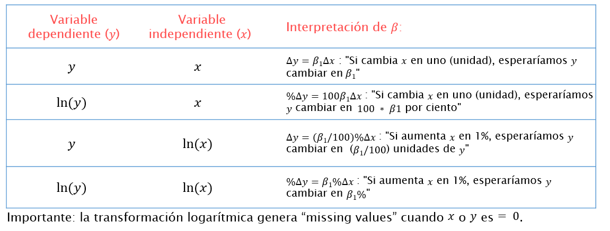

# (PART) Modelos {-}

# Modelos lineales {#lineal}
*Por Inés Fynn y Lihuen Nocetto*

***
```{r setup, include=FALSE}
knitr::opts_chunk$set(warning  = TRUE)
```

**Lecturas de referencia**

- Angrist, Joshua, Jörn-Steffen Pischke. (2008). *Mostly Harmless Econometrics: An Empiricist's Companion*. Princeton University Press. 

- Dunning, Thad. (2012). *Natural Experiments in the Social Sciences. A design-based approach*. Cambridge University Press.

- Gelman, Andrew, Jennifer Hill. (2006). *Data Analysis Using Regression and Multilevel/Hierarchical Models*. Cambridge University Press.

- Wooldridge, Jeffrey.(2010). *Introducción a la econometría. Un enfoque moderno*. Ed. Cengage

- Lewis-Beck, C., & Lewis-Beck, M. (2015). *Applied regression: An introduction (Vol. 22)*. Sage publications.

***

## Introducción

Este es el primer capítulo donde veremos como hacer regresiones. Comenzaremos por regresiones lineales,  comunmente usado para variables dependientes continuas. Aquí la función es lineal, es decir, requiere la determinación de dos parámetros: la pendiente y la ordenada en el origen. Cuando este análisis es multivariado, se complejiza más aún. Cubriremos como interpretar coeficientes, como crear tablas de regresión, visualizar valores predichos, y además nos detendremos a evaluar los supuestos de Minimos Cuadrados Ordinarios, para que puedas hacer diagnosticos respecto al buen ajuste de tus modelos. 

## Aplicación en `R`

La base de datos con la que trabajaremos en este capítulo se nutre de dos bases de datos construidas por [Evelyne Huber y John D. Stephens](http://huberandstephens.web.unc.edu/common-works/data/). Estas dos bases de datos son:

+ Latin America Welfare Dataset, 1960-2014 (Evelyne Huber and John D. Stephens, Latin American Welfare Dataset, 1960-2014, University of North Carolina at Chapel Hill, 2014.): contiene variables sobre Estados de Bienestar en todos los países de América Latina y el Caribe entre los años 1960 y 2014. 

+ Latin America and Caribbean Political Data Set, 1945-2012 (Evelyne Huber and John D. Stephens, Latin America and the Caribbean Political Dataset, 1945-2012, University of North Carolina at Chapel Hill, 2012.): contiene variables políticas para todos los países de América Latina y el Caribe entre los años 1945 y 2012.

La base de datos resultante contiene 1074 observaciones de 25 países entre los años 1970 y 2012 (se dejaron por fuera los datos de la década del 60 por tener demasiados valores perdidos).

Primero cargamos el paquete `tidyverse` que incluye un conjunto amplio de funciones para el manejo de bases de datos 

```{r, message=F}
library(tidyverse)
```

Vamos a importar esta base de datos.

```{r message=F}
library(paqueteadp)
```

```{r}
data(bienestar_la)
```

Ahora la base se ha cargado en nuestra sesión de `R`:

```{r}
ls()
```


Como base para el análisis en este capítulo tomaremos el paper de [Huber, E., Nielsen, F., Pribble, J., & Stephens, J. D. (2006). Politics and inequality in Latin America and the Caribbean. American Sociological Review, 71(6), 943-963](https://journals.sagepub.com/doi/abs/10.1177/000312240607100604) donde se estiman los determinantes de la desigualdad en los países de América Latina y el Caribe. Trabajar sobre la base de este artículo nos permite estimar un modelo con varias variables de control que ya se ha probado son importantes para explicar la variación de la desigualdad en la región. Por tanto, la variable dependiente que nos interesa explicar es la desigualdad de ingresos en países de América Latina y el Caribe, operacionalizada a partir del Índice de Gini (`gini_slc`). Las variables independientes que incorporaremos al modelo son las siguientes:

+ Dualismosectorial (refiere a la la coexistencia de un sector tradicional de baja productividad y un sector moderno de alta productividad) - `s_dualism`
+ PBI - `rgdpch`
+ Inversión Extranjera Directa (ingresos netos - % del PIB) - `fdiingdp`
+ Diversidad étnica (variable dummy codificada 1 cuando al menos el 20 %, pero no más del 80 % de la población es étnicamente diversa) - `ethnicdicot`
+ Democracia (tipo de régimen) - `demrss`
+ Gasto en educación (como porcentaje del PBI) - `cseduc`
+ Gasto en salud (comoporcentaje del PBI) - `cshlth`
+ Gasto en seguridad social (comoporcentaje del PBI) - `csssw`
+ Balance legislativo - `legbal`
+ AutoritarismoRepresivo - `repressauthor`

Durante este capítulo intentaremos estimar cuál es el efecto del gasto en educación sobre la desigualdad en los países de América Latina y el Caribe. De este modo, nuestra variable independiente de interés será Gasto en Educación (`cseduc`).

### Estadísticos Descriptivos 

Antes de estimar un  modelo con Mínimos Cuadrados Ordinarios (MCO, o OLS por su sigla en inglés), o con cualquier estimador, es recomendable reconocer la distribución de las variables de interés: la variable dependiente $y$ (también llamada variable explicada o regresando) y la variable independiente de interés $x$ (también llamada variable explicativa o regresor). Por lo general, en nuestros modelos tendremos, además de la variable independiente de interés, otras variables independientes (o explicativas) que les llamaremos "controles" pues su función será hacer el escenario *ceteris paribus* lo más creíble posible. Es decir, "mantener el resto de los factores constantes" para acercarnos lo más posible a un mundo experimental, en el que podemos controlar todas las variables que afectan $y$ y observar cómo la variación en una sola variable independiente $x$ afecta la variación de la variable dependiente ($y$).

Entonces, antes de estimar el modelo, vamos a observar los estadísticos descriptivos de las variables que estarán incorporadas a dicho modelo (tanto de la dependiente como de las independientes). El objetivo es prestar atención a los siguientes puntos:

1. Variación en $x$: que las variables independientes (pero sobre todo la de interés) tengan variación en nuestra muestra. Pues si no hay variación de $x$, no podremos estimar cómo esta variación afecta la variación de $y$.

2. Variación en $y$: si la variable dependiente no varía, no vamos a poder explicar su variación en función de las $x$. 

3. Unidad de medición de las variables: es en esta instancia donde evaluamos cómo están medidas nuestras variables (además de revisar los diccionarios que por lo general acompañan las bases de datos con las que trabajamos), para poder entender qué tipo de variables estas debieran ser (nominales, ordinales, continuas), y además para luego poder interpretar correctamente los resultados obtenidos.

4. Tipos de variables: en la estimación por Mínimos Cuadrados Ordinarios las variables dependientes deben ser, generalmente, *continuas* (aunque es posible trabajar con variables dependientes dicotómicas). Por tanto, debemos asegurarnos que la variable dependiente sea continua y numérica. Además, es importante conocer el tipo de variables independientes y chequear que su tipo sea coherente con cómo está codificada (i.e si tenemos una variable independiente de "rangos de edad" la variable debe ser categórica o de factor, y no númerica), para que luego nuestras interpretaciones de los resultados sean correctas.

5. Identificar valores perdidos: Si nuestras variables tienen demasiados valores perdidos debemos revisar a qué se debe esto y, eventualmente, imputar datos (como se explica en el Capítulo \@ref(casos)).

### Estadísticos descriptivos y distribución de las variables del modelo

Una primera visualización de nuestras variables de interés la podemos hacer utilizando el comando `skmir` que nos otorga no solo algunos estadísticos descriptivos sino también la distribución de las variables.
```{r, message=F}
library(skimr)
```

```{r}
skim(bienestar_la %>% select(gini_slc, cseduc, fdiingdp, rgdpch, cseduc, cshlth, csssw, ethnicdicot, pop014wdi))%>% skimr::kable()
```
En el output se ordenan los resultados por tipo de variable, nos indica la cantidad de missing para cada una de ellas, su respectiva media, desvío estandar, los valores correspondientes a los percentiles y un pequeño histograma que nos muestra cómoestán distribuidas. Además, si quisieramos, podriamos realizar una tabla seleccionando solo algunos de los estadísticos que te interesan. Aquí por ejemplo, solo nos interesa ver la media y desviación estándar:
```{r}
# skim(bienestar_la %>% select(cseduc, fdiingdp, rgdpch, cseduc, cshlth, csssw, ethnicdicot, pop014wdi))%>% dplyr::filter(stat==c("mean","sd"))%>% skimr::kable()
```

En este caso solo nos interesa observar su distribución en histogramas:
```{r}
# skim(bienestar_la %>% select(cseduc, fdiingdp, rgdpch, cseduc, cshlth, csssw))%>% dplyr::filter(stat=="hist")%>% skimr::kable()
```


### Matriz de correlación de variables independientes

Luego de reconocer todas las variables que incorporaremos al modelo, es recomendable observar cómo están relacionadas entre ellas. Para esto, realizamos una matriz de correlación de las variables independientes con el comando `rcorr` del paquete `Hmisc` donde podemos evaluar la correlaicón de Pearson entre todas las variables. Además, este comando también nos da el *p value* para cada correlación, donde podemos evaluar si la correlación observada es significativa. 

De todos modos, es importante recordar que la **correlación no implica causalidad**. Aquí simplemente queremos comprender si las variables del modelo están de algún modo relacionadas. Este paso es importante no solo para un reconocimiento de nuestros datos y variables, sino también porque queremos evitar que nuestro modelo tenga multicolinealidad perfecta (que hayan variables independientes que estén perfectamente corrrelacionadas) pues es uno de los supuestos centrales de OLS que revisaremos al final de este capítuo. 

```{r}
variables <- c("gini_slc","cseduc","s_dualism","fdiingdp","rgdpch","ethnicdicot","demrss","cshlth","csssw","legbal","repressauthor","pop014wdi")
vind <- bienestar_la[variables]
```
Cargamos el paquete ´Ggally´que nos será útil para ver las correlaciones.

```{r, fig.cap="Matriz de correlaciones entre variables", out.width='100%'}
# library(GGally)
# ggcorr(vind, label = T)
```

Ahora que conocemos todas las variables que incorporaremos al modelo, y cómo se relacionan entre sí, profundizaremos sobre las variables de interés: la dependiente y la independiente.

### Distribución de las variables de interés

Como mencionamos anteriormente, siempre nos interesa estimar cómo el cambio en una variable independiente (su variación) afecta la variación de una variable dependiente. Es decir, cómo cambia $y$ cuando cambia $x$. En este caso, supongamos que nos interesa estimar cómo varían los niveles de desigualdad de un país (medido a partir del Índice de Gini) en relación al gasto en la educación (medido como porcentaje del PBI destinado a la educación). De este modo, nuestra variable independiente de interés es el gasto en la educación, mientras que la variable dependiente es la desigualdad.

Veamos cómose distribuyen estas variables en nuestra base de datos:

```{r hist1, fig.cap="La variable dependiente: Índice de Gini", out.width='70%'}
ggplot(bienestar_la, aes(x=gini_slc, na.rm=TRUE))+
  geom_histogram(binwidth = 1,color="white", fill="black") +
labs(title = paste(
          "Distribución de la Variable Dependiente"),
        caption = paste ("Fuente: Huber et al (2012)"),
        x = "Índice de Gini",
        y = "Frecuencia"
)
```


La variable independiente: Gasto en Educación (% de PBI) 
```{r hist2, fig.cap="Distribución de la Variable Independiente: Gasto en Educación", out.width='70%'}
ggplot(bienestar_la, aes(x=cseduc, na.rm=TRUE))+
  geom_histogram(binwidth = 1,color="white", fill="black") +
labs(title = paste(
          "Distribución de la Variable Independiente"),subtitle = paste("% de PBI destinado a la Educación"),
        caption = paste ("Fuente: Huber et al (2012))"
      ),
        x = "Gasto en Educación",
        y = "Frecuencia"
)
```


### Relación entre la variable dependiente e independiente

Luego de observar cómo distribuyen las variables de interés, podemos ver gráficamente cómo se relacionan. Es decir, graficamos la correlación entre estas dos variables: en el eje de $x$ (horizontal) ubicamos a la variable independiente, mientras que en el eje de $y$ (vertical) la variable dependiente. Como resultado, cada "punto" del gráfico \@ref(fig:scatter1) representa una observación de nuestra muestra con un determinado valor de gasto en educación ($x$) y un determinado valor en el índice de Gini ($y$).

```{r scatter1, fig.cap="Relación entre Gasto en Educación e Índice de Gini", out.width='70%'}

ggplot(bienestar_la, aes(cseduc, gini_slc)) + geom_point()+ 
  labs(x="Gasto en Educación (%de PBI)", y="Gini", caption = paste ("Fuente: Huber and Stephens, 2012"))
```

Esta es una primera visualización de la relación entre nuestras variables que nos permite observar si hay algún tipo de vínculo entre ellas. Aquí claramente se observa una relación positiva (a mayor gasto en educación, mayor Gini). De todos modos, hasta el momento no podemos decir nada concluyente sobre la relación entre gasto en educación y nivel de desigualdad, para esto es necesario estimar el modelo. Hasta ahora solo estuvimos conociendo nuestros datos, avancemos hacia la regresión. 


## Modelo bivariado: regresión lineal simple


El modelo lineal simple asume que una variable aleatoria de respuesta $y$ es una función lineal de una variable independiente $x$ más un término de error $u$. También decimos que la variable dependiente $y$ es resultado de un Proceso de Generación del Dato (DGP por sus siglas en inglés) que puede escribirse
$$ Y = \beta_0 + \beta_1x + u   $$ 

Entonces, el modelo lineal implica precisamente definir que $Y$ está generada por una función lineal de $x_1$, además de un término constante $\beta_0$ y la variable $u$ que es inobservada.
Dos supuestos son necesarios para derivar los estimadores de Mínimos Cuadrados Ordinarios. El primero refiere a que la esperanza de $u$ es igual a 0 $$E(u)=0$$. Esto implica que a nivel poblacional, todos los factores inobservados promedian cero. El supuesto más importante refiere a que la media de $u$ para cada valor de $x$ es cero: $$E(u|x)=0$$

Este supuesto se conoce en la literatura econométrica comomedia condicional cero, o independencia condicional. En la literatura experimentalista se conoce comoexogeneidad de la $x$ o también que $x$ y $u$ son ortogonales. Todos estos términos implican que se asume que para cada valor de la variable independiente de interés $x$ los factores inobservados promediarán cero. En otras palabras, conocer un valor determinado de la $x$ no nos dice nada acerca de los inobservados. 
Cuando $E(u|x) = 0$, entonces se cumple que 
$$cov(x,u) = 0$$. 

En definitiva, bajo el supuesto de independencia condicional, $x$ y $u$ no correlacionan y esto permite derivar los estimadores de Mínimos Cuadrados Ordinarios a través de las *condiciones de primer orden*. Las dos condiciones de primer orden son que $$E(u)=0$$ y $$E(u|x)=0$$


Entender que estas son las condiciones que permiten derivar el  *estimador* de MCO  es clave para entender porqué a partir de la estimación por MCO no podemos testear la independencia del error. Esto es, por construcción, los residuos ($\hat{u}$) de la regresión siempre promediarán cero en la muestra y en cada valor de $x$. Demandar exogeneidad implica poder argumentar que $u$ es efectivamente ortogonal a las $x's$, algo más creíble para experimentos y cuasi experimentos (ver Gerber y Green 2012, Dunning 2012, Glennester y Takavarsha 2013).


Si damos por válido que $E(u|x)= 0$,entonces por álgebra podemos escribir la esperanza de una variable Y dado X como

$$E(y|x)= \beta_0+ \beta_1x$$

Como se ve, el término inobservado $u$ desaparece de la ecuación cuando se considera la esperanza de la distribución de $Y$ (la esperanza de $u$ es cero). Al término constante $\beta_0$ y al efecto de la $x_1$ se lo conoce como "parte sistemática del modelo"", o también Función de Regresión Poblacional (FRP). Es clave entender que el supuesto de  $E(u)=0$ refiere al promedio de los factores inobservables y que por tanto, en promedio $u$ no afecta a $Y$. 
Sin embargo, debe recordarse que cada realización de la variable aleatoria Y está generada por la ecuación 1, y que por tanto, la variable Y de un individuo aleatoriamente seleccionado de esa población es
$$Y_i= \beta_0+\beta_1x_{1i}+u_i$$


Esto quiere decir que la realización de la variable aleatoria $Y$ para el individuo $i$ es una función de $x_1$ y $u$. O sea, del valor que toma la $x_1$ en ese individuo y el valor que toma $u$. Todos los factores inobservados que se anotan como$u$ son los que explican que cada individuo se aleje de la FRP.


### Estimando un modelo lineal en `R`


Una vez que hemos definido un modelo poblacional como el descrito por la ecuación (1), nuestro trabajo es estimar el impacto de la variable independiente sobre la dependiente. La función `lm` que se encuentra en `R` base es la principal herramienta para estimar modelos lineales. La forma general que toma la función es

```{r eval=FALSE, include=T}
lm(Y ~ 1 + X)
```

De donde se entiende que se estima un *linear model* (lm) para una variable dependiente Y regresada (~) en una variable independiente X. El "1" no es necesario, pero por estilo, se agrega para denotar el intercepto ($\beta_0$). Con base a la investigación de Huber y Stephens (2006) asumamos que la Desigualdad es una función lineal del Gasto en Educación más un término de error inobservado $u$ y una constante $\beta_0$.
Formalmente:

$$ Desigualdad = \beta_0 + \beta_1 GastoEducacion + u $$

Por el momento, vamos a asumir que la base de datos tiene 1074 observaciones independientes. En realidad, la estructura es de datos de panel: el mismo país tiene distintas observaciones a lo largo del tiempo. Sin embargo, por el momento no estamos en condiciones de abordar correctamente estos datos. El supuesto de observaciones independientes e idénticamente distribuidas es lo que permite escribir la realización del modelo para un individuo $i$ aleatoriamente seleccionado como$$Desigualdad_i= \beta_0 +  \beta_1GastoEducacion_i + u_i$$

Para estimar el modelo, utilizaremos los datos de la base de Huber y Stephens (2006). La variable dependiente "Desigualdad" está medida a través del índice de Gini y el nombre de la variable es `gini_slc`. La variable independiente "Gasto en Educación" es `cseduc`. Como los datos están alojados en un data.frame, a la función le tenemos que indicar que traiga esos datos de la base correspondiente. Eso es lo que ocurre luego de la coma

```{r}
modelo_1 <- lm(gini_slc~ 1 + cseduc , data=bienestar_la) #luego de la coma le indicamos el data.frame que contiene los datos.
class(modelo_1) # verificamos que la clase del objeto  es "lm"
```

En la primera línea del código se creó un objeto (modelo_1) en que se está guardando el resultado de la función `lm`. Esta función arroja objetos de clase "lm" que son vectores que incluyen los coeficientes estimados, los errores estándar, residuos, la bondad de ajuste, entre otros resultados de la estimación. Para ver los componentes del objeto, una forma rápida es utilizar la función `summary`

```{r}

summary( modelo_1)
```

Presentaciones más elegantes pueden obtenerse con la función `screenreg`del paquete `texreg`. Veamos la presentación de resultados con la función `screenreg`

```{r}
library(texreg)
screenreg(modelo_1)
```
Podemos agregar nombre a las variables
```{r}
library(texreg)
screenreg(modelo_1, 
          custom.model.names = "Modelo 1",  
          custom.coef.names = c("Constante", "Gasto en educacion"))
```
Y podemos exportar la tabla en formato .doc para agregarla a nuestro trabajo. El archivo se guardará en nuestro directorio de trabajo
```{r}
htmlreg(list(modelo_1), file = "modelo_1.doc", 
    custom.model.names = "Modelo 1",  
    custom.coef.names = c("Constante", "Gasto en educacion"),
    inline.css = FALSE, doctype = TRUE, html.tag = TRUE, 
    head.tag = TRUE, body.tag = TRUE)
```

Como se ve, resulta más cómodo ver los resultados con `texreg` que con `summary`. Allí se ve claramente que la variable `cseduc`, gasto en educación, tiene un efecto positivo, de magnitud 1.233, estadísticamente significativo. En concreto, cuando  el gasto en educación como porcentaje del PIB aumenta en una unidad, la desigualdad aumenta en un 1,23%. Esto es así ya que nuestra variable dependiente está medida del 1 al 100 al igual que la independiente. El efecto del Gasto en Educación es significativo al 99.9% de confianza. Sabemos eso porque al lado del coeficiente aparecen tres estrellas, que refieren a un nivel de significancia de 0,01 %. 

La significancia estadística es resultado de la prueba t. Esta nos indica la distancia estandarizada donde se encuentra el beta estimado en la distribución del estimador bajo la hipótesis nula de que $\beta_1=0$. El estimador tiene una distribución t-Student con grados de libertad igual a $n-k-1$ donde $k$ es el número de variables independientes y se le suma 1 por la estimación de la constante $\beta_0$. Una aproximación manual de la distancia del beta estimado en la distribución del estimador bajo la hipótesis nula $\beta_1=0$, la obtenemos cuando dividimos la estimación por su error estándar:

```{r}
1.233 / 0.25
```

Este valor es el mismo que arroja la tercera columna de la sección "Coefficients" del `summary` del modelo_1. El valor t se interpreta como la distancia de la estimación de $\hat\beta_1$ de la media de una distribución del estimador bajo $H_0=\beta_1=0$. En este caso, el valor 1.233 está a 4.93 desvíos estándar de la distribución del estimador cuando H0 es verdadera (la media de la distribución es 0). 
Como las distribuciones t colapsan sobre la normal a medida que aumentan los grados de libertad, y sabemos que aproximadamente hasta 2 desvíos estándar se encuentra el 95% de la probabilidad de una normal, entonces cuando el estadístico t supera el valor de 2 podemos saber que la probabilidad de observar nuestra estimación si H0 fuera cierta es menor a 0.05. Cuando esto sucede, rechazamos la hipótesis nula a un nivel de confianza del 95%.

En este caso,  el  $\hat\beta_1$ estimado está a más de 4.93 desvíos estándar de la media de la distribución bajo $H_0=\beta_1=0$ por lo que es muy poco probable haber observado un efecto de 1.23 si $H_0$ es verdadera. La probabilidad precisa puede observarse en la cuarta columna del `summary`del modelo, que puede solicitarse a R con el siguente comando.

```{r}
coef(summary( modelo_1))[, "Pr(>|t|)"]

```

La probabilidad de observar una estimación de 1.23 si H0 es verdadera es de 0,00000128. Por tanto, podemos rechazar H0 aún a un nivel de confianza de 99.9%. 


#*****errores robustos


### Representación gráfica

Como vimos anteriormente, una de las maneras más fáciles de mostrar la relación entre dos variables es a través de gráficos. El paquete `ggplot2`es una herramienta de suma utilidad para realizar diverso tipo de representaciones. En el primer código se grafican todas las observaciones en función de sus valores de variable independiente y dependiente. 

```{r, message=F, warning=F}
library (ggplot2)
```

```{r scatter2, fig.cap="Relación lineal entre Gasto Educación y Desigualdad", out.width='80%'}

ggplot(data = bienestar_la, #se especifica el origen de la base de datos
       aes(x = cseduc, y = gini_slc))+ #se seleccionan las variables independiente y dependiente
       geom_point() + #se plotean los valores observados
       geom_smooth(method = "lm", # se superpone la línea de regresión
                   se = FALSE, #no se plotea el área de error al 95% de confianza
                   color = "blue")+ #color de línea
       labs (x = "Gasto Educación") + # título del eje X
       labs( y= "Desigualdad")  #título del eje Y
       #+ labs ( title ="") #título del gráfico

```

Usualmente es útil mostrar también una representación gráfica del error de la predicción de la recta. `ggplot2`nos permite editar un área sombreada donde podrían haber estado los valores predichos con un determinado nivel de significancia. Si bien el 95% de confianza es el valor que viene por defecto, también podemos editar este valor. El primer bloque muestra la línea de regresión y su error para un nivel de significancia estadística del 95%.

```{r scatter3, fig.cap="En esta figura adicionamos un intérvalo de confianza de 95%", out.width='80%'}

ggplot(data = bienestar_la, #se especifica el origen de la base de datos
       aes(x = cseduc, y = gini_slc))+ 
       geom_point() + 
       geom_smooth(method = "lm", 
                   se = T, #se agrega error de predicción
                   color = "blue")+ 
       labs (x = "Gasto Educación") +
       labs( y= "Desigualdad") +
       labs ( title ="Relación lineal entre Gasto Educación y Desigualdad") 


```

## Modelo multivariado: regresión múltiple

Si bien suele interesar el efecto de una variable independiente sobre una dependiente, lo más común es estimar modelos en los que la $Y$ es resultado tanto de una variable independiente de interés como de un conjunto de variables de control. Formalmente, 

$$Y= \beta_0+\beta_1x_{1}+\beta_1x_{2}+...+\beta_jx_{j}+u$$

A diferencia de la regresión simple, ahora la variable aleatoria $Y$ es una función de diversas variables más un término de error $u$. Al igual que la regresión simple, la esperanza del error condicional en los valores de las $x_j$ debe ser igual a cero. Formalmente, $E(u|x_1, x_2, ..., x_j)=0$.
Para estimar insesgadamente un modelo lineal múltiple no sólo se necesita el supuesto de media condicional cero, pero se presentarán todos los supuestos en una sección posterior. 

Por el momento estimaremos un modelo poblacional en que la desigualdad social (`gini_slc`) es una función lineal del gasto en educación como porcentaje del PIB (`cseduc`), de la inversión extranjera directa (`fdiingdp`), del gasto en salud como porcentaje del PIB (`cshlth`), del gasto en Seguridad Social como porcentaje del PIB (`csssw`), de la población joven (`pop014wdi`), del dualismo estructural de la economía (`s_dualism`), de la división étnica (`ethnicdicot`), del PIB per cápita real (`rgdpch`), del tipo de régimen (`demrss`), del balance entre los poderes del Estado (`legbal`) y del autoritarismo (`repressauthor`).

Como se ve, se han incluido una multiplicidad de variables que se piensa que predicen la desigualdad (Huber et al, 2006). El análisis de regresión múltiple nos permitirá estimar hasta qué punto nuestro modelo es correcto. En primer término se debe correr la estimación de MCO. La función `lm`también estima modelos múltiples y la única diferencia es que deben sumarse las variables independientes. Antes de estimar el modelo, filtraremos la base de datos, eliminando todos los casos con valores perdidos (NAs) en nuestras variables de control. Hay mejores formas de lidiar con los valores perdidos, para esto puedes revisar el Capítulo \@ref(casos) sobre imputación de valores perdidos. Aquí, por practicidad, simplemente nos quedaremos con aquellos casos (país/año) que están completos para las variables de nuestro modelo:

```{r}
bienestar_la_sinna<- bienestar_la %>% drop_na(gini_slc, cseduc , fdiingdp , cshlth , csssw , pop014wdi, s_dualism , ethnicdicot , rgdpch ,  demrss, legbal ,  repressauthor)
```

Ahora si estamos en condiciones de estimar el modelo 2:
```{r}
modelo_2<- lm(gini_slc~ 1+ cseduc + fdiingdp + cshlth + csssw + pop014wdi+ s_dualism + ethnicdicot + rgdpch +  as.factor(demrss) + legbal +  repressauthor,data = bienestar_la_sinna )
```
Recordemos que el 1 no es necesario, puedes probar rodando el modelo sin el, pero lo colocamos para recordarte que estamos también estimando el intercepto. 
Hemos indicado que la variable `demres` es categórica mediante `as.factor`. De esta manera, cada categoría de régimen se mide mediante un coeficiente ´dummy´.

Al igual que el modelo simple, podemos visualizar e imprimir los resultados de la estimación con `summary`o  `screenreg`. 

```{r}
screenreg(modelo_2)
```

Estas funciones también nos permiten comparar dos o más modelos. Al momento de presentar una investigación suele ser recomendable mostrar cómo cambian (o no) los resultados ante distintas especificaciones. Primeo guardamos los modelos en una lista. Al comando de  `screenreg` le agregremos los nombres de las variables como ya hemos visto. En el caso que se trabaja aquí la comparación de modelos es

```{r}
modelos<-list(modelo_1, modelo_2)

screenreg(modelos,
          custom.model.names = c("Modelo 1", "Modelo 2"),  
           custom.coef.names = c("Constante", "Gasto en educacion", "IED", "Gasto en salud", "Gasto en seg. social", "Población jóven", "Dualismo de economía", "División étnica", "PBI pc", "Reg. democrático", "Reg. mixto", "Reg. autoritario", "Balance entre poderes"))
```

Como se observa, la estimación puntual del efecto del gasto en Educación cambió ligeramente. Mientras en el modelo simple el efecto es de 1,23 en el modelo múltiple este efecto pasa a 1,59. En este caso, la interpretación es que cuando el gasto en educación aumenta en una unidad, la desigualdad aumenta en promedio 1,59 puntos porcentuales *manteniendo todos los demás factores constantes*. Esto es, una vez que se descuenta el efecto de las variables de control. Al igual que en el modelo 1, la variable sigue siendo significativa al 99,9% de confianza por lo que decimos que el efecto del Gasto en Educación es *robusto* a diferentes especificaciones. Cuando los investigadores incluyen nuevos controles al modelo y la principal variable de interés se mantiene significativa y con magnitudes relativamente estables se gana evidencia a favor del efecto de la misma. En otras palabras, cada vez es menos probable que el efecto observado en primera instancia fuese espurio.

Otra de las contribuciones del modelo 2 es la incorporación de variables nominales. Las variables dicotómicas y las categóricas plantean un ligero desafío de interpretación. Obsérvese la variable Diversidad Étnica que es dicotómica donde el valor 1 implica que más del 20% de la población pertenece a una minoría étnica y 0 si no hay una minoría tan relevante. El coeficiente de "ethicdicot" es 3,7 significativo al 99,9%. ¿Cómo interpretarlo? Sencillamente, el valor predicho de la desigualdad es 3.7 puntos mayor cuando existe una minoría étnica, a cualquier valor de las otras $x's$. Para interpretar estos coeficientes siempre debe conocerse la categoría base. Como ethicdicot es igual a 0 cuando no hay minorías étnicas, el coeficiente se interpreta como el pasaje hacia tener minoría étnica.

En el caso de la variable `s_dualism`, dado que la categoría base es 0 para "sin dualismo", el coeficiente se interpreta tal que tener una economía dual *disminuye* (coeficiente negativo) la desigualdad en aproximadamente 0.17 puntos.

```{block, type="books"}
Como práctica exporta la tabla con los dos modelos a un archivo de Word, te esperamos.
```

Se puede observar gráficamente la incidencia de las variables dicotómicas utilizando `plot_model` del paquete `sjPlot`

```{r, message=F}
library(sjPlot)
```

En la gráfica que sigue se muestra el efecto del gasto en educación sobre la desigualdad para las distintas categorías de diversidad étnica, manteniendo todas las demás variables constantes. Se aprecia claramente que lo único que cambia entre las categorías es el intercepto. Los países que tienen una minoría étnica importante tienen aproximadamente 3,7 puntos más de desigualdad que los que no tienen minorías étnicas, a cualquier valor de gasto en educación,  manteniendo todas las demás variables constantes. 

```{r}
# plot_model(model = modelo_2, 
#         type = "pred",
#         terms =   c("cseduc",  "ethnicdicot"), 
#         facet.grid = F,
#             show.ci = T, 
#         title = "Valores predichos de desigualdad según gasto en educación y etnicidad")

```

### Ajuste del modelo

La bondad de ajuste se define como la capacidad explicativa del modelo. Intuitivamente refiere a qué porción de la variación de la variable dependiente $y$ es explicada por el modelo especificado. La medida de la bondad de ajuste es el $R^2$ y se define como 1- SRC/STC, donde SRC es la Suma de los Residuos al Cuadrado y STC la Suma de los Totales Cuadrados. De manera simple SRC es una medida de todo lo que el modelo *no* explica, mientras que STC es la variabilidad de la $y$. 
Un modelo que explique *toda* la variación de $y$ tendrá un $R^2$ de 1. Un modelo que no explique nada de la variabilidad de la variable dependiente tendrá un valor de 0. 

Por regla general, a medida que se aumenta el número de variables independientes el $R^2$ nunca disminuye por lo que se suele utilizar el $R^2$ ajustado como una medida que penaliza la inclusión de variables sin fundamento. Como se puede observar en la comparación de los modelos estimados previamente, el modelo lineal simple tiene un $R^2$ de 0.06. Eso puede leerse como que el modelo 1 explica el 6% de la variabilidad de la desigualdad. El modelo múltiple 2 aumenta su capacidad explicativa al 59%. 

Algunos investigadores buscan aumentar la bondad de ajuste del modelo. Sin embargo, estimar el efecto de una variable en concreto no requiere aumentar la bondad de ajuste sino simplemente que se cumplan los supuestos del Modelo Lineal Clásico como la media condicional 0, la linealidad de los parámentros y demás supuestos que se describen en la sección correspondiente.


### Inferencia en modelos lineales múltiples


Al igual que en la regresión lineal simple, los estimadores de cada uno de los parámentros $\beta_j$ tienen una distribución t-Student por lo que puede realizarse inferencia acerca de las estimaciones puntuales de cada $\hat{\beta_j}$ a través de una prueba t. Sin embargo, a veces se desea imponer restricciones lineales múltiples al modelo del tipo $H_0= \beta_1= \beta_2 = 0$. Aquí se está sosteniendo que el efecto de dos variables $x_1$ y $x_2$ es igual a cero. Un caso típico que requiere este tipo de hipótesis nula refiere a las variables categóricas que ingresan al modelo como variables dicotómicas ficticias. La variable dicotómica "educación media"  y la dicotómica "educación superior" son en realidad categorías de una única variable nominal "nivel educativo" que sólo puede entrar en un análisis de regresión en la forma de *dummies* ficticias. 

La prueba que permite hacer inferencia para restricción lineal múltiple es la prueba F. Esto implica que la $H_0$ de una restricción múltiple distribuye F de Fisher. Aquí se muestran dos maneras de testear una restricción lineal múltiple. La primera muestra cada uno de los pasos del test mientras que la segunda es más breve. Supongamos que se quiere testear la hipótesis nula que $H_0= \beta_1= \beta_2 = \beta_3 =0 $. Según esta hipótesis las variables $x_1$, $x_2$ y $x_3$ no afectan a $Y$ cuando se las considera en conjunto. La hipótesis alternativa es que al menos uno de los betas es distinto de 0. Si $H_0$ es verdadera entonces un modelo que excluya estas variables debería explicar lo mismo que un modelo que las incluya, o sea, estas variables son redundantes.

La manera de testear esta hipótesis es a través de un test F en el que se compara la suma de los residuos cuadrados del modelo completo y el modelo restringido. En términos simples, si las variables deben ser excluidas porque no explican la variabilidad de $y$ la Suma de los Residuos Cuadrados de ambos modelos (otra manera es ver el $R^2$) no debe cambiar significativamente. 

Se utiliza el hecho que la comparación de los residuos cuadrados distribuye F


$$F= \frac{(SRC_r-SRC_c)/q}{SRC_c/(n-k-1)}$$

Donde $SRC_r$ es la Suma de los Residuos Cuadrados del modelo restringido, $SRC_c$ es la Suma de los Residuos Cuadrados del modelo completo, $q$ es la cantidad de variables excluidas y $n-k-1$ son los grados de libertad del modelo completo. En R se puede utilizar la función `anova` para comparar los modelos.
Por ejemplo, supongamos que un colega asegura que el balance del legislativo (`legbal`), el tipo de régimen (`demrss`) y la diversidad étnica (`ethnicdicot`) deben excluirse del modelo. Entonces debemos estimar un modelo restringido tal que

```{r}
modelo_2_restringido <- lm(gini_slc ~ 1 + cseduc + fdiingdp + cshlth + csssw + pop014wdi+ s_dualism  + rgdpch + repressauthor,data = bienestar_la_sinna)
```

Como se ve, las variables mencionadas fueron excluidas de la sintaxis. Ahora se debe comparar el poder explicativo de cada modelo

```{r}
anova( modelo_2, modelo_2_restringido)
```

La significancia de la última columna del test muestra con claridad que se rechaza la hipótesis nula por lo que esas variables *no* deben excluirse del modelo. 

### Supuestos de OLS

El estimador de Mínimos Cuadrados Ordinarios será de utilidad (estimará insesgadamente el parámetro poblacional) si es que se cumplen los supuestos de Gauss-Markov que permiten que sea el Mejor Estimador Lineal Insesgado (MELI, o BLUE por sus siglas en inglés). Para profundizar sobre los supuestos es recomendable consultar Wooldrige (2006) y Stock y Watson (2012). Es importante evaluar que en nuestra estimación se estén cumpliendo estos supuestos. Como veremos a continuación, esta evaluación es teórica y, en algunos casos, se podrá aproximar empíricamente. Todos estos diagnósticos suelen ir incorporados a los artículos como anexos o en los archivos de replicación de datos, y no necesariamente en el cuerpo del texto.

#### 1. Media condicional cero

El supuesto central para utilizar el estimador de MCO. El postulado crucial de este supuesto es la independencia entre las variables indpendientes y el término de error, esto nos permite aislar de los factores no observables (contenidos en el término de error $u$) el efecto de las $x$.
Este supuesto no puede ser evaluado empíricamente porque, por definición, no conocemos los factores contenidos en el término de error. Por lo tanto, la defensa de este supuesto siempre será *teórica*. 

#### 2. Muestreo aleatorio

Este es un supuesto sobre la generación de los datos. Se asume un muestreo aleatorio de tamaño $n$ que implica que la muestra fue tomada de forma tal que todas las unidades poblacionales tuvieron la misma probabilidad de ser seleccionadas. Es decir, no hay un sesgo de selección muestral.

#### 3. Linealidad en los Parámetros

MCO asume que la variable dependiente ($y$) esta relacionada linealmente con la variable(s) independiente(s) y el término de error ($u$). Es decir, el aumento en una unidad de $x$ implica un efecto constante en la variable dependiente $y$. De aquí la forma funcional de la ecuación de regresión:

$$Y = \beta_0 + \beta_1x + u$$

Si la relación en realidad no es lineal, entonces estaremos ante un problema de especificación del modelo. Es decir, los valores predichos por nuestro modelo no se ajustarán a la realidad de nuestros datos y, en consecuencia, las estimaciones serán sesgadas. Por tanto, es clave evaluar si la relación que queremos estimar es lineal o si la forma funcional que caracteriza dicha relación es otra (por ejemplo, podría ser cuadrática, cúbica, logarítmica, etc). 

La buena noticia es que si tenemos motivos teóricos y empíricos para creer que la relación no es lineal, es posible realizar transformaciones a nuestras variables para lograr una mejor especificación del modelo. Un clásico ejemplo refiere a la relación parabólica entre la edad y el salario: a medida que aumenta la edad aumenta el salario hasta que llega un punto de inflexión donde el aumento de la edad se relaciona con menores niveles de ingreso, como una U invertida. En este caso lo recomnedable es realizar una transformación cuadrática a la variable edad para lograr una mejor especificación del modelo.

Para evaluar la linealidad realizamos un gráfico de dispersión de los valores predichos contra los residuos $u$. Lo que se intenta es evaluar si  el promedio de los residuos tiende a ubicarse de manera aleatoria por encima y debajo del cero. Si los residuos muestran un patrón creciente o decreciente - o de cualquier otro tipo - entonces la forma funcional de alguna de las variables en cuestión no es lineal. 
Para esto utilizamos el comando `plot`:

```{r abline, fig.cap="Test de linealidad en valores predichos"}
 plot(y=modelo_1$residuals,x=modelo_1$fitted.values,
      xlab="Valores Predichos",ylab="Residuos")
abline(0, 0)
```

Además, podemos hacer un gráfico de residuos parciales (o de componentes), donde se grafican cada una de las variables independientes del modelo contra los residuos. El objetivo es obtener un gráfico "parcial" para observar la relación entre la(s) variable(s) independiente(s) y la variable dependiente dando cuenta (controlando) de las demás variables del modelo.  Una línea punteada nos muestra la predicción de OLS, y otra línea (rosada) nos muestra la relación "real". Si observamos que alguna de nuestras variables **no tiene una relación lineal** podemos realizar transformaciones (a las variables!) para que la forma funcional se acerque a la empiria. Cabe destacar que, además de la justificación empírica, esta transformación lineal **siempre** debe ir acompañada de un argumento teórico de por qué la relación entre las dos variables toma esa forma.

Una transformación que verás con regularidad en papers es la de transformaciones logaritmicas de variables. Estas se presentan tanto en la variable dependiente como en la independiente. Para ello te ofrecemos una tabla que te será de gran utilidad. Te permite saber como cambia la interpretación de los resultados cuando una de las variables (o ambas) es transformada.

```{r echo=FALSE, fig.cap="La tabla resume la interpretación de los coeficientes ante transformaciones logaritmicas"}

```
Por ejemplo, si decidimos transformar nuestra variable dependiente de tal forma que
```{r}
modelo_1_log <- lm(log(gini_slc)~ 1+ cseduc,data = bienestar_la)
screenreg(modelo_1_log)
```
La interpretación sería: si aumentamos el gasto en salud en una unidad, esperaríamos que el Gini aumente un 3%, *ceteris paribus*. Para poder saber cuando transformar nuestras variables, veremos con un ejemplo como podemos diagnosticar un problema en la forma en que nuestras variables son medidas.

```{r, fig.cap="Test de linealidad"}
library(car)
crPlots(modelo_1)
```

La relación de nuestra variable de interés con la variable dependiente parece ser cuadrática creciente. Por tanto, podría ser razonable realizar una transformación cuadrática a la variable. Evaluemos esto gráficamente:

```{r, fig.cap="Test de linealidad alternativo"}
bienestar_la_sinna <- bienestar_la_sinna %>% mutate(cseduc2 = cseduc*cseduc)

modelo_1_cuadratico<- lm(gini_slc ~ 1 + cseduc2 + cseduc, data=bienestar_la_sinna)

crPlots(modelo_1_cuadratico)
```

A partir de un diagnostico visual, se observa una tendencia creciente en los residuos a medida que se avanza en los valores predichos. Además, se detectó una relación no lineal entre el gasto en educación y los niveles de desigualdad. La sospecha es que esta relación pueda ser cuadrática (parábola cuadrática creciente) y, de acuerdo al gráfico de residuales parciales parece ser que la variable transformada se acerca bastante más a la relación lineal que estima MCO (marcada por la línea punteada). Ayuda notar que la escala en la figura de la izquierda es de 0 a 15, mientras que la de la derecha es de 0 a 20, denotando una pendiente más pronunciada.

Para confirmar las observaciones visuales, se suele utilizar un test estadístico para diagnosticar una mala especificación funcional del modelo: RESET Test de Ramsey. La idea es justamente evaluar si es que existe un error de especificación de la ecuación de regresión. Este test lo que hace es volver a estimar el modelo pero incorporando los valores predichos del modelo original con alguna transformación no lineal de las variables. Luego, a partir de un Test-F se evalúa si el modelo con la especificación no lineal tiene un mejor ajuste que el modelo original sin la transformación no lineal. La hipótesis nula postula que las nuevas variables (en este caso `cseduc^2`) no aportan significativamente para explicar la variación de la variable dependiente; es decir, que su coeficiente es igual a cero ($\beta=0$). 


```{r}
library(lmtest)
resettest(modelo_1, power=2, type=c("fitted"), data=bienestar_la_sinna)
```

De acuerdo al resultado del Test F, confirmamos lo observado gráficamente: el incorporar un término cuadrático del gasto en educación mejora el ajuste de nuestra estimación. A esta conclusión llegamos observando el *valor-p* del test RESET de Ramsey: a un nivel de significancia estadística del 5%, se rechaza la hipótesis nula de que la incorporación del término cuadrático no mejora el ajuste del modelo.

* *Nota*: Esta evaluación se realizó para un modelo de regresión simple (bivariado). Pero bien puede realizarse exactamente lo mismo para modelos multivariados.

#### Variación en las variables independientes y no colinealidad perfecta

En primer lugar, es necesario que exista variación en la(s) variable(s) independiente(s). Una variable que no varía, ¡no es variable! Si no tengo variación, la estimación de los coeficientes será indeterminada. Además, mayor variación  en las variables independientes me permitirá realizar estimaciones más precisas.

Por otra parte, la no-colinealidad perfecta implica que las variables independientes no estén perfectamente correlacionadas *linealmente*. Es decir, si bien las variables independientes por lo general suelen tener alguna relación entre ellas, ¡no queremos que midan prácticamente lo mismo! Eso lo evaluaremos con tests de multicolinealidad. 

**Problemas de la multicolinealidad:**

A. *Pérdida de eficiencia*, pues sus errores estándar serán infinitos. Aún si la multicolinealidad es menos que perfecta los coeficientes de regresión poseen grandes errores estándar, lo que hace que no puedan ser estimados con gran precisión. 

Repasemos la fórmula del error estándar de los coeficientes:

$$\hat{\sigma}{_\hat{\beta}{_1}} = \frac{\hat{\sigma}} {\sqrt{\sum(X_j – \bar{X})^2(1 - R^2_j)}}$$

* $\hat{\sigma}$ Es la varianza del término de error: $\frac{\sum\hat{u}}{n-k-1}$

* $\sum(X_j – \bar{X})^2$ Es la variabilidad de $x_j$ ($STCx_j$)

* $1 - R^2_j$ Es la porción de $x_j$ que no es explicada por el resto de las *x* en el modelo ($R^2_j$ indica la varianza de $x_j$ que es explicada por el resto de las equis del modelo). Es por este término que la no colinealidad perfecta es tan importante!

B. Las *estimaciones de los coeficientes pueden oscilar demasiado* en función de qué otras variables independientes están en el modelo. En una estimación OLS la idea es que puedes cambiar el valor de una variable independiente y no de las otras (de esto se trata *ceteris paribus*, es decir, manteniendo las otras covariables constantes). Sin embargo, cuando las variables independientes están correlacionadas, los cambios en una variable están asociados con los cambios en otra variable. Cuanto más fuerte es la correlación, más difícil es cambiar una variable sin cambiar otra. Se vuelve difícil para el modelo estimar la relación entre cada variable independiente y la variable dependiente manteniendo el resto constante porque las variables independientes tienden a cambiar simultáneamente. Repasemos la fórmula del estimación del coeficiente en una regresión múltiple:

$$\hat{\beta_1} = \frac{\sum(\hat{r_{i1}}\hat{y_i})}{\sum(\hat{r^2_{i1}})}$$

Donde:

* $\hat{r_{i1}}$ son los residuales de una regresión de $x_1$ sobre el resto de las $x$ en el modelo (osea la parte de $x_1$ que no puede ser explicada - o que no está correlacionada - con el resto de las $x$)

Por tanto, $\hat{\beta_1}$ mide la relación muestral entre $y$ y $x_1$ luego de haber descontado los efectos parciales de $x_2$, $x_3$...$x_k$. Para evaluar la multicolinealidad, un primer paso es observar la matriz de correlación de las variables de nuestro modelo (tal como hicimos en la etapa de analizar los estadísticos descriptivos):

```{r, fig.cap="Matriz de correlación, donde diagnosticaremos problemas de multicolinearidad"}
library(GGally)
vind <- bienestar_la[variables]
ggcorr(vind, label = T)
```

Vemos que algunas de nuestras variables tienen correlaciones fuertes, como el gasto en seguridad social `csssw` y la cantidad de población jóven que tiene el país `pop014w`, que tienen una correlacion negativa de 0.7. De todos modos, para detectar si la multicolinealidad es problemática es necesario realizar un test de vif (*variance inflation factors*) porque ver correlación de a pares no nos ayuda a dilucidar si más de dos variables tienen una correlación lineal. Lo que nos dice este test vif es qué tanto se "agrandan" los errores de cada coeficiente en presencia de las demás variables (qué tanto se incrementa la varianza del error). 

```{r}
# modelo_2 <- lm(gini_slc ~ 1 + cseduc + fdiingdp + cshlth + csssw + pop014wdi + s_dualism + ethnicdicot + rgdpch + demrss + legbal +  repressauthor,data = bienestar_la_sinna )
# 
# vif(modelo_2)

```

Luego, realizo una consulta sobre si la raíz cuadrada de vif para cada variable es menor que 2 (la raíz cuadrada porque lo que me interesa es el error estándar y no la varianza). Vif: debería ser menor a 2, si es mayor a dos quiere decir que la varianza es demasiado alta y por tanto hay problema de multicolinealidad.

```{r}
# sqrt(vif(modelo_2)) > 2
```

De acuerdo a la consulta, parece ser que no tenemos un problema de multicolinealidad. Pero si lo tenemos, debríamos corregirlo? En general los manuales de econometría que te recomendamos coinciden en que la necesidad de reducir la multicolinealidad depende de su gravedad y de cuál es el objetivo principal del modelo de regresión. Hay que tener en cuenta los siguientes tres puntos:

1. La gravedad de los problemas aumenta con el grado de multicolinealidad. Por lo tanto, si la multicolinealidad es moderada, es posible que no necesitemos resolverla.

2. La multicolinealidad afecta solo a las variables independientes específicas que están correlacionadas. Por lo tanto, si la multicolinealidad no está presente para las variables independientes de interés, es posible que no necesitemos resolverla. 

3. La multicolinealidad afecta los coeficientes y los valores-p, y el error estándar, pero no influye directamente en los valores predichos del modelo, la precisión de estas predicciones y las estadísticas de bondad de ajuste. Si el objetivo principal es hacer predicciones, y no necesitamos comprender el papel de cada variable independiente, no necesitamos reducir la multicolinealidad.

**Soluciones a la multicolinealidad**

1. Remover una de las variables indpendientes que esté altamente correlacionada. Esto constituye un trade-off, y se tiene que justificar teóricamente por qué se mantiene una variable y no la otra, además de hacer evidente el alto grado de correlación.

2. Puedo combinar las variables que estén altamente correlacionadas, hacer un índice por ejemplo como enseñamos en el Capítulo \@ref(pca).

+ Hasta ahora hemos visto cuatro supuestos, que permiten derivar que nuestros estimadores por MCO no son sesgados. Es decir, nos permiten confiar en que la esperanza de la estimación realizada a través de MCO será igual al promedio poblacional: $E(\hat\beta)=\beta$ 

#### 5. Homocedasticidad

El quinto supuesto tiene que ver con la eficiencia. Esto es, con la varianza del término de error de nuestra estimación. La varianza del término de error es constante. Es decir, dado cualquier valor de las variables explicativas, el error tiene la misma varianza:

 $Var(u\mid{x})=\sigma^2$, es decir $Var(u)=\sigma^2$
 
De este modo, la varianza del error no observable, $u$, condicional sobre las variables explicativas, es constante. Como mencionamos anteriormente, este supuesto **no afecta el sesgo** del estimador (es decir, que la distribución muestral de nuestra estimación $_\hat{\beta_1}$ esté centrada en $\beta_1$), sino su *eficiencia* (qué tanta dispersión hay en torno a la estimación $_\hat{\beta_1}$ del parámetro $\beta_1$). 

Este supuesto es central para poder calcular la varianza de los estimadores de MCO, y es el que permite que sea el estimador de mínima varianza entre los estimadores lineales insesgados. Si evaluamos la fórmula del error estándar de los coeficientes, se hace evidente la necesidad del supuesto:
$$\hat{\sigma}{_\hat{\beta}{_1}} = \frac{\hat{\sigma}} {\sqrt{\sum(X_j – \bar{X})^2(1 - R^2_j)}}$$

* $\hat{\sigma}$ Es la varianza del término de error: $\frac{\sum\hat{u}}{n-k-1}$

Para poder aplicar esta fórmula, **necesitamos** que ${\sigma^2}$ sea constante. Cuando este supuesto no se cumple, es decir el término de error no se mantiene constante para distintos valores de $x$, estamos ante un escenario de **heterocedasticidad**. Es bastante frecuente tener heterocedasticidad. La buena noticia es que esto no imposibilita la utilización del estimador OLS: ¡hay una solución!

**A. Evaluando el supuesto**

Para la evaluación de este supuesto se suelen seguir dos pasos:

1. Diagnóstico visual: Lo que buscamos es observar si los residuales (distancia entre los puntos y la línea de regresión) son constantes para distintos valores de equis. En primer lugar, hacemos un simple diagrama de dispersión entre la variable independiente que nos interesa y la variable dependiente: 
```{r, fig.cap="Evaluación visual del supuesto de homocedasticidad"}
ggplot(bienestar_la_sinna, aes(cseduc, gini_slc)) + 
    geom_point() +
    theme_bw()+ geom_smooth(method=lm)
```

Otra manera de hacer lo mismo y donde es más evidente:
```{r, fig.cap="Evaluación alternativa del supuesto de homocedasticidad"}
car::scatterplot(bienestar_la_sinna$cseduc,bienestar_la_sinna$gini_slc)
```
Parece ser que en los niveles bajos de gasto en educación la variabilidad de los niveles de desigualdad es bastante más alta que a niveles más elevados de gasto en educación. Podemos hacer un mejor diagnóstico visual si utilizamos el modelo estimado (y no solo la relación entre las dos variables) y graficamos los residuos. Primero lo hacemos para el modelo bivariado:
```{r, fig.cap="Evaluación del supuesto de homocedasticidad incluyendo covariables"}
par(mfrow=c(2,2))
plot(modelo_1)
```
Luego para el modelo multivariado:
```{r, fig.cap="Evaluación recomendada del supuesto de homocedasticidad"}
plot(modelo_2)
par(mfrow=c(1,1))
```

Los dos gráficos que nos interesa analizar son los de la izquierda: donde se grafican los valores predichos y los residuos. Recordemos que bajo el supuesto de homocedasticidad, como la $Var(u\mid{x})=\sigma^2$ , entonces la $Var(Y\mid{x})=\sigma^2$. En otras palabras, la varianza de los residuos de los valores predichos a partir de las equis **debiera ser constante**. Por tanto, si no hay absolutamente ninguna heterocedasticidad (osea si estamos ante un escenario de homocedasticidad), deberíamos ver una distribución de puntos completamente aleatoria e igual en todo el rango del eje X y una línea roja constante. Sin embargo, claramente se observa que los residuos no son constantes para distintos valores de la variable de gasto en educación. Estamos frente a un caso de **heterocedasticidad**.

* Podemos también evaluar cada una de las variables del modelo y, así, identificar para qué variables específicas hay heterocedasticidad. Nuevamente, lo que esperamos es que la línea roja coincida con la línea punteada (en cero).
```{r, fig.cap="Análisis de residuos para cada covariable"}
car::residualPlots(modelo_2)
```

2. Diagnóstico estadístico: En un segundo paso realizamos un diagnóstico estadístico. Hay distintas maneras de evaluar la homocedasticidad, pero exisrw el test de *Breusch-Pagan* es el que se utiliza con más frecuencia. La lógica que está por detrás de este test es la siguiente: se realiza una regresión donde la variable dependiente son los residuos al cuadrado, para evaluar si las variables independientes del modelo tienen relación con $u$. Lo que se quiere encontrar es que ese efecto sea 0, porque si la varianza del error es constante, el error (residuos) no debería variar según los valores de las $x's$. En definitiva, ¡no se quiere rechazar la hipótesis nula!
```{r}
bptest(modelo_2,studentize=T)
```
Como el p-value es menor a 0.05, se rechaza la hipótesis nula y, por tanto, estamos en un escenario de heterocedasticidad.

**B. Soluciones a la Heterocedasticidad**

Una vez que identificamos que tenemos heterocedasticidad, es necesario solucionarla. Una primera alternativa es corregir la *forma funcional*. Claramente podes estar ante el caso que la no constancia del término de error se deba a que la relación entre las variables no es lineal y oara esto ya vimos posibles soluciones a la no linealidad como exponenciar las variables. La segunda alternativa se da frecuentemente, cuando la naturaleza empírica de la relación hace que el error no sea constante. Sabemos que no podemos calcular los errores estándar de los estimadores como lo hacemos siempre en OLS: como la varianza del error **no es constante** es necesario modificar la forma en la que calculamos los errores.

Entonces, para poder hacer inferencia necesitamos ajustar la estimación del error de forma tal de hacer una estimación válida en presencia de **heterocedasticidad de la forma desconocida**. Esto es, aunque no sepa el tipo de heterocedasticidad que tengo, puedo mejorar mi precisión y, además, hacer inferencia estadística válida. La fórmula habitual del error estándar del estimador es:

$$\hat{\sigma}{_\hat{\beta}{_1}} = \frac{\sum_{i=1}^{n}(x_{i}-\overline{x})^2\hat{\sigma}} {\sqrt{\sum(X_j – \bar{X})^2(1 - R^2_j)}}$$

Lo que pasa es que cuando tenemos **homocedasticidad**, lo que está en el nominador: $\sum_{i=1}^{n}(x_{i}-\overline{x})^2\hat{\sigma}=\hat\sigma$. Como ahora $\hat{\sigma}$ ya no es constante, esa igualdad ya no se mantiene! Esto porque el valor que adquiere $\hat{\sigma}$ si va a depender de los distintos valores de $x$. Además, recordemos que al estimar una regresión **múltiple**, en la estimación del error estándar es necesario descontar la variación de la $x_1$ que es explicada por el resto de las $x_k$ del modelo.

De este modo, en una regresión múltiple, un estimador válido de $\hat{\sigma}{_\hat{\beta}{_1}}$ bajo heterocedasticidad, será:

$$\hat{\sigma}{_\hat{\beta}{_1}} = \frac{\sum_{i=1}^{n}r_{ij}^2\hat{u}^2}{\sqrt{\sum(X_j–\bar{X})^2(1 - R^2_j)}}$$

Donde:

* $r_{ij}^2$ Representa los residuos cuadrados de la regresión del resto de las variables independientes sobre la variable independiente $j$. 
* \sqrt{\sum(X_j–\bar{X})^2(1 - R^2_j)} Representa la Varianza Total de equis luego de haber descontado el efecto del resto de las equis.

A esta forma de estimar los errores estándar se la denomina **"errores estándares robustos"** o también le decimos **"robustecer"** el error, que no es otra cosa que dar cuenta y permitir la heterocedasticidad, volviendo los errores más exigentes.

### Errores estándares robustos

Si bien hay varias formas de robustecer los errores (incluso se podría hacer a mano), R nos permite calcularlos muy fácilmente con el comando `coeftest` del paquete `lmtest`. Además, el paquete `sandwich` con su función `vcovHC` nos permite incorporar la especificación de la matriz de varianza-covarianza robusta.

- HC0 = es la original de White (Wooldrige,2006)
- HC1= Es la que utiliza el software de Stata
- HC3 = Es la más conservadora y, por tanto, se suele ser altamente recomendada

```{r}
library(lmtest)
library(sandwich)
modelo_2_robusto_3=coeftest(modelo_2, vcov = vcovHC(modelo_2, "HC3"))
modelo_2_robusto_1=coeftest(modelo_2, vcov = vcovHC(modelo_2, "HC1"))
modelo_2_robusto_0=coeftest(modelo_2, vcov = vcovHC(modelo_2, "HC0"))
modelos_robustos<-list(modelo_2, modelo_2_robusto_0, modelo_2_robusto_1, modelo_2_robusto_3)

screenreg(modelos_robustos,
          custom.model.names = c("sin ES robustos", "robusto HC0", "robusto HC1", "robusto HC3"))
```
Todas las alternativas nos dan errores robustos similares. Las diferencias están dadas por distintas especificaciones sobre la matriz de varianza-covarianza robusta (HC). 

### Un caso especial de Heterocedasticidad: la varianza del error asociada a clusters

Sabemos que hay observaciones que pueden estar relacionadas entre sí dentro de determinados grupos (o clusters). Por ejemplo, los países de América Latina podrían estar relacionados por pertenecer a regiones similares (América del Sur versus América Central o Caribe, regiones Andinas versus no Andinas, etc). Así, sus errores podrían estar correlacionados en base a la región que pertenecen. Entonces, tengo que la varianza del error condicionada por región no es constante.

Cuando trabajamos con datos de panel, como es nuestro caso, esto es bastante más claro. Al contar con gasto en educación por país para varios años existe una *auto-correlación del error* entre observaciones de un mismo país. Es decir, los errores se encuentran correlacionados entre las observaciones de un mismo país para cada año (lo que se gasta en un año particular, probablemente esté relacionado con lo que se gastó en el año anterior). Entonces, cuando mis observaciones pertenecen a clusters y tengo motivos teóricos para pensar que sus errores estarán correlacionados dentro del cluster, la corrección supondrá clusterizar los errores estándar: **cluster standard errors**.

Lo que estamos haciendo cuando clusterizamos los errores estándar es permitir que exista correlación del error dentro de los clusters (se relaja el supuesto de homocedasticidad). Así, permitimos que la varianza del error no sea constante, sino que sea diferente según los clusters. La selección de cuáles son los clusters relevantes estará dada teóricamente. En nuestro caso, hace sentido pensar que los clusters son los países. Recordemos que nuestro interés era estimar el el efecto del gasto en educación sobre el índice de Gini en países de América Latina. Observemos esta relación en la región para evaluar si, a primera vista, parece haber clusterización:

```{r, fig.cap="Relación entre educación y Gini por país"}
library(ggplot2)
ggplot(bienestar_la_sinna, aes(cseduc, gini_slc)) + 
    geom_point() + 
    facet_wrap(~country) 
```

Parece ser que si existe cierta clusterización por país. Es deir, el gasto en educación por país suele mantenerse dentro de un rango que varía por poco. Cuando lo vemos así no queda tan claro porque son demasiados países, pero aún así pareciera haber cierta clusterización por país (las observaciones se agrupan por país; no parecen ser independientes).

```{r, fig.cap="Condensamos la figura anterior en una sola faceta"}
ggplot(bienestar_la_sinna, aes(cseduc, gini_slc, color=country)) + 
    geom_point() + 
    theme_bw()
```

Para realizar la estimación por MCO con el error clusterizado, utilizamos el comando `lm.cluster` del paquete `miceadds`. Este comando lo que hace es clusterizar los errores estándar según la variable de clusterización indicada. En definitiva, lo que estamos haciendo es permitir que exista correlación del error dentro de los clusters, en este caso países (relajando el supuesto de homocedasticidad).

Los errores estándar robustos por cluster pueden aumentar o disminuir los errores estándar. Es decir, los errores estándar clusterizados pueden ser más grandes o más pequeños que los errores estándar convencionales. La dirección en la que cambiarán los errores estándar depende del signo de la correlación del error intragrupo. Es necesario para hacer este paso que instales los paquetes `miceadds` y `multiwayvcov`. Mediante la opción "cluster" indicamos que variable será la que agrupará los errores:
```{r}
# install.packages("miceadds")
library(miceadds)
modelo_2_cluster <- miceadds::lm.cluster( data=bienestar_la_sinna, formula=gini_slc ~ 1 + cseduc + s_dualism + fdiingdp + rgdpch + ethnicdicot + demrss + cshlth + csssw + legbal + repressauthor, cluster="country")
summary(modelo_2_cluster)
```
Al usar clusters, el coeficiente de nuestra variable independiente `cseduc` bajó de 1,56 a 1,19 pero se mantuvo con significancia estadística alta (t valor de > 12).

### Un supuesto adicional para poder realizar **inferencia**

Hasta aquí hemos repasado y evaluado empíricamente - en la medida de lo posible - los cinco supuestos del teorema de Gauss-Markov que aseguran que el estimador de MCO sea MELI (Mejor Estimador Lineal Insesgado). Sin embargo, estos no son suficientes para poder realizar inferencia estadística. Para esto, debemos asumir un supuesto adicional:

#### 6. Normalidad en la distribución del error

Como hemos visto anteriormente, para testear una hipótesis de significancia individual de un coeficiente estimado por MCO se utilizan los estadísticos $t$ que permiten contrastar el valor $t$ empírico contra un valor $t$ teórico (llamado "valor crítico") dado un nivel de significancia determinado ($\alpha$), comúnmente se utiliza un alpha del 5% (por esto se habla de significancia estadística al 95% de confianza). Sin embargo, para poder realizar esta prueba de hipótesis y, así, hacer inferencia estadística, es necesario asumir que el coeficiente ($\beta$) sigue una distribución T-Student. Sólo así podemos realizar la prubea de hipótesis utilizando el estadístico $t$.

El supuesto que permite esto es el de *normalidad en la distribución del error*. Como el estimador MCO ($\beta$) es una combinación lineal de los errores ($Y = \beta_0 + \beta_1x + u$), al asumir distribución normal del error ($u$) podemos asumir distribución normal del estimador MCO. Sin embargo, como el error y su varianza son desconocidos, se estiman utilizando los residuos de la regresión ($\hat{u}$), obteniendo así el error estándar de la estimación. Sin embargo, las estimaciones implican una pérdida de grados de libertad (por cada parámetro estimado pierdo un grado de libertad: n-k-1, n=tamaño muestral, k=cantidad de parámetros estimados - variables del modelo-, 1=la estimación del intercepto, $\beta_0$) y, por tanto, la distribución del error estándar y, por tanto, del coeficiente, ya no distribuye normal sino T-Student ($\hat\beta \sim t_{n-k-1}$). Los siguientes dos comandos nos permiten verificar que los residuos del modelo estimado a través de MCO siguen una distribución T-Student (aproximadamente normal).

* El comando `qqplot` viene por default en `R` y genera un gráfico de probabilidad normal que muestra la distribución de los datos contra una distribución normal teórica esperada. Por tanto, lo que es importante mirar del gráfico es que las observaciones (que son los residuos) no se salgan de las líneas punteadas (que delimitan la distribución normal).

```{r, fig.cap="Normalidad de los residuos. Note que los países 160 y 118 son valores extremos"}
qqPlot(modelo_2$residuals)
```
* El comando `ggpubr` del paquete `ggpubr` permite construir gráficos de densidad. De este modo, puedo graficar los residuos para evaluar visualmente si siguen una distribución aproximadamente normal.  

```{r, fig.cap="Test de normalidad de los residuos"}
library(ggpubr)
ggdensity(modelo_2$residuals, 
          main = "Gráfico de Densidad de los Residuos")
```

Luego de la evaluación de los supuestos y buscar soluciones (cuando es necesario), podemos tener mayor confianza en nuestra estimación y la relación encontrada entre las variables. Aún así, una explicación completa de nuestro hallazgo implica profundizar en por qué y cómo se relacionan estas dos variables. Todo lo que hemos visto te será muy útil en el Capítulo \@ref(casos) de selección de casos de estudio. En el próximo capítulo pasaremos a estimar modelos con variables dependientes binarias por Estimación de Maxima Verosimilitud. 

```{block, type="books"}
**Ejercicios antes de continuar al próximo capítulo**

- Haga un scatterplot entre la relación de la variable `gini_slc` y la variable `fdiingdp`. Agregue el nombre del país a cada observación. 

- Al modelo 1 agreguele como control la variable `fdiingdp` e interprete su coeficiente.

- Haga los tests correspondientes para asegurarse de que los supuestos de OLS no son violados. 

- Usando `htmlreg`exporte la tabla de la regresión a Word.
```


