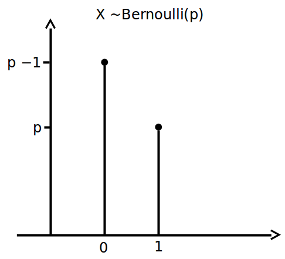
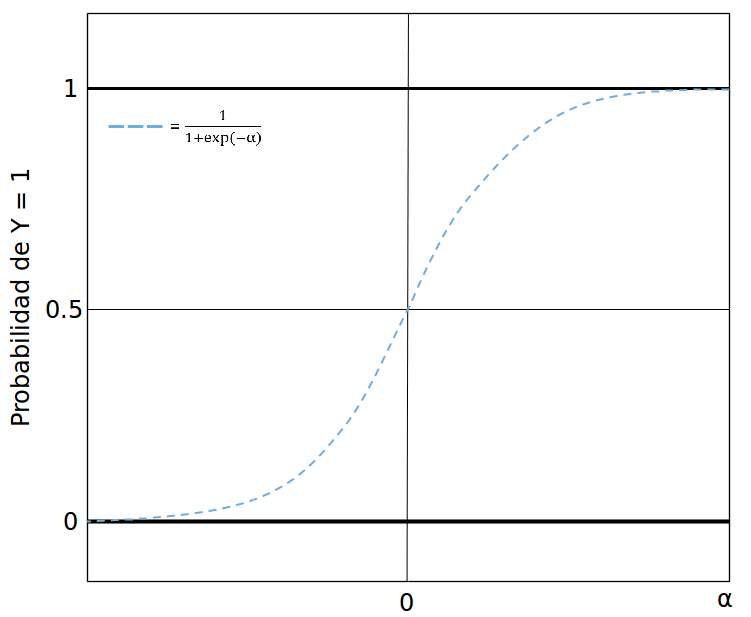

# Modelos logísticos {#logit}

*Por Francisco Urdinez*

***

**Lecturas de referencia**

- Box-Steffensmeier, J. M., Brady, H. E., & Collier, D. (Eds.). (2008). *The Oxford Handbook of Political Methodology* (Vol. 10). Oxford Handbooks of Political Science. Oxford: Oxford University Press. Cap. 22 – Discrete Choice Methods.

- Agresti, A. (2007). *An Introduction to Categorical Data Analysis*, 2nd Ed. Hoboken: Wiley. Cap. 3, 4 y 5 – Generalized Linear Models; Logistic Regression; Building and Applying Logistic Regression Models.

- Greenhill, B., Ward, M. D., & Sacks, A. (2011). The separation plot: A new visual method for evaluating the fit of binary models. *American Journal of Political Science*, 55(4), 991-1002.

***

En el capítulo anterior vimos cómo hacer regresiones lineares cuando tenemos variables dependientes contínuas de una manera simple y cubriendo los paquetes más útiles a nuestro alcance. En este capítulo veremos cómo hacer lo mismo cuando tenemos variables dependientes dicotómicas (también llamadas binarias, o *dummy*), aquellas que asumen una de dos posibilidades, comunmente '0' y '1'. Al igual que en los capítulos previos, no cubriremos aspectos sustanciales de la teoría por tras de cada modelo, ni desglosaremos en detalle las fórmulas. Para ello sugerimos referencias que van a ayudarte a acompañar lo que describimos, si es que nunca has leído al respecto. 

## Nociones básicas

Los modelos para variables dependientes dicotómicas son utilizados para estimar la probabilidad de ocurrencia de un evento. En nuestra base de datos codificamos como '1' los casos en que el evento sucede, y '0' cuando no. Por ejemplo, si mi variable es "países con Acuerdos de Libre Comercio con Estados Unidos", Chile será codificada con un '1', Argentina con un '0'. Estos modelos estiman probabilidades, es decir, cual es la probabilidad de que se observe un '1' dada ciertas caracteristicas de las observaciónes en nuestra muestra. Toda la discusión respecto a cómo estimar una probabilidad de una muestra es muy intersante, y puedes leerla en los capítulos 3, 4 y 5 de Agresti (2007). Es importante remarcar que en inglés existen dos conceptos diferentes que en español y portugués se traducen como una única palabra: *probability* y *likelihood* se traducen como probabilidad en diccionarios comúnes (¡haz la búsqueda si no nos crees!) a pesar de que la distinción entre ambos es vital para comprender como funcionan los modelos dicotómicos estimados por Máxima Verosimilitud (*Maximum Likelihood* en inglés). Aunque no vamos a ahondar en su distinción, es importante comprender que una probabilidad se estima a partir de una "población" de la cual conocemos sus "parámetros", mientras que la verosimilitud recorre el camino inverso, es decir, estima los valores de los parámetros para los cuales el resultado observado mejor se ajusta a ellos (ver Figura \@ref(fig:bin-realmuestra)). 

```{r bin-realmuestra, echo=FALSE, fig.cap="El camino de doble vía de probabilidad y verosimilitud"}
knitr::include_graphics("00-images/bin-realmuestra.png")
```

Cuando tenemos una variable dependiente dicotómica que queremos modelar, se asume que la misma tiene una distribución de Bernoulli con una probabilidad de $Y=1$ que desconocemos. Así, estimamos por medio de Máxima Verosimilitud nuestra probabilidad desconocida,  dada una determinada combinación linear  de variables independientes de nuestra elección (ver Figura \@ref(fig:bin-bernou)). Un muy buen ejercicio para comprender como se estima un parámetro cuya distribución es binomial por medio de Máxima Verosimilitud es ofrecida por [RPubs](https://rpubs.com/felixmay/MLE).

```{r bin-bernou, echo=FALSE, fig.cap="Distribución de Bernoulli"}

```

Los modelos logísticos han crecido enormemente en popularidad en Ciencia Política. Google Scholar reporta, de la búsqueda de "logit"+"political science" un total de 17100 referencias publicadas entre 2008 y 2018. La década previa (1998-2007) reporta 8900 artículos, y la anterior (1988-1997), 2100. Claro que la literatura en español y portugués es mucho más escasa. desde 1988 a 2018 hay 1060 resultados para la combinación "logit"+"ciencia política" y 355 para "logit"+"ciência política". La Ciencia Política ha hecho extensivo el uso de modelos Logit, por sobre los modelos Probit, en buena medida debido a que los primeros permiten el cálculo de razones de oportunidades (*odds ratios*). Casi todos los manuales econométricos discuten las diferencias y similitudes entre ambos, aunque a los fines prácticos de estimar un modelo, ambos son muy similares y reportan coeficientes casi idénticos. Por ello, siendo que son métodos que llevan a resultados muy similares, sólo utilizaremos Logit en este capítulo. 
Los modelos Logit y Probit se diferencian es en su función de enlace (en la literatura recomendada se denominan *link functions*). Logit lleva su nombre debido a que su función está dada por el logaritmo natural de las razones de oportunidad ("log odds" $\rightarrow$ logit!).

$$ ln(odds) = ln(\frac {p}{1 - p})$$
 
Despejando los términos podemos calcular la inversa de su función, de tal forma que tendremos

$$ logit^{-1}(\alpha) =  \frac {1}{1+e^{-\alpha}} = \frac {e^\alpha}{1+e^\alpha}$$

Donde $\alpha$ es la combinación linear de las variables independientes y sus coeficientes. La inversa del Logit nos dará la probabilidad de la variable dependiente ser igual a '1' dada una cierta combinación de valores para nuestras variables independientes. 

```{r bin-invlogit, echo=FALSE, fig.cap="Inversa de la función logit"}

```

Si profundizas en los textos recomendados, notarás que la función es indefinida en 0 y en 1, es decir, que la probabilidad se aproxima infinitamente al límite sin nunca tocarlo. Si modelaramos las probabilidades por medio de Mínimos Cuadrados Ordinarios, obtendríamos probabilidades mayores a 100% y menores a 0%, lo que es conceptualmente imposible. La función en forma de sigmoide de logit impide que esto suceda. Lo que estaremos estimando es la probabilidad de que, dada una cierta combinación de atributos (variables independientes y controles), cierta observación asuma que la variable dependiente sea igual a 1. Dicha probabilidad puede ser comparada al valor real que la variable dependiente ha asumido. Por eso mismo, muchos manuales se refieren a los modelos logit como modelo de "clasificación", pues lo que estimamos es la probabilidad de cada observación ser clasificada como $Y=1$. 


## Aplicación en `R`

Como mencioné antes, los modelos probabilísticos han ganado enorme preeminencia en la Ciencia Política en los últimos años, y por ello es probable que estés buscando una guía aplicada para saber qué hacer y qué no hacer cuando tengas una variable dependiente dicotómica. Vamos a ilustrar un paso a paso en `R` utilizando como ejemplo la base de datos del libro [“Democracies and Dictatorships in Latin America: Emergence, Survival, and Fall” (2013)](https://kellogg.nd.edu/democracies-and-dictatorships-latin-america-emergence-survival-and-fall) de [Scott Mainwaring](https://scholar.google.com/citations?user=TnO95soAAAAJ&hl=en) y [Aníbal Perez-Liñan](https://scholar.google.com/citations?user=UwryKbkAAAAJ&hl=en). A lo largo del libro los autores analizan cuales variables independientes ayudan a explicar por qué ocurrieron quiebres democráticos en América Latina durante todo el siglo XX y comienzos del XXI. En el capítulo 4, los autores se preguntan qué factores explican la supervivencia de los regímenes políticos. Si bien prueban varios modelos complejos, algunos logísticos y otros de supervivencia (desarrollados en este libro en el capítulo siguiente), haremos un ejemplo muy sencillo para que nos acompañes desde tu computador en el paso a paso. Para cargar la base de datos del capítulo, usa nuestro paquete `libroadp`.

Luego, cargamos la base de datos, llamada `quiebres_dem_la`.


```{r message=F}
library(paqueteadp)
```

```{r}
data(quiebres_dem_la)
```

Ahora la base se ha cargado en nuestra sesión de R:

```{r}
ls()
```

Suponiendo que la variable dependiente asume el valor '1' si el país sufre el quiebre de su régimen político democrático y '0' si no, ¿qué efecto tiene sobre la probabilidad de un quiebre democrático que en la constitución nacional se le otorguen grandes poderes constitucionales al poder ejecutivo? Y si esos poderes son pequeños, ¿la probabilidad de un quiebre democrático es mayor o menor?  Como argumentan los autores, se puede medir estos poderes por medio de un índice creado por [Shugart y Carey](http://www.cambridge.org/gb/academic/subjects/politics-international-relations/comparative-politics/presidents-and-assemblies-constitutional-design-and-electoral-dynamics?format=PB&isbn=9780521429900) (1992) de poder presidencial que los autores incluyen en su base de datos (en el capítulo 13 explicamos cómo crear índices). 

```{r message=F}
library(tidyverse)
```

Queremos ver, primeramente, cuantos países han sufrido un quiebre democrático en la muestra. ¿Recuerdas lo que se explicó en el capítulo 4? Comenzamos cargando el `tidyverse`. El país con más quiebres democráticos es Perú con 6, seguido de Argentina y Panamá con 5 cada uno. 

```{r , warning=FALSE, message=FALSE}
library(tidyverse)
quiebres_dem_la %>% filter(breakdown == 1) %>% count(country)
```
El primer modelo que vamos a probar usa la variable dependiente de quiebre democrático (`breakdown`) siendo predicha por el índice de [Shugart y Carey](http://www.cambridge.org/gb/academic/subjects/politics-international-relations/comparative-politics/presidents-and-assemblies-constitutional-design-and-electoral-dynamics?format=PB&isbn=9780521429900) de poderes del ejecutivo (`shugart`). La función `glm` exige que definamos nuestros datos, y el modelo, pues con la misma función para Generalized Linear Models podría usar Probit, Poisson y otras [funciones menos comúnes](https://www.rdocumentation.org/packages/stats/versions/3.5.1/topics/family) en Ciencia Política.   
```{r}
modelo_1 <- glm(breakdown ~ shugart, 
                data   = quiebres_dem_la,
                family = binomial("logit"))
```

Como vimos en capítulos anteriores, la función `summary` nos permite ver de forma rápida los resultados de un modelo de regresión:
```{r}
summary(modelo_1)
```

El coeficiente para la variable `shugart` está negativamente asociado a la probabilidad de ocurrencia de un quiebre de régimen `(-0.191)`, y es estadísticamente significativo `(p=0.00312)`. Ahora bien, a diferencia de los modelos por Mínimo Cuadrados del capítulo anterior, donde podíamos interpretar directamente el efecto de la variable independiente sobre la dependiente a partir de los coeficientes de la regresión, en el caso de regresiones logísticas esto no es tan sencillo. Debemos transformar los coeficientes en probabilidades u oportunidades. Si partimos de que la función de enlace de logit es el logaritmo de las razones de oportunidades, tenemos que: 
$$ln(\frac {p}{1 - p}) = \beta_{0} + \beta_{1}x_{1}$$

Despejando $ln$, tenemos que:
$$(\frac {p}{1 - p}) = e^{\beta_{0}+\beta_{1}x_{1}}$$

Y despejando los términos nuevamente tenemos que:
$$\hat{p} = \frac {e^{\beta_{0}+\beta_{1}x_{1}}}{1 + e^{\beta_{0}+\beta_{1}x_{1}}}$$

Lo que queremos, entonces, es transformar los coeficientes tal y como los reporta `R` en una probabilidad asociada a que la variable dependiente asuma el valor '1'. Sabemos que la variable independiente `shugart` es un índice que a mayor valor, mayor concentración de poder del ejecutivo *vis a vis* el legislativo, por lo tanto el coeficiente de la regresión nos indica que a menor concentración de poder del ejecutivo, mayor la probabilidad de un quiebre de régimen. Esto resultará intuitivo a todo aquel que esté familiarizado con la literatura. La muestra del libro cubre 20 países latinoamericanos entre 1900 y 2010, y el índice oscila entre un mínimo de 5 (para Haití, en varios años) y un máximo de 25 (Brasil en 1945) (ver Figura \@ref(fig:bin-shugarthist). Cuando anteponemos un (-) a la variable dentro de la función `arrange`, la ordenamos de mayor a menor.
```{r, warning=FALSE, message=FALSE}
quiebres_dem_la %>% select(country, year, shugart)%>% arrange(shugart)
quiebres_dem_la %>% select(country,year, shugart)%>% arrange(-shugart)
```
Podemos ver la distribución de la variable por medio de un histograma. Casi todas las observaciones tienen valores de 16 en el índice, y asume una distribución normal.
```{r, bin-shugarthist, fig.cap="Histograma del índice de Shugart & Carey", warning=FALSE, message=FALSE}
ggplot(quiebres_dem_la, aes(shugart)) +
  geom_histogram()
```

 ¿Cómo puedo saber en qué magnitud se afecta la probabilidad de un quiebre democrático si el nivel de concentración de poder del ejecutivo pasa de un puntaje de 5 (mínimo) a uno de 25 (máximo) cuando no controlamos por nada más en la regresión? Para ello podemos reemplazar los valores de nuestra última fórmula, en la que hemos aislado en el lado izquierdo de la fórmula a $\hat {p}$. Primero debemos calcular cuál es la probabilidad de sufrir un quiebre de régimen en un nivel de `shugart` de 5 y en un nivel 25, respectivamente, para luego calcular la diferencia. Así tenemos que
$$\hat{p} = \frac {e^{(0+(-0.019*5))}}{1 + e^{(0+(-0.019*5))}}$$

Notarás que el valor correspondiente al intercepto es igual a 0 pues ese coeficiente no ha resultado estadísticamente significativo. Sabemos que para un índice de Shugart y Carey de 5, luego de hacer el cálculo en la fórmula arriba, la probabilidad es igual a 0.47 o 47%. Te recomiendo que te detengas en la lectura y hagas el cálculo de la función en lápiz y papel. Si repetimos el proceso para un valor de `shugart` de 25, la probabilidad cae a 38%. Con las probabilidades podemos calcular oportunidades, que son simplemente $\frac {p}{1-p}$. De esta manera, la oportunidad (*odd* en inglés) para un valor 5 del índice de Shugart y Carey es de 0.90 mientras que para un índice de Shugart y Carey de 25 es de 0.62. 
$$oportunidad_1 = \frac {0.47}{1 - 0.47}$$
$$oportunidad_2 = \frac {0.38}{1 - 0.38}$$

La utilidad de las oportunidades es que permite calcular razones de probabilidades (*odds ratios*) ¿Cuál es la gracia de calcular una razón de probabilidades? Veamos. Cuando calculo la probabilidad de un cambio en el índice de Shugart y Carey de 23 a 24, la magnitud será diferente a si calculamos un cambio en la probabilidad si el índice pasa de 12 a 13, por ejemplo. Si no me crees, puedes probarlo. Esto se debe a que los efectos de la variable independiente sobre la probabilidad de que la variable dependiente sea `=1` no son lineares (recuerde la función en "S" de la Figura \@ref(fig:bin-invlogit)). Sin embargo, las razones de probabilidades tienen la útil propiedad de poder reflejar cambios independientemente de la curvatura de la función, es decir, son cambios “constantes”. Así, podemos expresar el efecto de la variable sin tener que especificar un valor determinado para ella. Por ello, verás en muchos artículos los coeficientes expresados como *odds ratios*.
Veamos cómo sería el cálculo de razones de probabilidad siguiendo el ejemplo que acabamos de crear con la base de datos de Mainwaring y Perez-Liñan. Dijimos que la oportunidad está dada por $\frac {p}{1 - p}$. Una razón de oportunidades se expresaría, entonces, como $\frac {\frac {p_1}{1-p_1}}{\frac {p_2}{1-p_2}}$. 


Supongamos que en un país el año 1992 tenía un índice de Shugart de 15, y que en el año 1993 ese índice subió a 16. ¿Cuánto cambia la probabilidad de un quiebre democrático?
 
$$ Pr(quiebredemocratico){_{país,1992}} = \frac {e^{(0+(-0.019*15))}}{1 + e^{((0+(-0.019*15))}} = 0.42$$
$$ Pr(quiebre democratico){_{país,1993}} = \frac {e^{(0+(-0.019*16))}}{1 + e^{(0+(-0.019*16))}} = 0.43$$

La probabilidad difiere poco y cae en un 2.4% lo que parece ser un efecto pequeño. La razón de oportunidades se calcula como el cociente de ambas oportunidades, así tenemos que: 

$$\frac {0.42}{0.43}=0.97$$


De esta manera, toda razón de oportunidades mayor a 1 expresa un cambio positivo, mientras que todo valor menor a 1 (entre 0 y 1) representa un cambio negativo en las probabilidades estimadas. Si hiciéramos el mismo ejercicio para otros valores del índice de Shugart y Carey, por ejemplo, un cambio de 3 a 4 o de 23 a 24, el cociente de las oportunidades daría 0.97. 

<div class='books'>
Ahora, haz el cálculo para el valor real de Chile en 1992 y 1993 como práctica, te esperamos.
</div>

`R` ofrece paquetes para que este análisis sea fácil de hacerse. Podemos visualizar fácilmente las razones de oportunidades utilizando el paquete `sjPlot`. Podemos calcular probabilidades predichas, y además podemos hacer tests para saber la capacidad explicativa de nuestros modelos. Utilizando la misma base de datos haremos un ejemplo de una rutina típica, que puedes reproducir en tu computador utilizando tus propios datos. 

Los pasos a seguir son (a) estimar los modelos, (b) crear tablas formateadas para incluir en nuestros procesadores de texto, (c) crear figuras para visualizar la magnitud de los coeficientes por medio de cociente de oportunidades, (d) visualizar probabilidades predichas para variables de interés, y (e) calcular capacidad explicativa de los modelos (porcentaje correctamente predicho, AIC, BIC, curvas ROC, *Brier scores* o *separation plots*, que explicaremos a continuación).

### Estimar los modelos
Para ejemplificar este paso lo que haremos es agregar al modelo 1 dos modelos más: El modelo 2 tendrá como variables independientes al índice de Shugart y Carey más la variable `age` que mide en años la edad del régimen político. 
 
```{r, warning=FALSE, message=FALSE}
ggplot(quiebres_dem_la, aes(age)) +
  geom_histogram()
```

```{r, warning=FALSE, message=FALSE}
modelo_2 <- glm(breakdown ~ shugart + age, 
                data   = quiebres_dem_la,
                family = binomial("logit"))
```

Luego de ejecutar la regresión, con `summary` vemos los coeficientes:
```{r}
summary(modelo_2)
```
El modelo 3 agrega a las dos variables del modelo 2 una tercer variable llamada `fh` que corresponde al [Freedom House  score](https://freedomhouse.org/report/methodology-freedom-world-2017) de democracia. Cuanto mayor el score, mejor el funcionamiento de la democracia de un país.

```{r fhhist, fig.cap="Histograma del índice de democrácia de FH", warning=FALSE, message=FALSE}
ggplot(quiebres_dem_la, aes(fh)) +
  geom_histogram()
```

Quizás también querramos ver por medio de una matriz de correlación como estan relacionadas nuestras variables independientes antes de incluirlas en el modelo. Para ello, podemos usar el paquete `GGally` que permite crear matrices de correlación con `ggplot2`. Vemos que la correlación entre `age`, `fh` y `shugart` es muy baja.

```{r, message=FALSE, warning=FALSE}
library(GGally)
correlacion <- quiebres_dem_la %>%
  dplyr::select(age, fh, shugart)

ggcorr(correlacion, label = T)
```
El modelo 3 entonces se verá de la siguiente manera:
```{r, warning=FALSE}
modelo_3 <- glm(breakdown ~ shugart + age + fh, 
                data   = quiebres_dem_la,
                family = binomial("logit"))
```

```{r}
summary(modelo_3)
```
Ahora la variable `shugart` ha dejado de ser estadisticamente significativa pero lo son `fh` y el intercepto.

### Crear tablas
¿Recuerde el `ADP`? Una de las funciones que hemos facilitado es la de creación de tablas editables para artículos académicos utilizando la función `texreg`. Si utilizas nuestro paquete te ahorrarás muchos pasos que son engorrosos. Basicamente la función contiene tres paquetes, uno para exportar tablas a html (`htmlreg`), uno para exportar tablas a $\LaTeX$, y un tercero para verlas en `RStudio` (llamado `screenreg`).

Por medio de `htmlreg` podemos exportar nuestras tablas formateadas en html para poder incorporarlas en nuestros artículos directamente. 
Una vez que estimamos los modelos de interés, los agrupamos en una lista por medio de la función `list`. Esto ahorra trabajo, pues en vez de tener que escribir el nombre de los tres modelos, simplemente nos referiremos al conjunto `mp_modelos`:
```{r}
library(texreg)
mp_modelos <- list(modelo_1, 
                   modelo_2,
                   modelo_3)
```

Para exportar la tabla a html debemos definir la opción `file` y un nombre para el archivo html. Yo la he llamado "tabla_1". También voy a usar dos opciones de la función para mejorar aún más la tabla. La primera es `custom.model.names` que me permite ponerle nombres a los modelos y la segunda es `custom.coef.names` que me permite ponerle nombre a los coeficientes. Así el comando sería:

```{r, eval=FALSE, message=FALSE}
htmlreg(mp_modelos,
          custom.model.names = c("Modelo 1", "Modelo 2", "Modelo 3"),
          custom.coef.names = c("Intercepto", "Indice de Shugart & Carey", "Edad del régimen", "Ind. Freedom House"),
          file="tabla_1.html")
```
Esta línea de comando crea un archivo de html en la carpeta de su proyecto. Si haces clic derecho sobre el archivo, puedes abrirlo en Word o cualquier procesador de textos. También podemos incluir una versión en pantalla usando `screenreg`. En este caso, veamos como se ve sin la opción `custom.coef.names`. A este comando uno puede usarlo en sus proyectos de trabajo, y una vez que se decide por la mejor tabla, la exporta con `htmlreg`. 
```{r, message=FALSE, warning=FALSE}
screenreg(mp_modelos,
          custom.model.names = c("Modelo 1", "Modelo 2", "Modelo 3")
          )
```
Observemos como `shugart` deja de ser estadísticamente significativa cuando controlamos por `fh` que, además, pasa a ser la única variable estadísticamente significativa del tercer modelo.También vemos como el número de observaciones cae significativamente al incluir la variable `fh` lo que hace difícil comparar los modelos. La función `skim` nos será muy útil para ver *missing values*. Las tres variables tienen niveles de missing muy altos, para `fh` de casi $2/3$ del total de observaciones.
```{r, message=FALSE, warning=FALSE}
library(skimr)
vars_modelo_3 <- quiebres_dem_la %>%
  dplyr::select(age, fh, shugart)

skim(vars_modelo_3)
```

Jane Miller pone mucho énfasis en su libro [The Chicago Guide to Writing about Multivariate Analysis (2013)](http://www.press.uchicago.edu/ucp/books/book/chicago/C/bo15506942.html), respecto a la diferencia entre significancia estadística y significancia substantiva a la hora de interpretar regresiones: no por ser una variable  estadísticamente significativa la magnitud del efecto será el esperado, ni tampoco significa que el hallazgo es relevante cientificamente. Para explorar las magnitudes de los coeficientes vamos a concentrarnos en el tercer modelo. 


Además, aprovecho aquí para mostrarte como puedes cambiar los coeficientes que obtienes directamente de la regresión logística, que son *log odds*, y reemplazarlos por *odds ratios*.  Para ello, puedes ayudarte de los argumentos `override.coef`, `override.se` y `override.pvalues` de `screenreg()`. Los odds ratios, como vimos antes, son simplemente los coeficientes exponenciados. Calcular errores estándar y valores-p, en tanto, es un poco más complejo: necesitamos acceder a la matriz varianza-covarianza del modelo. Por suerte esto ya lo hizo [Andrew Heiss](https://www.andrewheiss.com/blog/2016/04/25/convert-logistic-regression-standard-errors-to-odds-ratios-with-r/) en R, a quien agradecemos por compartir la función. Nosotros adaptamos levemente sus funciones, que podrás ingresar fácilmente en tus análisis siempre y cuando hayas cargado el paquete del libro, `paqueteadp` (como hicimos antes).

```{r, message=FALSE, warning=FALSE}
screenreg(modelo_3, 
          custom.model.names = "Modelo 3",
          override.coef    = exp(coef(modelo_3)), 
          # las siguientes funciones de ayuda, odds_*, están en el paquete del libro
          override.se      = odds_se(modelo_3),
          override.pvalues = odds_pvalues(modelo_3),
          # adicionalmente, omitiremos el coeficiente
          omit.coef = "Inter" )
```

Al obtener una tabla como la que acabamos de crear tenemos dos desafíos que abordaremos en los proximos subtitulos: primero, saber si la magnitud de los efectos es substantiva desde un punto de vista científico. Por ejemplo, si la variable `fh` resulta estadísticamente significativa pero la probabilidad de un quiebre de régimen cae en 0.03% si un país pasa del peor score de `fh` al mejor, entonces diríamos que, a pesar de estadísticamente significativa, nuestra variable carece de significancia substantiva. Segundo, comparar los modelos para saber cuál tiene mejor ajuste, es decir, cual tiene mejor capacidad explicativa. A diferencia de OLS no contamos con $R^2$, por lo que se recurre a otras medidas. Veamos!


### Visualización de resultados
Podemos representar visualmente la última tabla con la función `plot_model()` del paquete `sjPlot`. Una figura es mucho más intuitiva que una tabla. La figura \@ref(fig:bin-m2pr) muestra la probabilidad predicha de un quiebre democrático para para cada valor de poderes presidenciales. 

```{r bin-m2pr, message=FALSE, fig.cap="Modelo 2 en base Mainwaring y Perez Liñan (2013), prob. predicha de Shugart con otras variables en sus medias", warning=FALSE, message=FALSE}
library(sjPlot)

plot_model(modelo_2, 
           type        = "pred",
           show.ci     = TRUE,
           terms = "shugart",
           title = "Probabilidad predicha para Shugart (poderes presidenciales)")
```


También podemos graficar los coeficientes como *odds ratios*: En azul obtenemos coeficientes positivos, en rojo coeficientes negativos (recuerde que odds ratios menores a 1 son negativos). El coeficiente se expresa como su valor promedio y su intérvalo de confianza del 95%. Si el coeficiente es estadisticamente significativo, su intérvalo de confianza no tocará la línea en 1. Si, por el contrario no son significativos, el efecto cruzará la línea. Aquellos coeficientes cuyo efecto es significativo, además, son señalados con un * (esto se logra con la opcion `show.p = T`). Quizás te preguntes por qué la variable `shugart` no tiene intérvalo de confianza. En realidad, lo que sucede es que la escala es mucho menor para esta variable que para `fh`. Al estar la escala en base a `fh` no se nota el intérvalo para `shugart`.

```{r bin-m3or, message=FALSE, fig.cap="Odds ratios del Modelo 3, en base a Mainwaring y Pérez Liñán (2013)", warning=FALSE, message=FALSE}
# plot_model(modelo_3, show.ci = T, show.p = T)
```

Es cada vez más frecuente encontrar este tipo de figuras en vez de tablas y personalmente pienso que son preferibles. Un precursor en la disciplina en el uso de figuras y gráficos informativos fue [Edward Tufte](http://pages.mtu.edu/~hcking/Tufte_hKing.pdf). La ciencia política, sin embargo, no prestó demasiada atención a la presentación de resultados por medio de figuras hasta hace unas dos décadas, pero hoy la [tendencia](https://www.princeton.edu/~jkastell/Tables2Graphs/graphs.pdf) en la disciplina es a prescindir de tablas cuando estas no sean esenciales. Paquetes como `sjPlot` han facilitado esta tarea.

Con el argumento `type = "pred"` en `plot_model()` podemos apreciar cómo es la relación entre cada variable independiente y la probabilidad de que la variable dependiente ocurra, cuando las demás variables independientes están en sus medias (en este caso `fh`con `age`y `shugart`en valores medios). Vemos que la relación entre la probabilidad de ocurrencia de un quiebre democrático y el score de calidad institucional de Freedom House, es negativa. Cuando un país tiene un score de Freedom House de 2.5 (recuerdo, con las otras variables independientes en sus medias), la probabilidad de un quiebre oscila entre 58 y 100% con un intérvalo de confianza de 95%. Cuando el score es de 7.5, la probabilidad de un quiebre es casi nula. Las probabilidades altas de ocurrencia de un quiebre se registran en scores de Freedom House menores a 3.5, aproximadamente. Para cada valor de `fh`, además, vemos una nuve de puntos, que representa la cantidad de observaciones en cada valor. Así, sabemos que en el caso de `fh` la mayoría de las observaciones están entre los valores 6 y 10, que es donde el efecto es menor en mangnitud. Caer a un `fh` menor a 5 dispara las probabilidades de quiebre democrático. 

```{r bin-m3prpr-medias, fig.cap="Probabilidades predichas (con el resto de las variables en sus medias) del Modelo 3, en base a Mainwaring y Pérez Liñán (2013)", message=FALSE, warning=FALSE}
# plot_model(modelo_3, 
#         type        = "pred",
#         show.ci     = TRUE,
#         terms        = "fh",
#         title       = "Modelo 3 en base Mainwaring y Perez Liñan (2013), pr. predichas con otras variables en sus medias")
```

### Ajuste de los modelos
Una vez que uno ha analizado la significancia substantiva de los modelos por medio de figuras, graficando las probabilidades predichas y los efectos marginales, podemos explorar el ajuste de los modelos.  Así como en MCO se usa $R^2$ y el *Mean Root Square Error* ,existe una serie de estadísticas diseñadas para saber cuál de los modelos logísticos tiene mejor ajuste.  

#### Pseudo-$R^2$
Para entender como se interpreta el Pseudo-$R^2$ (normalmente se usa el de McFadden) es importante compreender como se diferencia de un $R^2$ de regresión lineal (puedes usar [este link](http://setosa.io/ev/ordinary-least-squares-regression/) para acompañar su interpretación en el el capítulo de OLS). La fórmula, en este caso es 
$psR^2= 1-\frac {ln \hat{L}(Modelo completo)}{ln \hat{L}(Modelo sólo con intercepto)}$
Donde $\hat{L}$ es la verosimilitud estimada por el modelo. Básicamente, lo que la fórmula está haciendo es comparar el modelo con todas nuestras covariables al modelo que apenas tiene el intercepto, para ver cuanto mejora la capacidad explicativa del mismo si incluimos variables independientes. Como $L$ está entre 0 y 1, su log es menor o igual a 0. Así, cuanto menor la razón, mayor la diferencia entre el modelo elegido y el modelo con apenas el intercepto. La función es tomada del paquete `pscl`. El modelo 1 y 2 tienen casi la misma capacidad explcativa, pese a que se ha incorporado una variable más en el segundo modelo. En cambio, al agregar `fh` al Modelo 3, nuestro Pseudo-$R^2$ se dispara a 0.96.
```{r, message=FALSE, warning=FALSE}
library(pscl)
pR2(modelo_1)[["McFadden"]]
pR2(modelo_2)[["McFadden"]]
pR2(modelo_3)[["McFadden"]]
```
También se podría implementar un $psR^2$ ajustado, es decir, una versión que penalice por cantidad de covaraibles. Al igual que en el $R^2$ ajustado, incorporamos a la fórmula el término $c$, que es cantidad de covariables, y así tenemos que 
$Pseudo-R^2= 1-\frac {ln \hat{L}(Modelo completo)-c}{ln \hat{L}(Modelo sólo con intercepto)}$
Si bien el $R^2$ siempre aumenta al adicionar covariables al modelo, si utilizamos medidas ajustadas, estaremos teniendo en cuenta este aspecto. 
```{r, message=FALSE, warning=FALSE}
library(DescTools)
PseudoR2(modelo_1, c("McFadden"))
PseudoR2(modelo_2, c("McFadden"))
PseudoR2(modelo_3, c("McFadden"))
```


#### AIC

Muchas veces las tablas con modelos de regresión logística reportan AIC (Akaike Information Criterion). Estos permiten comparar entre modelos diferentes para una misma muestra, y decidir cual tienen mejor ajuste. El AIC,como el $Pseudo-R^2$, usa información de $ln(\hat {L})$. El AIC lo que hace es medir la “distancia” que existe entre los verdaderos parámetros y los estimadores del modelo, por medio de una distancia matemática llamada divergencia de Kullback-Leibler. Cuanto menor sea esta distancia, mejor el modelo. Es muy útil a la hora de comparar diferentes modelos y se calcula como 
$AIC = 2p-2ln(\hat {L})$
Donde $p$ es la cantidad de regresores incluyendo al intercepto, y $\hat{L}$ es la verosimilitud estimada por el modelo. De los tres modelos, claramente el que mejor ajuste posee bajo este criterio es el tercero. 

```{r, message=FALSE, warning=FALSE}
AIC(modelo_1)
AIC(modelo_2)
AIC(modelo_3)
```

#### BIC
El BIC (Bayesian information criterion), al igual que AIC, es un criterio de comparación de modelos según su ajuste. A los fines prácticos, y para no entrar en las diferencias entre AIC y BIC, es importante saber que BIC penaliza de manera más rigurosa que AIC la complejidad del modelo, siendo que su fórmula es
$BIC=ln(n)p-2ln(\hat {L})$
donde agrega a la formula $n$ que es el número de observaciones en la muestra. Los resultados son similares a los que obtubimos mediante AIC, es decir que el mejor ajuste lo muestra el tercer modelo.
```{r,  message=FALSE, warning=FALSE}
BIC(modelo_1)
BIC(modelo_2)
BIC(modelo_3)
```
Se recomienda usar AIC o BIC pero no es necesario reportar ambos en una tabla con varios modelos.

#### Porcentaje de predicciones correctas

Para entender el porcentaje de predicciones correctas en un modelo es importante tener en claro que un modelo produce cuatro combinaciones posibles: 

```{r bin-porcpred, echo=FALSE, out.width='60%', fig.cap="Tabla de clasificación a partir de la cual se calcula el porcentaje de predicciones correctas"}
knitr::include_graphics("00-images/bin-porcpred.png")
```

Toda observación será clasificada como "correcta" si corresponde a la casilla superior izquierda (verdadero positivo) o a la inferior derecha (verdadero negativo). El porcentaje de observaciones que pertenecen a estas dos casillas determina el porcentaje de predicciones correctas en el modelo. Como criterio estándar, si la probabilidad estimada para una observación es mayor o igual a 50% se estima que es una probabilidad positiva, y si es menor a 50% será una probabilidad negativa.

Para poder calcular las predicciones correctas necesitamos hacer varios pasos, pero si usas los comandos que te damos a continuación, vas a poder hacerlo con tu propia base de datos cuando trabajes solo. Primero que nada necesitamos usar el paquete `broom`, que transforma los modelos que tenemos guardados (modelos 1, 2 y 3) en bases de datos en formato `tidy` como vimos en el Capítulo \@ref(lineal). Voy a calcular los valores predichos del modelo 3 como ejemplo que puede repetirse para los otros modelos. Lo primero que necesitamos son los valores predichos, es decir, la probabilidad asignada a cada obervación de que `Y=1`. En el tidy que obtenemos usando `broom` esta variable se llama `.fitted`.

```{r, message=FALSE, warning=FALSE}
library(broom)

pred_modelo_3 <- augment(modelo_3, type.predict = "response")
pred_modelo_3
```

La función `dplyr` nos permite transformar nuestra nueva base obtenida por medio de `broom`. Una de las funciones básicas de `dplyr` es `select`, que nos permite escoger variables por sus nombres. Necesitamos identificar los valores predichos y la variable dependiente (en este caso `breakdown`) para poder comparar la probabilidad asignada por el modelo con el valor real de la varible. La función `mutate` de `dplyr` nos permitirá crear una variable binaria para saber si el modelo ha predicho correctamente cada observación. El punto de corte es de 0.5, es decir, si la probabilidad estimada es igual o superior a 0.5 la se considera que el modelo predijo la ocurrencia del evento, y si es menor a ese valor se considera que predijo la no ocurrencia del evento. Trabajar con valores arbitrarios de corte tiene desventajas, que veremos a continuación que son resueltas por los ROC. Al fin creamos una variable que llamamos `pcp` (porcentaje correctamente predicho) que refleja la proporcion de verdaderos positivos y verdaderos negativos estimados por el modelo 3. El resultado muestra que de las 422 observaciones del modelo 3, 99.5% han sido correctamente predichas.   

```{r, message=FALSE, warning=FALSE}
pred_modelo_3 %>% 
  dplyr::select(.rownames, breakdown, .fitted) %>% 
  mutate(predicho_binario = if_else(.fitted >= 0.5, 1, 0),
                      predicho_correcto = if_else(breakdown == predicho_binario, 1, 0)) %>% 
  summarize(pcp = mean(predicho_correcto))
```

#### Brier Score 
Ésta es otra medida de ajuste, menos frecuente en Ciencia Política. Cuanto más próximo el score de Brier está de 0, mejor el ajuste del modelo. En general uno no utiliza todas las medidas que estamos repasando (AIC, BIC, Brier, etc.) sino que elige dos o tres que sean de su agrado. Creo que situaciones en que se quiere “castigar” mucho las predicciones erróneas, ésta es una alternativa ideal ya que su fórmula viene dada por $$BS = \frac {1}{N} \sum(\hat{p}-x)^2$$, donde $N$ es el número de observaciones, $\hat{p}$ es la probabilidad predicha para cada observación, y $x$ es el valor real de la observación en nuestra base de datos. El score es el promedio para todas las observaciones de la muestra. ¿Cuál de los tres modelos tiene menor score?
```{r}
BrierScore(modelo_1)
BrierScore(modelo_2)
BrierScore(modelo_3)
```


#### ROC plot
Las curvas de ROC tienen la ventaja de no definir un límite arbitrario a partir del cual se decide si la observación ha sido correcta o incorrectamente clasificada. Su desventaja es que es una figura extra que deberás incluir en tu artículo, que quizás puedas incluir en el apéndice. Para interpretar estas figuras, lo que nos interesa es el área debajo de la curva diagonal que cruza la figura. A mayor el área bajo la curva, mejor el ajuste del modelo. Si quieren leer más al respecto, el área conforma un score que se denomina AUC score (que viene de *Area Under the Curve*). Vamos a construirlo con la función `geom_roc()` del paquete `plotROC`. Lo que haré primero es crear una base de datos con los resultados de los tres modelos de regresión. A la base la llamaré `pred_modelos`. 

```{r, fig.cap="Roc Plot de nuestros modelos.", message=FALSE, warning=FALSE}
library(plotROC)

pred_modelos <- bind_rows(augment(modelo_1, response.type = "pred") %>% 
                            mutate(modelo = "Modelo 1"),
                          augment(modelo_2, response.type = "pred") %>% 
                            mutate(modelo = "Modelo 2"),
                          augment(modelo_3, response.type = "pred") %>% 
                            mutate(modelo = "Modelo 3"))
```

Una vez creada la base con la información de los tres modelos, procedo a crear la figura usando `gglpot`, como vimos en el **CAP XXX**. En el eje vertical tenemos la *sensibilidad* del modelo mientras que en el eje horizontal tenemos (1-*especificidad*) del modelo. La sensibilidad es la razón entre los verdaderos positivos (o sea, aquellas observaciones predichas como "1", que realmente eran "1" en la base de datos), y la suma de los verdaderos postivos más los falsos negativos (aquellos preichos como "0" que en verdad eran "1"). La especificidad es la razón entre los verdaderos negativos (aquellas observaciones predichas como "0" que eran "0" en la base de datos) y la suma de los falsos positivos (aquellas observaciones predichas como "1" que en verdad eran "0") sumado a los verdaderos negativos. 

```{r bin-rocplot, fig.cap="Roc Plot de nuestros modelos.", message=FALSE, warning=FALSE}

roc <- ggplot(pred_modelos, aes(d = breakdown, m = .fitted, color = modelo)) + 
  geom_roc(n.cuts = 0) + geom_abline(slope = 1)+
  xlab("1 - Especificidad")+
  ylab("Sensibilidad")
  
roc
```

Para poder ver el AUC, utilizamos la función `calc_auc` sobre el objeto que hemos llamado `roc`. 
```{r, message=FALSE, warning=FALSE}
calc_auc(roc)
```


#### Separation plots
El *separation plot* fue propuesto por [tres politólogos en este paper publicado en  2011](https://onlinelibrary.wiley.com/doi/abs/10.1111/j.1540-5907.2011.00525.x) y remite a la idea que mencionamos al inicio del capítulo de que los modelos logísiticos son modelos de clasificación, y retoma la utilidad tanto de los porcentajes correctamente predichos como de los ROC. Los *separation plots* son figuras que permiten ver la información de una tabla de clasificación, pero donde podemos identificar qué observaciones son las peor predichas. 

Una crítica que puede hacersele a esta linda herramienta visual es que cuanto mayor es el número de observaciones en nuestra muestra, más dificil se vuelve interpretar la figura ya que la gracia del *separation plot* es que cada observación es incluida en la figura en la forma de una línea vertical, que será amarilla si la observación asume `breakdown=0` y roja si `breakdown=1`. Nótese cómo ocupamos el argumento `type = "line"` en las opciones, para que cada observación sea incluida como línea. Si las observaciones fueran más de 1000, por decir un número no arbitrario, sería recomendable usar el arguemnto `type = "band"`, que facilita la lectura para modelos con muestras muy grandes. ¿Cómo interpretamos la figura? Si el modelo predijiera perfectamente nuestra variable dependiente, todas las observaciones en amarillo estarían del lado izquierdo, y todas las rojas del lado derecho, ya que en el eje horizontal de la figura tenemos la probabilidad predicha para cada obervación. 


```{r bin-sepplots, fig.cap="Separation plots del modelo 1 y 3.", message=FALSE, warning=FALSE}
library(separationplot)
separationplot(pred    = predict.glm(modelo_1, type = "response"),
               actual  = as.vector(modelo_1$y),
               type    = "line",
               show.expected = T,
               newplot = F, 
               line    = F,
               heading = "Separation plot - Modelo 1 en base a Mainwaring y Perez Liñan (2013)")

separationplot(pred    = predict.glm(modelo_3, type = "response"),
               actual  = as.vector(modelo_3$y),
               type    = "line",
               show.expected = T,
               newplot = F, 
               line    = F,
               heading = "Separation plot - Modelo 3 en base a a Mainwaring y Perez Liñan (2013)")
```

El triangulo negro que vemos debajo de la figura es el punto a partir del cual las obsevaciones en rojo deberían comenzar si estuviesen perfectamente clasificadas de las amarillas. Si te fijas en el *separation plot* del modelo 1, verás que hay líneas rojas del lado izquierdo de la figura. Estas son observaciones para los cuales `breakdown=1` y sin embargo se les ha estimado una probabilidad de quiebre democrático muy baja. El modelo 1, apenas con una variable dependiente (`shugart`) predice bastante mal la realidad de quiebres democráticos en América Latina. Notarás que el modelo 3 ha clasificado mucho mejor que el modelo 1 a las observaciones. De hecho, el modelo 3, apenas con 3 variables independientes, ha podido clasificar la variable dependiente casi perfectamente. 

<div class ='books'>

**Ejercicios antes de continuar al próximo capítulo**

* Con lo aprendido en el Capítulo \@ref(dataviz), de visualización de datos, mejora las figuras, agregando nombres a los ejes y título.

- Agrega dos variables independientes al modelo que hemos repasado en el capítulo e interprete los coeficientes como *odds ratios*. 

- Grafique estos coeficientes usando `sjPlot`. 

- Diagnostique el ajuste del modelo con un ROC y un *Separation Plot*.

</p>