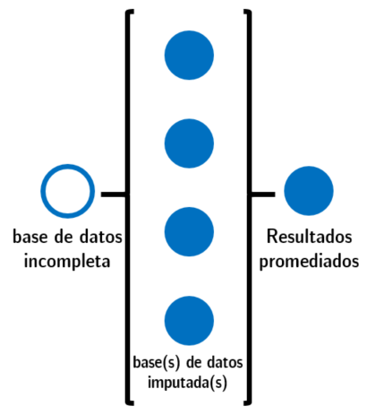
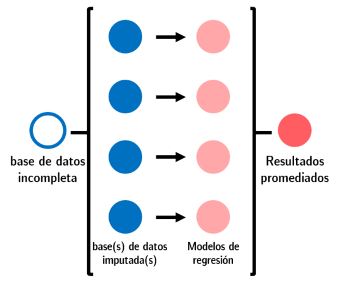

# (PART) Aplicaciones {-}

# Manejo avanzado de datos políticos {#manejo-av}
*Por Andrés Cruz Labrín y Francisco Urdinez*


***

**Lecturas de referencia**

- Lall, R. (2016). How multiple imputation makes a difference. *Political Analysis, 24*(4), 414-433.

- Honaker, J., King, G., & Blackwell, M. (2011). Amelia II: A program for missing data. *Journal of Statistical Software, 45*(7), 1-47.

-  Allison, P. D. (2001). *Missing data* (Vol. 136). Sage publications.

- Graham, J. W. (2009). Missing data analysis: Making it work in the real world. *Annual Review of Psychology, 60*, 549-576.

***

## Introducción

En este capítulo tratamos dos problemas que son muy recurrente entre quienes usamos datos de países tomados de diferentes fuentes ([World Bank Data]( https://data.worldbank.org/
), [V-Dem]( https://www.v-dem.net/es/), [World, Governance Indicators]( http://info.worldbank.org/governance/wgi/#home), [Correlates of War]( http://www.correlatesofwar.org/), etc). El primero de ellos es el de la estandarización de los “códigos” que se utiliza para cada país. Estos códigos son importantes, porque a partir de estos es que unimos dos o más bases de datos de diferentes fuentes. Piense por ejemplo el siguiente escenario: su base tiene una variable llamada “país” donde Brasil es codificado en mayúsculas como “BRASIL”. Luego toma datos del Banco Mundial y los datos de Brasil están como “Brazil”, y luego toma datos de Correlates of War donde Brasil es el código 140. Si este problema se repite para los más de 200 países de su muestra, ¿cómo resuelve de manera rápida este rompecabezas? 

El segundo problema es que muchas veces nuestros datos tienen datos faltantes, o como se les llama comunmente, “missing values”. Cuando hay datos faltantes en una regresión `R` simplemente elimina la observación que tiene el dato faltante ya sea en su variable dependiente, independiente o controles (a esta eliminación se le llama *listwise deletion*). Imagine que queremos comparar diez países de América Latina en la evolución de su tasa de desempleo entre 2008 y 2018 y, sin embargo, uno de ellos no tiene datos para el trienio 2010-2013. ¿Podemos rellenar estos valores "adivinando" los valores que no observamos? A este proceso se le llama imputación.

Decidir si imputar o no es una una decisión del investigador. Que la imputación sea adecuada dependerá de si los datos sean faltantes de manera **aleatoria**. Este dilema se presenta cuando estos datos son usados para crear gráficos y no queremos que queden incompletos. También, en algunos modelos avanzados, como los espaciales, tener valores faltantes puede impedirnos ejecutar los comandos. Para estos casos, podemos considerar imputar estos datos, es decir, completar los datos faltantes a partir de la información que tenemos para los otros países. Hacer esto tiene un costo que discutiremos en breve, ya que, como toda solución, no es perfecta. 

Para ejemplificar este ejercicio vamos a usar la base de datos sobre tratados internacionales creada por [Carsten Schulz](https://www.carstenschulz.eu/) en base al repositorio de [Naciones Unidas con todos los tratados internacionales vigentes](https://treaties.un.org/). En este repositorio se alojan todos los tratados internacionales celebrados entre estados, con sus textos, e informaciones sobre los firmantes. La base del ejemplo está simplificada, apenas tenemos dos tratados internacionales en vez de las decenas que originalmente utiliza Schulz para estudiar qué lleva a un país a unirse a un acuerdo internacional. Los tratados del ejemplo son el Tratado de Prohibición Completa de los Ensayos Nucleares de 1996 y El Estatuto de Roma de 1998, que es el instrumento constitutivo de la Corte Penal Internacional y sólo tenemos los países del continente americano. Empezamos por cargar su base de datos, desde nuestro paquete `paqueteadp`:

```{r}
library(tidyverse)
```

```{r message=F}
library(paqueteadp)
```
Puede demorar uno o dos minutos la carga de los datos.

```{r}
data(tratados_int)
```

Ahora la base se ha cargado en nuestra sesión de `R`. 

```{r}
ls()
```

Cada tratado viene acompañado de información del proceso de incorporación doméstica del tratado, es decir, fecha de firma, aceptación, ratificación y delegación. Estas acciones están categorizadas en la variable `action_type_string` y además son acompañadas de la variable `action_date` que registra la fecha de cada acción. La variable `location` registra la ciudad donde se firmó el tratado internacional, y `country name` el nombre de cada país.

```{r}
skimr::skim(tratados_int)
```

## ¿Cómo aprovechar `countrycode`?

Si leíste el Capítulo \@ref(surv) sobre modelos de supervivencia, seguramente recuerdes que utilizamos la función `countrycode` para poder crear el gráfico de Gantt con el tiempo que demoró cada país en implementar mecanismos de democracia directa. Como en ese entonces lo vimos bastante por encima, ¡hagamos otro ejemplo! 

Teniendo la base de datos de Schulz, primero queremos agregarle a cada país el índice de capacidades materiales que codifica Correlates of War, el famoso [índice CINC]( https://es.wikipedia.org/wiki/%C3%8Dndice_compuesto_de_capacidad_nacional). Este índice es un proxy de poder nacional tal como lo entiende la escuela del realismo, y combina seis indicadores de poder duro, a saber, consumo primario de energía, población total, población urbana, producción de acero y hierro, gasto militar y número de tropas militares. El índice varía de 0 a 1 pues representa la proporción que cada país representa del poder mundial total en un año determinado. 

Una vez que hemos agregado estos datos a la base, queremos analizarlos pero únicamente para la región de América Latina. 

El paquete `countrycode` nos permitirá hacerlo de manera simple: lo que hace la función es estandarizar los nombres de los países en base a códigos preexistentes como el de ISO (International Organization for Standardization), el Fondo Monetario Internacional, Naciones Unidas, el proyecto Varieties of Democracy (V-Dem), el Banco Mundial, solo por mencionar algunos. Si logramos que la base de Schulz y la base de Correlates of War identifiquen a cada país con códigos equivalentes, nos aseguraremos que al unir las dos bases de datos no perderemos información. 

Cargamos el paquete `countrycode` y le preguntamos cuáles son los estándares que reconoce en `?codelist`. Los estándares aparecen en el cuadrante derecho de RStudio.
```{r}
library(countrycode)
?codelist  #lista todos los formatos de origen y destino que soporta el paquete
```
Por la forma en que están registrados los países daría la sensación de que es `un.name.es`, es decir, los países están registrados con su nombre entero (que en este caso es el nombre oficial que Naciones Unidas da a cada país). Como vamos a unirlo a la base de Correlates of War querremos crear una variable que codifique cada país con la nomenclatura que ellos usan, que se llama `cown` (Correlates Of War Numbers).

```{r}
tratados_int_estandar <- tratados_int %>%
  mutate(ccode = countrycode(country_name_es, 
                             origin = "un.name.es", 
                             dest   = "cown", 
                             custom_dict = codelist)) 
```
La variable ‘country_name_es’ de Schultz le da nombre a cada país, pero no podemos saber a priori si todos los países se adaptan al estándar que usamos (`un.names.es`). Veamos si tenemos algún *missing value* después de haber creado la variable de códigos de Correlates of War ‘ccode’. 
```{r}
tratados_int_estandar %>%
  filter(is.na(ccode))
```
Vemos que Venezuela no ha sido unida a la base porque su `ccode` aparece como NA. Esto puede ser por dos razones: o bien el nombre estaba mal escrito y por lo tanto `countrycode` no supo identificarlo, o bien que Correlates of War no tiene códigos para este país. En este caso, la respuesta es la primera opción. 

Schulz registra al país como “Venezuela, República Bolivariana de” y el estándar en español de Naciones Unidas `un.names.es` lo registra como “Venezuela (República Bolivariana de)”. Esta pequeña diferencia hizo con que a Venezuela no se le adjudique código. Cuando trabajes con nombres de países es casi seguro que te enfrentes a una situación como esta. 

Para comprobar los nombres puedes chequear en los nombres oficiales que Naciones Unidas da a cada país en todos los idiomas oficiales que se obtienen en este [link]( https://www.google.com/url?sa=t&rct=j&q=&esrc=s&source=web&cd=2&ved=2ahUKEwiRmPGu9YHgAhWsGbkGHVLYBJIQFjABegQIAhAC&url=https%3A%2F%2Funstats.un.org%2Funsd%2Fgeoinfo%2FUNGEGN%2Fdocs%2F26th-gegn-docs%2FWP%2FWP54_UNGEGN%2520WG%2520Country%2520Names%2520Document%25202011.pdf&usg=AOvVaw3FxPx11WUTRvKfYQZ-DCzf)

Como `countrycode` no logró unir automáticamente a Venezuela, hay que resolver este tipo de situaciones manualmente con la opción `custom_match`. 
```{r}
tratados_int_estandar <- tratados_int %>%
  mutate(ccode = countrycode(country_name_es, 
                             origin = "un.name.es", 
                             dest   = "cown", #cown es Correlates of War numérico 
                             custom_dict = codelist,
	custom_match = c("Venezuela, República Bolivariana de" = "Venezuela (República Bolivariana de)")))
```
Ahora veamos si se ha resuelto el problema. 

```{r}
tratados_int_estandar %>%
  filter(is.na(ccode))
```
¡Perfecto!

Una vez que hemos creado la variable `ccode` en la base de los tratados internacionales, queremos unir la base de Schulz a Correlates of War. Nosotros bajamos los datos COW desde este [link](http://www.correlatesofwar.org/data-sets/national-material-capabilities) y la base ya está disponible en el paquete del libro:

```{r}
data(cinc_cow)
```

Ahora podemos chequear que la base se ha cargado en nuestra sesión de `R`:

```{r}
ls()
```

El código que identifica a cada país es `ccode`, el mismo que creamos en la base de tratados. También tenemos `year` que denota el año, `milex` el gasto militar del país, `milper` el tamaño del ejército en hombres activos , `irst` producción de acero y hierro, `pec` consumo energético, `tpop` población total, `upop` población urbana, el `cinc` que es el índice compuesto de capacidades materiales que nos interesa, y por último `version` que es la versión de la base. Este índice refleja la fracción del poder global que cada país posee. Por ejemplo, si vemos su valor para los dos países más poderosos del mundo, Estados Unidos y China, veremos que hace algunos años China habría superado a los Estados Unidos. En la literatura de RRII existe un debate respecto a si este índice es un reflejo cabal del poder total de los estados, que podrás ver en [Chan (2005)]( http://as.ucpress.edu/content/45/5/687.full.pdf+html) y [Xuetong (2006)]( http://www.tsinghua.edu.cn/publish/iis/7236/20120308004022054904369/2006-The%20Rise%20of%20China%20and%20its%20Power%20Status.pdf). 

Para poder crear la figura usando `ggplot` hay que saber el código de cada país. Si te resulta útil continuar usando el estándar de COW en tus trabajos, podés bajar la lista completa de códigos en este [link](cow.la.psu.edu/COW%20State%20list.xls). 

```{r, fig.cap="Índice de capacidades materiales para Estados Unidos y China"}
ggplot(subset(cinc_cow, ccode %in% c("2", "710"))) + 
  geom_line(aes(x = year, y = cinc, group = ccode, colour = stateabb))
```
Para unir las dos bases vamos a usar la función `left_join` del paquete `dplyr`. De esta forma las estamos pegando de manera horizontal, como si a la base original de Schulz le agregáramos nuevas variables a la derecha de las que había. Sin embargo, hay un detalle a tener en consideración: la base de `cinc_cow` tiene los datos del índice CINC para más de cien años, pero nosotros aquí necesitamos los valores de cada país en el año específico en que firmaron cada tratado internacional. 

Por suerte, dentro del gran `tidyverse` existe un paquete llamado `lubridate`. Esta función nos permite tomar una fecha, como por ejemplo en la variable `adoption_date` y a partir de ella extraer el año en que el tratado internacional fue adoptado para que el valor del índice CINC sea el de este año. 

```{r}
library(dplyr)

tratados_int_estandar <- tratados_int_estandar %>% mutate(year = lubridate::year(adoption_date)) 

base_unida <- left_join(tratados_int_estandar %>% 
                          mutate(ccode = as.character(ccode)), 
                        cinc_cow %>% 
                          mutate(ccode = as.character(ccode)), 
                        by = c("ccode", "year"))
```
Al haber unido las dos bases, queremos quedarnos únicamente con los países de América del Sur. El problema es que no tenemos una variable que registre la región de cada país. Aquí se vuele útil `countrycode` una vez más pues tiene incorporada una función por la cual reconoce a qué region pertenece cada país.  Creamos la variable `region` y filtramos América del Sur. 

```{r}
base_unida <- base_unida %>% 
 mutate(region = countrycode(ccode, origin = "cown", dest = "region"))
```

Si quieres, puedes abrir la base para ver como se ve la variable `región` en este momento. Ahora, filtramos la que queremos mantener
```{r}
base_unida_samerica <- base_unida %>% filter(region == "South America")
```
Así, hemos logrado una base que tiene más variables que la original, y que nos permite filtrar por regiones geográficas del mundo. 

De esta forma te hemos ejemplificado la enorme utilidad de `countrycode` y `lubridate` cuando estés armando tus bases de datos.

## ¿Cómo imputar datos faltantes?

De manera suscita, existen cuatro tipos diferentes de datos faltantes para decidir si necesitas imputar datos recomendamos una profunda reflexión y también la lectura de los textos de Graham y Allison que están en las lecturas de referencia. Tus datos faltantes pueden ser “estructurales”, faltantes de manera *absolutamente* aleatoria (esto en la literatura se denomina MCAR), faltantes de manera *no* aleatoria y los faltantes de manera aleatoria. Solo querremos imputar cuando los datos sean faltantes de manera aleatoria.

Para poner un breve ejemplo de cada tipo de dato faltante, ¿qué significa que haya datos faltantes de manera estructural? En el ejemplo debajo tenemos una variable que codifica si el país tiene vigente una ley de matrimonio entre personas del mismo sexo. La variable siguiente codifica el año en que dicha ley se ha sancionado. Si te fijas, Venezuela y Perú tienen valores faltantes en esta variable, pero la razón es que *no tienen* en principio una ley de este tipo. Entonces, los datos faltantes son estructurales cuando el dato está faltando porque el dato no existe.

ID         | Ley de matrimonio igualitario | Año de aprobación
---------- | ----------------------------- | -------------------
Argentina  | 1              |  2010
Brasil     | 1              | 2013
Venezuela  | 0              | NA
Peru       | 0              | NA

Tendremos datos faltantes de manera *absolutamente* aleatoria si cuando los datos fueron generados hubo algún criterio de aleatorización. Por ejemplo, si en un cuestionario de diez preguntas hemos preguntado ocho a cada persona de manera aleatoria. Las dos preguntas faltantes para cada persona no estarán explicadas por variables relacionadas al encuestado (su ideología, edad, género, religión, etc). 

Puede darse que nuestros datos sean faltantes no aleatoriamente. Este es posiblemente el escenario más frecuente en el que equivocadamente se imputan datos en ciencia política, cuando en verdad no se debería hacer. Los datos faltantes no aleatorios son aquellos cuya condición de faltantes se correlaciona otra variable de tal forma que hay un *patrón* en la falta de datos. Cuando nos encontramos ante una situación en que faltan datos en nuestra base debemos reflexionar cuidadosamente respecto a qué variables pueden estar explicando esta falta de datos, y si es que existe un sesgo de selección. Por ejemplo, si utilizamos datos del banco mundial respecto a crecimiento del PBI es muy probable que países muy pobres no reporten datos. Esto se debe a que en estos países la calidad de las mediciones no es óptima. También puede darse que las mediciones no se han hecho si el país atraviesa un momento difícil en su economía que repercute sobre las estadísticas nacionales. Por ejemplo, desde 2016 que el Banco Mundial no reporta índices de inflación para Venezuela. Idealmente uno debería corregir este sesgo mediante una covariable en el modelo, usando modelos de selección (no los vemos en el libro, lamentablemente), o simplemente hacer *pairwise* en las regresiones sabiendo que nuestra muestra puede no ser representativa de la población.

Por último, si asumimos que nuestros datos son faltantes de manera aleatoria (los textos los describen como MAR) estos estarán generados sin un patrón, pero la otra información con la que contamos en la base de datos nos permitiría “adivinar” el valor faltante. Pensemos en el índice CINC, por ejemplo: imagina que tenemos veinte observaciones faltantes en el índice de los Estados Unidos. Como el índice se compone de las otras variables de capacidades materiales, podemos utilizar estas para predecir los valores que faltan. 

Tomando este caso vamos a hacer dos escenarios de imputación. El primero es de imputación con fines descriptivos (creación de gráficos). El segundo, quizás más útil, será una imputación para aumentar la cantidad de observaciones en nuestros modelos de regresión. 

Utilicemos como ejemplo el gráfico con el índice CINC de Estados Unidos y China solo que lo haremos con puntos para poder ver los valores año a año más facilmente. 
```{r, fig.cap="En vez de ver el índice de capacidades materiales como una línea vemos cada año como un punto para ver mejor datos faltantes"}
ggplot(subset(cinc_cow, ccode %in% c("2", "710"))) + 
  geom_point(aes(x = year, y = cinc, group = ccode, colour = stateabb)) +
  scale_x_continuous(breaks = seq(1810, 2020, 10)) +
  theme(panel.grid.minor = element_blank(),
        axis.text.x = element_text(angle = 90, hjust = 1))
```

¿Cómo se vería el gráfico si Estados Unidos no tuviera datos entre 1950 y 1970? 
Primero eliminamos estos datos de la base
```{r}
cinc_cow2 <- cinc_cow %>%
  mutate(cinc_na = if_else(ccode == 2 & between(year, 1950, 1970),
                           NA_real_,
                           cinc))
```
Luego vemos el gráfico
```{r, fig.cap="A la figura le faltan los datos de Estados Unidos entre 1950 y 1970"}
ggplot(subset(cinc_cow2, ccode %in% c("2", "710"))) + 
  geom_point(aes(x = year, y = cinc_na,
                 group = ccode, colour = stateabb))  +
  scale_x_continuous(breaks = seq(1810, 2020, 10)) +
  theme(panel.grid.minor = element_blank(),
        axis.text.x = element_text(angle = 90, hjust = 1))
```
Es importante en este punto hacer la reflexión del tipo de datos faltantes que tenemos. Vamos a suponer que no habría motivos para asumir que esos datos faltasen en la base, por lo tanto son faltantes aleatoriamente. Para hacer la imputación vamos a usar `Amelia`.

## Imputar datos usando Amelia

[Amelia II](https://gking.harvard.edu/amelia) es un programa creado por Gary King, James Honaker y Matthew Blackwell.  En `R` lo consigues mediante ` install.packages("Amelia")`. Nos gusta mucho Amelia II, y lo preferimos sobre otros paquetes conocidos como `mice` por su facilidad, versatilidad y rapidez. El paquete está diseñado para poder indicar cuantas imputaciones queremos que se hagan para cada dato faltante (con la opción `m=`, que por defecto hace 5 imputaciones), y permite trabajar tanto con bases de datos transversales (como una encuesta) como con datos en panel, como por ejemplo en nuestro caso del índice CINC donde hay datos de muchos años para cada país.

```{r}
library(Amelia)
```

Lo primero que querrás confirmar es la cantidad de datos faltantes en tu variable de interés. Para esto recomendamos usar la función `skim`de `skimr`. En la variable `cinc_na` tenemos veinte datos faltantes más que en la variable `cinc`, que son las observaciones que acabamos de eliminar para hacer el ejemplo. 

```{r}
skimr::skim(cinc_cow2)
```

El segundo paso en la imputación consiste en elegir las variables que utilizarás. Solo necesitas tu variable temporal (`year`), el ID de cada observación (en este caso tenemos dos: `stateabb` y `ccode`) y las variables con las que harás las predicciones de los valores. Dejaremos fuera del análisis a `version` que es una variable que siempre asume el valor 2011 porque indica el año de la versión de los datos y también eliminaremos  `cinc` que es la variable sin datos faltantes. Llamaremos a este conjunto de variables ` cinc_cow2_amelia`.

```{r}
cinc_cow2_amelia <- cinc_cow2 %>% 
 select(ccode, stateabb, year, milex, milper, 
        irst, pec, tpop, upop, cinc_na)
```
Para asegurarnos que nuestra base esté en formato de *data frame* haremos el siguiente paso 
```{r}
cinc_cow2_amelia <- as.data.frame(cinc_cow2_amelia)
```
Llamaremos a la imputación `imputado_m1`. Para hacer la imputación vamos a necesitar indicar a `Amelia` algunas opciones del comando: `cs` es la variable que identifica a las observaciones, en este caso los países. `ts` es la variable temporal, en este caso el año. `m` es la cantidad de imputaciones que queremos que simule `amelia`. Le pediremos que haga una sola, y ahora veremos un ejemplo con 4 imputaciones. Con la opción `idvars` estamos indicando al comando que la variable `ccode` identifica a los países, por lo que no debe ser tenida en cuenta en el cálculo de los valores faltantes. Por último, la opción `polytime`  incorpora un término extra a la imputación para dar cuenta de los efectos temporales de los valores. En nuestro caso esta opción es fundamental pues todos los valores faltantes corresponden a veinte años consecutivos.  Si definimos la opción `1` se incorpora un término que modela efectos temporales *lineares*, si definimos la opción `2` se modelan efectos cuadráticos, y si definimos la opción `3` se modelan efectos cúbicos.  
 
```{r}
imputado_m1 <- amelia(x = cinc_cow2_amelia, cs = "stateabb", ts = "year", m = 1, idvars = "ccode", polytime=1)
summary(imputado_m1)

```
Una vez realizada la imputación, la graficaremos para ver cómo se ven nuestros datos. La imputación ha sido guardada como un objeto llamado `imp1`, así que le damos un nombre. 

```{r}
datos_imputados<-imputado_m1$imputations$imp1 
```

```{r, fig.cap="Los valores entre 1950 y 1970 para EEUU han sido imputados con `Amelia`"}
ggplot(subset(datos_imputados, ccode %in% c("2", "710"))) + 
  geom_point(aes(x = year, y = cinc_na,
                 group = ccode, colour = stateabb))  +
  scale_x_continuous(breaks = seq(1810, 2020, 10)) +
  theme(panel.grid.minor = element_blank(),
        axis.text.x = element_text(angle = 90, hjust = 1))
     
```

Ahora haremos la simulación definiendo cuatro imputaciones en vez de una. Para ello, repetiremos el proceso, con la única diferencia que en la opción `m` indicaremos 4 en vez de 1. 

```{r}
cinc_cow2_amelia <- cinc_cow2 %>% 
 select(ccode, stateabb, year, milex, milper, irst, pec, tpop, upop, cinc_na)


cinc_cow2_amelia <- as.data.frame(cinc_cow2_amelia)

set.seed(9999) 
imputado_m4 <- amelia(x = cinc_cow2_amelia, 
                   cs = "stateabb", ts = "year", m = 4, idvars = "ccode", polytime=2)

summary(imputado_m4)

datos_imputados_1<-imputado_m4$imputations$imp1 
datos_imputados_2<-imputado_m4$imputations$imp2 
datos_imputados_3<-imputado_m4$imputations$imp3 
datos_imputados_4<-imputado_m4$imputations$imp4 

```
Hemos llamado a cada una de las imputaciones como `datos_imputados` y lo que haremos a continuación en unirlos a todos en un solo data frame. 
```{r}
imputaciones_4 <- bind_rows(
  datos_imputados_1 %>% mutate(imp = "1", obs_original = row_number()),
  datos_imputados_2 %>% mutate(imp = "2", obs_original = row_number()),
  datos_imputados_3 %>% mutate(imp = "3", obs_original = row_number()),
  datos_imputados_4 %>% mutate(imp = "4", obs_original = row_number())
) %>% 
  select(obs_original, imp, everything()) %>% 
  filter(ccode == "2", between(year, 1950, 1970)) %>% 
  mutate(fuente = "imputaciones_4")
```
Para poder analizar los datos imputados de manera gráfica haremos un promedio de las imputaciones. 
```{r}
imputaciones_promedio <- imputaciones_4 %>% 
  group_by(ccode, stateabb, year) %>% 
  summarize(cinc_na       = mean(cinc_na)) %>% 
  ungroup() %>% 
  mutate(fuente = "imputaciones_promedio")
```
Unimos las cuatro imputaciones a su promedio.
```{r}
plot_df <- cinc_cow2 %>% 
  select(ccode, stateabb, year, cinc_na) %>% 
  filter(ccode %in% c("2", "710")) %>% 
  mutate(fuente = "original") %>% 
  bind_rows(imputaciones_4, imputaciones_promedio)
```

La figura muestra en valores claros las imputaciones individuales, y en un tono más oscuro el valor promedio de las cuatro imputaciones. 
```{r, fig.cap="Esta figura refleja las cuatro imputaciones que hicimos con `amelia` junto a su promedio"}
ggplot(mapping = aes(x = year, y = cinc_na, group = ccode)) + 
  geom_point(data = plot_df %>% filter(fuente == "original"), 
             aes(color = stateabb))  +
  geom_point(data = plot_df %>% filter(fuente == "imputaciones_4"),
             aes(color = fuente, shape = imp)) +
  geom_point(data = plot_df %>% filter(fuente == "imputaciones_promedio"),
             aes(color = fuente)) +
  scale_x_continuous(breaks = seq(1810, 2020, 10)) +
  scale_color_manual(breaks = c("CHN", "USA", 
                                "imputaciones_4",
                                "imputaciones_promedio"),
                     labels = c("China", "USA", 
                                "USA (4 imputaciones)",
                                 "USA (prom. imputaciones)"),
                     values = c("CHN" = "#F8766D", "USA" = "turquoise3", 
                                "imputaciones_4" = "lightsteelblue3", 
                                "imputaciones_promedio" ="navyblue")) +
  labs(color = "País",
       shape = "Número de imputación") +
  theme(panel.grid.minor = element_blank(),
        axis.text.x = element_text(angle = 90, hjust = 1)) +
  guides(color  = guide_legend(order = 1), 
         shape  = guide_legend(order = 2))
```
Es importante repetir aquí que el ejercicio de imputación cuando hagamos trabajos descriptivos es diferente al ejercicio cuando imputemos para rodar regresiones. 

```{r imp, echo=FALSE, out.width='70%', fig.cap="El proceso de imputación para análisis visual se hace luego de promediar las imputaciones que hayamos pedido a Amelia", out.width='60%'}

```
De esta forma hemos visto como completar bases de datos con valores faltantes, ya sea mediante una o más imputaciones usando `amelia`.

### Diagnosticos

El paquete nos ofrece también una herramienta para comparar más de una imputación, si es que no estamos seguros respecto a cuál utilizar. Por ejemplo,  supongamos que no sabemos si los efectos temporales serían mejor ajustados con efectos lineares, cuadráticos o cúbicos. Mediante la función `tscsPlot` veremos el promedio de las imputaciones con su respectivo intérvalo de confianza.

```{r, out.height='80%'}
#Efectos temporales lineales
imputado_m4_p1 <- amelia(x = cinc_cow2_amelia, 
                   cs = "stateabb", ts = "year", m = 4, idvars = "ccode", polytime=1)

tscsPlot(imputado_m4_p1, cs = c("USA"), var = "cinc_na", main="Valores imputados para con polytime=1") 
 
#Efectos temporales cuadráticos
imputado_m4_p2 <- amelia(x = cinc_cow2_amelia, 
                   cs = "stateabb", ts = "year", m = 4, idvars = "ccode", polytime=2)

tscsPlot(imputado_m4_p2, cs = c("USA"), var = "cinc_na", main=" Valores imputados con polytime=2") 


# Efectos temporales cúbicos
imputado_m4_p3 <- amelia(x = cinc_cow2_amelia, 
                   cs = "stateabb", ts = "year", m = 4, idvars = "ccode", polytime=3)

 tscsPlot(imputado_m4_p3, cs = c("USA"), var = "cinc_na", main=" Valores imputados con polytime=1") 
```
En este caso no hay una diferencia notable entre las tres opciones. Cuando la cantidad de datos faltantes son más, es posible que sea necesario evaluar varias versiones de la imputación para decidir cuál utilizar.


## Regresiones luego de imputar datos

A diferencia del proceso para visualización de datos, cuando queremos imputar datos que utilizaremos en análisis de regresiones lo que recomienda la lectura es no promediar las imputaciones, sino promediar los coeficientes de las regresiones obtenidos con cada una de las imputaciones que hemos hecho. El proceso es el siguiente


```{r imputa3, echo=FALSE, out.width='70%', fig.cap="El proceso de imputación para análisis de regresión consiste en promediar los coeficientes de los datos imputados, no promediar las bases imputadas.", out.width='60%'}

```
Primero, veamos como se ve la regresión con los datos incompletos para Estados Unidos. Estaremos explicando el índice CINC de cada país por las variables `pec` y `upop`. 

```{r}
modelo_incompleto <- lm(I(cinc_na*100) ~ I(pec / 1000) + 
                        I(upop / 1000), data = cinc_cow2)

texreg::screenreg(modelo_incompleto)
```

Estamos usando el data frame que llamamos `imputaciones_4` donde guardamos las cuatro imputaciones (`imp1`, `imp2`, `imp3` e `imp4`) que hicimos en el ejercicio anterior. Haremos una regresión para cada una de las cuatro imputaciones. 

```{r}
modelo_imputado_1 <- lm(I(cinc_na*100) ~ I(pec / 1000) + 
                        I(upop / 1000), 
                        data = imputado_m4$imputations$"imp1")

modelo_imputado_2 <- lm(I(cinc_na*100) ~ I(pec / 1000) + 
                        I(upop / 1000),
                        data = imputado_m4$imputations$"imp2")

modelo_imputado_3 <- lm(I(cinc_na*100) ~ I(pec / 1000) + 
                        I(upop / 1000),
                        data = imputado_m4$imputations$"imp3")

modelo_imputado_4 <- lm(I(cinc_na*100) ~ I(pec / 1000) + 
                        I(upop / 1000),
                        data = imputado_m4$imputations$"imp4")


lista_modelos <- list(modelo_imputado_1, modelo_imputado_2,
                      modelo_imputado_3, modelo_imputado_4)
```
Al correr las regresiones las guardamos todas en una lista que llamaremos `lista_modelos` y luego extraeremos de ella los coeficientes y los errores estándar de cada uno de ellos con la siguiente función

```{r}
df_coefs <- map_dfr(lista_modelos,
                    ~ coef(.x) %>% bind_rows())
df_se <- map_dfr(lista_modelos,
                 ~ sqrt(diag(vcov(.x))) %>% bind_rows())
```
La función `mi.meld` del paquete de `amelia` nos permite combinar todos los coeficientes de las diferentes imputaciones. Luego, para evitar errores en el comando, indicamos que los valores extraídos son numéricos.  

```{r}
res_imputado <- mi.meld(df_coefs, df_se)

coefs_imputados <- res_imputado[["q.mi"]] %>% as.numeric()
se_imputados <- res_imputado[["se.mi"]] %>% as.numeric()
```

¡Ya estamos cerca! Con los coeficientes y sus respectivos errores estándar podemos calcular la significancia estadística de cada uno de ellos

```{r}
p_values_imputados <- 2 * pt(coefs_imputados / se_imputados, 
                             modelo_imputado_1$df.residual, 
                             lower.tail = FALSE)
```
 Una vez que tenemos todo lo que necesitamos, podemos crear un elemento, que llamamos `e_modelo_imputado` para poder crear la tabla de `texreg`

```{r}
e_modelo_imputado <- texreg::extract(modelo_incompleto, 
                                     include.rsquared = F, 
                                     include.adjrs    = F, 
                                     include.rmse     = F)

e_modelo_imputado@gof <- nobs(modelo_imputado_1)
e_modelo_imputado@coef <- coefs_imputados
e_modelo_imputado@se <- se_imputados
e_modelo_imputado@pvalues <- p_values_imputados
```
Finalmente logramos lo que buscábamos. Una regresión donde tenemos más observaciones gracias al proceso de imputación que hemos hecho. En este caso la diferencia de observaciones es muy pequeña, pues pasamos de 12165 a 12187, con casi ninguna diferencia en los coeficientes. Cuando el porcentaje de valores faltantes sea mayor, notarás que el esfuerzo de la imputación hace una diferencia en los resultados. 

```{r}
texreg::screenreg(list(modelo_incompleto, e_modelo_imputado))
```
¡Esperamos que hayas encontrado útil el capítulo! Si te interesa profundizar sobre el trabajo con valores faltantes te recomendamos que leas el texto de James Honaker y Gary King ["What to do About Missing Values in Time Series Cross-Section Data" American Journal of Political Science Vol. 54, No. 2 (April, 2010): Pp. 561-581.](http://gking.harvard.edu/files/pr.pdf).

```{block, type="books"}
**Ejercicios antes de continuar al próximo capítulo**

- A la base que hemos llamado ` base_unida` agregale una variable de tu elección bajada de Worldwide Governance Indicators. Usa el paquete `coutrycode` para unir las variables.

- En vez de 4 imputaciones, repite el ejercicio de utilizar datos imputados para modelos de regresión pero esta vez con 6 imputaciones. 
```
