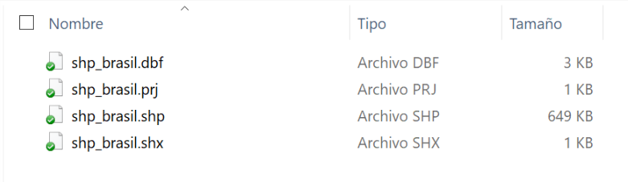
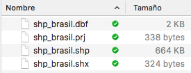
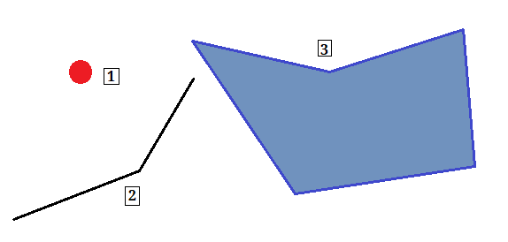
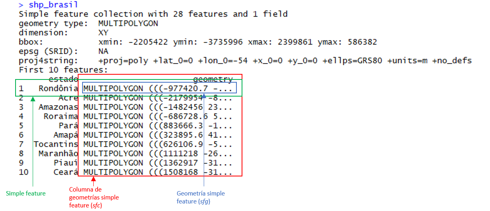
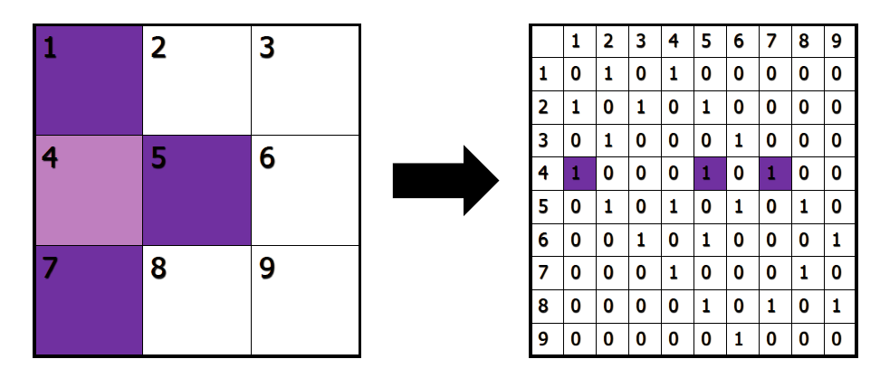
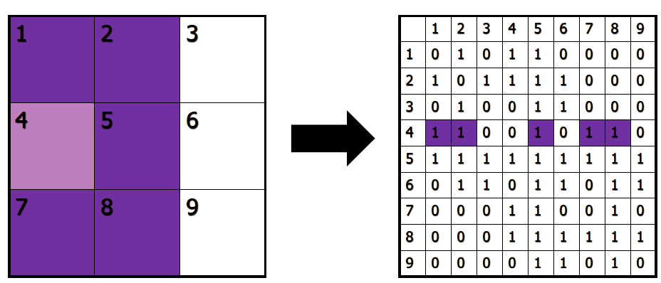
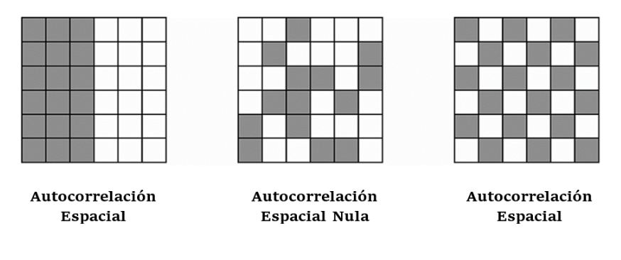

# Generación de mapas {#mapas}
*Por Andrea Escobar y Gabriel Ortiz*

***

**Lecturas de referencia**

- Brunsdon, C., & Comber, L. (2015). *An introduction to R for spatial analysis and mapping*. Sage Press.

- Pebesma, E. (2018). “Simple Features for R: Standardized Support for Spatial Vector Data.” *The R Journal, 10*(1),439-446. 

- [R-Spatial](https://r-spatial.github.io/sf/index.html)

- D. Kahle and H. Wickham. (2013). ggmap: Spatial Visualization with ggplot2. *The R Journal, 5*(1), 144-161. 
  
- Anselin, L. (1995). Local Indicators of Spatial Association-LISA. *Geographical Analysis 27*: 93-115 

- Weidmann, N. B., Kuse, D., & Gleditsch, K. S. (2010). The geography of the international system: The CShapes dataset. *International Interactions, 36*(1), 86-106.

***

En este capítulo veremos cómo podemos trabajar con datos espaciales spatial data utilizando `R` dentro del `tidyverse`. Aquí nos concentraremos en la riqueza que poseen los datos espaciales tanto como herramienta para el análisis exploratorio de datos sobre diversos fenómenos y también para una visualización y comunicación más atractiva y efectiva de nuestros hallazgos. Es decir, este capítulo tiene como misión principal:

1. Caracterizar qué son los datos espaciales.
2. Explicar por qué estos son interesantes de utilizar para el análisis en ciencia política 
3. Su manejo y manipulación en R, teniendo como foco principal su visualización mediante la creación de mapas estáticos y animados mediante `ggplot` a partir de su relación con otras variables descriptivas.  

Por lo que no nos adentraremos en la realización de modelos de inferencia estadística a partir de datos espaciales (*Spatial Autoreggresion*) y tampoco como generar datos geográficos ya que, en general, siempre estaremos trabajando a partir de bases de datos geográficos ya realizadas con anterioridad. 

Los datos a utilizar en este capítulo serán un *shapefile* (formato del cual hablaremos más adelante) de los estados de Brasil, obtenido del [*Spatial Data Repository de la New York University*](https://geo.nyu.edu/catalog/stanford-ys298mq8577), el cual complementamos con datos de [Danilo Freire](https://github.com/danilofreire). 

Por un lado, el repositorio de datos espaciales de NYU provee una multitud de datos espaciales para distintos países y áreas geográficas tanto inter como intra nacionales. En este caso, utilizamos una base de límites estaduales de Brasil al año 1991, provista por el *Instituto Brasileiro de Geografia e Estatística*, la cual sigue vigente dado a que el último cambio administrativo en Brasil a nivel de estados ocurrió el año 1988. Por otro lado, el [artículo de Freire (2018)](https://doi.org/10.25222/larr.334) intenta explicar la causa de la disminución en las tasas de homicidios del estado de Sao Paulo a partir de la implementación de medidas para la reducción del crimen impulsadas por el gobierno estatal. Lo útil de este trabajo es que recopila datos a nivel estadual de diversos indicadores socioeconómicos como PIB, Índice GINI, años de escolaridad promedio, etc., a lo largo de diez años (1990 - 2010), los cuales podremos unir a nuestro shapefile y utilizarlos para graficar estos factores visualmente. 

## 	Datos Espaciales

###  ¿Qué son?

Los datos espaciales, o más bien *geoespaciales*, se refieren a los datos que obtenemos sobre lugares geográficos, es decir, lugares en la superficie de la tierra. El uso de este tipo de datos reconoce “el rol clave que conceptos espaciales como la distancia, la ubicación, proximidad, vecindario y región juegan en la sociedad humana”, permitiendo enfrentarnos a los fenómenos desde una perspectiva multivariada y multidimensional, al entregarnos un nuevo tipo de información adicional a nuestras unidades de estudio (CSISS, 2-3). En la ciencia política la perspectiva espacial para el análisis se ha empleado en trabajos como el de King (1997) sobre cómo realizar inferencias ecológicas en la disciplina y en Gimple y Shuknecht (2003) sobre la accesibilidad de los lugares de votación. Este tipo de datos permite responder preguntas tales como si existe influencia en términos de proximidad de los países vecinos sobre la adopción de ciertas políticas, pero también resultan ser una herramienta clave en la exploración de nuestros datos para observar la existencia de patrones territoriales en los fenómenos estudiados. 

Durante el último tiempo, la accesibilidad a datos de tipo espacial se ha vuelto cada vez más ampliamente disponible, con iniciativas por parte de los gobiernos para hacer disponible datos de diverso tipo que se relacionan a los procesos sociales y económicos de los países (Brunsdon y Comber, 2015: 18) y con plataformas que permiten obtener coordenadas geográficos e información adicional relacionada a la ubicación geográfica en todo el mundo como Google Maps, [Open Street Map](https://www.openstreetmap.org/), o desde redes sociales como Twitter o Facebook. Mientras que, para investigadores y estudiantes, bases como la mencionada *Spatial Data Repository* de la NYU proveen archivos de shapefiles de fácil acceso y manipulación para generar visualizaciones y agregar datos georreferenciados de otras bases. Quienes estudian relaciones internacionales encontrarán un buen complemento entre este capítulo y el capítulo \@ref(manejo-av) donde se explota al máximo la función `countrycode`. Si eres uno de ellos, te recomendamos ver la página web del proyecto [Cshapes de Niels Weidmann](http://nils.weidmann.ws/projects/cshapes.html) y leer su artículo en la lectura de referencia. 

###  Estructura de los Datos Espaciales

Los archivos en los cuales se contienen datos espaciales usualmente se les conoce como *shapefiles*, los cuales generalmente se contienen en una carpeta que contiene al menos tres archivos con las extensiones `.shp, .dbf y.shx`.

```{r shp-windows, echo=F, out.width="60%", fig.cap="Ejemplo de carpeta que contiene un shapefile en Windows. Nota que el archivo .shp contiene la mayor cantidad de información y es el más pesado. Además, esta carpeta contiene un archivo adicional .prj"}

```

```{r shp-mac, echo=F, out.width="60%", fig.cap="Ejemplo de carpeta que contiene un shapefile en Mac"}

```

Este tipo de objetos son usualmente representados por vectores (si no recuerdas lo que es un vector podés refrescarlo en el capítulo 3), que consisten en la descripción de la geometría o forma (*shape*) de los objetos, conteniendo usualmente variables adicionales, llamadas "atributos", sobre estos mismos datos. Tomando como ejemplo los datos que usaremos durante este capítulo, nuestra base de datos describe los bordes de los estados de Brasil (geometría) y además contiene información sobre la tasa de homicidios de cada uno de estos y otro tipo de datos socioeconómicos de ellos (atributos). Los datos espaciales son diversos en sus características y son usualmente divididos en tipos de vectores que en todos los casos consisten en un set de par de coordenadas (x,y) (Rspatial): 

*	Puntos: Una sola ubicación descrita por un punto como una dirección de una casa geocodificada.
*	Líneas: Segmento compuesto por una serie de puntos unidos el uno con el otro que no conforman un objeto cerrado.
*	Polígonos: Superficie plana compuesta por una serie de líneas conectadas la una con la otra que forman un objeto cerrado. 
*	Multi-polígonos: Multi-superficie compuesta por polígonos que no necesariamente deben intersectar. 

```{r figura-formas, echo=F, out.width="60%", fig.cap="Tipos de formas de datos espaciales. (1) Punto, (2) Línea, (3) Polígono."}

```
 
```{block, type="books"}

Tip: Como hemos mencionado, el [Repositorio de Datos Espaciales de la NYU](https://geo.nyu.edu/) puede ser una buena alternativa si es que deseas empezar a trabajar con datos espaciales de tu país, estado, o comuna. Si bien está en inglés, puedes buscar *shapefiles* fácilmente entrando a la página del Repositorio y seleccionas "Polygon" dentro de la categoría "Data Type". Una vez es hecho esto, es solo un caso de introducir el nombre del área que te interesa en el buscador, seleccionar un resultado y apretar "Download Shapefile" en el costado superior derecho de la página para obtener tus archivos. Otra ventaja de estos datos es que suelen ser de bajo tamaño sin dejar de tener una calidad suficiente, lo cual es conveniente en el caso de que tu hardware posea limitaciones para trabajar con archivos de mayor tamaño. 

```

## Datos Espaciales en R

Durante los últimos años `R` ha avanzado considerablemente en sus herramientas para manipular y analizar datos geográficos de tal manera que esta sea compatible con el formato y las funcionalidades de otros paquetes del programa. En este capítulo nos concentraremos en el paquete `sf`, lanzado en el 2016, el cual se creó en base a las funcionalidades de tres paquetes anteriores: `sp`, `rgeos` y `rgdal` y que implementa el modelo estándar de código abierto *simple features* (cualidades simples) para la representación de objetos del mundo real en el computador, el cual posee atributos tanto espaciales como no espaciales, basados en geometría 2D con interpolación linear entre vértices (Pebesma, 2018).   

##  Special Features en R

La principal ventaja que nos entrega el paquete `sf` es que este permite trabajar con datos espaciales dentro del `tidyverse`, es decir, poder manejar datos espaciales como si fueran cualquier otro tipo de dataset, utilizando así las funciones de los paquetes de `R` contenidos dentro del metapaquete `tidyverse` como `ggplot2` y `dplyr` que has visto en los capítulos 4 y 5. 

Es importante tener la última versión de `tidyverse` para correr los geomas de `ggplot` que usaremos en este capítulo. Puedes actualizar a la última versión con el comando `install.packages("tidyverse")`:

```{r, message = F, warning = F}
library(tidyverse)
```

Ahora necesitamos instalar el paquete `sf`. Para que este funcione en Mac y Linux se deben tener las versiones recientes de GDAL, GEOS, Proj.4 y UDUNTIS instaladas (Para más información ir a https://github.com/r-spatial/sf#installling). Una vez hecho esto podemos instalar el paquete `sf`:

```{r, eval= F}
# devtools::install_github("robinlovelace/geocompr")
```

```{r, eval = F}
# install.packages("sf")
```

```{r, message = F, warning = F}
library(sf)
```

###  Estructura 

Para comenzar a trabajar, crea un proyecto de RStudio y descarga la carpeta comprimida con los shapefiles para este capítulo. El procedimiento para obtener los archivos es idéntico al que fue utilizado en el Capítulo \@ref(carga), de carga de bases de datos.

Para ver la estructura de los objetos de tipo `sf` cargamos nuestra base de datos en formato shapefile, utilizando el comando `st_read()` (Nota que estamos cargando el *archivo* "shp_brasil.shp" dentro de la *carpeta* "datos") y llamando el objeto a la consola:

```{r, message = F, echo=F}
shp_brasil <-  st_read("00-datos/shp_brasil/")
```

```{r, message = F, eval=F}
shp_brasil <-  st_read("datos/")
```

```{r}
shp_brasil
```

En la siguiente imagen detallamos las partes de nuestro shapefile con sus nombres:

```{r estructura-sf, echo=F, out.width="60%", fig.cap="Estructura de un archivo de tipo `sf`"}

```

Como se puede observar en la figura anterior, las simple features son guardados por `sf` como formato data.frame y con el formato adicional de clase `sf`, por lo que como se mencionaba anteriormente, podemos tratar a este set de datos como cualquier otro dentro del tidyverse, utilizando sus funciones, pipes (%>%), etc. Aquí cada fila consiste en un simple feature y cada columna consiste en un atributo, la diferencia con el data normal es que encontramos una nueva columna de geometrías simple feature (*simple feature geometry column* - `sfc`)  que contiene las geometrías simple feature (*simple feature geometry* - `sfg`), resultando en un data.frame con una columna extra para la información espacial. 

Podemos comprobar esto al revisar el tipo de archivo que hemos cargado con el comando `class`. Nota que "shp_brasil" es al mismo un archivo de tipo "sf" y de tipo "data.frame":

```{r}
class(shp_brasil)
```

Ahora, si vemos más en detalle nuestros datos podemos encontrarnos con que este estándar puede implementar distintos tipos de geometría en nuestras bases de datos: 

*	Un vector numérico para un solo punto (POINT)
*	Una matriz numérica (cada fila es un punto) para una serie de puntos (MULTIPOINT o LINESTRING)
*	Una lista de matrices para un set de set de puntos (MULTIINESTRING, POLYGON)
*	Una lista de listas de matrices (MULTIPOLYGON), la cual se vuelve la más utilizada cuando se representan datos geográficos como la forma y ubicación de países u otras unidades administrativas de estos. 
*	Una lista de cualquiera de los elementos mencionados anteriormente (GEOMETRYCOLLECTION)

Utilizando el comando `st_geometry` podemos ver las geometrías que incluye nuestro shapefile:

```{r}
st_geometry(shp_brasil)
```

Una vez cargado nuestro shapefile podemos empezar a generar mapas. Nota que la forma para hacer esto está basada en `ggplot`; solo tenemos que seleccionar nuestra base de datos y agregar el geoma `geom_sf`:

```{r, fig.cap= "Mapa de los estados de Brasil", fig.align='center'}
ggplot(data = shp_brasil)+
  geom_sf()
```

## Manejo de Datos Espaciales

Ya vimos como cargar shapefiles con el `st_read`. Ahora que ya tenemos el archivo cargado, procederemos a ver que tipo de modificaciones podemos hacerle para generar nuevos datos a partir de nuestra información, así como incorporar datos de otras bases a nuestro shapefile.

### 	Modificaciones

Existen dos principales maneras en que podemos realizar modificaciones a nuestra base georreferenciada. La primera consiste en aplicar las técnicas que hemos aprendidos ocupando el `tidyverse`, mientras que la segunda contempla ocupar funciones incorporadas en el paguete `sf`. En este paquete todas las funciones comienzan con st_ para que se pueda captar fácilmente por la herramienta de *completition* de Rstudio. Estas funciones se utilizan principalmente para transformar y realizar operaciones geográficas.  En esta sección combinaremos ambas técnicas para generar nuevas variables y datos asociados a nuestra base.

#### Filtrar y seleccionar por unidades geográficas

Una de las primeras funciones que podemos utilizar las funciones de `dplyr` para seleccionar datos dentro de nuestra base. Así, por ejemplo, podemos ocupar `filter` para seleccionar ciertos estados de Brasil, como por ejemplo el estado de São Paulo:

```{r}
shp_brasil %>% 
  filter(estado == "São Paulo")
```

Esto es más útil cuando lo ocupamos de manera combinada con `ggplot`, para elegir graficar solo algunos polígonos. Así, podemos graficar el estado de São Paulo:

```{r, fig.cap= "Mapa del estado de São Paulo", fig.align='center'}
ggplot(data = shp_brasil %>%  
         filter(estado == "São Paulo")) +
  geom_sf()
```

Un desafío común que solemos encontrar cuando trabajamos con shapefiles de países completos es la existencia de regiones o zonas insulares que forman parte del país administrativamente pero se encuentras aisladas geográficamente, como por ejemplo la Isla de Pascua en Chile. Por diversos motivos, el acceso a datos sobre estas regiones puede ser más limítado, y suelen dejarse fuera de los análisis. Por esto, nos interesa sacar estas regiones de nuestros shapefile. En Brasil, el Distrito Estadual de Fernando de Noronha, un archipielago de 21 islas ubicado en el Océano Atlántica, corresponde a este tipo de casos (posiblemente lo puedes identificar como un pequeño punto en la parte superior derecha de los mapas anteriores). Podemos eliminar este tipo de datos de nuestro shapefile fácilmente utilizando, de nuevo, la función `filter`. 

```{r}
shp_brasil <-  shp_brasil %>% 
   filter(estado != "Distrito estadual de Fernando de Noronha (PE)")
```

Esto se ve reflejado en los mapas que haremos a continuación:

```{r, fig.cap= "Mapa de los Estados de Brasil sin el distrito estadual de Fernando de Noronha", fig.align='center'}
ggplot(data = shp_brasil)+
  geom_sf()
```


#### Generar centroides

Otra opción es generar una nuevas variables asociadas a nuestras unidades, utilizando el comando `mutate`. Una acción común es la de generar lo que se denomina "centroides", es decir, puntos ubicados en el centro de nuestras unidades. Para generar los centroides debemos crear las variables `centroid`, `coords`, `coords_x`y `coords_y`asociadas a nuestras geometrías, utilizando los comandos `map`y `map_dbl` del paquete `purr` y los comandos `st_centroid` y `st_coordinates` del paquete `sf`:

```{r, tidy = T}
shp_brasil <- shp_brasil %>% mutate(
  centroid = map(geometry, st_centroid),
    coords   = map(centroid, st_coordinates),
    coords_x = map_dbl(coords, 1),
    coords_y = map_dbl(coords, 2))
head(shp_brasil)
```

Una vez generadas estas variables podemos graficarlas con `ggplot` y el paquete `ggrepel` para generar los textos:

```{r}
library(ggrepel)
```

```{r, fig.cap= "Mapa de Brasil con nombres de los estados", fig.align='center'}
ggplot(data = shp_brasil) +
  geom_sf()+
  geom_text_repel(mapping = aes(coords_x, coords_y, label = estado), size = 4, min.segment.length = 0)
```

#### Generar nuevas unidades con `st_union`

Aún otra opción interesante es la de generar nuevas variables que agrupen a varias de nuestras unidades geográficas. Al hacer esto, estaremos efectivamente generando nuevas unidades geográficas que van más allá de la información originalmente contenida en nuestro shapefile. Por ejemplo, en 1969 el *Instituto Brasileiro de Geografia e Estatística* dividió el país en 5 regiones que agrupan a los 27 estados del país. Dado que esta es una división con fines académicos y no es reconocida en términos político-administrativos, no es posible encontrar archivos de tipo shapefile que muestren estas regiones. Sin embargo, utilizando `mutate` y `case_when`, podemos fácilmente generar nosotros mismos esta categoría:

```{r}
shp_brasil <- shp_brasil %>% 
  mutate(region = case_when(estado %in% c("Goiás","Mato Grosso","Mato Grosso do Sul",
                                         "Distrito Federal") ~ "Centro-Oeste",
                            estado %in% c("Acre","Amapá","Amazonas","Pará","Rondônia",
                                         "Roraima","Tocantins") ~ "Norte",
                            estado %in% c("Alagoas","Bahia","Ceará","Maranhão","Paraíba",
                                         "Pernambuco","Piauí","Rio Grande do Norte",
                                         "Sergipe") ~ "Nordeste",
                            estado %in% c("Espírito Santo","Minas Gerais","Rio de Janeiro",
                                          "São Paulo") ~ "Sudeste",
                            estado %in% c("Paraná","Rio Grande do Sul","Santa Catarina") ~ "Sul"))
```

Una vez generada esta variable, la podemos incorporar a nuestro mapa:
```{r, fig.cap= "Mapa de los estados de Brasil según región", fig.align='center'}
ggplot(data = shp_brasil)+
  geom_sf(aes(fill = region))
```

Mejor aún, podemos ocupar esta categoría para generar nuevas geometrías con `group_by`, `summarise` y `st_union`:

```{r}
shp_brasil_regiones <-  shp_brasil %>% 
  group_by(region)%>% 
  summarise(geometry = st_union(geometry)) %>%
  ungroup()
```

Podemos graficar este resultado con `ggplot`:

```{r, fig.cap= "Mapa de las regiones de Brasil", fig.align='center'}
ggplot(shp_brasil_regiones) + 
  geom_sf(aes(fill = region))
```

Nota que esto no genera objetos completamente "lisos", es decir, todavía tienen se observan algunas líneas en su interior, probablemente ocasionadas debido los polígonos de nuestro shapefile no se superponen de manera perfecta. Esta es una dificultad común al hacer este tipo de operaciones y puede ocurrir hasta al trabajar con shapefiles más sofísticados. Pese a estas dificultades, este tipo de operaciones puede ser muy útil al, por ejemplo, elaborar distritos electorales compuestos de varias provincias o municipalidades, por ejemplo.

### Crear nuevos shapefiles con `st_write`

Podemos guardar este nuevo shapefile con la función `st_write`, en la que solo tenemos que seleccionar el objeto que deseamos guardar y la ruta en que queremos que se guarde. En este caso guardaremos el archivo "shp_brasil_regiones.shp" en una carpeta del mismo nombre. Esto genera automáticamente no solo el .shp sino que también todos los otros archivos que componen el shapefile:

```{r, eval = F}
st_write(shp_brasil_regiones,"datos/shp_brasil_regiones/shp_brasil_regiones.shp")
```

***

>Advertencia:
El comando `st_write` no puede sobrescribir archivos ya existentes, e intentar hacer esto reportará automáticamente un error. Si deseas modificar un shapefile que ya has generado previamente, deberás borrarlo manualmente de su carpeta antes de generar los nuevos archivos.

***

### 	Incorporar datos de otras bases con `merge`

Primero vamos a ver como incorporar datos de otras bases de datos a nuestro shapefile, ya que usualmente vamos a querer conocer *atributos* de nuestros lugares geográficos para generar análisis exploratorios o de inferencia estadística. En primer lugar, vamos a cargar la base de datos de Freire (previamente hemos eliminados algunos datos para simplificar la base). Podemos hacer esto con facilidad, utilizando el paquete del libro:

```{r message=F}
library(paqueteadp)
```

```{r}
data(crimen_brasil)
```


Ahora se ha cargado la base adecuadamente, como podemos ver utilizando `head()` para obtener sus seis primeras observaciones:

```{r, message = F}
head(crimen_brasil)
```

Notarás que nuestra base contiene la variable `estado`. Esta misma variable está presente en nuestro shapefile:

```{r}
shp_brasil$estado
```

Previamente nos hemos asegurado de que las observaciones estén codificadas de la misma manera tanto en la base como en el shapefile. De esta forma podemos juntar las bases utilizando el comando `left_join`:

```{r}
shp_brasil_datos <- shp_brasil %>% 
  left_join(crimen_brasil)
```

Utilizando `head` podemos ver el resultado de esta operación:

```{r, tidy = T}
head(shp_brasil_datos)
```

Una vez que tenemos esta información incorporada a nuestro shapefile, estos datos nos servirán cuando empecemos a mapear variables en la sección 4.

## Mapear en R 

Los mapas han sido históricamente la manera principal para almacenar y comunicar datos espaciales, y los objetos y sus atributos pueden ser plasmados fácilmente de manera tal que el ojo humano pueda reconocer rápidamente patrones y anomalías en un mapa bien diseñado [(Spatial Analysis Online)](http://www.spatialanalysisonline.com/HTML/index.html). En esta sección aprenderás a realizar mapas de distinto tipo (tanto estáticos como animados) a partir de datos geográficos y de sus atributos teniendo como base el formato de `ggplot2`:

En primer lugar, podemos generar visualizaciones más complejas de elementos que ya hemos visto en secciones anteriores. Por ejemplo, podemos mapear cada una de nuestras unidades con un color distinto utilizando el argumento `fill` de `ggplot`:

```{r, fig.cap= "Mapa de Brasil con colores por estado", fig.align='center'}
ggplot(shp_brasil)+
  geom_sf(aes(fill = estado))+
  guides(fill = "none")
```

También podemos cambiar el color base de nuestra imagen, así como el color de las líneas divisorias entre unidades geográficas:


```{r, fig.cap= "Mapa de los estados de Brasil con fondo blanco y fronteras azules", fig.align='center'}
ggplot(shp_brasil)+
  geom_sf(fill = "white", color = "blue")+
  guides(fill = FALSE, color = FALSE)
```

También podemos generar una visualización más simple si eliminamos los indicadores de coordenadas que aparecen al borde de nuestro gráfico. Podemos hacer esto con el comando `coord_sf` y el comando `theme_void`:

```{r, fig.cap= "Mapa de los estados Brasil sin coordenadas ni líneas cartesianas", fig.align='center'}
ggplot(data = shp_brasil) + 
  geom_sf() +
  coord_sf(crs = st_crs(shp_brasil), datum = NA)+
  theme_void()
```

O incluso podemos combinar varias de estas opciones en una sola imagen. Por ejemplo, en la siguiente imagen generamos un mapa con bordes negros y colores de relleno distintos para cada estado, donde además se señaliza el punto centroide de cada unidad y se eliminan los indicadores de coordenadas:

```{r, fig.cap= "Mapa de Brasil con colores y nombres por estado y sin coordenadas ni líneas cartesianas", fig.align='center'}
ggplot(data = shp_brasil, aes(fill = estado)) +
  geom_sf(color = "black") +
  geom_text_repel(mapping = aes(coords_x, coords_y, label = estado), size = 4, min.segment.length = 0) +
  coord_sf(crs = st_crs(shp_brasil), datum = NA)+
  theme_void()+
  guides(fill = "none")
```


##  Mapeando variables
Como ya hemos agregado los datos de Freire (2018) a nuestro shapefile, podemos ocupar estas variables para ejemplificar diferencias entre nuestras unidades geográficas. Así, por ejemplo, podemos mostrar el índice Gini para cada estado con el argumento `fill`. Los datos corresponden al promedio de los años observados:

```{r, fig.cap= "Mapa de los estados de Brasil según índice Gini", fig.align='center'}
ggplot(shp_brasil_datos %>% filter(gini != "NA")) +
  geom_sf(aes(fill = gini)) 
```

También podemos combinar esto con `filter` para seleccionar solo ciertos años de nuestra base. Por ejemplo, podemos mostrar la cantidad de personas en extrema pobreza para el año 2009 en los diferentes estados:

```{r, fig.cap= "Mapa de los estados de Brasil según población en extrema pobreza", fig.align='center'}
ggplot(shp_brasil_datos %>% filter(anio == 2009) ) +
  geom_sf(aes(fill = poblacion_extrema_pobreza)) 
```

### 	Mapas animados con `gganimate`

Cuando estamos trabajando con datos por ciertos periodos de tiempo una visualización que puede ser de utilidad es el mostrar la evolución de una variable a través de ese periodo. Para hacer esto generalmente lo que haríamos es generar varios gráficos de distintos puntos temporales y después unirlos en una sola figura. Por ejemplo, podríamos generar distintos mapas con las tasas de homicidios para cada estado desde el año 2006 hasta el año 2009 e incorporarlos todos a una misma figura con el paquete `gridExtra`:

```{r}
a <- ggplot(shp_brasil_datos %>%  filter(anio == 2006)) +
  geom_sf(aes(fill = tasa_homicidios))+
  labs(subtitle = "Año: 2006")
b <- ggplot(shp_brasil_datos %>%  filter(anio == 2007)) +
  geom_sf(aes(fill = tasa_homicidios)) +
  labs(subtitle = "Año: 2007")
c <- ggplot(shp_brasil_datos %>%  filter(anio == 2008)) +
  geom_sf(aes(fill = tasa_homicidios)) +
  labs(subtitle = "Año: 2008")
d <- ggplot(shp_brasil_datos %>%  filter(anio == 2009)) +
  geom_sf(aes(fill = tasa_homicidios)) +
  labs(subtitle = "Año: 2009")
```

```{r, message = F}
library(gridExtra)
```

```{r, fig.cap= "Mapas de los estados de Brasil según tasas de homicidios", fig.align='center'}
grid.arrange(a,b,c,d)
```

Sin embargo, una opción más dinámica para mostrar estos cambios es la de mostrar los mismos datos en un mismo mapa que cambie a medida que cambie la unidad temporal específica. Al usar tan solo un mapa, esto también nos permite incorporar más unidades temporales; así, por ejemplo, podemos ver las tasas de homicidios en cada estado desde 1990 a la fecha. Para hacer esto primero debemos instalar el paquete `gganimate`. Como este aún no está disponible desde CRAN, debemos utilizar `devtools`para instalarlo:

```{r, eval = F}
devtools::install_github('thomasp85/gganimate')
```

```{r}
library(gganimate)
```

Una vez hecho esto, podemos generar el objeto utilizando `ggplot`y el comando `transition_manual`. En este ultimo seleccionamos como argumento nuestra variable temporal, que en este caso corresponde a "anio". También al seleccionar la función "{current_frame}" como parte de nuestro subtitulo hace que se muestre automáticamente el año al cambiar la imagen: 

```{r}
e <- ggplot(shp_brasil_datos)+
  geom_sf(aes(fill=tasa_homicidios))+
  transition_manual(anio)+
  labs(subtitle = "Año: {current_frame}")
```

Una vez generado el objeto, simplemente utilizamos el comando `animate` para generar la animación:

```{r, message = F, fig.cap= "Mapa animado de los estados de Brasil según tasas de homicidios", fig.align='center'}
animate(e)
```

También podemos guardar nuestra animación en diferentes formatos. Por ejemplo, podemos guardar nuestra animación en forma de gif con el argumento `renderer` y el comando `gifski_renderer`. Solo tenemos que seleccionar una ruta de exportación:

```{r, eval = F}
animate(e, renderer = gifski_renderer("00-images/tasas_homicidio_brasil.gif"))
```

Para generar otros tipos de archivos animados, podemos revisar la documentación de `renderers`:

```{r, eval = F}
?renderers
```


## Inferencia a partir de Datos Espaciales

Más allá del análisis exploratorio y descriptivo que podemos realizar con los datos espaciales, estos también son de gran utilidad para realizar inferencia sobre la relación entre distintos fenómenos. La inferencia en base a datos espaciales parte de la base de reconocer que las observaciones en el espacio no pueden ser asumidas todo el tiempo como mutuamente independientes, debido a que las observaciones que están cerca la una de la otra son la mayoría del tiempo similares, por lo que debemos prestar atención a los diferentes patrones de asociación espacial que existen en los fenómenos que estudiamos. 

Estos patrones espaciales (que llamamos *autocorrelación espacial*), miden cómo la distancia influencia una variable en particular, pudiendo ser utilizados como información relevante sobre tipos de influencia que no han sido observadas o consideradas. (Bivand, Pebesma & Gomez-Rubio, 2008: 11). 

###  Indicadores locales de asociación espacial (LISA)

En esta sección encontrarás los mecanismos básicos para adentrarse en la correlación espacial, basándonos en los LISA (Local indicator of spatial asociation), indicadores locales de asociación espacial introducidos por [Luc Anselin (1995)](https://onlinelibrary.wiley.com/doi/epdf/10.1111/j.1538-4632.1995.tb00338.x). Estos permiten indicar la existencia de similitud (correlación) entre observaciones próximas las unas a las otras, es decir, si están agrupadas (*clustered*) espacialmente. Para esto Anselin indica que: 

* El LISA para cada observación da un indicador sobre el grado de clustering espacial significativo de valores similares alrededor de esa observación
* La suma de los LISAs de todas las observaciones es proporcional a un indicador global de correlación espacial. 

Y mediante el testeo de significancia estadística para estos indicadores, se pueden identificar localidades en donde hay un grado significativo de clustering (o repulsión espacial) (Brunsdon & Comber, 2015, 249). Se dice que las variables tienen una correlación espacial positiva cuando valores similares tienden a estar más cercanos entre ellos que los valores distintos (Lansley & Cheschire, 2016, 77)

### Matriz de Pesos Espaciales

El primer paso para realizar este tipo de análisis es determinar el set de vecindarios para cada observación, es decir, identificar los polígonos que comparten fronteras entre ellos. Luego, debemos asignar pesos a cada relación vecina, que permiten definir la fuerza de esta relación en base a cercanía. En las matrices de peso, los vecinos son definidos por un método binario (0,1) en cada fila indicando si existe o no relación. 

Para hacer este tipo de análisis primero necesitamos cargar el paquete `spdep` y guardar las coordenadas de las unidades de nuestro mapa:

```{r, message=F}
library(spdep)
```

```{r}
coords <- coordinates(as((shp_brasil), 'Spatial'))
```

También en esta sección trabajaremos con el shapefile al cual hemos agregado datos de la base de Freire (2018), `shp_brasil_datos`,pero solo ocuparemos datos del último año disponible, correspondiente a 2009:

```{r}
shp_brasil_datos <- shp_brasil_datos %>%  filter(anio == 2009)
```

Existen tres criterios diferentes para calcular los vecindarios: 

1.	Rook: Considera como vecinos a cualquier par de celdas que compartan alguna arista (borde). 

```{r criterio-rook, echo=F, out.width="60%", fig.cap="Criterio Rook"}

```

Para generar este critero se utiliza el comando `poly2nb` del paquete `spdep`. Debemos fijarnos que el argumento `queen` este fijado en 'FALSE'.

```{r}
rook_brasil <- poly2nb(as(shp_brasil_datos, 'Spatial'),
                   row.names = shp_brasil$estado,
                   queen     = FALSE)
```

Podemos plotear con el comando `plot.nb`:

```{r}
plot.nb(rook_brasil,coords)
```

Y podemos graficar esto por encima de nuestro mapa con `ggplot`. Primero necesitamos pasar nuestras coordenadas a un dataframe con esta función de [Maxwell B. Joseph](https://mbjoseph.github.io/2015/06/15/nb_ggmap.html).

```{r}
nb_to_df <- function(nb, coords){
  x <- coords[, 1]
  y <- coords[, 2]
  n <- length(nb)

  cardnb <- card(nb)
  i <- rep(1:n, cardnb)
  j <- unlist(nb)
  return(data.frame(x=x[i], xend=x[j],
                    y=y[i], yend=y[j]))
}

```

Generamos el dataframe:

```{r}
rook_brasil_df <- nb_to_df(rook_brasil, coords)
```

Y ahora podemos generar el gráfico con los los geomas `geom_point`y `geom_segment`:

```{r, fig.cap= "Mapa de vecinos, criterio Rook", fig.align='center'}
ggplot(shp_brasil_datos) +
  geom_sf()+
  geom_point(data = rook_brasil_df,
             mapping = aes(x = x, y = y))+
  geom_segment(data = rook_brasil_df,
               mapping = aes(x = x, xend = xend, y = y, yend = yend))
```


2.	Queen: Considera como vecinos a cualquier par de celdas que compartan alguna arista o un punto. 

```{r criterio-queen, echo=F, out.width="60%", fig.cap="Criterio Queen"}

```

Para generar este criterio igualmente utilizamos el comando `poly2nb` y generamos el dataframe:

```{r}
queen_brasil <- poly2nb(as(shp_brasil_datos, 'Spatial'),
                   row.names = shp_brasil$estado)
queen_brasil_df <- nb_to_df(queen_brasil, coords)
```

Y ahora podemos generar el gráfico, lo cual hacemos directamente sobre nuestro mapa de Brasil:

```{r, fig.cap= "Mapa de vecinos, criterio Queen", fig.align='center'}
ggplot(shp_brasil_datos) +
  geom_sf()+
  geom_point(data = queen_brasil_df,
             mapping = aes(x = x, y = y))+
  geom_segment(data = queen_brasil_df,
               mapping = aes(x = x, xend = xend, y = y, yend = yend))
```


3.	K-nearest: Los vecindarios se generan en base la distancia entre vecinos, donde “k” se refiere al número de vecinos de una determinada locación, calculada como la distancia entre los puntos centrales de los polígonos. Se aplica usualmente cuando las áreas tienen diferentes tamaños para asegurarse que cada lugar tenga el mismo número de vecinos, independiente de cuán grande sean las áreas vecinas (Fuente: https://geodacenter.github.io/glossary.html ). 

En este caso utilizaremos a los seis vecinos más cercanos. Esto lo podemos hacer con el comando `knn2nb`. También generamos inmediatamente el dataframe:

```{r}
kn_brasil <- knn2nb(knearneigh(coords, k = 6), 
                   row.names = shp_brasil_datos$estado)
kn_brasil_df <- nb_to_df(kn_brasil,coords)
```

Y generamos el mapa con ggplot:

```{r, fig.cap= "Mapa de vecinos, criterio k-nearest", fig.align='center'}
ggplot(shp_brasil_datos) +
  geom_sf()+
  geom_point(data = kn_brasil_df,
             mapping = aes(x = x, y = y))+
  geom_segment(data = kn_brasil_df,
               mapping = aes(x = x, xend = xend, y = y, yend = yend))
```

Nota que si bien Rook y Queen generan, para nuestro caso, resultados similares en cuanto a la vecindad en nuestro mapa, el modelo k-nearest añade muchas más relaciones 


### Moran’s I
El Moran’s I es la estadística más utilizada para identificar autocorrelación espacial:

$$ I = \frac{n}{\sum_{i=1}^{n}(yi - \bar{y})^2} \frac{\sum_{i=1}^{n}\sum_{j=1}^{n}wij(yi - \bar{y})(yj - \bar{y})}{\sum_{i=1}^{n}\sum_{j=1}^{n}wij}$$

Esta fórmula si bien parece compleja, no es más que una versión expandida de la fórmula para computar el coeficiente de correlación, al cual se le agrega una matriz de pesos espaciales [RSpatial](http://rspatial.org/analysis/rst/3-spauto.html) mediante la cual se puede testear y visualizar la presencia de autocorrelación espacial.

Esta estadística es utilizada para realizar un test que permite evaluar la significancia de la correlación espacial.  Primero, realizaremos un test a nivel global que crea una sola medida de correlación espacial. Este test de Moran creará una medida de correlación entre -1 y 1 en donde:

•	1 determina una correlación espacial positiva perfecta (que indica que nuestros datos están agrupados en clusters) 
•	0 significa que nuestros datos están distribuidos aleatoriamente 
•	-1 representa autocorrelación espacial negativa (valores disímiles están cercanos entre sí).

```{r autocorr, echo=F, out.width="60%", fig.cap="Ejemplos de Moran's I"}

```

Utilizando la simulación de Monte Carlo en donde los valores son asignados aleatoriamente a los polígionos para computar el Moran’s I, lo cual es repetido varias veces para establecer una distribución de los valores esperados. Luego de esto, el valor observado del Moran’s I es comparado con la distribución simulada para ver cuán probable es que los valores observadores puedan ser considerados como aleatorios y así determinar si existe autocorrelación espacial significativa (Rspatial)

Para hacer el Moran's I test utilizaremos el comando `moran.test`. La variable para la cual identificaremos su nivel de correlacion espacial es la variable de índice gini, y ocuparemos el criterio Queen. Para esto debemos generar un objeto de tipo `listw`(matriz de pesos) basado en el criterio Queen:

```{r}
queen_brasil_lw <- nb2listw(queen_brasil)
```

Con esto podemos generar el test de Moran's I, donde seleccionamos matriz de pesos el objeto que acabamos de crear: 

```{r}
moran.test(shp_brasil_datos$tasa_homicidios, listw = queen_brasil_lw)
```

El resultado del test de Moran's I nos muestra que existe una leve relación de correlación positiva, versus una expectativa de una leve relación negativa. Pero el test resulta no ser significativo estadísticamente al tener un valor-p menor a una significancia del 0.05. Por ende, podemos señalar que la tasa de homicidios no presenta altos grados de autocorrelación espacial cuando estamos analizando estos datos a nivel estadual en Brasil. 

También realizamos un scatter plot para visualizar el tipo y fuerza de la correlación espacial en la distribución de nuestros datos. Para generar el scatter plot utilizamos el comando `moran.test`:

```{r}
moran.plot(shp_brasil_datos$tasa_homicidios, listw = queen_brasil_lw)
```

En este mapa la curva  del gráfico indica el valor del Moran’s I, es decir, la medida global de autocorrelación espacial de nuestros datos. Como ya vimos en el test anterior, esta es ligeramente positiva. El eje horizontal del gráfico muestra los datos de las tasas de homicidios a nivel estatal en Brasil y el eje vertical muestra estos mismos datos, pero laggeados espacialmente. Los cuatro cuadrantes del gráfico describen el valor de la observación en relación a sus vecinos: alta-alta, baja-baja (autocorrelación espacial positiva), baja-alta o alta-baja (correlación espacial negativa), y el gráfico también puntualiza en los valores considerados como outliers en esta relación, como el Distrito Federal o Acre. (Fuente: https://geodacenter.github.io/glossary.html) 

Si bien el test de Moran nos permite identificar si es que existe clustering a nivel global,  no nos permite identificar si existen clusters locales significantes en la variable que estamos analizando (Lansley & Cheschire, 2016, 78). Es por esto que realizamos un test de Moran’s I a nivel local en donde se calculan los indicadores locales de asociación espacial para cada unidad de nuestros datos y se testea si es que esta relación es estadísticamente significativa, lo que nos entrega datos sobre los patrones geográficos de la relación de los datos espaciales y si existen desviaciones locales de los patrones globales de autocorrelación espacial.

Para hacer este test de Moran's I utilizamos `localmoran`. Sin embargo, en esta ocasión generamos el objeto `listw` inmediatamente al interior del comando, al cual le agregamos un argumento nuevo `style`. Nota también que no realizamos el test de inmediato, sino que generamos un objeto con él, el cual después utilizaremos para mapear la correlación espacial:

```{r}
lmoran_brasil <- localmoran(x = shp_brasil_datos$gini,
           listw = nb2listw(queen_brasil, style = "B"))
```

Una vez obtenidos estos datos para cada polígono, podemos mapearlos para indicar cómo varía la correlación espacial en las zonas que estamos estudiando. Primero unimos los resultados a nuestro shapefile:

```{r}
mapa_moran <- cbind(shp_brasil_datos, lmoran_brasil)
```

A continuación podemos mapear los resultados con `ggplot`:

```{r, fig.cap="Moran's I a nivel local para distintos valores de Gini", fig.align="center"}
ggplot(mapa_moran)+
  geom_sf(aes(fill = Ii))+
  labs(fill = "Estadísitico Moran Local")
```


Este mapa nos permite observar la variación en la autocorrelación a lo largo del espacio, pero no es posible identificar si los patrones geográficos de autocorrelación son clusters con valores altos o bajos, lo que nos permitirá analizar el tipo de autocorrelación espacial que existe y su nivel de significancia. Para esto debemos crear un mapa de clusters LISA, que creará una etiqueta basada en los tipos de relación que se comparte con sus vecinos (alta-alta, baja-alta, insignificante, etc) en relación a los valores de la variable que estamos analizando (Gini).

Para poder realizar esto, primero se deben realizar una serie de transformaciones que detallamos a continuación:

```{r}
#Genera el mapa de cluster LISA
cuadrante <- vector(mode="numeric",length=nrow(lmoran_brasil)) 

#Centra la variable de interés en su media
m_gini<- shp_brasil_datos$gini - mean(shp_brasil_datos$gini)

#Centra el Moran's local en la media
m_lmoran <- lmoran_brasil[,1] - mean(lmoran_brasil[,1])

#Umbral de significancia
signif <- 0.1

#Crea el cuadrante de datos
cuadrante[m_gini >0 & m_lmoran>0] <- "Alto-Alto"
cuadrante[m_gini <0 & m_lmoran<0] <- "Bajo-Bajo"
cuadrante[m_gini <0 & m_lmoran>0] <- "Bajo-Alto"
cuadrante[m_gini >0 & m_lmoran<0] <- "Alto-Bajo"
cuadrante[lmoran_brasil[,5]>signif] <- "Insignificante"
```

A continuación podemos generar el gráfico con `ggplot`. Nota que utilizamos `scale_fill_manual" para cambiar los colores de modo que reflejen la intensidad de la autocorrelación:

```{r, fig.cap="Patrones Geográficos de Clusterización para distintos valores de Gini", fig.align="center"}
ggplot(shp_brasil_datos, aes(fill = cuadrante))+
  geom_sf()+
  labs(fill = "Cuadrante")+
  scale_fill_manual(values=c("red", "lightblue", "white"))
```

Este mapa nos entrega una mayor información sobre los patrones geográficos de autocorrelación espacial. Este mapa nos muestra si es que existen clusters, es decir, regiones en donde en su núcleo existe autocorrelación espacial positiva, por ende, nos muestra regiones clusterizadas más que lugares individuales. Es importante señalar que estos mapas no son significativos, sino que nos permiten encontrar lugares o relaciones que pueden ser interesantes para un análisis posterior. 

Podemos interpretar en este caso que en la mayor parte de Brasil, existe una correlación espacial insignificante para los valores de Gini, es decir, su valor no está influenciado por la proximidad de otros valores similares. Sin embargo, en algunos estados del noreste de Brasil podemos observar que existe un clusters en donde se concentran altos valores de Gini que tienen vecinos también con altos valores en esa misma variable (*hot spots*), indicando que esas regiones contribuyen significativamente hacia una autocorrelación espacial positiva a nivel global. Por otro lado, en los estados que están coloreados con celeste encontramos clusters que concentran valores bajos de Gini en donde sus vecinos poseen altos valores de la misma variable y, por ende, contribuyen significativamente a una autocorrelación espacial negativa a nivel global (ya que esta está ocurre cuando valores disímiles son próximos entre sí).

```{block, type="books"}
**Ejercicios antes de continuar al próximo capítulo**
- Desde el [Repositorio de Datos Espaciales de la NYU](https://geo.nyu.edu/) baja un shapefile de América Latina y cárgalo a `R`.

- Utilizando `left_join()` agrégale datos por país de variables como el gini e el Indice de Desarrollo Humano a partir de la base datos extendida de [V-Dem](https://www.v-dem.net/en/data/data-version-8/#).

- Crea un mapa con el valor de 2015 para una de estas variables y representalo en forma de mapa con `geom_sf`.

- ¿Te animas a crear el mismo mapa para varios años usando `gganimate`?
```

