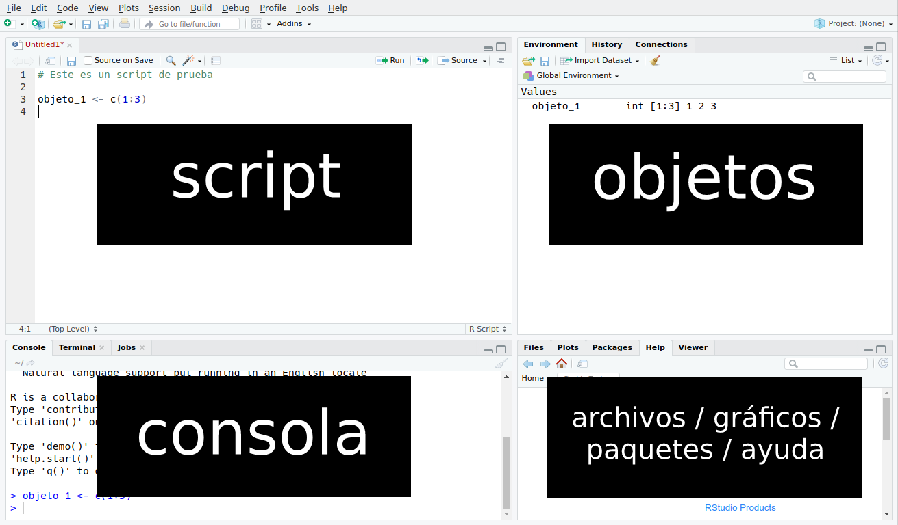
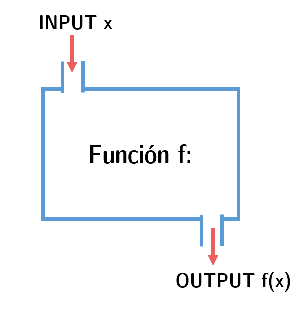
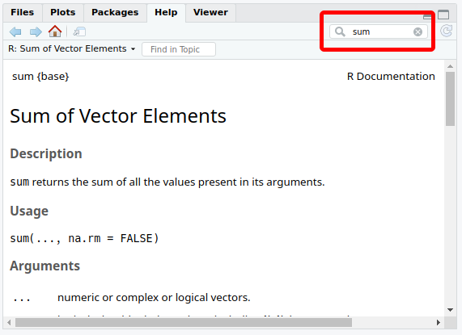

# (PART) Introducción a R {-}

# R básico {#rbas}
*Por Andrés Cruz*

## Instalación

### R

`R` (R Core Team, 2017) es un lenguaje de programación especialmente desarrollado para realizar análisis estadístico. Una de sus principales características, como se ha dejado a entrever en el prefacio, es que es de *código libre*: aparte de ser gratis, esto significa que las licencias que protegen legalmente a `R` son muy permisivas. Al amparo de esas licencias, miles de desarrolladores alrededor del mundo han añadido su granito de arena a la usabilidad y atractivo de `R`. ¡En *AnalizaR Datos Políticos* le sacaremos el jugo a esa diversidad!

Instalar `R` es fácil, independiente de si usas Windows, Mac o Linux. Basta con ingresar a https://cran.r-project.org/ y seguir las instrucciones de descarga e instalación.


### RStudio

Como dijimos, `R` es un lenguaje de programación. En términos informales, es una forma ordenada de pedirle al computador que realice ciertas operaciones. Esto significa que es posible usar R exclusivamente desde una consola o terminal -las pantallas negras de los hackers de las películas. Aunque esto tiene algunos atractivos -entre ellos, parecer hacker-, en general queremos interfaces más amigables. Ahí es cuando entra en escena `RStudio`, el programa más popular para utilizar `R`. Una vez esté instalado, todos nuestros análisis ocurrirán dentro de `RStudio`, que es también de código libre.
Para instalar `RStudio`, es necesario ya haber instalado `R`. La descarga e instalación es accesible en Windows, Mac y Linux. El link es https://www.rstudio.com/products/rstudio/download/#download

```{block, type="books"}
Instale ambos `R` y `RStudio`, que nosotros lo esperamos aquí. 
```

## Partes de RStudio

Si lograste bajar e instalar `R` y `RStudio`, bastará con ingresar a `RStudio´ para comenzar a trabajar. Se pillará con una pantalla como la de la figura \@ref(fig:rbas-rstudio).

```{r rbas-rstudio, echo=FALSE, fig.cap="Cuatro paneles de la interfaz básica de RStudio."}

```

La pantalla de `RStudio` se divide en cuatro paneles. A continuación, vamos a explicar sus funciones. La idea en esta sección es familiarizar al lector con lo básico de `R` en el camino.

### Consola

El panel inferior izquierdo de `RStudio`. Es nuestro espacio de comunicación directa con el computador, en el que le solicitamos, hablando “lenguaje `R`”, realizar tareas específicas. Llamaremos **comandos** a estas solicitudes. Probemos correr un comando que realiza una operación aritmética básica:
```{r}
2 + 2
```

Un truco importante de la consola es que con tus flechas del teclado de arriba y abajo podrás navegar en el historial de comandos recientes. 
```{block, type="books"}
Recomendamos al lector probar de realizar otros comandos con operaciones aritméticas y volver atrás con los botones de arriba y abajo. 
```

### Script

El panel superior izquierdo de `RStudio` puede describirse como una suerte de "bitácora de comandos". Aunque la consola puede ser útil para unos pocos comandos, análisis complejos requerirán que llevemos un registro de nuestros comandos.

Para abrir un script nuevo, basta con presionar `Ctrl + Shift + N` o ir a `File > New File > R Script` (utilizar atajos de teclado suele ser una buena idea, y no solo por el factor hacker. La pantalla en blanco de un nuevo script es similar a un bloc de notas sin usar, con la particularidad de que cada línea debe pensarse como un comando. El lector debe notar que escribir un comando en el script y presionar `Enter` no consigue nada más que un salto de párrafo. Para correr el comando de una línea basta con presionar `Ctrl + Enter` (en el caso de Mac, `Cmd + Enter`) mientras se tiene el teclado en ella. ¡Es posible seleccionar múltiples líneas/comandos a la vez y correrlas de una pasada con `Ctrl + Enter`!

También es fundamental para trabajar bien dejar comentarios explicativos en nuestros scripts. Esto no es solo relevante en el trabajo en grupo (el código ajeno puede ser inentendible sin una guía clara), sino que también denota atención por nuestros yo del futuro. En varias ocasiones nos ha tocado revisar código que escribimos hace un par de meses, no entender nada, y maldecir a nuestros yo del pasado por su poca consideración. A la hora de interpretar comandos, `R` reconoce que todo lo que siga a un numeral (# o *hashtag*) es un comentario. Así, hay dos formas de dejar comentarios, como "comandos estériles" o como apéndices de comandos funcionales:

```{r}
# Este es un comando estéril. R sabe que es solo un comentario, por lo que no retorna nada.
```
```{r}
2 + 2 # Este es un comando-apéndice. ¡R corre el comando hasta el # y luego sabe que es un comentario!
```
Para guardar un script, basta con presionar `Ctrl + S` o clickear `File > Save`.

### Objetos

Este es el panel superior derecho de `RStudio`. Aunque tiene tres pestañas (“Environment”, “History” y “Connections”), la gran estrella es "Environment" que sirve como registro para los objetos que vayamos creando a medida que trabajamos. Una de las características centrales de `R `es que permite almacenar objetos para luego correr comandos con ellos. La forma para crear un objeto es usando la flechita `<-` de tal manera que `nombre_del_objeto <- contenido`. Por ejemplo:
```{r}
objeto_1 <- 2 + 2
```

El lector notará que en la pestaña "Environment" aparece un nuevo objeto, objeto_1. Este contiene el resultado de 2 + 2. Es posible preguntarle a `R` qué contiene un objeto simplemente corriendo su nombre como si fuera un comando:

```{r}
objeto_1
```
Los objetos pueden insertarse en otros comandos, haciendo referencia a sus contenidos. Por ejemplo:

```{r}
objeto_1 + 10
```

También es posible reasignar a los objetos. ¡Si nos aburrimos de `objeto_1` como un `4`, podemos asignarle cualquier valor que queramos! Valores de texto o no númericos se pueden asignar entre comillas:

```{r}
objeto_1 <- "democracia"
```
```{r}
objeto_1 
```

Borrar objetos es también muy simple. Aunque suene como perder nuestro duro trabajo, tener un "Environment" limpio y fácil de leer a menudo lo vale la pena. Para ello usamos la función `rm`
```{r}
rm(objeto_1)
```

#### Vectores

Hasta ahora hemos conocido los objetos más simples de `R`, que contienen un solo valor. Objetos un poco más complejos son los **vectores** o "lineas" de valores. Crear un vector es simple, basta con insertar sus componentes dentro de `c()`, separados por comas:
```{r}
vector_1 <- c(15, 10, 20)
```
```{r}
vector_1
```

#### Funciones

Mira el siguiente comando de ejemplo:

```{r}
2 + sqrt(25) - log(2)
```

R interpreta que `sqrt(25)` es la raíz cuadrada 2, mientras que `log(2)` es el logaritmo natural de 2. Tanto `sqrt()` como `log()` son funciones de R. En términos muy básicos, una función es un procedimiento que se puede esquematizar de la siguiente forma:

```{r rbas-funs, echo=FALSE, fig.cap="Las funciones nos permitirán hacer las transformaciones necesarias a nuestros datos. Adaptada de [Wikimedia Commons](https://commons.wikimedia.org/wiki/File:Function_machine2.svg)."}

```

`sqrt()` toma un valor numérico como input y devuelve su raíz cuadrada como output. `log()` toma el mismo input, pero devuelve su logaritmo común (o en base a 10).  `c()`, otra función que utilizamos antes, toma distintos valores únicos como input y devuelve un vector que los concatena.

Es a propósito de los vectores que las funciones de `R` comienzan a brillar y a alejarse de las cualidades básicas de una calculadora (que, a grandes rasgos, es lo que hemos visto ahora de `R`, nada muy impresionante). Veamos algunas funciones que extraen información útil sobre algún vector. ¿Qué hace cada una?

```{r}
mean(vector_1) # media
median(vector_1) # mediana
sd(vector_1) # desviación estándar
sum(vector_1) # suma
min(vector_1) # valor mínimo
max(vector_1) # valor máximo
length(vector_1) # longitud (cantidad de valores)
sort(vector_1) # ...
```

El lector podría haber deducido que `sort()`, la última función del lote anterior, ordena al vector de menor a mayor. ¿Qué pasa si quisiéramos ordenarlo de mayor a menor? Esto nos permite introducir a los *argumentos*, partes de las funciones que nos permiten modificar su comportamiento. A continuación agregaremos el argumento `decreasing = TRUE` al comando anterior, consiguiendo nuestro objetivo:

```{r}
sort(vector_1, decreasing = TRUE)
```


### Archivos / gráficos / paquetes / ayuda

Es el cuadrante inferior derecho de la pantalla de `RStudio`. ¡Estas cuatro pestañas son las que se roban la película! Vamos una por una:

#### Archivos y RStudio projects

Esta pestaña es una ventana a los archivos que tenemos en nuestro directorio de trabajo. Funcionando como un pequeño gestor, nos permite moverlos, renombrarlos, copiarlos, etcétera. 

A propósito de archivos, una de las grandes novedades recientes de `R` son los *RStudio Projects*, o proyectos de `RStudio`. Los desarrolladores de `RStudio` se dieron cuenta de que sus usuarios tenían scripts y otros archivos de `R` desperdigados a lo largo y ancho de sus discos duros, sin orden alguno. Por eso implementaron la filosofía de "un proyecto, una carpeta". "Un proyecto, una carpeta" es tan simple como suena: la idea es que cada proyecto en el que trabajemos sea autosuficiente, que incluya todo lo que necesitemos para trabajar. Se pueden manejar los proyectos desde la esquina superior derecha de `R`. ¿Viste las tres solapas “Environment”, “History”, “Connections”? Bueno, mira un poquito más arriba y verás el logo de `RStudio Projects`. Aquí debes ser cuidadoso y notar que crear o abrir un proyecto reiniciará tu sesión de `R`, borrando todo el trabajo que no guardes. Como no has creado proyectos aún, tu sesión dirá `Project: (None)`. Al clickear en “New Project” se ofrecen tres alternativas:

```{r rbas-rproj, echo=FALSE}
knitr::include_graphics("00-images/rbas/rstudio_projects.png")
```

Una vez que hayas creado un proyecto y estés trabajando en él, todos los enlaces a  archivos serán locales. Por ejemplo, si en tu carpeta de proyecto tienes una subcarpeta "datos" con un archivo "ejemplo.csv" adentro, la referencia al archivo será simplemente "datos/ejemplo.csv". Recuerda el lema: "un proyecto, una carpeta".

¡Te recomendamos crear un proyecto de RStudio por cada capítulo del libro que quieras seguir con código!

#### Gráficos

Aquí aparecen los gráficos que realizamos con `R`. ¡En el capítulo \@ref(dataviz) aprenderemos a crearlos!

#### Instalar paquetes {#rbas-paquetes}

Una de las cualidades de `R` a la que más hincapié hemos dado es su versatilidad. Su código libre hace que muchos desarrolladores se sientan atraídos a aportar a la comunidad de `R` con nuevas funcionalidades. En general, realizan esto a través de paquetes, que los usuarios pueden instalar como apéndices adicionales a `R`. Los paquetes contienen nuevas funciones, bases de datos, etcétera. La pestaña de `RStudio` aquí reseñada nos permite acceder a nuestros paquetes instalados.

En la introducción mencionamos la enorme contribución que significó la creación de `tidyverse`. Instalar un paquete es bastante simple, a través de la función `install.packages()`. A continuación vamos a instalar el paquete `tidyverse`, central en nuestros próximos análisis. El `tidyverse` es una recopilación que incluye algunos de los mejores paquetes modernos para análisis de datos en `R`.
```{r, eval = F}
install.packages("tidyverse")
```

Cada vez que el usuario abre una nueva sesión de `R`, este se abre como "recién salido de fábrica". Es decir, no solo se abre sin objetos sino que solo con los paquetes básicos que permiten a `R` funcionar. Tenemos que cargar los paquetes extra que queramos usar, entonces. Es más o menos como cuando compramos un *smartphone* y descargamos las aplicaciones que más usaremos, para que se ajuste a nuestras necesidades cotidianas. La forma más común de hacer esto es a través de la función `library()`, como se ve a continuación. Nota que `tidyverse` no está entre comillas^[Esta es la convención más utilizada para `library()`. El comando funcionará con comillas, aunque no es muy común verlo así: `library("tidyverse")`. ¡Seguir las convenciones es buena idea, por eso recomendamos omitir las comillas!].

```{r eval=F}
library(tidyverse)
```

Adicionalmente, para sacar todo el provecho de este libro debes instalar nuestro paquete complementario, `paqueteadp`. Este te dará acceso a las bases de datos a utilizar en los diferentes capítulos del libro, además de algunas funciones de apoyo. La instalación es ligeramente distinta, porque es un paquete en desarrollo. Para instalarlo, primero debes haber instalado el paquete "remotes", que permite utilizar paquetes almacenados en GitHub, como el nuestro.

```{r, eval=F}
install.packages("remotes")
```

Teniendo el paquete "remotes" cargado, su función `install_github()` te permitirá instalar el paquete del libro:

```{r eval=F}
library(remotes)
install_github("arcruz0/paqueteadp")
```

Nota que "arcruz0" es el usuario de uno de nosotros en GitHub, donde está almacenado el paquete "paqueteadp". ¡Ahora este está instalado en tu sistema! Cada vez que lo necesites en una sesión de R, debes cargarlo con `library()`:

```{r eval=F}
library(paqueteadp)
```


#### Ayuda

Buscar ayuda es central a la hora de programar en `R`. Mira la figura \@ref(fig:rbas-help):Esta pestaña de `RStudio` abre los archivos de ayuda que necesitemos, permitiéndonos buscar en ellos. Las funciones tienen archivos de ayuda para cada una de ellas. Por ejemplo, podemos acceder al archivo de ayuda de la función `sqrt()` a través del comando `help(sqrt)` (también sirve `?sqrt`, que es lo mismo). Los paquetes en su conjunto también tienen archivos de ayuda, más comprensivos. Por ejemplo, para ver los archivos de ayuda del tidyverse solo debemos recurrir al argumento "package": `help(package = tidyverse)`. El lector debe notar que los archivos de ayuda de paquetes y funciones de paquetes solo están disponibles si el paquete ha sido cargado.
```{r rbas-help, echo=FALSE, fig.cap="En la solapa Help podemos buscar los documentos de ayuda de los paquetes que queremos utilizar. ¡Esta es la mejor forma de aprender R (después de este libro)!", out.width='80%'}

```
Dentro del archivo de ayuda para un paquete podemos buscar sub-funciones o dudas sobre comandos específicos en el cuadrante que hemos señalado en rojo.  

<div class='books'>

**Ejercicios antes de continuar al próximo capítulo**

- ¿Qué significa "correr" un comando desde un script? ¿Cómo se hace?

- ¿Cuál es la media de los dígitos del hit de Rafaella Carrà, 0 3 0 3 4 5 6? ¿Y la mediana? Por último, ordénalos de mayor a menor.

- Busca ayuda para el paquete `ggparliament`, recomendado para maravillarte con la variedad de los paquetes de `R`. Revisaremos brevemente dicho paquete más tarde, en el Capítulo \@ref(dataviz), de visualización de datos.

</div>